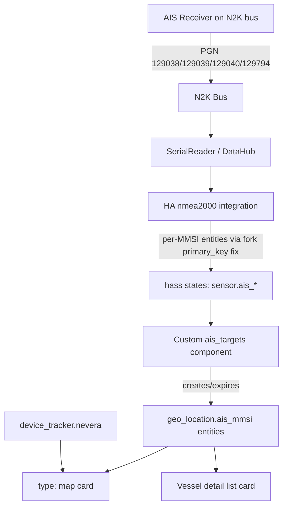

# Requirements

### Overview & Goals
Add AIS (Automatic Identification System) support to the boat's Home Assistant setup: decode AIS target data already arriving on the NMEA 2000 bus (from an AIS receiver/transceiver already wired to the bus), and show it on a map together with the boat's own position, plus key vessel identity data (MMSI, name, callsign, ship type, length/beam, destination) for each nearby target.

This is delivered as a new dashboard package `ha/ais/`, sibling to the existing `ha/sailing-dash/`, following the same build/deploy conventions already established in this project.

### Scope
**In scope:**
- Investigation/confirmation that PGN 129038 (Class A Position Report), 129039 (Class B Position Report), 129040 (Class B Extended), 129041 (Aid to Navigation), and 129794 (Static & Voyage Data) are decodable by the `nmea2000` fork already used in this project.
- A custom HA integration (`ais_targets`) that turns raw per-MMSI AIS entities into map-plottable `geo_location.ais_<mmsi>` entities that appear/disappear as vessels come in/out of range.
- A new HA dashboard view (`ha/ais/`) with a map card showing own boat + all live AIS targets, and a table/list card with MMSI, vessel name, callsign, ship type, length/beam, destination for each target.
- Build/deploy tooling mirroring `ha/sailing-dash/` (`helpers/build.py`, `config.yaml`, `deploy.sh --install/--update`, idempotent `.storage`/`configuration.yaml` merge, resource registration).

**Out of scope (this iteration):**
- AIS Safety-Related Broadcast Messages (PGN 129802) and CPA/TCPA collision-proximity alarms.
- Any changes to the physical AIS receiver wiring/configuration — assumed already present and transmitting on the bus.
- Console web UI (`static/js`) map — this plan targets the HA dashboard only, per user direction.

### User Stories
- As a skipper, I want to see other vessels' AIS positions plotted on the same map as my own boat, so I can quickly assess nearby traffic.
- As a skipper, I want to tap/hover a vessel on the map and see its MMSI, name, callsign, type, size and destination, so I can identify it without needing a separate AIS display.
- As a skipper, I want vessels that go out of AIS range to disappear from the map automatically, so the display always reflects current traffic.

### Functional Requirements
- The dashboard's map card plots: own boat (`device_tracker.nevera`, unchanged) plus one marker per currently-tracked AIS target.
- Each AIS target marker exposes at minimum: MMSI, latitude/longitude, SOG, COG, heading, nav status, rate of turn.
- Where PGN 129794 (Static & Voyage Data) has been received for a target, its marker/detail view also exposes vessel name, callsign, ship type, length, beam, destination, ETA.
- Targets that stop reporting for a configurable timeout are removed from the map (no stale ghost markers).
- The feature must not interfere with existing sailing-dash sensors/dashboards or the existing device-registry hash-collision fix (Bug 2) for non-AIS PGNs.

# Technical Design

### Current Implementation (relevant findings)
- The project's `nmea2000` fork (`requirements.txt`: `dnevera/nmea2000@cpu-overload-fix`) already **defines** all needed AIS PGNs in `nmea2000/pgns.py` (129038/129039/129040/129041/129793/129794/129809/129810), including a `userId`/`mmsiOfVesselOfOrigin` field typed `FieldTypes.MMSI` and marked `part_of_primary_key=True`.
- `nmea2000/message.py` (the same Bug-2 fix documented in the project's nmea2000-setup skill) already builds `primary_key = f'{self.id}_{source_id}'` **and appends every field flagged `part_of_primary_key=True`** to that key before hashing (`message.py:224-227`). This means: once the HA `nmea2000` integration's `pgn_include` allow-list includes the AIS PGNs, each distinct MMSI reported by the AIS receiver already produces a **distinct HA device hash** — no gateway-side decoding changes are required to disambiguate vessels.
- The gateway side (`ydnu02_tcp_gateway/`, `ydnu02/pgn_decoder.py`) only needs to make sure AIS frames pass through untouched (they already do — the bus is broadcast raw to all TCP clients including HA); AIS PGNs are single/multi-frame FastPacket PGNs already routed through the existing `feed_to_lib()`/`decode_pgn()` split documented in `pgn_decoder.py`. No changes needed there.
- `ha/sailing-dash/` is the reference implementation for HA dashboard packages in this project: `config.yaml` (toggles) → `helpers/build.py` (compiles `src/yaml/**` → `build/dashboard-*.yaml` + `build/sensors-*.yaml`) → `helpers/deploy_dashboard.sh` / `deploy_sensors.sh` (idempotent diff-then-merge into live `.storage`/`configuration.yaml`, restart HA) → top-level `deploy.sh --install|--update|--resources-only|...`.
- The map card pattern already in use (`ha/sailing-dash/src/yaml/dashboard/sections/02_position.yaml`): `type: map`, `entities: [{entity: device_tracker.nevera}]`. HA's native map card also accepts `geo_location_sources`, which is exactly the mechanism used by built-in dynamic-object trackers (e.g. `adsb`, `opensky`) to plot an unbounded, changing set of markers — this is the natural fit for AIS targets.

### Key Decisions
1. **Dynamic per-vessel entities via a custom HA integration, not static templates.** AIS targets are not tied to a fixed N2K source address (unlike other bus devices) and their count changes over time, so a small custom component `ais_targets` (Python, `homeassistant.helpers.entity_platform`, mirrors HA's `geo_location` platform pattern used by `adsb`/`opensky`) will create/update/expire one `geo_location.ais_<mmsi>` entity per tracked vessel by reading the raw per-MMSI entities/attributes the `nmea2000` integration already exposes (position, SOG/COG/heading/nav-status from 129038/129039, and name/callsign/type/length/beam/destination from 129794, matched by shared MMSI). Rationale: this is HA's idiomatic pattern for an unbounded/changing set of map objects and plugs directly into the stock `map` card via `geo_location_sources`, avoiding fragile fixed-slot templates or an extra pyscript/AppDaemon dependency.
2. **`ha/ais/` mirrors the `ha/sailing-dash/` build/deploy pipeline** (own `config.yaml`, `helpers/build.py`, `deploy.sh --install/--update`, idempotent `.storage`/`configuration.yaml` merge) for tooling consistency across the two dashboard packages, rather than a one-off standalone YAML+script.
3. **`pgn_include` on the target's `nmea2000` config entry must allow the AIS PGNs.** As documented in the project's nmea2000-setup skill, `pgn_include` is a silent allow-list — missing entries silently hide sensors with no error. Deploy tooling must verify/patch this allow-list as part of `--install`.
4. **Stale-target expiry lives inside the custom component**, not as a separate HA automation — each `geo_location.ais_<mmsi>` entity tracks its own last-update timestamp and removes/marks-unavailable itself after a configurable timeout (default e.g. 10 minutes), consistent with how `geo_location` platforms in HA core behave for other transient sources.

### Proposed Changes
1. **`ha/ais/custom_components/ais_targets/`** — new HA custom integration:
   - `manifest.json`, `__init__.py`, `geo_location.py`: entity platform that on each update cycle scans `hass.states` for `nmea2000`-domain entities carrying AIS PGN identifiers, groups readings by MMSI, and creates/updates a `geo_location.ais_<mmsi>` entity with `latitude`/`longitude`/`source` plus extra attributes (`mmsi`, `sog`, `cog`, `heading`, `nav_status`, `rate_of_turn`, and, once available, `vessel_name`, `callsign`, `ship_type`, `length`, `beam`, `destination`, `eta`).
   - `config_flow.py` (or YAML config) for the update interval and stale-target timeout.
2. **`ha/ais/` build pipeline** (mirroring `ha/sailing-dash/`):
   - `config.yaml.template` — toggles (map zoom/aspect ratio, target timeout, which detail fields to show).
   - `src/yaml/dashboard/sections/01_ais_map.yaml` — `type: map` card with `entities: [{entity: device_tracker.nevera}]` (own boat) + `geo_location_sources: ['ais_targets']`, plus a `custom:auto-entities` (or native entities) card listing MMSI/name/callsign/type/destination for all `geo_location.ais_*` entities.
   - `helpers/build.py` — compiles the above into `build/dashboard-ais.yaml`.
   - `helpers/deploy_dashboard.sh` — idempotent upload into `.storage/lovelace.dashboard_ais` (pre-deploy diff, HA restart), reusing the merge approach from sailing-dash.
   - `deploy.sh --install|--update|--dashboard-only` — top-level entry point; `--install` also copies `custom_components/ais_targets` into the target HA config dir and verifies/patches `pgn_include` on the `nmea2000` config entry.
3. **Verification helper**: a small check (reusing the `verify_nmea2000_fork` drift-guard pattern from the root `deploy.sh`) confirming the AIS PGNs are present in the deployed `nmea2000` package's `pgns.py`.

### Data Models / Contracts
```python

# geo_location.py entity attributes

{
  "mmsi": 244660123,
  "latitude": 42.4312,
  "longitude": 18.6021,
  "sog_kn": 6.4,
  "cog_deg": 187.0,
  "heading_deg": 185.0,
  "nav_status": "Under way using engine",
  "rate_of_turn": 0.0,
  "vessel_name": "SEA BREEZE",       # from PGN 129794, may be absent initially
  "callsign": "ZA1234",
  "ship_type": "Sailing",
  "length_m": 12.5,
  "beam_m": 3.8,
  "destination": "BUDVA",
  "eta": "2026-08-20T14:00:00",
  "last_seen": "2026-08-15T10:22:31Z"
}
```

### Components
- **`ais_targets` custom component** (new) — core of this feature; bridges raw `nmea2000` PGN entities to dynamic `geo_location` entities.
- **`ha/sailing-dash/` map card, `device_tracker.nevera`** (existing, unchanged) — reused as the "own boat" layer on the new AIS map.
- **`nmea2000` HA integration `pgn_include`** (existing config, modified) — must allow the AIS PGN set.
- **`ha/ais/` build/deploy pipeline** (new) — modeled directly on `ha/sailing-dash/helpers/build.py` and `deploy_dashboard.sh`.

### File Structure
```
ha/ais/
├── config.yaml.template
├── deploy.sh
├── custom_components/
│   └── ais_targets/
│       ├── manifest.json
│       ├── __init__.py
│       └── geo_location.py
├── helpers/
│   ├── build.py
│   ├── deploy_dashboard.sh
│   └── verify_ais_targets.py
└── src/yaml/dashboard/sections/
    └── 01_ais_map.yaml
```

### Architecture Diagram


### Risks
- **`pgn_include` allow-list must be patched on the live HA config entry** — easy to silently miss (documented failure mode in this project's history); deploy tooling must explicitly verify it, not assume defaults.
- **AIS Static & Voyage Data (129794) arrives far less often than position reports** — marker will show position-only fields until the first 129794 is captured per vessel; UI must tolerate partial attributes gracefully.
- **Volume of AIS entities in busy anchorages** could create many transient `sensor.ais_*` raw entities from the `nmea2000` integration — the custom component's stale-timeout expiry is the main safeguard against unbounded entity growth.

# Delivery Steps

### ✓ Step 1: Confirm AIS PGN decoding end-to-end and capture live samples
Verify that AIS frames from the already-connected AIS receiver decode correctly through the existing pipeline, with no gateway-side code changes needed.
- Capture live AIS traffic from the N2K bus (PGN 129038/129039/129040/129041/129794) via the existing TCP data port.
- Confirm the `nmea2000` fork's `pgns.py`/`message.py` decode these PGNs and produce a distinct `primary_key`/hash per MMSI (validates the Key Decision that no gateway change is required).
- Check and, if needed, patch the live `nmea2000` HA config entry's `pgn_include` allow-list to include the AIS PGN set, following the pattern used for the existing `pgn_include` drift diagnosis in this project.
- Document findings (raw PGN samples, resulting HA entity IDs per MMSI) as the baseline for the custom component.

### ✓ Step 2: Implement the ais_targets custom HA integration
Deliver a working custom component that turns raw per-MMSI nmea2000 entities into dynamic map-plottable entities.
- Scaffold `ha/ais/custom_components/ais_targets/` (`manifest.json`, `__init__.py`, `geo_location.py`) following HA's `geo_location` platform pattern.
- Implement grouping of `nmea2000` position-report entities by MMSI and creation/update of one `geo_location.ais_<mmsi>` entity per vessel with `latitude`/`longitude`/`sog`/`cog`/`heading`/`nav_status`/`rate_of_turn` attributes.
- Implement stale-target expiry (configurable timeout, default ~10 minutes) removing/marking unavailable vessels no longer reporting.
- Add config options (update interval, timeout) via YAML config or a minimal config flow.

### ✓ Step 3: Enrich targets with Static & Voyage Data (129794)
Add vessel identity attributes to each AIS target entity once available.
- Extend `ais_targets` to also consume the `nmea2000` entities produced from PGN 129794 (vessel name, callsign, ship type, length, beam, destination, ETA), matched to the same MMSI.
- Merge these attributes into the corresponding `geo_location.ais_<mmsi>` entity without blocking on their arrival (position-only entities remain valid until static data arrives).
- Handle partial/missing static data gracefully (fields default to unknown rather than breaking the entity).

### ✓ Step 4: Build the ha/ais dashboard package and map view
Create the new dashboard package mirroring ha/sailing-dash's build pipeline, with a map showing own boat plus all AIS targets and their details.
- Scaffold `ha/ais/config.yaml.template`, `helpers/build.py`, and `src/yaml/dashboard/sections/01_ais_map.yaml`.
- Configure the `type: map` card with `entities: [{entity: device_tracker.nevera}]` for own boat and `geo_location_sources: ['ais_targets']` for all live AIS markers.
- Add a detail/list card (e.g. `custom:auto-entities` or native entities card) enumerating MMSI, vessel name, callsign, ship type, length/beam, destination for each currently tracked `geo_location.ais_*` entity.

### ! Step 5: Deploy tooling and end-to-end verification on live HA
Deliver an idempotent deploy path for the new package and confirm the whole pipeline against the live gateway/HA.
- Implement `ha/ais/deploy.sh --install/--update/--dashboard-only`, reusing the idempotent `.storage`/resource-merge pattern from `ha/sailing-dash/helpers/deploy_dashboard.sh`.
- `--install` copies `custom_components/ais_targets` into the target HA config and patches the `nmea2000` config entry's `pgn_include` to add the AIS PGNs if missing.
- Add a small drift-guard check (`verify_ais_targets.py`) confirming the AIS PGNs are present in the deployed `nmea2000` package, mirroring `verify_nmea2000_fork`.
- Deploy to the live HA instance and confirm the map renders own boat plus live AIS targets with correct attributes, and that stale targets disappear after timeout.

**Blocked in this sandboxed environment:** `deploy.sh`, `helpers/deploy_dashboard.sh`,
`helpers/patch_pgn_include.py` and `helpers/verify_ais_targets.py` are all implemented,
`bash -n`/`py_compile`-clean, and exercised against local fixtures (a synthetic
`core.config_entries` for the PGN patcher, the actually-installed `nmea2000` fork for the
drift-guard, `helpers/build.py`'s YAML output). There is no network access to
`bumblebee.local` or any live HA/Docker instance from this environment, so the actual
`--install`/`--update` runs against a real container, the live `pgn_include` patch, and the
rendered map/markers with real AIS traffic could **not** be exercised end-to-end. This must
be done during real deployment — see `ha/ais/README.md` and
`ha/ais/custom_components/ais_targets/README.md` for the exact re-verification steps
(entity_id/attribute shape in particular).