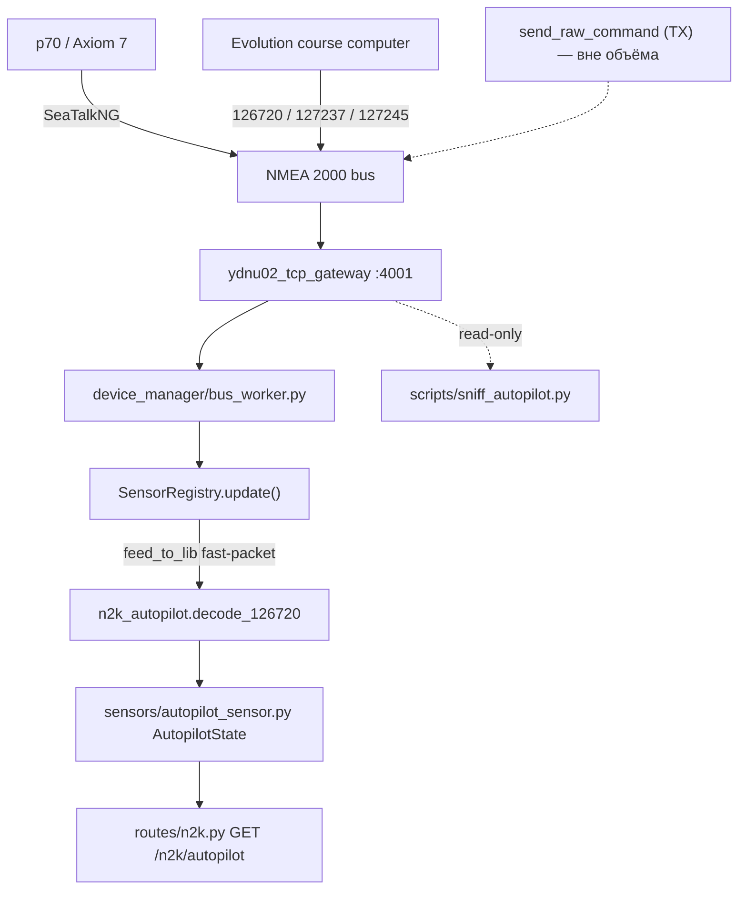

# Requirements

### Overview & Goals

На борту: курсовой компьютер Raymarine Evolution с постом управления **p70** и MFD **Axiom 7**, всё на SeaTalkNG (физически — NMEA 2000). Проект (`yacht-n2k-console`) сейчас про автопилот **не знает ничего**: `grep` по `autopilot|126720|65379|65360` не даёт ни одного попадания в коде.

Цель задачи — **разобраться, как в принципе можно управлять автопилотом**, зафиксировать это в спеке по SDD-процессу проекта, и в качестве проверки теории реализовать **read-only прототип**: гейтвей должен видеть и отдавать наружу текущий режим автопилота, заданный курс и угол руля. Отправка команд в шину в этой задаче **не делается**.

### Scope

**In Scope**
- Спека `specs/active/008-autopilot-control.md` по шаблону `specs/templates/feature_template.md`: разбор трёх каналов управления (proprietary PGN 126720 / стандартные 127237+129284 / Axiom-интерфейсы), выбор пути, риски безопасности, схема будущей команды.
- Декодер проприетарных Raymarine-кадров (режим, заданный курс, wind datum) + стандартных 127237/127245.
- Модель состояния автопилота и её включение в существующий `SensorRegistry`.
- REST-эндпоинт `GET /api/n2k/autopilot` со снимком состояния.
- Скрипт-снифер для записи реальных кадров с борта, чтобы подтвердить раскладку байт.
- Unit-тесты декодера на зафиксированных hex-кадрах.

**Out of Scope**
- Любая отправка команд автопилоту (смена режима, правка курса, `send_raw_command`) — отдельная задача после верификации чтения.
- Интеграция в HA-дашборд `ha/sailing-dash/`.
- Управление через Axiom / LightHouse — в спеке фиксируется как тупик, кодом не трогается.

### User Stories

- Как владелец лодки, я хочу иметь письменный разбор всех способов управления Evolution, чтобы понимать цену и риск каждого пути до того, как что-то писать в шину.
- Как оператор, я хочу видеть в API текущий режим автопилота (Standby/Auto/Wind/Track) и заданный курс, чтобы дашборд мог их показать.
- Как разработчик, я хочу иметь тесты декодера на реальных hex-кадрах, чтобы правки в разборе байт не ломались молча.

### Functional Requirements

1. Спека содержит все обязательные H2-секции валидатора (`Metadata`, `Context`, `Requirements`, `Architecture & Technical Design`, `Interfaces / Contracts`, `Implementation Plan`, `Verification`) и проходит `python ~/.junie/scripts/spec.py validate`.
2. Декодер распознаёт кадр PGN 126720 как Raymarine-проприетарный по manufacturer code 1851 + industry group 4 в первых двух байтах и разбирает подтипы по proprietary ID.
3. Состояние автопилота включает: `mode` (`standby|auto|wind|track|unknown`), `locked_heading_deg`, `heading_reference` (`magnetic|true`), `wind_datum_deg`, `rudder_angle_deg`, `src`, `last_update`/`age_sec`.
4. Поля, для которых кадр не приходил или пришёл со значением «нет данных» (`0xFFFF`), остаются `None` — не подменяются нулями.
5. `GET /api/n2k/autopilot` возвращает снимок; при отсутствии трафика — `mode: "unknown"` и `age_sec: null`, а не 500.
6. Снифер (`scripts/sniff_autopilot.py`) подключается к DATA-порту `:4001`, пишет сырые строки с интересующими PGN в файл и печатает разобранную интерпретацию рядом — чтобы сверять с тем, что показывает p70.

### Non-Functional Requirements

- **Безопасность прежде всего:** ни одна строка этого этапа не пишет в шину. Снифер открывает соединение только на чтение.
- Декодирование выполняется в горячем цикле `_bus_worker` — никаких блокирующих операций, только арифметика над байтами.
- Раскладки байт помечаются в коде как reverse-engineered (источник — canboat/SignalK), с явным указанием, что они не подтверждены Raymarine.

# Technical Design

### Current Implementation

- **Приём кадров:** `ydnu02_tcp_gateway` → DATA-порт `:4001` → `device_manager/bus_worker.py` → `DeviceManager._update_sensor_state()` → `device_manager/sensor_registry.py::SensorRegistry.update(parsed)`.
- **Диспетчер PGN** живёт прямо в `SensorRegistry.update`: `if pgn == 60928 ... if pgn == 127505 ...`. Fast-packet собирается через `N2KPGNDecoder.feed_to_lib(parsed)` — **единственная** точка сборки, дублировать её нельзя (комментарий в файле, commit `1de3074`).
- **Модели датчиков:** `sensors/base_sensor.py` — dataclass-каналы (`NMEAData`/`BLEData`) + `to_dict()`; наследники `GobiusCSensor`, `MopekaSensor`, экспорт через `sensors/__init__.py`.
- **Декодирование:** `ydnu02/pgn_decoder.py::N2KPGNDecoder`.
- **REST:** `routes/n2k_config.py` / `routes/n2k.py` — `APIRouter`, доступ к состоянию через `get_device_mgr()`.
- **TX (пока не используем):** `DeviceManager.send_raw_command()` и `n2k_command_builder.build_pgn_126208_command()` — готовая инфраструктура для будущего этапа управления.

### Что вообще можно с автопилотом — три канала

**1. Axiom 7 / LightHouse как «отдельный интерфейс» — тупик.** Axiom не курсовой компьютер, а такая же голова на шине, как p70. LightHouse наружу отдаёт только RayNet-видео, точки/маршруты и мобильное приложение — **открытого API для команд автопилоту нет**. Всё, что Axiom «делает» с автопилотом, он делает теми же кадрами SeaTalkNG, что и p70. Вывод для спеки: Axiom интересен только как *источник* кадров для реверса, а не как точка интеграции.

**2. Стандартные NMEA 2000 PGN — частично.** 127237 (Heading/Track Control) и 129284 (Navigation Data) Evolution принимает, но фактически только чтобы **вести по маршруту в режиме Track**; перевести автопилот из Standby в Auto ими нельзя. Полезны как *источник чтения* (127237 отдаёт commanded rudder / heading-to-steer, 127245 — угол руля).

**3. Проприетарный PGN 126720 (SeaTalkNG) — единственный полноценный путь.** Выбран пользователем. Это fast-packet PDU1 0x1EF00; первые два байта — manufacturer code 1851 (Raymarine) + industry group 4, упакованные little-endian (`0x3B 0x9F`), дальше proprietary ID. Сообщество (canboat, SignalK `@signalk/raymarine-autopilot`) разобрало нужные подтипы:

 Подтип | Смысл | Направление |
---|---|---|
 65379 Seatalk Pilot Mode | режим: Standby / Auto / Wind / Track | чтение **и** запись |
 65360 Seatalk Pilot Locked Heading | заданный курс | чтение |
 65345 Seatalk Pilot Wind Datum | заданный угол к ветру | чтение |
 126208 (Command Group Function поверх 65360) | правка курса ±1/±10 | запись (будущий этап) |

В этой задаче используются **только строки «чтение»**.

### Key Decisions

1. **Декодер — отдельный модуль `n2k_autopilot.py` в корне, а не рост `SensorRegistry.update`.** Диспетчер в `SensorRegistry` уже перегружен; проприетарный разбор — чистая функция `bytes -> dict`, её удобно тестировать в отрыве от шины. Ставим рядом с `n2k_command_builder.py` / `n2k_meta.py` — тот же уровень.
2. **Fast-packet берём из существующего `feed_to_lib`, свою сборку не пишем.** 126720 — fast-packet; собственный реассемблер отравил бы счётчик последовательности stateful-декодера (прямо предупреждено в комментарии `sensor_registry.py`).
3. **Состояние — один объект `AutopilotState` на весь автопилот, не словарь по instance.** Автопилот на борту один; ключ — SA курсового компьютера, для наблюдаемости.
4. **Никакого TX на этом этапе.** `send_raw_command` не вызывается; будущая команда только описывается в секции `Interfaces / Contracts` спеки.
5. **Раскладки байт считаются гипотезой до подтверждения на борту.** Поэтому в план входит снифер: сверяем декодированный режим с тем, что показывает p70, и только потом фиксируем константы.

### Proposed Changes

**`n2k_autopilot.py`** (новый, корень проекта)

```python
RAYMARINE_MFG_CODE = 1851
PROPRIETARY_PGN = 126720

PILOT_MODES = {           # (mode, submode) -> имя; reverse-engineered
    (0x0000, 0x0000): "standby",
    (0x0040, 0x0000): "auto",
    (0x0100, 0x0001): "wind",
    (0x0180, 0x0001): "track",
}

def is_raymarine_proprietary(data: bytes) -> bool: ...
def decode_126720(data: bytes) -> Optional[Dict[str, Any]]:
    """-> {'kind': 'pilot_mode'|'locked_heading'|'wind_datum', ...} или None."""
def decode_127237(data: bytes) -> Dict[str, Any]: ...   # heading/track control
def decode_127245(data: bytes) -> Dict[str, Any]: ...   # rudder angle
```

**`sensors/autopilot_sensor.py`** (новый) — `AutopilotState` в стиле `BaseSensor`: dataclass с полями из FR-3, метод `update_from_frame(decoded)` и `to_dict()` с вычисляемым `age_sec`. Экспорт добавляется в `sensors/__init__.py`.

**`device_manager/sensor_registry.py`** — в `update()`, внутри уже существующей ветки `lib_msg = feed_to_lib(...)`, добавляется обработка `lib_msg.PGN == 126720` (рядом с текущей веткой 126996), плюс однокадровые 127237/127245 рядом с 127505. Всё под тем же `self._lock`. Новое поле `self.autopilot: AutopilotState` и геттер `get_autopilot_state()`.

**`device_manager/manager.py`** — тонкий проброс `get_autopilot_state()` к `_sensor_registry`, как уже сделано для `get_bus_devices()`.

**`routes/n2k.py`** — `GET /n2k/autopilot`, паттерн один в один с `list_devices()`: `get_device_mgr()` → 503 если менеджера нет → снимок.

**`scripts/sniff_autopilot.py`** (новый) — read-only TCP-клиент к `:4001`, фильтр по 126720/127237/127245/65379, дамп сырых строк в файл + печать разбора.

### Architecture Diagram



### File Structure

```
specs/active/008-autopilot-control.md      (новый)  спека-исследование
n2k_autopilot.py                           (новый)  декодер 126720/127237/127245
sensors/autopilot_sensor.py                (новый)  AutopilotState
sensors/__init__.py                        (правка) экспорт
device_manager/sensor_registry.py          (правка) диспетчер PGN + состояние
device_manager/manager.py                  (правка) get_autopilot_state()
routes/n2k.py                              (правка) GET /n2k/autopilot
scripts/sniff_autopilot.py                 (новый)  снифер для сверки на борту
tests/test_autopilot_decoder.py            (новый)  тесты на hex-кадрах
```

### Risks

- **Раскладки байт не документированы Raymarine.** Взяты из canboat/SignalK и могут отличаться для конкретной прошивки EV. Митигация — снифер и сверка с показаниями p70 до фиксации констант.
- **126720 — fast-packet.** Попытка разобрать его в обход `feed_to_lib` даст мусор и сломает сборку 126996. Митигация — обработка строго внутри существующей ветки `lib_msg`.
- **Трафик автопилота плотный** (несколько кадров в секунду). Митигация — только присваивания полей, никакого логирования на кадр.
- **Соблазн «раз уж декодер есть, добавим кнопку».** Запись в шину, ведущую руль, требует отдельного обсуждения безопасности — явно вынесено в Out of Scope и зафиксировано в спеке.

# Testing

### Validation Approach

Две независимые проверки: **офлайн** — unit-тесты декодера на зафиксированных hex-кадрах (pytest, как весь `tests/`), и **на борту** — снифер, чей вывод сверяется с тем, что в этот момент показывает p70.

### Key Scenarios

- `decode_126720` на кадре Pilot Mode Standby → `{'kind': 'pilot_mode', 'mode': 'standby'}`; то же для Auto / Wind / Track.
- `decode_126720` на кадре Locked Heading → курс в градусах с корректной ссылкой (`magnetic`).
- Кадр 126720 от чужого производителя (manufacturer code ≠ 1851) → `None`, состояние не трогается.
- `SensorRegistry.update()` с последовательностью «Standby → Auto → смена курса» → `get_autopilot_state()` отражает финальное состояние, `age_sec` растёт.
- `GET /n2k/autopilot` без трафика → `mode: "unknown"`, `age_sec: null`, HTTP 200.
- На борту: перевод p70 в Auto и правка курса на ±10 — снифер печатает совпадающие значения.

### Edge Cases

- Значение «нет данных» `0xFFFF` в поле курса → `None`, а не 655.35.
- Слишком короткий payload (обрезанный fast-packet) → `None` без исключения.
- Неизвестная пара (mode, submode) → `mode: "unknown"`, кадр не роняет `_bus_worker`.
- Автопилот пропал с шины → последние значения остаются, но `age_sec` показывает возраст.
- Регрессия: 126996 (Product Info) продолжает собираться — новая ветка 126720 не ломает существующую сборку fast-packet.

### Test Changes

- Новый `tests/test_autopilot_decoder.py` — чистые тесты декодера на hex-константах.
- Расширение существующих тестов реестра: прогон кадра автопилота через `SensorRegistry.update()` и проверка снимка.
- Полный прогон `pytest tests/` для контроля отсутствия регрессий в разборе 60928/126996/127505.

# Delivery Steps

### ✓ Step 1: Написать спеку-исследование по управлению автопилотом
В `specs/active/008-autopilot-control.md` лежит согласованный разбор всех способов управления Evolution, проходящий валидатор спек.

- Создать файл по `specs/templates/feature_template.md` со всеми обязательными H2-секциями (`Metadata`, `Context`, `Requirements`, `Architecture & Technical Design`, `Interfaces / Contracts`, `Implementation Plan`, `Verification`), статус `draft`.
- В `Context` зафиксировать конфигурацию борта: Evolution + p70 + Axiom 7 на SeaTalkNG, и что в коде проекта автопилота сейчас нет ни одного упоминания.
- Разобрать три канала: Axiom/LightHouse (нет открытого API, только та же шина — тупик для интеграции), стандартные 127237/129284 (работают в Track, режим ими не переключить), проприетарный 126720 (полноценный путь, выбранный).
- Описать структуру 126720: fast-packet, manufacturer code 1851 + industry group 4 в первых двух байтах, таблица подтипов 65379 / 65360 / 65345 с пометкой «reverse-engineered, источник canboat/SignalK».
- В `Interfaces / Contracts` описать будущий формат команды через `n2k_command_builder` + `send_raw_command`, явно отметив, что на этом этапе она не реализуется.
- В `Known Issues` перечислить риски безопасности записи в шину, ведущую руль.
- Прогнать `python ~/.junie/scripts/spec.py validate specs/active/008-autopilot-control.md`.

### ✓ Step 2: Реализовать декодер проприетарных кадров автопилота
`n2k_autopilot.py` разбирает кадры Raymarine и покрыт тестами на зафиксированных hex-последовательностях.

- Создать `n2k_autopilot.py` рядом с `n2k_command_builder.py` / `n2k_meta.py`.
- Реализовать `is_raymarine_proprietary(data)` — проверка manufacturer code 1851 и industry group 4 в первых двух байтах little-endian.
- Реализовать `decode_126720(data)` с диспетчером по proprietary ID: Pilot Mode (65379) → `standby/auto/wind/track`, Locked Heading (65360) → курс + `heading_reference`, Wind Datum (65345) → угол к ветру; неизвестный ID и чужой производитель → `None`.
- Реализовать `decode_127237(data)` (heading/track control) и `decode_127245(data)` (угол руля) как источники стандартных данных.
- Все значения `0xFFFF`/«нет данных» отдавать как `None`; короткий payload не должен бросать исключение.
- Добавить `tests/test_autopilot_decoder.py`: по кейсу на каждый режим, на locked heading, на чужого производителя, на обрезанный кадр и на `0xFFFF`.

### ✓ Step 3: Завести состояние автопилота и подключить его к живой шине
Гейтвей поддерживает актуальный снимок состояния автопилота из реального трафика.

- Создать `sensors/autopilot_sensor.py` с dataclass-моделью `AutopilotState` в стиле `sensors/base_sensor.py`: `mode`, `locked_heading_deg`, `heading_reference`, `wind_datum_deg`, `rudder_angle_deg`, `src`, `last_update` и вычисляемый `age_sec`; методы `update_from_frame()` и `to_dict()`.
- Экспортировать класс из `sensors/__init__.py`.
- В `device_manager/sensor_registry.py` завести поле `self.autopilot` и обрабатывать 126720 **внутри существующей ветки** `lib_msg = N2KPGNDecoder.feed_to_lib(...)`, рядом с веткой 126996 — чтобы не заводить второй реассемблер fast-packet.
- Там же добавить однокадровые 127237/127245 рядом с обработкой 127505, всё под существующим `self._lock`.
- Добавить `get_autopilot_state()` в `SensorRegistry` и тонкий проброс в `device_manager/manager.py`.
- Расширить тесты реестра: прогон последовательности «Standby → Auto → смена курса» через `update()` и проверка снимка; убедиться, что сборка 126996 не сломалась.

### ✓ Step 4: Отдать состояние в API и добавить снифер для сверки на борту
Состояние автопилота доступно по REST, а его корректность можно проверить против показаний p70.

- Добавить в `routes/n2k.py` эндпоинт `GET /n2k/autopilot` по образцу `list_devices()`: `get_device_mgr()`, 503 при отсутствии менеджера, снимок состояния в ответе.
- При отсутствии трафика возвращать `mode: "unknown"` и `age_sec: null` с HTTP 200, а не ошибку.
- Создать `scripts/sniff_autopilot.py` — read-only TCP-клиент к DATA-порту `:4001`, без единой записи в шину: фильтр по 126720/127237/127245, дамп сырых строк в файл и печать декодированной интерпретации рядом.
- Добавить в снифер краткую инструкцию по сверке: переключить p70 в Auto, поправить курс ±10 и сравнить вывод с дисплеем.
- Дописать тест на эндпоинт (пустое состояние и заполненное) и прогнать полный `pytest tests/`.
- По результатам реальной сверки обновить константы раскладок в `n2k_autopilot.py` и раздел `Verification` спеки.