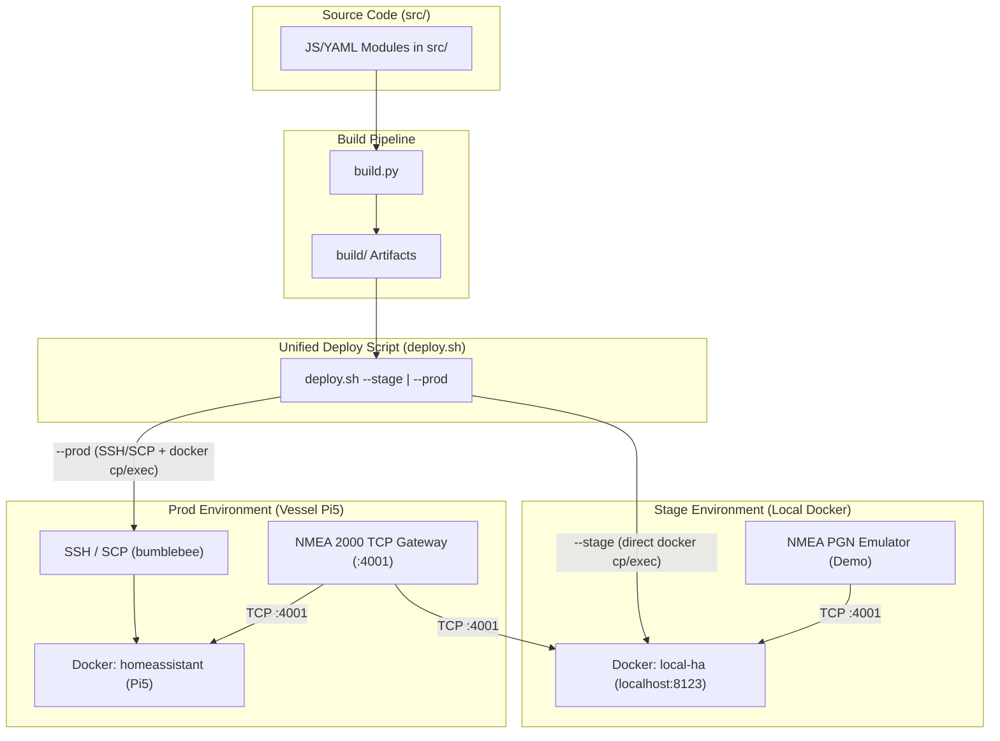

# ha-sailing-dash-deploy-stage-prod.md

### План доработки скриптов деплоя и отладочного окружения Home Assistant (Stage и Prod)

В связи с отказом от автономного статического превью (`local-preview`) отладка дашборда и кастомных карточек полностью переводится на **полноценный инстанс Home Assistant**. Создается разделение на среды **Stage** (локальный HA в Docker) и **Prod** (продакшн HA на лодке), а скрипты сборки и деплоя дорабатываются для прозрачной поддержки обоих окружений.

---

# Требования

### Обзор и цели
Отказ от автономного `local-preview` в пользу полноценной отладки дашборда `ha/sailing-dash` на реальном Home Assistant. Создание единой системы деплоя с поддержкой двух целевых сред:
1. **Stage (локальное окружение)**: изолированный контейнер Home Assistant (`local-ha`) в Docker с возможностью эмуляции NMEA-данных или прямого подключения к TCP-шлюзу.
2. **Prod (боевое окружение)**: продакшн-инстанс Home Assistant на Pi5 (bumblebee).

### Функциональные требования
1. **Удаление/замена `local-preview`**:
   - Отказ от использования автономного HTML/JS-стенда `local-preview`.
   - Замена `start_preview.py` на оркестратор `start_stage.py`, управляющий локальным Stage-инстансом HA.

2. **Единый скрипт деплоя (`deploy.sh`) с поддержкой Stage и Prod**:
   - Переключатель окружений: `--stage` (деплой в локальный контейнер `local-ha` напрямую через Docker) и `--prod` (деплой по SSH на продакшн host из `deploy.conf`).
   - Единый цикл сборки: любой деплой автоматически запускает пересборку `build.py` перед отправкой артефактов.
   - Поддержка частных режимов деплоя для обоих окружений: `--resources-only`, `--dashboard-only`, `--sensors-only`.

3. **Локальный Stage инстанс (`local-ha`)**:
   - Автоматический запуск локального HA в Docker (`ha/sailing-dash/local-ha/`).
   - Автоматическая загрузка собранных ресурсов (`build/dashboard-sailing.yaml`, `build/sensors-sailing.yaml`, `build/lovelace-resources.yaml`, кастомные JS-карточки).
   - Двухрежимная работа с NMEA 2000:
     - **Demo mode**: локальный Python эмулятор NMEA 2000 PGN кадров (скорость, ветер, глубина, GPS).
     - **Live mode**: подключение Stage HA к удаленному TCP-шлюзу Pi5 (`GW_HOST:4001`).

4. **Продакшн деплой (`Prod`)**:
   - Использование параметров из `deploy.conf` (SSH host, имя контейнера HA).
   - Безопасный процесс с созданием бэкапов `.storage/lovelace.dashboard_sailing` и `configuration.yaml` перед обновлением.
   - Проверка diff перед записью (защита от случайной перезаписи UI-изменений).

---

# Технический Дизайн

### Схема архитектуры деплоя (Stage vs Prod)

### Ключевые технические решения

1. **Доработка `deploy.sh`**:
   - Расширение разбора аргументов: `--stage` по умолчанию использует локальное Docker-подключение (`docker exec local-ha ...`, без SSH), `--prod` читает `deploy.conf` или принимает SSH host из аргументов.
   - Унификация подскриптов: `deploy_dashboard.sh` и `deploy_sensors.sh` получают поддержку передачи имени контейнера и режима выполнения (local docker vs remote ssh).

2. **Оркестратор Stage-среды (`start_stage.py`)**:
   - Запускает Docker-контейнер `local-ha` с примонтированными ресурсами.
   - Запускает фоновый симулятор NMEA `mock_nmea_emulator.py` (в режиме `--demo`).
   - Отслеживает изменения в `src/`, автоматически вызывая `build.py` и `./deploy.sh --stage`.
   - Выводит в консоль готовую ссылку на дашборд: `http://localhost:8123/dashboard-sailing/`.

3. **Конфигурация `local-ha`**:
   - Размещение в `ha/sailing-dash/local-ha/`.
   - `docker-compose.yml` поднимает официальный образ Home Assistant (`ghcr.io/home-assistant/home-assistant:stable`).
   - При старте инициализирует `.storage/lovelace.dashboard_sailing` и `configuration.yaml` из собранных `build/` артефактов.

---

# Delivery Steps

### ✓ Step 1: Настройка локального Stage-инстанса Home Assistant (`local-ha`)
Локальный инстанс Home Assistant поднят в Docker в `ha/sailing-dash/local-ha/` и готов к приему артефактов дашборда и сенсоров.

- Создать директорию `ha/sailing-dash/local-ha/` с `docker-compose.yml` и базовой конфигурацией `configuration.yaml`.
- Реализовать скрипт эмуляции NMEA PGN кадров `mock_nmea_emulator.py` для работы Stage HA в Demo-режиме без физической лодки.
- Настроить инициализацию хранилища `.storage/` для автоматического подхвата дашборда `dashboard-sailing`.

### ✓ Step 2: Модернизация скриптов деплоя (`deploy.sh`, `deploy_dashboard.sh`, `deploy_sensors.sh`) для поддержки Stage и Prod
Скрипт `deploy.sh` умеет выполнять автоматический деплой как в локальный Stage HA контейнер, так и на удаленный Prod HA хост.

- Добавить в `deploy.sh` флаги вызова `--stage` и `--prod` (с поддержкой переопределения SSH хоста).
- Доработать `deploy_dashboard.sh` и `deploy_sensors.sh` для корректной работы с локальным Docker-контейнером без использования SSH в Stage-режиме.
- Обеспечить автоматический запуск `build.py` перед каждым деплоем независимо от выбранного окружения.

### ✓ Step 3: Реализация оркестратора Stage-окружения `start_stage.py`
Разработан скрипт `start_stage.py`, автоматизирующий сборку, запуск Stage HA, эмуляцию данных и отслеживание изменений в исходниках.

- Создать `start_stage.py` с флагами `--demo` (NMEA симулятор) и `--live` (подключение к TCP-шлюзу Pi5).
- Интегрировать механизм watch-автопересборки при редактировании файлов в `src/` и автоматического обновления Stage HA.
- Обновить документацию в `ha/sailing-dash/README.md` с подробным руководством по работе с Stage и Prod деплоем.