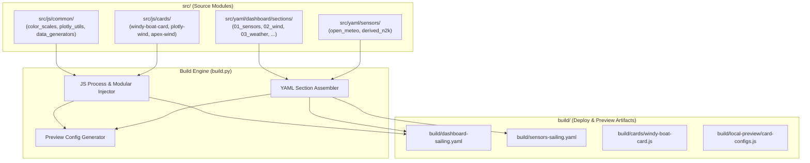

# module-refactoring-v1.md

### Аудит текущей реализации ha/sailing-dash

В результате глубокого аудита проекта `ha/sailing-dash` выявлены следующие проблемные места:
1. **Монолитный `dashboard-sailing.yaml` (~800 строк)**:
   - Объединяет 4 секции Lovelace (`Wind & Forecast`, `Weather & Forecast`, `Position`, `Speed & Depth`) и около 12 карточек в один файл.
   - Содержит массивные фрагменты JavaScript-кода, внедренные в YAML-строки (`$fn`, `data_generator`, математика координат, генерация векторных стрелок Plotly, фильтры времени `rangeStart`).
   - Дублирование стилей `card-mod` для индикаторов (например, логика порогов цвета датчика глубины).

2. **Дублирование кода с `local-preview/card-configs.js`**:
   - Файл `local-preview/card-configs.js` вручную воспроизводит конфигурации карточек из `dashboard-sailing.yaml` на JS.
   - Комментарий в файле прямо указывает: *"IMPORTANT: whenever dashboard-sailing.yaml changes, re-sync all four configs below by hand..."*.
   - Это прямое нарушение принципа DRY (Don't Repeat Yourself), приводящее к расхождению между реальным дашбордом и офлайн-превью.

3. **Отсутствие единого процесса сборки**:
   - Файлы `sensors-sailing.yaml`, `automations-sailing.yaml`, `lovelace-resources.yaml` и `dashboard-sailing.yaml` лежат в корне подпроекта в плоском виде.
   - Нет промежуточного этапа сборки и валидации перед деплоем.

---

### Предлагаемая структура проекта (модульная организация)

```
ha/sailing-dash/
├── build/                        # Целевая директория артефактов сборки (под деплой)
│   ├── dashboard-sailing.yaml    # Собранный Lovelace дашборд
│   ├── sensors-sailing.yaml      # Собранный YAML сенсоров
│   ├── automations-sailing.yaml  # Собранный YAML автоматизаций
│   ├── lovelace-resources.yaml  # Собранный список ресурсов
│   ├── cards/                    # Готовые JS-карточки
│   │   └── windy-boat-card.js
│   └── local-preview/            # Сгенерированные конфигурации для локального превью
│       └── card-configs.js       # Автоматически сгенерированный JS из модулей!
├── src/                          # Исходные модули проекта
│   ├── js/                       # Модули JavaScript
│   │   ├── common/               # Переиспользуемые утилиты и логика
│   │   │   ├── color_scales.js   # Цветовые палитры (ветер, волны, шкала knots)
│   │   │   ├── data_generators.js# Обработка временных рядов ApexCharts/Plotly
│   │   │   └── plotly_utils.js   # Генераторы векторных стрелок и слоев Plotly
│   │   └── cards/                # Логика и исходники карточек
│   │       ├── windy-boat-card.js# Кастомный элемент Windy
│   │       ├── plotly-wind.js    # Конфигурация и логика карточки ветровых векторов
│   │       ├── plotly-wave.js    # Конфигурация и логика карточки волн
│   │       └── apex-wind.js      # График истории и прогноза ветра
│   └── yaml/                     # Модули YAML
│       ├── dashboard/            # Компоненты дашборда
│       │   ├── header.yaml       # Настройки вида Lovelace
│       │   └── sections/         # Модули секций ("плашек")
│       │       ├── 01_sensors.yaml        # Плашка STW, Depth, SOG
│       │       ├── 02_wind.yaml           # Плашка Windrose, Apex Wind, Plotly Wind Vector
│       │       ├── 03_weather.yaml        # Плашка Windy card, давление
│       │       ├── 04_position.yaml       # Плашка COG compass, карта, Lat/Lon
│       │       └── 05_speed_depth.yaml    # Плашка детальных габаритов скорости/глубины
│       ├── sensors/              # Модули сенсоров
│       │   ├── open_meteo.yaml   # REST и template сенсоры Open-Meteo
│       │   └── derived_n2k.yaml  # Производные N2K сенсоры
│       ├── automations/          # Модули автоматизаций
│       │   └── refresh_forecast.yaml
│       └── resources/            # Список ресурсов
│           └── lovelace-resources.yaml
├── build.py                      # Скрипт сборки (Python 3 + PyYAML)
├── deploy.sh                     # Единый скрипт деплоя (запускает build.py)
├── deploy_dashboard.sh           # Деплой дашборда из build/
├── deploy_sensors.sh             # Деплой сенсоров из build/
└── local-preview/                # Стенд локального превью
```

---

### Принципы рефакторинга и правила языка

1. **Документация и комментарии**:
   - Все комментарии в JS и YAML файлах, а также docstrings в Python пишутся strictly on **English**.
   - Документация планов и ответов пользователю пишется на **русском языке**.

2. **Переиспользование кода (Zero Duplication)**:
   - Общая логика (расчет углов, трансформации массивов, цветовые палитры) живет исключительно в `src/js/common/`.
   - При сборке `build.py` внедряет общие функции из `src/js/common/` в нужные карточки дашборда и превью.
   - `build/local-preview/card-configs.js` генерируется автоматически из тех же `src/` файлов, исключая синхронизацию вручную.

# Требования

### Обзор и цели
Цель проекта — проведения глубокой модулизации подпроекта `ha/sailing-dash`, создание независимых переиспользуемых JS и YAML модулей, ликвидация дублирования кода между целевыми конфигурациями Home Assistant и стендом `local-preview`, и создание автоматизированного сборщика в директорию `ha/sailing-dash/build/`.

### Требования к JS-модулям
1. **Логическое разделение по плашкам**: Каждая карточка/плашка (`windy-boat-card`, `plotly-wind`, `plotly-wave`, `apex-wind`, `depth-gauge`) должна иметь свой независимый JS-модуль.
2. **Переиспользуемые утилиты**: Общие функции (цветовые шкалы `WIND_SPEED_COLORSCALE`, генераторы векторов Plotly, конвертеры координат и времени) должны находиться в `src/js/common/`.
3. **Запрет на дублирование**: Запрещено дублировать JS-код между YAML-шаблонами дашборда и конфигурациями `local-preview`.

### Требования к YAML-модулям
1. **Декомпозиция дашборда**: Монолитный `dashboard-sailing.yaml` должен быть разбит на секции в `src/yaml/dashboard/sections/`.
2. **Декомпозиция сенсоров и автоматизаций**: Файлы `sensors-sailing.yaml` и `automations-sailing.yaml` разбиваются по функциональным доменам (`open_meteo`, `derived_n2k`, `refresh_forecast`).

### Требования к сборщику и деплою
1. **Результат сборки**: Все сгенерированные файлы помещаются в `ha/sailing-dash/build/`:
   - `build/dashboard-sailing.yaml`
   - `build/sensors-sailing.yaml`
   - `build/automations-sailing.yaml`
   - `build/lovelace-resources.yaml`
   - `build/cards/windy-boat-card.js`
   - `build/local-preview/card-configs.js`
2. **Интеграция с deploy.sh**: Скрипты деплоя (`deploy.sh`, `deploy_dashboard.sh`, `deploy_sensors.sh`) перед выполнением обязаны запускать `build.py` и использовать файлы исключительно из папки `build/`.

# Технический Дизайн

### Текущие проблемы архитектуры
В текущей реализации `ha/sailing-dash`:
- Дашборд представляет собой 800-строчный монолитный YAML с вкраплениями многострочного JS-кода в полях `$fn` и `data_generator`.
- Стенд `local-preview/card-configs.js` содержит дублирующий JS-код карточек, требующий ручного синхронизирования при любом изменении YAML.
- Отсутствует сборочный пайплайн.

### Схема потока сборки (Build Flow Diagram)



### Архитектура сборочного модуля build.py
1. **Сборка JS**: `build.py` считывает переиспользуемые модули из `src/js/common/` и объединяет их с логикой конкретных карточек из `src/js/cards/`.
2. **Сборка YAML**:
   - Раздел `dashboard-sailing.yaml` собирается путем последовательного чтения файлов секций из `src/yaml/dashboard/sections/` и подстановки обработанных JS-скриптов.
   - Раздел `sensors-sailing.yaml` собирается объединением файлов из `src/yaml/sensors/`.
3. **Генерация local-preview**:
   - `build.py` генерирует `build/local-preview/card-configs.js`, напрямую конвертируя объекты карточек из исходных модулей. Это полностью устраняет необходимость ручного обновления файлов превью.

# Delivery Steps

### ✓ Step 1: Создание структуры каталогов src/ и извлечение переиспользуемых JS-модулей
В `src/js/common/` вынесены все повторно используемые JS-функции для работы с графиками Plotly, ApexCharts и кастомными карточками.

- Создать структуру папок `src/js/common/` и `src/js/cards/`.
- Извлечь функцию и шкалу цветов ветра/волн в `src/js/common/color_scales.js`.
- Извлечь логику обработки временных рядов ApexCharts и фильтрации диапазонов (`rangeStart`) в `src/js/common/data_generators.js`.
- Вынести генератор векторных стрелок и конфигурацию слоев Plotly в `src/js/common/plotly_utils.js`.

### ✓ Step 2: Декомпозиция YAML-файлов на секционные и сенсорные модули
Монолитные конфигурации дашборда, сенсоров и автоматизаций разделены на независимые YAML-модули в `src/yaml/`.

- Создать структуру папок `src/yaml/dashboard/sections/`, `src/yaml/sensors/`, `src/yaml/automations/` и `src/yaml/resources/`.
- Разбить `dashboard-sailing.yaml` на модули секций: `01_sensors.yaml`, `02_wind.yaml`, `03_weather.yaml`, `04_position.yaml`, `05_speed_depth.yaml`.
- Перенести исходник кастомной карточки Windy в `src/js/cards/windy-boat-card.js`.
- Разбить `sensors-sailing.yaml` на `src/yaml/sensors/open_meteo.yaml` и `src/yaml/sensors/derived_n2k.yaml`.
- Вынести автоматизацию переопроса прогноза в `src/yaml/automations/refresh_forecast.yaml`.

### ✓ Step 3: Разработка сборочного скрипта build.py и генерация целевой папки build/
Скрипт `build.py` собирает исходные YAML и JS модули в готовые артефакты в папки `build/` и `build/local-preview/`.

- Реализовать `build.py` на Python 3 с использованием `pyyaml`.
- Реализовать сборку `build/dashboard-sailing.yaml` путем склейки YAML-секций и внедрения компилированных/вставляемых JS-функций.
- Реализовать генератор `build/local-preview/card-configs.js` напрямую из исходных конфигураций карточек (ликвидация ручной дубликации).
- Сформировать целевые файлы `build/sensors-sailing.yaml`, `build/automations-sailing.yaml`, `build/lovelace-resources.yaml` и `build/cards/windy-boat-card.js`.

### ✓ Step 4: Обновление скриптов деплоя и интеграция с local-preview
Скрипты деплоя подхватывают артефакты из `build/`, а стенд `local-preview` работает на сгенерированных конфигурациях.

- Обновить `deploy.sh` для автоматического вызова `python3 build.py` перед деплоем на Home Assistant.
- Перенаправить `deploy_dashboard.sh` и `deploy_sensors.sh` на файлы из директории `ha/sailing-dash/build/`.
- Обновить `local-preview/index.html` и `render.js` для работы с `build/local-preview/card-configs.js`.
- Проверить корректность сборки и прохождение тестов в `local-preview/run-preview.js`.