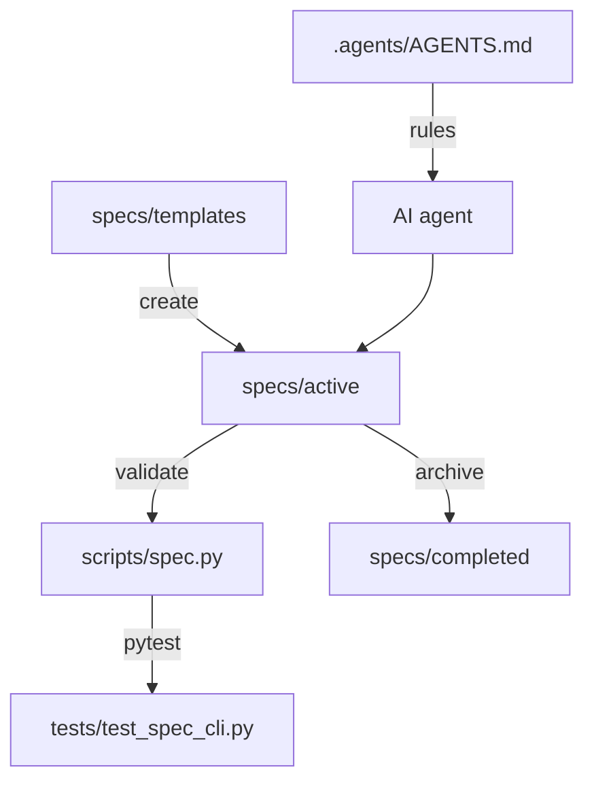

# Requirements

### Overview & Goals
Создать набор спецификаций (Spec-Driven Development) для существующего проекта `yacht-n2k-console`: инфраструктуру `specs/`, шаблоны и ретро-спеки по ключевым подсистемам, чтобы агенты и разработчики работали от спеки, а не от кода.

### Scope
**In Scope**
- Каталоги `specs/active/`, `specs/completed/`, `specs/templates/`.
- Шаблоны: feature, bugfix, N2K-device.
- Ретро-спеки (as-is) на 5 подсистем:
  1. TCP Gateway (`ydnu02_tcp_gateway/`)
  2. Device Manager (`device_manager/`)
  3. Web API + UI (`app.py`, `routes/`, `static/`)
  4. BLE-сенсоры (`sensors/`, `gobius_*`, `mopeka_*`, `ble_registry.py`)
  5. Deploy & Home Assistant integration (`deploy.sh`, `scripts/`, `patches/`, `homeassistant/`)
- Сквозные спеки уровня проекта:
  6. `000-project-overview.md` — общие требования к проекту (цели, платформа, глобальные правила, NFR, глоссарий, реестр спек).
  7. `006-integrations.md` — технический дизайн интеграций (YDNU-02/NMEA 2000, Home Assistant + форк `nmea2000`, Signal K, BLE-устройства, REST/WebSocket-потребители).
  8. `007-testing-strategy.md` — стратегия тестирования (уровни, карта `tests/` → подсистемы, моки железа, live-тесты, Definition of Done).
- `specs/README.md` с 4-фазным жизненным циклом и реестром спек.
- Правило SDD в `.agents/AGENTS.md`.
- Лёгкий валидатор `scripts/spec.py` (create/list/validate/archive) + тесты.

**Out of Scope**
- Изменения продуктового кода и поведения приложения.
- Рефакторинг, миграции, новые фичи.

### User Stories
- Как разработчик, я хочу читать спеку подсистемы, чтобы понимать контракты без чтения всего кода.
- Как AI-агент, я хочу шаблон и обязательные секции, чтобы новая работа начиналась со спеки.
- Как ревьюер, я хочу `validate`, чтобы PR со спекой без обязательных секций отклонялся.

### Functional Requirements
- Каждая спека содержит: Metadata (id, status, owner, date), Context, Requirements, Architecture & Technical Design, Interfaces/Contracts, Implementation Plan, Verification, Known Issues.
- Ретро-спеки ссылаются на конкретные файлы/функции проекта и существующие тесты в `tests/`.
- Набор спек покрывает три сквозных уровня помимо подсистем: общие требования к проекту, технический дизайн интеграций, тестирование.
- `000-project-overview.md` содержит реестр всех спек и служит точкой входа для агента и нового разработчика.
- `006-integrations.md` для каждой интеграции фиксирует транспорт, контракт данных, направление потока, точки отказа и тесты.
- `007-testing-strategy.md` содержит таблицу «подсистема → тестовые файлы → покрыто / пробелы» и правила запуска тестов.
- `python scripts/spec.py validate` возвращает ненулевой код при отсутствии обязательной секции.
- Все комментарии/код — на английском (правило AGENTS.md); текст спек — русский, как остальная документация проекта.

### Non-Functional
- Никаких чувствительных данных (hostname/IP/user) в спеках — только плейсхолдеры.

# Technical Design

### Состояние после прерывания (факт на текущий момент)
Прогон был прерван на последнем шаге. Уже есть в репозитории:
- `specs/README.md`, `specs/templates/{feature,bugfix,n2k_device}_template.md`, `specs/active/`, `specs/completed/` (с `.gitkeep`).
- `scripts/spec.py` (create/list/validate/archive) и `tests/test_spec_cli.py` — 12 тестов, зелёные.
- Все 5 ретро-спек: `001-tcp-gateway.md`, `002-device-manager.md`, `003-web-api-ui.md`, `004-ble-sensors.md`, `005-deploy-ha-integration.md`. `python scripts/spec.py validate specs/active/*.md` → exit 0; `list` показывает 5 активных спек со статусом `as-is`.
- Полный `pytest`: 294 passed, 2 skipped.

Осталось только закрепить SDD в правилах проекта: раздела «Spec-Driven Development» в `.agents/AGENTS.md` нет, ссылки из `README.md` нет. `docs/README.md` в проекте отсутствует — создавать его не будем.

### Current Implementation (до начала работ)
- `specs/` в репозитории отсутствует; документация разрознена: `docs/` (аудиты, планы), `.agents/AGENTS.md` (правила), `.agents/skills/nmea2000-setup/SKILL.md` (база знаний по gateway/багам/деплою), `.junie/plans/`.
- Подсистемы: `ydnu02_tcp_gateway/` (`data_hub.py` 519 строк, `ydnu02_gateway_device.py` 810, `serial_reader.py`, `ctrl_handler.py`, `frame_utils.py`, `device_contract.py`, `gateway_settings.py`), `device_manager/` (`manager.py`, `bus_worker.py`, `tcp_connection.py`, `ws_stream_hub.py`, `sensor_registry.py`, `service_manager.py`, `firmware_manager.py`), `routes/` (12 роутеров), `sensors/` (base/gobius/mopeka), `n2k_meta.py` (PGN metadata).
- Тесты: ~28 файлов в `tests/` (`test_data_hub.py`, `test_device_contract.py`, `test_ha_integration_full.py`, `test_service_mode.py` и др.) — источник верифицируемых требований для ретро-спек.

### Key Decisions
1. **Спеки как Markdown в git**, а не внешний трекер — согласуется с правилом «знания хранятся в репозитории проекта».
2. **Ретро-спеки по подсистемам**, а не по файлам — соответствует фактическим границам модулей и тестов.
3. **Источник фактов — существующий код и тесты + `SKILL.md`**, чтобы спеки описывали as-is, без выдуманных требований.
4. **CLI-валидатор минимальный** (stdlib `argparse`, без новых зависимостей), проверка обязательных заголовков H2.

### Proposed Changes
- Новый каталог `specs/` (layout ниже).
- Шаблоны с фиксированным набором H2-секций — их же проверяет валидатор.
- 5 ретро-спек в `specs/active/` со статусом `as-is`, каждая с mermaid-диаграммой потоков и таблицей «модуль → ответственность → тесты».
- Три сквозные спеки уровня проекта: `000-project-overview.md` (общие требования и реестр), `006-integrations.md` (технический дизайн интеграций), `007-testing-strategy.md` (тестирование). Формат — тот же `feature_template.md`, чтобы `validate` работал без правки `REQUIRED_SECTIONS`; `000` нумеруется нулём, чтобы стоять первым в `list`.
- `scripts/spec.py` + `tests/test_spec_cli.py`.
- Раздел «Spec-Driven Development» в `.agents/AGENTS.md` и ссылка из `README.md`/`docs/README.md`.

### File Structure
```
specs/
  README.md
  templates/{feature_template.md,bugfix_template.md,n2k_device_template.md}
  active/
    001-tcp-gateway.md
    002-device-manager.md
    003-web-api-ui.md
    004-ble-sensors.md
    005-deploy-ha-integration.md
    000-project-overview.md      (new)
    006-integrations.md          (new)
    007-testing-strategy.md      (new)
  completed/
specs/README.md            (modified: реестр спек)
scripts/spec.py            (new)
tests/test_spec_cli.py     (new)
.agents/AGENTS.md          (modified)
```

### Contracts
```
python scripts/spec.py create --type feature|bugfix|n2k-device --title "..."
python scripts/spec.py list [--status active|completed]
python scripts/spec.py validate [path ...]   # exit 1 on missing required section
python scripts/spec.py archive specs/active/00X-....md
```
REQUIRED_SECTIONS = [Metadata, Context, Requirements, Architecture & Technical Design, Interfaces / Contracts, Implementation Plan, Verification]

### Architecture Diagram


### Risks
- Ретро-спека может разойтись с кодом → фиксируем ссылки на файлы и тесты, добавляем секцию Known Issues из `SKILL.md` (ioclient EOF spin-loop, PGN 126996 hash collision, мусор в HA registry).
- Слишком тяжёлые шаблоны отпугнут использование → держим 7 обязательных секций.

# Testing

### Validation Approach
- Прогон `pytest` целиком — убедиться, что добавление спек и CLI не ломает существующие тесты.
- Прогон `python scripts/spec.py validate specs/active/*.md` — все ретро-спеки должны проходить.

### Key Scenarios
- `create` генерирует файл с корректным префиксом номера и slug в `specs/active/`.
- `list` показывает активные и завершённые спеки.
- `validate` проходит на шаблонах и на всех ретро-спеках.
- `archive` перемещает файл из `active/` в `completed/`.

### Edge Cases
- Спека без обязательной секции → exit code 1 и понятное сообщение.
- Повторный `create` с тем же заголовком → новый номер, без перезаписи.
- `archive` несуществующего пути → ошибка без трейсбека.

### Test Changes
- Новый `tests/test_spec_cli.py` с использованием `tmp_path` (без записи в реальный `specs/`).

# Delivery Steps

### ✓ Step 1: Каркас specs/ и шаблоны
В репозитории появляется структура specs/ с шаблонами и описанием процесса.

- Создать `specs/active/`, `specs/completed/`, `specs/templates/` (с `.gitkeep` где нужно).
- Добавить `specs/templates/feature_template.md`, `bugfix_template.md`, `n2k_device_template.md` с обязательными H2-секциями: Metadata, Context, Requirements, Architecture & Technical Design, Interfaces / Contracts, Implementation Plan, Verification, Known Issues.
- Добавить `specs/README.md`: 4-фазный жизненный цикл, соглашение об именовании `NNN-slug.md`, правила статусов.

### ✓ Step 2: CLI scripts/spec.py и тесты
Работает CLI управления спеками с валидацией обязательных секций.

- Реализовать `scripts/spec.py` на stdlib (`argparse`, `pathlib`) с командами `create`, `list`, `validate`, `archive`.
- `validate` парсит H2-заголовки и возвращает exit code 1 при отсутствии обязательной секции.
- Добавить `tests/test_spec_cli.py` на `tmp_path`, покрывающий все четыре команды и негативные случаи.
- Прогнать `pytest`.

### ✓ Step 3: Ретро-спека TCP Gateway
`specs/active/001-tcp-gateway.md` описывает подсистему ydnu02_tcp_gateway как есть.

- Зафиксировать роли `data_hub.py`, `serial_reader.py`, `ctrl_handler.py`, `gateway.py`, `ydnu02_gateway_device.py`, `frame_utils.py`, `device_contract.py`, `gateway_settings.py`.
- Описать потоки данных (serial ↔ hub ↔ TCP clients), service mode, двухфазный `announce_all_devices()`.
- Секция Known Issues: ioclient EOF spin-loop, hash collision PGN 126996 — со ссылкой на `patches/` и `.agents/skills/nmea2000-setup`.
- Verification: ссылки на `tests/test_data_hub.py`, `test_bidirectional_hub.py`, `test_service_mode.py`, `test_device_contract.py`, `test_gateway_settings.py`.

### ✓ Step 4: Ретро-спеки Device Manager и Web API/UI
`002-device-manager.md` и `003-web-api-ui.md` покрывают серверный слой и API.

- 002: `manager.py`, `bus_worker.py`, `tcp_connection.py`, `ws_stream_hub.py`, `sensor_registry.py`, `service_manager.py`, `firmware_manager.py`, `operation_runner.py`, `error_logger.py`; жизненный цикл discovery и состояние сенсоров.
- 003: `app.py`, роутеры `routes/*.py` (device, n2k, n2k_config, service, firmware, maintenance, websockets, ble, gobius, mopeka), контракты эндпоинтов и WebSocket-каналов, роль `n2k_meta.py` (динамические PGN metadata, запрет hardcoded registries).
- Verification: `tests/test_api.py`, `tests/test_integration.py`, `tests/test_n2k_commands.py`, `tests/test_bus_scanner.py`, `tests/specs/*`.

### ✓ Step 5: Ретро-спеки BLE-сенсоров и Deploy/HA
`004-ble-sensors.md` и `005-deploy-ha-integration.md` завершают покрытие проекта.

- 004: `sensors/base_sensor.py`, `gobius_sensor.py`, `mopeka_sensor.py`, `gobius_ble_poller.py`, `gobius_parsers.py`, `mopeka_parsers.py`, `ble_registry.py`; правило «N2K — основной источник данных, BLE — только настройка», опасные действия (`adv_off`, `initialize`).
- 005: `deploy.sh`/`deploy.conf.template`, `scripts/apply_ha_patch.sh`, `scripts/patch_ha_nmea2000_message.py`, `patches/`, `homeassistant/`, `docker-compose.yml`; идемпотентный `patch_ha()`, nmea2000 из git-форка, правило «никаких реальных hostname/IP».
- Verification: `tests/test_gobius_*`, `test_mopeka_parsers.py`, `test_ble_*`, `test_ha_gateway.py`, `test_ha_integration_full.py`.

### ✓ Step 6: Правило Spec-Driven Development в `.agents/AGENTS.md`
Агент, читая `.agents/AGENTS.md`, обязан начинать работу со спеки в `specs/active/`.

*(перед этим — три сквозные спеки, шаги 6a–6c)*

**Step 6a: `specs/active/000-project-overview.md` — общие требования к проекту**
- Создать по `specs/templates/feature_template.md`, status `as-is`, id `000`.
- `## Context`: назначение `yacht-n2k-console`, целевая платформа (Raspberry Pi 5, Python 3.13), состав репозитория, внешнее окружение (YDNU-02, шина NMEA 2000, Home Assistant, BLE-датчики).
- `## Requirements`: продуктовые требования верхнего уровня + глобальные правила из `.agents/AGENTS.md` (N2K — основной источник данных, без hardcoded PGN-реестров, `unique_number` вместо `iso_name.name`, без реальных hostname/IP), NFR (ресурсы Pi, работа 24/7), Out of scope.
- `## Architecture & Technical Design`: mermaid-диаграмма верхнего уровня + таблица «подсистема → каталог → спека».
- Реестр спек 000–007 со статусами; глоссарий (PGN, SA, ISO Address Claim, RAW mode, service mode).

**Step 6b: `specs/active/006-integrations.md` — технический дизайн интеграций**
- Для каждой интеграции — транспорт, контракт, направление потока, обработка отказов, ссылки на код.
- YDNU-02: serial RAW + TCP 4001/4002 (`ydnu02_tcp_gateway/`).
- Home Assistant: интеграция `nmea2000` из git-форка, `patches/`, `scripts/patch_ha_nmea2000_message.py`, `homeassistant/`.
- Signal K — по факту реализации (см. `.agents/skills/nmea2000-setup/SKILL.md`).
- BLE: Gobius C и Mopeka Pro 200 (`gobius_ble_poller.py`, `mopeka_scanner.py`, `ble_registry.py`).
- Внешние потребители REST/WebSocket (`app.py`, `routes/websockets.py`); mermaid «шина ↔ gateway ↔ console ↔ HA/Signal K/браузер».
- Known Issues: EOF spin-loop, hash collision PGN 126996, мусор в HA registry. Verification: `tests/test_ha_gateway.py`, `tests/test_ha_integration_full.py`, `tests/test_live_ha_integration.py`, `tests/test_bidirectional_hub.py`.

**Step 6c: `specs/active/007-testing-strategy.md` — тестирование**
- Уровни: unit (парсеры, `frame_utils`, `n2k_meta`), интеграционные (`test_integration.py`, `test_bidirectional_hub.py`), API (`test_api.py`, `test_ble_api.py`, `tests/specs/*`), live/hardware (`test_live_ha_integration.py` — skip без железа).
- Таблица «подсистема → тестовые файлы → покрыто / пробелы» по всем файлам `tests/`.
- Правила: запуск `pytest` из venv, моки serial/BLE вместо реального железа, запрет тестов, требующих реального `deploy.conf`.
- Definition of Done для любой спеки: `scripts/spec.py validate` = 0, полный `pytest` зелёный, затем `archive`.

**Затем — правило в `.agents/AGENTS.md`:**

- Добавить в `.agents/AGENTS.md` новый раздел «Spec-Driven Development», не ломая существующие блоки правил и критические заметки (nmea2000 fork, unique_number, двухфазный анонс, HA patch).
- Зафиксировать 4-фазный жизненный цикл: Requirements → Architecture & Technical Design → Implementation Plan → Verification.
- Зафиксировать обязательные команды: `python scripts/spec.py create --type feature|bugfix|n2k-device --title "..."` перед реализацией, `validate <spec>` перед началом кода, `archive <spec>` после зелёных тестов.
- Указать порядок чтения спек: `000-project-overview.md` → нужная подсистемная спека (001–005) → `006-integrations.md` для внешних стыков → `007-testing-strategy.md` для проверок.
- Повторить правило: в спеках только плейсхолдеры вместо реальных hostname/IP/пользователей.

### ✓ Step 7: Унификация секции Requirements в `004-ble-sensors.md`
Во всех 5 ретро-спеках секция `## Requirements` имеет одинаковую структуру.

- В `specs/active/004-ble-sensors.md` привести `## Requirements` к общему виду: подразделы «Функциональные требования» (нумерованный список), «Нефункциональные требования», «Out of scope».
- Сохранить существующий фактический материал по Gobius C и Mopeka Pro 200, переформулировав его как нумерованные требования (источники данных N2K vs BLE, период опроса 30s, опасные команды `adv_off`/`initialize`, расчёт `fill_level_pct`).
- Не менять остальные секции файла и не менять другие спеки.

### ✓ Step 8: Ссылка на SDD из README и финальная проверка
Процесс SDD обнаружим из корневого `README.md`, все проверки зелёные.

- Добавить в `README.md` короткий раздел со ссылкой на `specs/README.md` и списком команд `scripts/spec.py`.
- `docs/README.md` не создавать — такого файла в проекте нет, ссылки из корневого README достаточно.
- Обновить реестр спек в `specs/README.md`: добавить `000`, `006`, `007`.
- Прогнать `python scripts/spec.py validate specs/active/*.md` — ожидается exit 0 на всех 8 спеках.
- Прогнать полный `pytest` — ожидается 294 passed / 2 skipped без регрессий.