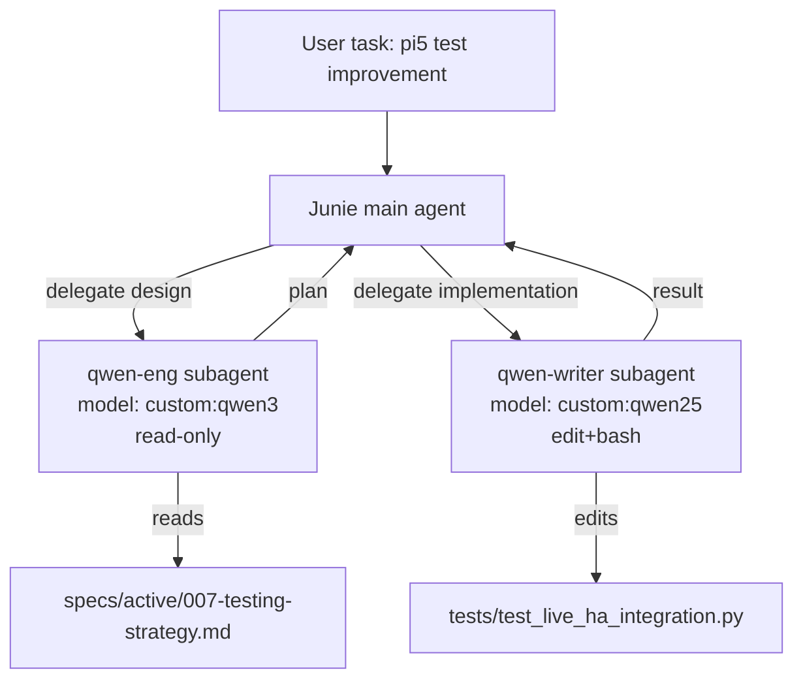

# Requirements

### Overview & Goals
Сейчас делегирование задач локальным Qwen-моделям (через Ollama) идёт только вручную — оператор сам вызывает `/ask-qwen-coder` или `/ask-qwen-engineer-log` и сам выбирает модель через `/qwen-select`. Нужно определить **маршрут автоматической разадачи (routing)** задач субагентам по схеме `<model>:<mode>`, например `qwen3:eng`, `qwen3:writer`, `qwen2.5:eng`, `qwen2.5:writer`, и обкатать этот маршрут на реальной задаче — доработке тестирования Pi5 (`tests/test_live_ha_integration.py` и связанной live-test инфраструктуры из `specs/active/007-testing-strategy.md`).

Модель по умолчанию — `qwen3`. Роль `eng` — инженер (проектирование, анализ логов, спецификация, план). Роль `writer` — писатель кода (реализация по готовому плану).

### Scope
**In scope:**
- Формализация тегов `qwen3:eng`, `qwen3:writer`, `qwen2.5:eng`, `qwen2.5:writer` как именованных ролей/профилей.
- Custom model profiles в `.junie/models/` для `qwen3` и `qwen2.5` (Ollama, OpenAI-compatible `/v1/chat/completions`).
- Native Junie subagents в `.junie/agents/` (`qwen-eng.md`, `qwen-writer.md`), которые Junie CLI выбирает автоматически по описанию задачи, с `model: custom:qwen3` по умолчанию и возможностью запускать `qwen2.5` вторым шагом цепочки.
- Расширение существующего `scripts/ask_qwen.py` и `/ask-qwen-*`, `/qwen-select` команд под новые роли `eng`/`writer` (с обратной совместимостью на `engineer`/`coder`) — для ручного вызова той же цепочки.
- Пилотный прогон цепочки `qwen3:eng → qwen2.5:writer` (или `qwen3:writer`) на конкретной задаче: доработка live-тестов Pi5.

**Out of scope:**
- Изменение существующей бизнес-логики `ydnu02_tcp_gateway`, `routes/`, `sensors/` вне тестового кода.
- Полный редизайн pytest-стратегии (`specs/active/007-testing-strategy.md` уже описывает целевую структуру — просто используем её как контракт).
- Загрузка/скачивание реальных моделей `qwen3`/`qwen2.5` в Ollama (предполагается, что оператор доустановит нужные теги вручную при необходимости).

### User Stories
- Как разработчик, я хочу, чтобы Junie CLI сам делегировал этап проектирования теста Pi5 инженерному субагенту (`qwen3:eng`), а этап написания кода — субагенту-писателю (`qwen2.5:writer` или `qwen3:writer`), без ручного вызова слэш-команд.
- Как разработчик, я хочу иметь возможность вручную вызвать конкретную пару модель:роль (`/qwen-select model=qwen3 role=eng`), если автоматический выбор не подходит.
- Как разработчик, я хочу, чтобы результат пилота (доработанные live-тесты Pi5) был проверяем через `python3 -m pytest`.

### Functional Requirements
- Тег `<model>:<mode>` однозначно определяет: (а) какой Ollama-модели профиль использовать, (б) какой системный промпт/ограничение по инструментам применяется.
- `eng`-роль: read-only анализ, работа со спеками/логами, формирует план/диф в Markdown, НЕ редактирует код напрямую (аналог существующей роли `engineer`, но с фокусом на проектирование, а не только на инфраструктуру).
- `writer`-роль: реализация кода/тестов по плану, может редактировать файлы (аналог `coder`, переименован по смыслу).
- Дефолтная модель при отсутствии явного выбора — `qwen3`.
- Цепочка `eng → writer` должна передавать план от инженерного шага писателю без потери контекста (через файл в `docs/`/`specs/` или через prompt argument).
- Пилот: доработать `tests/test_live_ha_integration.py` (или смежные live-тесты) так, чтобы покрытие соответствовало плану из `specs/active/007-testing-strategy.md`, и все новые/существующие unit/integration тесты проходили через `/run-tests`.

# Technical Design

### Current Implementation
- `scripts/ask_qwen.py` — CLI-обёртка над Ollama `/api/chat`, роли `engineer`/`coder`/`general`, модель по умолчанию `qwen2.5-coder:32b` (env `OLLAMA_MODEL`).
- `.junie/commands/ask-qwen-coder.md`, `ask-qwen-engineer-log.md`, `qwen-select.md`, `ollama-list.md` — ручные слэш-команды, вызывающие `ask_qwen.py` напрямую.
- `.junie/models/` — уже используется для custom model profiles (пример: `gemini-3.6-flash.json` в `~/.junie/models/`), но профилей для qwen3/qwen2.5 пока нет.
- `.junie/agents/` — пока пуст, нативных Junie-субагентов в проекте нет; делегирование целиком ручное через слэш-команды.
- `specs/active/007-testing-strategy.md` — описывает целевую тестовую пирамиду; `test_live_ha_integration.py` — 7 live-тестов, требующих реального Pi + HA + gateway.

### Key Decisions
1. **Два слоя делегирования (гибрид, по решению пользователя):**
   - Native Junie subagents (`.junie/agents/qwen-eng.md`, `qwen-writer.md`) — для автоматического роутинга главным агентом.
   - Обновлённые slash-команды/`ask_qwen.py` — для ручного явного вызова тех же ролей.
2. **Именование тегов**: `<model>:<mode>`, где `model ∈ {qwen3, qwen2.5}`, `mode ∈ {eng, writer}`. `qwen3` — модель по умолчанию, если тег не указан явно.
3. **Обратная совместимость**: старые роли `engineer`→`eng`, `coder`→`writer` остаются рабочими алиасами в `ask_qwen.py`, чтобы не ломать уже работающие `/ask-qwen-*` команды.
4. **Профили моделей**: два custom model profile файла в `.junie/models/` (`qwen3.json`, `qwen25.json`), с `primaryModel`/`fasterModel`, указывающие на реальные Ollama-теги (`qwen3:latest` и текущий `qwen2.5-coder:32b`).

### Proposed Changes
1. Добавить `.junie/models/qwen3.json` и `.junie/models/qwen25.json` — custom model profiles (`apiType: OpenAICompletion`, `baseUrl: http://localhost:11434/v1/chat/completions`), доступные как `custom:qwen3` / `custom:qwen25`.
2. Создать `.junie/agents/qwen-eng.md` — subagent с `name: qwen-eng`, `description`, ориентированным на автоматическое делегирование задач проектирования/анализа логов/тестовой стратегии, `model: custom:qwen3`, `tools: ["Read", "Grep", "Glob"]` (read-only).
3. Создать `.junie/agents/qwen-writer.md` — subagent `name: qwen-writer`, `description` для задач реализации кода/тестов по готовому плану, `model: custom:qwen25` (или `custom:qwen3` по флагу), `tools: ["Read", "Grep", "Glob", "Edit", "Write", "Bash"]`.
4. Расширить `ROLE_SYSTEM_PROMPTS` в `scripts/ask_qwen.py` новыми ключами `eng`/`writer` (с сохранением `engineer`/`coder` как алиасов на те же промпты), добавить `--tag` разбор строки `model:mode` (например `qwen3:eng`) как альтернативу `--role`/`--model`.
5. Обновить `.junie/commands/qwen-select.md`, `ask-qwen-coder.md`, `ask-qwen-engineer-log.md` под новые имена ролей и добавить пример вызова тега `qwen3:eng`/`qwen2.5:writer`.
6. Пилот: используя цепочку `qwen3:eng → qwen2.5:writer`, доработать `tests/test_live_ha_integration.py` — этап `eng` анализирует пробелы покрытия относительно `specs/active/007-testing-strategy.md`, формирует план в `docs/` или как markdown-ответ; этап `writer` реализует недостающие тест-кейсы.

### Data Models / Contracts
```json
// .junie/models/qwen3.json
{
  "baseUrl": "http://localhost:11434/v1/chat/completions",
  "id": "qwen3:latest",
  "apiType": "OpenAICompletion",
  "temperature": 0.3
}
```
```yaml

# .junie/agents/qwen-eng.md (frontmatter)

---
name: qwen-eng
description: "Design/analysis subagent (System Engineer role) for infra, logs, test strategy planning; local qwen3 via Ollama"
model: custom:qwen3
tools: ["Read", "Grep", "Glob"]
---
```
```yaml

# .junie/agents/qwen-writer.md (frontmatter)

---
name: qwen-writer
description: "Implementation subagent (Writer role) that turns an approved plan into code/tests; local qwen2.5/qwen3 via Ollama"
model: custom:qwen25
tools: ["Read", "Grep", "Glob", "Edit", "Write", "Bash"]
---
```

### Components
- `scripts/ask_qwen.py` — расширяется ролями/тегами, остаётся источником истины для промптов персон.
- `.junie/models/*.json` — новые профили подключения к Ollama.
- `.junie/agents/*.md` — новые нативные субагенты для автоматического роутинга.
- `.junie/commands/*.md` — обновляются под новую номенклатуру ролей.
- `tests/test_live_ha_integration.py` — целевой файл пилотной доработки.

### Architecture Diagram


### Risks
- Локальные модели `qwen3`/`qwen2.5` должны быть реально доступны в Ollama (`ollama list`) — если тег не установлен, custom model profile будет падать при вызове; в плане это фиксируется, но фактическая установка модели — ответственность оператора.
- Junie CLI может не всегда автоматически выбрать нужный subagent по `description` — для контроля сохраняется ручной путь через `/ask-qwen-*`/`/qwen-select`.
- Live-тесты Pi5 требуют реального железа/HA — пилотная доработка должна сохранить существующую маркировку (skip без реального стенда), чтобы CI/локальный прогон не ломался.

# Delivery Steps

### ✓ Step 1: Создать custom model profiles для qwen3 и qwen2.5
В проекте появляются переиспользуемые профили подключения к локальным Ollama-моделям.
- Добавить `.junie/models/qwen3.json` (id `qwen3:latest`, `apiType: OpenAICompletion`, `baseUrl: http://localhost:11434/v1/chat/completions`).
- Добавить `.junie/models/qwen25.json`, переиспользуя текущий дефолт `qwen2.5-coder:32b` из `scripts/ask_qwen.py`.
- Задать разумные `temperature` (0.2-0.3) и опционально `fasterModel` для обоих профилей.

### ✓ Step 2: Расширить scripts/ask_qwen.py и slash-команды под роли eng/writer и теги model:mode
Ручной путь делегирования поддерживает новую номенклатуру ролей с обратной совместимостью.
- Добавить в `ROLE_SYSTEM_PROMPTS` ключи `eng` и `writer` (алиасы на существующие `engineer`/`coder` промпты, при необходимости — уточнённые формулировки под проектирование/реализацию).
- Добавить парсинг тега `--tag qwen3:eng` в `ask_qwen.py` как short-hand для `--model qwen3:latest --role eng`.
- Обновить `.junie/commands/qwen-select.md`, `ask-qwen-coder.md`, `ask-qwen-engineer-log.md` с примерами новых тегов `qwen3:eng`, `qwen2.5:writer`.

### ✓ Step 3: Создать native Junie subagents qwen-eng и qwen-writer для автоматического роутинга
Главный агент Junie CLI может автоматически делегировать задачи проектирования и реализации локальным моделям.
- Создать `.junie/agents/qwen-eng.md` с `model: custom:qwen3`, read-only набором tools (`Read`, `Grep`, `Glob`), описанием для инфраструктурных/тестово-стратегических задач.
- Создать `.junie/agents/qwen-writer.md` с `model: custom:qwen25`, набором tools (`Read`, `Grep`, `Glob`, `Edit`, `Write`, `Bash`), описанием для задач реализации по готовому плану.
- Прописать в `description` обоих файлов явные триггерные формулировки (например "test strategy planning", "implement approved test plan"), чтобы Junie мог сопоставлять их с задачами автоматически.

### ✓ Step 4: Прогнать пилотную цепочку eng→writer на доработке live-тестов Pi5
Цепочка `qwen3:eng → qwen2.5:writer` применена к реальной задаче и результат проверен тестами.
- Делегировать `qwen-eng` анализ пробелов покрытия `tests/test_live_ha_integration.py` относительно целевой пирамиды из `specs/active/007-testing-strategy.md` и получить план недостающих тест-кейсов.
- Делегировать `qwen-writer` реализацию согласованных тест-кейсов в `tests/test_live_ha_integration.py` (или смежном файле), сохраняя существующие skip-маркеры для реального железа.
- Прогнать `python3 -m pytest` и убедиться, что новые и существующие unit/integration тесты проходят (live-тесты, требующие Pi+HA, остаются skip в CI-режиме).).