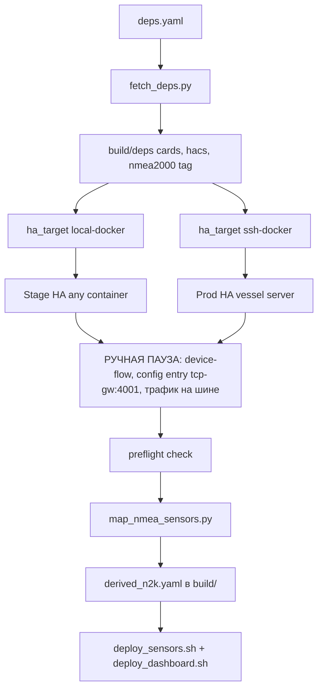
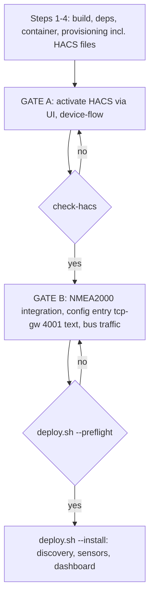

# Requirements

### Overview & Goals
Рефакторинг `ha/sailing-dash` по итогам полного аудита (`ha/revision.md`): убрать из репозитория любые копии чужих/форкнутых библиотек и интеграций, перевести доставку зависимостей на пин по тегам наших форков, обеспечить воспроизводимую установку «с нуля» на Stage и на Prod, и явно зафиксировать ручные шаги пользователя, которые автоматизировать нельзя.

### Scope
- **In Scope:**
  - Манифест зависимостей `deps.yaml` + загрузчик `fetch_deps.py` (скачивание в сборочный каталог `build/deps/`, retry, sha256). Никакого «кэша» как концепции деплоя.
  - Удаление `ha/sailing-dash/vendor/` (6 JS-бандлов HACS-карточек + копия `custom_components/nmea2000`).
  - Перевод библиотеки `nmea2000` на git-пин нашего форка `dnevera/nmea2000@cpu-overload-fix` и удаление патч-механики (`patches/nmea2000_ioclient.py`, `scripts/patch_ha_nmea2000_message.py`, `scripts/apply_ha_patch.sh`, режим `deploy.sh --patch-ha`).
  - Перевод интеграции на тег `dnevera/ha-nmea2000@ydnu-02-usb-tcp-gw` вместо zip плавающей ветки.
  - Обобщение целей деплоя: `stage` и `prod` — два профиля одной абстракции «HA target» (локальный docker / удалённый docker по SSH), без хардкода `local-ha` / `homeassistant`.
  - Устранение дублирования: общий слой доступа к HA, один вызов `build.py`, одна точка входа Stage, одна реализация мерджа `lovelace_resources`.
  - `deploy.sh --prod --bootstrap` с preflight-проверкой готовности и rollback.
  - Переписанная документация в формате «авто-этап 1 → ручная пауза → авто-этап 2» + чек-листы ручных шагов Stage/Prod.
- **Out of Scope:**
  - Правки в самих форках (`manifest.json` → тег, бамп версии библиотеки) — выполняются пользователем вручную.
  - Логика `ydnu02_tcp_gateway` и декодирование PGN.
  - Переход на апстрим `tomer-w/*` — форки остаются штатным постоянным источником.

### User Stories
- **Как установщик**, я хочу поднять Prod «с нуля» по одному документу с явной разметкой «что делает скрипт / что я делаю руками», чтобы не гадать, на каком шаге застрял пайплайн.
- **Как разработчик**, я хочу, чтобы репозиторий не содержал копий чужих бандлов и интеграций, чтобы обновление зависимости было изменением одной строки в `deps.yaml`.
- **Как оператор**, я хочу, чтобы `deploy.sh --prod` останавливался с внятным списком недоделанного, а не деплоил дашборд на пустой entity registry.

### Functional Requirements
- **FR-1 (No vendor):** в `ha/sailing-dash/` нет папки `vendor/`; внешние артефакты ставятся штатными каналами — библиотека `pip install` по git-тегу форка, интеграция и карточки — через HACS (Prod) либо скачиванием релиза по тегу (Stage). Скачанные файлы кладутся в обычный сборочный каталог `build/deps/` (такой же артефакт сборки, как `build/dashboard-sailing.yaml`) и оттуда доставляются в цель: `docker cp` локально или `scp` + `docker cp` по SSH.
- **FR-1a (Обобщённая цель):** `stage` и `prod` отличаются только профилем цели (`transport: local-docker | ssh-docker`, `host`, `container`, `config_dir`), а не отдельными ветками кода; Stage может быть произвольным контейнером на произвольной машине, Prod — реальным судовым сервером.
- **FR-2 (Один источник правды по версиям):** тег форка библиотеки и тег форка интеграции объявлены ровно один раз — в `deps.yaml`; `requirements.txt` и `stage_provisioner.py` берут значения оттуда.
- **FR-3 (Без патчей):** библиотека ставится из git-тега форка; патч-скрипты и режим `--patch-ha` удалены; drift-guard проверяет версию/коммит установленной библиотеки, а не наличие маркера патча.
- **FR-4 (Preflight):** `deploy.sh --prod` перед деплоем проверяет: контейнер жив, HACS активирован, интеграция установлена, config entry на tcp-gw существует, в registry есть raw-сущности `nmea2000`. При провале — стоп + список ручных действий.
- **FR-5 (Ручные шаги задокументированы):** отдельный раздел с двумя чек-листами (Stage / Prod) с пометкой «нельзя автоматизировать» (GitHub device-flow) vs «пока не автоматизировано».
- **FR-6 (Дедупликация):** `build.py` вызывается один раз за прогон; `ha_cat`/`ha_cp_to_container`/`ha_restart` вынесены в общий `lib/ha_target.sh`.
- **FR-7 (HACS: установка автоматом, настройка вручную):** доставка HACS **остаётся автоматической** — секция `hacs` в `deps.yaml`, скачивание релиза `fetch_deps.py` и раскладка `custom_components/hacs/` через `deploy_hacs_integration()` сохраняются (одинаково для Stage и Prod, чтобы окружения не расходились). Ручным остаётся только то, что автоматизировать нельзя: перезапуск HA, добавление интеграции HACS в UI и авторизация через GitHub device-flow.
- **FR-8 (Hard-stop визарда на активации HACS):** `install_wizard.sh` останавливается до всех зависящих от HACS шагов, печатает чек-лист настройки через UI, ждёт подтверждения и затем проверяет **фактическую активацию** — entry с `domain == "hacs"` в `.storage/core.config_entries`, плюс наличие `custom_components/hacs/manifest.json` как подтверждение успешной автодоставки. Пока проверка не прошла — дальше не идёт (retry / abort), без «предупредил и поехал».
- **FR-9 (Два гейта вместо одной паузы):** гейт A — HACS установлен и активирован; гейт B — интеграция NMEA 2000, config entry на tcp-gw (`text`, порт 4001) и raw-сущности в registry. У каждого гейта своя проверка и свой retry-цикл.
- **FR-10 (Валидный config entry):** entry, создаваемый провижинингом, содержит все поля, читаемые миграцией интеграции (в т.ч. `mode`); ошибка `Unknown mode 'None' during migration` (`custom_components/nmea2000/__init__.py:58`) не воспроизводится.

### Non-Functional Requirements
- **Воспроизводимость:** две установки «с нуля» в разные дни дают идентичный код (теги + sha256, никаких `refs/heads/*.zip`).
- **Идемпотентность:** `provision_auth()`, `provision_nmea2000_config_entry()`, мердж ресурсов и сенсоров безопасны при повторном запуске.
- **Offline-поведение:** при недоступности GitHub деплой падает с внятной ошибкой и списком недостающих артефактов — без молчаливого использования устаревших локальных копий.

# Technical Design

### Current Implementation
Факты аудита зафиксированы в `ha/revision.md`:
- `ha/sailing-dash/vendor/` содержит 7.7 МБ чужих бандлов (`apexcharts-card.js`, `card-mod.js`, `compass-card.js`, `config-template-card.js`, `plotly-graph-card.js`, `windrose-card.js`) и полную копию `custom_components/nmea2000`; последняя — **приоритетный** источник в `stage_provisioner.py:46,703-704`, скачивание — лишь fallback.
- `build.py` вызывается 6 раз за прогон: `run_stage.sh:14` → `start_stage.py:57` → `deploy.sh:118` → `deploy_sensors.sh:101` + `deploy_dashboard.sh:14`, плюс `build_docker.sh:25`.
- Слой доступа к HA продублирован: `deploy.sh:55-115`, `deploy_sensors.sh:31-81`, `deploy_dashboard.sh:34-84`.
- Две реализации мерджа ресурсов: `deploy.sh:160-235` и `stage_provisioner.py:536-604`.
- `stage_provisioner.py:49` тянет `archive/refs/heads/bumblebee-custom.zip` — плавающий указатель; HACS скачивается релизом (`stage_provisioner.py:63-66`), но в скрытый `.cache/` — это тоже заменяется на обычный `build/deps/`.
- Библиотека: `requirements.txt:43` пинит PyPI `nmea2000==2026.5.2`, оба фикса накатываются патчами; при этом в форке уже есть тег `cpu-overload-fix` (`6c9df918d19a`) с обоими фиксами.
- Prod «с нуля» не покрыт: `deploy.sh --prod` предполагает уже установленные Docker, HACS, карточки, custom repository и config entry.

### Отказ от `.cache/` как концепции
В предыдущей редакции плана фигурировал `.cache/` — он был взят из текущего кода (`stage_provisioner.py:49-51,63-66` качает туда HACS и интеграцию). Это **убирается**: кэш не является способом доставки зависимостей и не должен упоминаться в архитектуре деплоя.

Целевая модель — только штатные каналы установки:
- библиотека `nmea2000` — `pip install` по git-тегу нашего форка (в `requirements.txt` и внутри контейнера HA через `manifest.json` интеграции);
- интеграция `ha-nmea2000` и 6 HACS-карточек — на Prod через HACS (custom repository по тегу), на Stage — скачивание релиза по тегу скриптом провижининга;
- всё скачанное ложится в `build/deps/` — обычный сборочный каталог рядом с `build/dashboard-sailing.yaml`, gitignored, чистится вместе с `build/`.

Пропуск повторного скачивания при том же теге — побочный эффект «артефакт уже собран», ровно как `build.py` не пересобирает неизменившееся. Это не отдельная сущность и не требование.

### Key Decisions
1. **Форк по тегу — единственный канал доставки.** Никаких патчей поверх PyPI. `nmea2000 @ git+https://github.com/dnevera/nmea2000.git@cpu-overload-fix` в `requirements.txt`; интеграция — `archive/refs/tags/ydnu-02-usb-tcp-gw.zip` / HACS custom repository по тому же тегу.
2. **`deps.yaml` как единственный источник правды** по версиям карточек, интеграции, HACS и библиотеки; `fetch_deps.py` — единственный загрузчик, кладёт результат в `build/deps/`.
3. **Двухэтапный пайплайн с явной ручной паузой** вместо иллюзии «один скрипт с нуля»: авто (контейнер + HACS + интеграция) → ручное (device-flow, config entry на tcp-gw, трафик на шине) → авто (`deploy.sh --install`: discovery + сенсоры + дашборд).
4. **Preflight-гейт вместо тихого деплоя.** Автодискавери `map_nmea_sensors.py` читает уже созданный entity registry, поэтому запуск раньше ручного шага бессмысленен — проверка обязательна.
5. **`stage` / `prod` — два профиля одной цели, а не два разных кодовых пути.** Stage — окружение для проверки доработок, Prod — реальный сервер. Различие сводится к транспорту (`docker exec/cp` вс. `ssh` + `docker exec/cp`) и к тому, что на Stage допустимы provisioning-шорткаты (bypass onboarding, `test/test`, mock-эмулятор), а на Prod они запрещены. Любая из целей может быть как локальной, так и удалённой.
6. **Никакого `.cache/`.** Зависимости приходят штатными каналами (pip по git-тегу, HACS, релиз по тегу), а скачанные файлы живут в `build/deps/` как обычный артефакт сборки. Существующие обращения к `.cache/` в `stage_provisioner.py` переводятся на `build/deps/`.
7. **Drift-guard по версии/коммиту** установленной библиотеки в контейнере HA и в нашем venv/Docker (замена проверки маркера в `message.py`).
8. **HACS: файлы — автоматом, активация — руками.** Скачивание релиза по пину и раскладка `custom_components/hacs/` остаются в пайплайне (и на Stage, и на Prod — единообразно). Автоматизировать нельзя только GitHub device-flow и добавление интеграции в UI, поэтому визард обязан *проверять* активацию и блокировать зависящие шаги, а не пытаться её выполнить.
9. **Визард — машина состояний с гейтами, а не линейный скрипт.** Гейт = инструкция → ожидание Enter → автопроверка → при провале печать причины и повторное ожидание. Проверка одинакова для всех профилей — на stage она не «advisory».

### Architecture Diagram


### Data Models / Contracts
```yaml

# ha/sailing-dash/deps.yaml

cards:
  - name: card-mod
    repo: thomasloven/lovelace-card-mod
    ref: v3.4.4
    asset: card-mod.js
    sha256: "..."
lib:
  - name: nmea2000
    source: git
    repo: dnevera/nmea2000        # НАШ ФОРК
    ref: cpu-overload-fix         # тег, commit 6c9df918d19a
integrations:
  - name: nmea2000
    repo: dnevera/ha-nmea2000     # НАШ ФОРК
    ref: ydnu-02-usb-tcp-gw       # тег, commit 2cdef78c6df2
    sha256: "..."
  - name: hacs
    release: latest
```

### File Structure
- Новые: `ha/sailing-dash/deps.yaml`, `ha/sailing-dash/fetch_deps.py`, `ha/sailing-dash/lib/ha_target.sh`.
- Удаляются: `ha/sailing-dash/vendor/**`, `patches/nmea2000_ioclient.py`, `scripts/patch_ha_nmea2000_message.py`, `scripts/apply_ha_patch.sh`, режим `--patch-ha` в корневом `deploy.sh`.
- Изменяются: `stage_provisioner.py`, `deploy.sh`, `deploy_sensors.sh`, `deploy_dashboard.sh`, `build.py`, `run_stage.sh`, `start_stage.py`, `build_docker.sh`, корневой `requirements.txt`, `ha/sailing-dash/requirements-ha.txt`, `.gitignore`.
- Документация: `INSTALLATION.md`, `HACS_SETUP.md`, `README.md`, `ha/revision.md`, скилл `nmea2000-setup`, `.agents/AGENTS.md`.

### Ручные шаги пользователя
**Stage (любой тестовый HA-контейнер; по умолчанию локальный `local-ha`):** вход в UI таргета (локально `http://localhost:8123`, `test`/`test`); активация HACS через GitHub device-flow (`github.com/login/device`) — **автоматизировать нельзя**; перезапуск HA после установки custom integration.

**Prod (судовой Pi5):** установка Docker и контейнера `homeassistant`; полноценный onboarding (владелец, координаты, TZ); установка HACS (`wget -O - https://get.hacs.xyz | bash -`) + device-flow — **нельзя автоматизировать**; добавление custom repository `dnevera/ha-nmea2000` (тег `ydnu-02-usb-tcp-gw`); установка 6 карточек через HACS UI; создание config entry NMEA2000 (Host = IP шлюза, Port = `4001`, Gateway type = `text`); перезапуск HA и ожидание raw-сущностей (нужен трафик на шине, двухфазный анонс SA 64/200); только затем `./deploy.sh --prod --install`.

**Уточнение по HACS (перекрывает формулировки выше):** *файлы* HACS доставляются автоматически (`deps.yaml` → `fetch_deps.py` → `deploy_hacs_integration()`), одинаково на Stage и Prod. Вручную выполняется только настройка: рестарт HA, Settings → Add integration → HACS, авторизация через GitHub device-flow. Команда `wget -O - https://get.hacs.xyz | bash -` остаётся лишь альтернативным способом доставки файлов, а не обязательным шагом.

### Risks
- Пока в форке интеграции `manifest.json` ссылается на ветку библиотеки, установка «с нуля» невоспроизводима — это предусловие на стороне пользователя.
- `pyproject.toml` форка библиотеки имеет ту же версию `2026.5.2`, что и PyPI: drift-guard по `__version__` не сработает без бампа — как запасной вариант используем проверку коммита/содержимого.
- Удаление `vendor/` делает первую сборку Stage зависимой от доступности GitHub — компенсируется внятной ошибкой со списком недостающих артефактов.

### HACS: автоматическая установка + ручная настройка и проверка
Сохраняется (НЕ удаляется): `deploy_hacs_integration()` (`helpers/stage_provisioner.py:634-645`), константа `HACS_INTEGRATION_DEPS_DIR` (`:51`), секция `hacs` в `deps.yaml` и её обработка в `helpers/fetch_deps.py`, вызов в `run_full_provisioning()` (`:729-734`). Единственное усиление — раскладка HACS выполняется и для профилей с `transport: ssh-docker` (Prod), а не только для локального Stage; провал доставки перестаёт быть тихим warning и попадает в отчёт гейта.

Добавляется проверка: `inspect_ha_environment()` уже вычисляет `hacs_installed` по `custom_components/hacs/manifest.json` (`:315-321`) — это признак успешной автодоставки; к нему добавляется признак **активации** — entry с `domain == "hacs"` в `.storage/core.config_entries` (появляется только после device-flow). Обе сводятся в команду `stage_provisioner.py check-hacs --target <profile>` (exit 0/1 + список недостающего с разделением «не доставлен» / «не активирован»), которую используют и визард, и `deploy.sh --preflight`.



### Баг `Unknown mode 'None' during migration`
Причина: `provision_nmea2000_config_entry()` (`helpers/stage_provisioner.py:679-686`) пишет `data` без ключа `mode`, а миграция интеграции (`custom_components/nmea2000/__init__.py:58`) читает его безусловно. Фикс — добавить `mode` в `entry_data` (значение для текстового TCP-шлюза по `const.py` форка) и бэкфилл для существующих entry, по образцу бэкфилла `subentries` (`:714-716`).

# Testing

### Validation Approach
End-to-end прогон чистого Stage и dry-run Prod после каждого этапа; проверка отсутствия сетевых и vendor-зависимостей грепом по репозиторию.

### Key Scenarios
1. `python3 fetch_deps.py` наполняет `build/deps/`, sha256 совпадают.
2. Чистый Stage: удалить `local-ha/config` и `build/`, прогнать `./run_stage.sh` → HA поднялся, карточки в `/config/www/`, интеграция из тега, `build.py` вызван один раз.
2а. Тот же прогон с профилем Stage, указывающим на контейнер с другим именем на другой машине (`transport: ssh-docker`): результат идентичен, хардкода `local-ha` нет.
3. Грепом подтвердить: `vendor` не упоминается ни в одном скрипте; `--patch-ha` и патч-файлы отсутствуют.
4. Внутри контейнера HA: установленная `nmea2000` соответствует коммиту `6c9df918d19a` (есть `Connection closed by remote host` в `ioclient.py` и `primary_key = f"{self.id}_{source_id}"` в `message.py`).
5. `./deploy.sh --prod --install` на инстансе без config entry останавливается с чек-листом ручных шагов и ничего не пишет в `.storage/`.

### Edge Cases
- Нет сети и пустой `build/deps/` → внятная ошибка со списком нужных артефактов, деплой не стартует.
- Повторный `--bootstrap` не дублирует ресурсы и не ломает существующий config entry.
- Rollback восстанавливает `configuration.yaml` и `.storage/lovelace.*` из бэкапа.

# Delivery Steps

### ✓ Step 1: Ввести манифест зависимостей `deps.yaml` и загрузчик `fetch_deps.py`
Все внешние артефакты (карточки, HACS, интеграция) описаны в одном манифесте и скачиваются в сборочный каталог `build/deps/` с проверкой sha256.

- Создать `ha/sailing-dash/deps.yaml` с секциями `cards`, `lib`, `integrations`; пин интеграции на тег `ydnu-02-usb-tcp-gw`, библиотеки — на тег `cpu-overload-fix`.
- Создать `ha/sailing-dash/fetch_deps.py`: скачивание с retry и таймаутом в `build/deps/<name>/`, проверка sha256, явная ошибка при недоступности сети.
- Перевести существующие обращения `stage_provisioner.py:49-51,63-66` с `.cache/` на `build/deps/`; убедиться, что `build/` есть в `.gitignore`.

### ✓ Step 2: Обобщить цель деплоя и доставлять артефакты из `build/deps/`, удалив `vendor/`
Скрипты работают с любым HA-таргетом (локальный или удалённый контейнер), а в репозитории не остаётся копий чужих библиотек и интеграций.

- Ввести профили целей (`stage` / `prod`) с полями `transport` (`local-docker` | `ssh-docker`), `host`, `container`, `config_dir`; убрать хардкод имён `local-ha` и `homeassistant` из `deploy.sh:56,81`, `deploy_sensors.sh:32,52`, `deploy_dashboard.sh:35,55`, `stage_provisioner.py:93`.
- Реализовать единую функцию доставки артефакта `build/deps/` → цель: локально `docker cp`, удалённо `scp` + `docker cp`.
- Убрать `VENDOR_DIR` из `stage_provisioner.py:29,46` и `deploy.sh:25`; `deploy_card_bundles()` и `deploy_nmea2000_integration()` берут артефакты только из `build/deps/`.
- Заменить `NMEA2000_RELEASE_URL` (`stage_provisioner.py:49`) на URL тега из `deps.yaml`.
- Удалить `ha/sailing-dash/vendor/**` (6 JS-бандлов и `custom_components/nmea2000`) и добавить `vendor/` в `.gitignore`.

### ✓ Step 3: Перевести библиотеку `nmea2000` на git-пин форка и удалить патч-механику
Библиотека ставится из тега форка одинаково в контейнере HA и в нашем venv/Docker; патчей нет.

- Заменить `requirements.txt:43` на `nmea2000 @ git+https://github.com/dnevera/nmea2000.git@cpu-overload-fix`, синхронизировать `requirements-ha.txt`.
- Удалить `patches/nmea2000_ioclient.py`, `scripts/patch_ha_nmea2000_message.py`, `scripts/apply_ha_patch.sh` и режим `--patch-ha` в корневом `deploy.sh`.
- Реализовать drift-guard: проверка коммита/содержимого установленной библиотеки в контейнере HA вместо проверки маркера `yacht-n2k-console-patch-v2`.

### ✓ Step 4: Устранить дублирование в скриптах сборки и деплоя
Один вызов `build.py` за прогон и один общий слой доступа к HA.

- Вынести `ha_mkdir`/`ha_cat`/`ha_cp_to_container`/`ha_restart` в `ha/sailing-dash/lib/ha_target.sh` и подключить в `deploy.sh`, `deploy_sensors.sh`, `deploy_dashboard.sh`.
- Убрать повторные вызовы `build.py` из `deploy_sensors.sh:101`, `deploy_dashboard.sh:14`, `start_stage.py:57`, оставив один в точке входа.
- Свести две реализации мерджа `lovelace_resources` (`deploy.sh:160-235` и `stage_provisioner.py:536-604`) к одной.
- Объединить точки входа Stage: `build_docker.sh` становится тонкой обёрткой над `run_stage.sh`/`start_stage.py`.

### ✓ Step 5: Добавить `--prod --bootstrap` с preflight-гейтом и rollback
Prod ставится по документированной процедуре, а деплой на неготовый инстанс блокируется.

- Добавить в `deploy.sh` режим `--prod --bootstrap`: проверка SSH/Docker/контейнера, раскладка карточек и интеграции из `build/deps/` либо проверка, что они уже поставлены через HACS.
- Реализовать preflight: контейнер жив, HACS активирован, интеграция установлена, config entry на tcp-gw существует, в `core.entity_registry` есть raw-сущности `nmea2000`; при провале — стоп и печать списка ручных действий.
- Добавить rollback: восстановление `configuration.yaml` и `.storage/lovelace.*` из бэкапа с timestamp плюс очистка старых бэкапов.

### ✓ Step 6: Переписать документацию под no-vendor, форки по тегу и ручные шаги
Документация описывает установку «с нуля» как «авто → ручная пауза → авто» и содержит два чек-листа ручных шагов.

- Переписать `INSTALLATION.md`: разделы «Авто-этап 1», «Ручные шаги (Stage)», «Ручные шаги (Prod)», «Авто-этап 2 (`deploy.sh --install`)».
- Обновить `HACS_SETUP.md`: custom repository `dnevera/ha-nmea2000` по тегу, device-flow как неавтоматизируемый шаг, порядок установки карточек до `--install`.
- Исправить в `README.md` битую ссылку на несуществующий раздел «Setting this up from scratch» и различить требования Stage/Prod к карточкам.
- Синхронизировать скилл `nmea2000-setup` и `.agents/AGENTS.md` с моделью «только форки по тегу, без патчей»; отметить выполненные пункты в `ha/revision.md`.

### ✓ Step 7: Сохранить автодоставку HACS и добавить проверку его активации
HACS по-прежнему скачивается и раскладывается скриптами (Stage и Prod одинаково), а вручную выполняется только настройка через UI — и она проверяется отдельной командой.

- Оставить без изменений `deploy_hacs_integration()`, `HACS_INTEGRATION_DEPS_DIR`, секцию `hacs` в `deps.yaml` и её обработку в `helpers/fetch_deps.py` — ничего из автодоставки HACS не вырезать.
- Распространить раскладку `custom_components/hacs/` на профили с `transport: ssh-docker` (Prod), чтобы Stage и Prod не расходились; провал доставки возвращать как ошибку шага, а не тихий warning.
- Добавить команду `stage_provisioner.py check-hacs --target <profile>`: отдельно проверяет доставку (`custom_components/hacs/manifest.json`, `domain == "hacs"`) и активацию (entry `hacs` в `.storage/core.config_entries`), возвращает exit code и печатает, чего именно не хватает.
- Использовать эту же проверку в `deploy.sh --preflight` вместо текущей неявной трактовки «HACS активирован».

### ✓ Step 8: Переделать `install_wizard.sh` в машину состояний с блокирующими гейтами
Визард нельзя проскочить: на каждом гейте он ждёт человека и продолжает только после успешной автопроверки.

- Разбить текущий монолитный шаг 5 на два гейта: гейт A (HACS) и гейт B (интеграция NMEA 2000 + config entry на `GW_HOST:GW_DATA_PORT`, gateway type `text`, + raw-сущности в registry).
- Гейт A: печать чек-листа **настройки** HACS (файлы уже разложены скриптом — остаётся рестарт HA, Settings → Add integration → HACS, авторизация на `github.com/login/device`), ожидание Enter, затем `check-hacs`; при провале — печать причины (не доставлен / не активирован) и повторное ожидание, с возможностью прервать.
- Гейт B: ожидание Enter, затем `deploy.sh --target <profile> --preflight` в retry-цикле; убрать поведение «на stage preflight только advisory» — гейт единый для всех профилей.
- Пересобрать `STEP_NAMES`, `--list`, `--from`, `--only` под новую нумерацию; сохранить `--dry-run` и `--yes` (при `--yes` гейты всё равно останавливаются).
- В stage-инструкциях разделить два утверждения: «HACS-файлы уже установлены скриптом» и «активация через UI/device-flow обязательно вручную» — порядок ручных шагов одинаков для Stage и Prod.

### ✓ Step 9: Исправить config entry NMEA 2000 и синхронизировать документацию
Чистая установка не логирует `Unknown mode 'None' during migration`, а документация описывает ровно ту процедуру, которую выполняет визард.

- Добавить в `entry_data` в `provision_nmea2000_config_entry()` поле `mode` (значение для text/TCP-шлюза согласно `const.py` форка интеграции) и бэкфилл `existing["data"].setdefault("mode", ...)`.
- Проверить на чистом stage, что в логах HA нет предупреждения от `custom_components/nmea2000/__init__.py:58`.
- Обновить `HACS_SETUP.md` и `INSTALLATION.md`: HACS — исключительно ручной шаг для обоих профилей, с описанием гейтов визарда и команды проверки.
- Обновить раздел «Examples» в `INSTALLATION.md` и `README.md` под новую нумерацию шагов; отметить изменения в `ha/revision.md`.

### ✓ Step 10: Автономная конфигурируемая среда подпроекта `ha/sailing-dash`
`ha/sailing-dash` перестаёт зависеть от конфигов корневого проекта (`.env`, `deploy.conf`): у него своя настраиваемая среда, в которой любой профиль (stage/prod) может жить на произвольном хосте — в том числе на нескольких разных Pi5 одновременно.

- Создать `ha/sailing-dash/.env.template` (в git) и читать `ha/sailing-dash/.env` (gitignored) — единственный источник правды по окружениям подпроекта: HA-таргет (`transport`, `ssh host`, `container`, `config_dir`, `url`, `token`) и его YDNU-02 tcp-gw (`gw host`, `gw data port`) для каждого профиля.
- Ввести именованные профили вместо жёсткой пары stage/prod: `HA_PROFILES="stage prod ..."` и переменные с префиксом профиля (`<PROFILE>_TRANSPORT`, `<PROFILE>_SSH_HOST`, `<PROFILE>_CONTAINER`, `<PROFILE>_CONFIG_DIR`, `<PROFILE>_HA_URL`, `<PROFILE>_HA_TOKEN`, `<PROFILE>_GW_HOST`, `<PROFILE>_GW_DATA_PORT`), чтобы можно было описать несколько Pi5.
- Добавить `--target <profile>` в `deploy.sh` (флаги `--stage`/`--prod` остаются алиасами) и `--target` в `start_stage.py`/`run_stage.sh`.
- Реализовать загрузчик `lib/env_profile.sh` + питоновский аналог `env_profile.py`; `lib/ha_target.sh` перестаёт сорсить корневой `deploy.conf` (устранение протечки `HA_CONTAINER=homeassistant` в stage на уровне архитектуры, а не заплаткой).
- Перевести на профиль `stage_provisioner.py` (config entry вместо хардкода `127.0.0.1:4001`), `start_stage.py`/`mock_nmea_emulator.py` (`--gw-host` по умолчанию), `deploy_sensors.sh`/`deploy.sh` (autodiscovery и preflight берут `HA_URL`/`HA_TOKEN` профиля).
- `targets.conf` свести к тонкой прослойке над `.env` (или удалить, если дублирование полное); корневой `.env`/`deploy.conf`/`deploy.conf.template` не трогать — они остаются конфигом менеджера ydnu-02.
- Документация: раздел «Configuring targets» в `INSTALLATION.md` с примером двух Pi5 (`stage-pi5`, `prod`) и явным указанием, что подпроект самодостаточен.