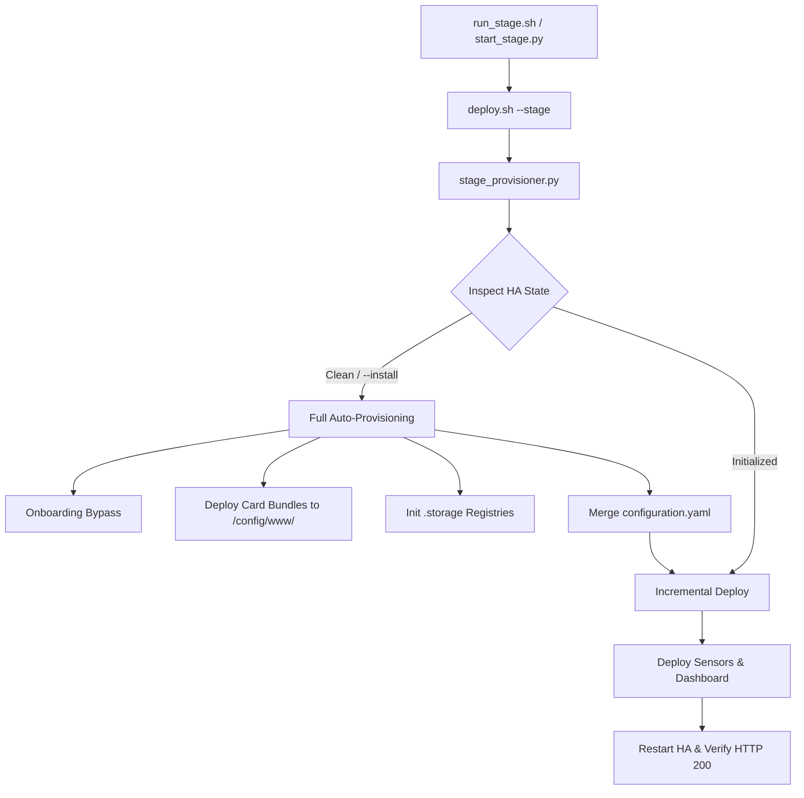

# Requirements

### Overview & Goals
Enhance the **Sailing Dashboard** (`ha/sailing-dash`) stage testing and deployment workflows to support completely empty/uninitialized Home Assistant instances (`local-ha` Docker container or fresh Prod instances).

The current deployment pipeline assumes that Home Assistant is pre-configured with completed onboarding, `.storage/` registries (`lovelace_dashboards`, `lovelace_resources`), and HACS custom cards. This proposal introduces automated HA environment inspection, onboarding bypass, card dependency auto-provisioning (including HACS card fallback bundles), and force full reinstall capabilities.

### Scope
- **In Scope**:
  - New HA environment inspection and provisioning module `ha/sailing-dash/stage_provisioner.py`.
  - Offline vendor card fallback bundles in `ha/sailing-dash/vendor/` (`card-mod.js`, `compass-card.js`, `apexcharts-card.js`).
  - Updates to `deploy.sh`, `start_stage.py`, and `run_stage.sh` supporting 1) from-scratch auto-setup, 2) force full reinstall (`--clean-install`), and 3) incremental stage updates.
  - Unit tests in `tests/test_sailing_dash.py`.
  - Documentation updates in `ha/sailing-dash/INSTALLATION.md` and `TEST.md`.
- **Out of Scope**:
  - Modifications to core Python gateway scripts (`ydnu02_tcp_gateway`, PGN decoders) outside `ha/sailing-dash`.

### User Stories
- **As a developer**, when I start a clean `local-ha` Docker container, I want the system to detect that HA is empty, complete onboarding, copy all card resources, and register the dashboard automatically so I can test immediately without manual setup.
- **As a developer**, I want a `--clean-install` / `--install` command to force a complete reset and re-installation of all cards, storage registries, and configurations on Stage or Prod HA.
- **As a developer**, when running incremental stage updates, I want deployment scripts to check HA health first and auto-provision any missing prerequisites before applying changes.

### Functional Requirements
1. **HA State Inspection**: Inspect target HA container/host for API responsiveness, onboarding completion, `.storage` registries (`lovelace_dashboards`, `lovelace_resources`), and presence of custom card JS files in `/config/www/`.
2. **From-Scratch Provisioning**: Automatically initialize clean HA instances by:
   - Writing completed `.storage/onboarding` status (for local Stage HA).
   - Registering `dashboard-sailing` in `.storage/lovelace_dashboards`.
   - Copying all required JS card bundles (both built `/local/` cards and HACS fallback cards `card-mod`, `compass-card`, `apexcharts-card`, `windrose-card`, `plotly-graph-card`, `config-template-card`, `windy-boat-card`) into `/config/www/` (and `/config/www/community/`).
   - Generating `.storage/lovelace_resources` with all registered card paths.
   - Merging `configuration.yaml` with REST, template, automation, http, and frontend settings.
   - Deploying compiled `dashboard-sailing.yaml`.
3. **Force Full Reinstall (`--clean-install` / `--install`)**: Provide an explicit flag to overwrite existing storage files, re-copy all card bundles, and re-apply base configurations.
4. **Post-Launch Verification**: Restart HA container/service and verify that the HA REST API and `/dashboard-sailing/` return HTTP 200.

# Technical Design

### Current Implementation
- `ha/sailing-dash/deploy.sh` merges `sensors-sailing.yaml` into `configuration.yaml` and copies `/local/` card JS files to `/config/www/`.
- It assumes `.storage/lovelace_dashboards` already exists and does not check if HA is stuck on the onboarding wizard (`/onboarding.html`).
- If HACS cards (`card-mod`, `compass-card`, `apexcharts-card`) are missing on a fresh HA instance, Lovelace displays "Custom element doesn't exist" errors.

### Key Decisions
1. **Dedicated Provisioner Engine (`stage_provisioner.py`)**: Implement a standalone Python module in `ha/sailing-dash/` that handles container health inspection, onboarding completion, `.storage` file generation, and card bundle deployment.
2. **Offline HACS Vendor Fallback Bundles**: Store offline JS bundles for `card-mod.js`, `compass-card.js`, and `apexcharts-card.js` under `ha/sailing-dash/vendor/` so clean Stage HA containers run fully standalone without internet/HACS setup.
3. **Integrated Workflow in `deploy.sh` & `start_stage.py`**: Update `deploy.sh` and `start_stage.py` to execute pre-checks before deploy, automatically triggering full provisioning on clean instances or when `--clean-install` is supplied.

### Proposed Changes
- **`ha/sailing-dash/stage_provisioner.py`** (New):
  - `inspect_ha_environment()`: Checks container status, `.storage` presence, and card files.
  - `provision_onboarding()`: Bypasses onboarding on local Stage HA.
  - `provision_storage_registries()`: Creates/updates `lovelace_dashboards` and `lovelace_resources`.
  - `deploy_card_bundles()`: Uploads built and vendor card JS files to `/config/www/` and `/config/www/community/`.
- **`ha/sailing-dash/vendor/`** (New bundles):
  - Add `card-mod.js`, `compass-card.js`, `apexcharts-card.js`.
- **`ha/sailing-dash/deploy.sh`**:
  - Run `stage_provisioner.py` pre-checks before sensor/dashboard updates.
  - Support `--clean-install` / `--install` flags for forced re-provisioning.
- **`ha/sailing-dash/start_stage.py` & `run_stage.sh`**:
  - Perform auto-provisioning on launch if HA is clean.
  - Verify dashboard availability at `http://localhost:8123/dashboard-sailing/` (HTTP 200 check) post-launch.
- **`ha/sailing-dash/INSTALLATION.md` & `TEST.md`**:
  - Document the 3 operational modes: 1) From scratch, 2) Force full reinstall, 3) Incremental stage deploy.

### Architecture Diagram

### File Structure
- `ha/sailing-dash/stage_provisioner.py` (New)
- `ha/sailing-dash/vendor/card-mod.js` (New)
- `ha/sailing-dash/vendor/compass-card.js` (New)
- `ha/sailing-dash/vendor/apexcharts-card.js` (New)
- `ha/sailing-dash/deploy.sh` (Modified)
- `ha/sailing-dash/start_stage.py` (Modified)
- `ha/sailing-dash/run_stage.sh` (Modified)
- `ha/sailing-dash/TEST.md` (Modified)
- `ha/sailing-dash/INSTALLATION.md` (Modified)
- `tests/test_sailing_dash.py` (Modified)

# Testing

### Validation Approach
Verification will be performed using both automated Python unit tests and end-to-end integration checks against the `local-ha` Docker container.

### Key Scenarios
1. **From-Scratch Setup on Fresh HA**:
   - Start a clean `local-ha` Docker container with an empty `/config` directory.
   - Run `./run_stage.sh`.
   - Verify that `stage_provisioner.py` detects an empty HA, bypasses onboarding, initializes `.storage/lovelace_dashboards` and `.storage/lovelace_resources`, uploads all 7 card JS bundles, and deploys `dashboard-sailing.yaml`.
   - Verify that `http://localhost:8123/dashboard-sailing/` returns HTTP 200 without onboarding screens or missing card errors.
2. **Force Full Reinstall (`--clean-install`)**:
   - Run `./deploy.sh --stage --clean-install`.
   - Confirm that storage registries and custom card files are completely refreshed and verified.
3. **Incremental Stage Update**:
   - Modify a label in `src/yaml/dashboard/sections/01_sensors.yaml`.
   - Confirm that the file watcher triggers an incremental build and deploy without re-running onboarding/provisioning routines.

### Test Changes
- Add unit tests in `tests/test_sailing_dash.py` for `stage_provisioner.py`:
  - `test_stage_provisioner_inspect_empty_ha()`
  - `test_stage_provisioner_generate_registries()`
  - `test_stage_provisioner_card_bundle_resolution()`

# Delivery Steps

### ✓ Step 1: Implement HA environment inspection and provisioning engine (stage_provisioner.py)
stage_provisioner.py inspects HA state, bypasses onboarding on empty instances, and provisions .storage registries and card bundles.

- Create `ha/sailing-dash/stage_provisioner.py` with HA container and HTTP readiness checks.
- Implement onboarding completion logic by initializing `.storage/onboarding` for local Stage HA.
- Implement `.storage/lovelace_dashboards` registry initialization to automatically register `dashboard-sailing`.
- Implement `.storage/lovelace_resources` registry generation covering both `/local/` built cards and HACS card resources.

### ✓ Step 2: Add HACS vendor card fallback bundles to vendor/ and update card resource resolution
Clean HA instances have all required custom card JS bundles available locally in vendor/ without requiring HACS navigation.

- Add fallback JS card bundles (`card-mod.js`, `compass-card.js`, `apexcharts-card.js`) into `ha/sailing-dash/vendor/`.
- Update resource deployment in `stage_provisioner.py` and `deploy.sh` to deploy card bundles to `/config/www/` (and `/config/www/community/` for HACS paths) when HACS is absent.

### ✓ Step 3: Integrate provisioning into deploy.sh, start_stage.py, and run_stage.sh
Deployment commands (deploy.sh, start_stage.py) handle clean setup, force reinstall, and incremental stage updates seamlessly.

- Modify `deploy.sh` to invoke `stage_provisioner.py` pre-checks before applying sensor and dashboard updates.
- Add `--clean-install` / `--install` support in `deploy.sh` to trigger full provisioning reset.
- Update `start_stage.py` to check HA health, execute full auto-provisioning on clean instances, and verify dashboard HTTP 200 response post-launch.
- Add `--clean-install` flag to `run_stage.sh` wrapper.

### ✓ Step 4: Add unit tests and update Stage documentation in TEST.md and INSTALLATION.md
Provisioning engine is covered by automated unit tests and documented in installation guides.

- Add unit test cases in `tests/test_sailing_dash.py` covering `stage_provisioner.py` (HA state inspection, `.storage` registry generation, card mapping).
- Update `ha/sailing-dash/INSTALLATION.md` with step-by-step documentation for 1) from-scratch Docker setup, 2) force full reinstall, and 3) incremental stage deployment.
- Update `ha/sailing-dash/TEST.md` with verification procedures for clean container provisioning and HTTP health checks.