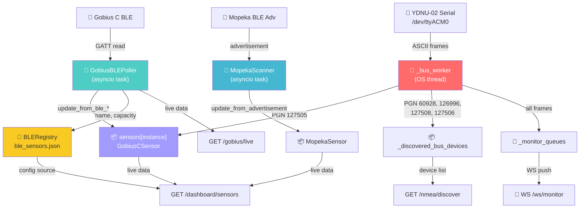

# 🔍 Полный аудит кодовой базы NMEA 2000 Web Console

## Структура проекта

```
ha/nmea2000/
├── app.py                    (107 строк) — FastAPI entry point, lifecycle
├── device_manager.py         (663 строк) — YDNU-02 serial, CAN bus worker, sensor state
├── ydnu02_web.py             (643 строк) — ⚠️ LEGACY монолит-дублёр
├── gobius_ble_poller.py      (316 строк) — BLE GATT polling для Gobius C
├── ble_registry.py           (124 строки) — Persistent registry BLE сенсоров (JSON)
├── mopeka_scanner.py         (133 строки) — Passive BLE scanning Mopeka
├── gobius_parsers.py         (234 строки) — Парсеры GATT байтов Gobius C
├── n2k_command_builder.py    (103 строки) — PGN 126208, ISO Request builder
├── sensors/
│   ├── base_sensor.py        (244 строки) — BaseSensor, NMEAData, BLEData
│   ├── gobius_sensor.py      (171 строка) — GobiusCSensor
│   └── mopeka_sensor.py      (106 строк) — MopekaSensor
├── routes/
│   ├── __init__.py            (35 строк) — get_device_mgr(), get_ble_registry(), etc.
│   ├── device.py             (229 строк) — /info, /mode, /sensors, /dashboard/sensors, /nmea/discover
│   ├── gobius.py             (382 строки) — /gobius/live, /status, /n2k, /user_config, /command, /n2k_command
│   ├── ble.py                (168 строк) — /ble/sensors CRUD, /ble/scan
│   ├── mopeka.py              (54 строки) — /mopeka/sensors, /config, /delete
│   ├── service.py            (175 строк) — /io/pause, /resume, /state, /filters, /diag, service terminal
│   ├── maintenance.py         (62 строки) — /backup, /reset/*, MCU
│   ├── firmware.py            (98 строк) — /firmware/latest, /download, /upload, /flash
│   └── websockets.py          (36 строк) — WS /ws/monitor, WS /ws/scan
├── static/
│   ├── index.html            (466 строк) — 8 вкладок, 3 модалки
│   └── js/
│       ├── core.js           (342 строки) — init, tabs, API client, BLE modal, polling helpers
│       ├── dashboard.js      (215 строк) — Gateway info, mode/silent, sensor cards
│       ├── monitor.js        (131 строка) — WebSocket live CAN frame monitor
│       ├── scan.js            (62 строки) — WebSocket CAN bus address scan
│       ├── discover.js       (100 строк) — REST CAN bus device discovery + PGN 126208 config
│       ├── gobius.js         (217 строк) — Gobius C tab: telemetry, config, commands
│       ├── mopeka.js         (132 строки) — Mopeka tab: sensor cards, config
│       ├── service.js        (179 строк) — I/O pause/resume, diag, service terminal
│       └── maintenance.js    (228 строк) — Backups, firmware, factory reset
```

**Итого: ~4,270 строк Python + ~1,606 строк JavaScript + ~466 строк HTML**

---

## 🔴 Критические баги

### BUG-1: Service Terminal полностью сломан

> [!CAUTION]
> **Все кнопки терминала в Service tab не работают — JS выбрасывает TypeError.**

В `index.html` кнопки вызывают:
- `App.termCmd('HELP')`, `App.termCmd('HELP SET')`, etc.
- Input + кнопка Send → `App.termSubmit()`

В `service.js` определён метод `sendServiceCmd()`, а **`termCmd()` и `termSubmit()` не существуют нигде**.

**Результат:** нажатие на любую кнопку или Enter в терминале → `TypeError: App.termCmd/termSubmit is not a function` в консоли DevTools.

---

### BUG-2: Service tab crash при переключении

> [!CAUTION]
> **Переход на вкладку Service вызывает runtime ошибку.**

В `core.js` (строка ~69):
```javascript
if (btn.dataset.tab === 'service') this.refreshServiceState();
```

Метод `refreshServiceState()` **не определён нигде** в кодовой базе.

**Результат:** `TypeError: this.refreshServiceState is not a function` при клике на вкладку ⚙️ Service.

---

### BUG-3: Thread-unsafe доступ к `sensors` dict

> [!WARNING]
> **Data race между OS-потоком bus_worker, asyncio-задачами BLE poller и HTTP-хендлерами.**

| Writer | Context | Lock? |
|--------|---------|-------|
| `device_manager._bus_worker()` → `_update_sensor_state()` | OS daemon thread | ❌ Нет |
| `gobius_ble_poller._read_full_unlocked()` → `sensors[0].update_from_ble_*()` | asyncio task | asyncio.Lock (не thread-safe) |
| `routes/device.py` → `get_sensors_state()` | HTTP handler thread | ❌ Нет |

`asyncio.Lock` защищает только от concurrent asyncio coroutines, но **не от OS-потока** `_bus_worker`.

---

### BUG-4: `ble_registry.py` — ложная thread-safety

> [!WARNING]
> **Класс утверждает "Thread-safe registry", но не имеет ни одного lock.**

`add()`, `update()`, `remove()` + `_save()` (json.dump на диск) вызываются из:
- HTTP routes (ble.py, gobius.py)
- BLE poller background task

Без какой-либо синхронизации → возможна порча `ble_sensors.json`.

---

## 🟠 Архитектурные проблемы

### ARCH-1: `ydnu02_web.py` — мёртвый монолит-дублёр (643 строки)

> [!IMPORTANT]
> **Полная копия `app.py` + `device_manager.py` + `routes/*` в одном файле.**

Содержит **устаревший** `DeviceManager` без bus_worker, без BLE интеграции, с блокирующим `self._lock` на 300 секунд при monitor/scan. 

**Проблема:** этот файл не используется (app.py — актуальный entry point), но создаёт путаницу и лежит рядом в репозитории.

---

### ARCH-2: Scan vs Discover — дублирование функциональности

> [!IMPORTANT]
> **Две вкладки делают по сути одно и то же: сканируют CAN bus на предмет устройств.**

| Аспект | 🔍 Scan (scan.js) | 🌐 Discover (discover.js) |
|--------|-------------------|---------------------------|
| **Транспорт** | WebSocket `/ws/scan` | REST `GET /api/nmea/discover` |
| **Backend** | `device_manager.scan_bus()` — останавливает bus_worker, открывает serial, шлёт ISO Request, парсит ответы | `routes/device.py` → `send_raw_command()` + читает `_discovered_bus_devices` из bus_worker |
| **UI** | Таблица src/model/serial/firmware | Карточки с кнопками Configure + Bind |
| **Отличия** | Показывает live фреймы по мере прихода | Показывает накопленные устройства |
| **Проблема scan_bus** | **Останавливает** весь bus_worker на время сканирования — NMEA данные перестают приходить | Работает поверх bus_worker без остановки |

**Вывод:** `Scan` и `Discover` должны быть объединены в одну вкладку.

---

### ARCH-3: Registry ≠ Sensor State, но код их смешивает

> [!IMPORTANT]
> **`ble_registry` — это конфиг приложения (какие датчики зарегистрированы, настройки бака). Но код использует его как источник live данных.**

Примеры:
- `gobius.py` `/gobius/n2k` после записи GATT обновляет `ble_registry` с `fluid_type` и `capacity_l`
- `gobius_ble_poller.py` при каждом полном чтении пишет в `ble_registry.update()` name и capacity
- `dashboard/sensors` мерджит данные из `ble_registry` + live NMEA + live BLE в один response

**Registry должен быть read-only источником конфигурации.** Live state должен читаться только из `sensors[]` объектов.

---

### ARCH-4: Двойное хранение конфигурации

Настройки бака (tank_depth, capacity, fluid_type, name) хранятся в:
1. `ble_registry.py` → `ble_sensors.json` (персистентное)
2. `MopekaSensor` / `GobiusCSensor` → in-memory атрибуты
3. Сам аппаратный датчик (Gobius C GATT, Mopeka advertisement)

`mopeka_scanner.update_config()` обновляет и `MopekaSensor`, и `BLERegistry`. При рестарте приложения `_init_from_registry()` загружает из registry в sensor. Но если кто-то обновил только sensor, а не registry — данные рассинхронизируются.

---

### ARCH-5: `n2k_command_builder` не используется где надо

`device_manager.scan_bus()` и `ydnu02_web.py` содержат **хардкоженные** ISO Request строки:
```python
ctrl.ser.write(b"18EAFF10 00 EE 00\r\n")  # вместо build_iso_request_frame(60928)
ctrl.ser.write(b"18EAFF10 14 F0 01\r\n")  # вместо build_iso_request_frame(126996)
```

Модуль `n2k_command_builder.build_iso_request_frame()` существует, но не вызывается.

---

### ARCH-6: Monitor queue race condition

`_monitor_queues` (list of asyncio.Queue) модифицируется:
- **Добавление:** в async `monitor_raw()` (HTTP handler thread)
- **Итерация + удаление dead:** в `_broadcast_frame()` (OS daemon thread `_bus_worker`)

Нет `threading.Lock` → `RuntimeError: list modified during iteration`.

---

## 🟡 Карта всех вкладок и эндпоинтов

### Frontend: 8 вкладок

| Tab | JS файл | Основные API вызовы |
|-----|---------|---------------------|
| 📊 Dashboard | dashboard.js | `GET /info`, `POST /mode/*`, `POST /silent/*`, `POST /reset/mcu`, `GET /dashboard/sensors`, `GET /io/state` |
| 📡 Monitor | monitor.js | `WS /ws/monitor` |
| 🔍 Scan | scan.js | `WS /ws/scan` |
| ⚙️ Service | service.js | `POST /io/pause`, `/resume`, `GET /io/state`, `GET /filters`, `GET /diag/*`, `POST /service/cmd`, `/enter`, `/exit` |
| 🌊 Gobius C | gobius.js | `GET /gobius/live`, `/status`, `POST /gobius/n2k`, `/user_config`, `/command`, `/info`, `/n2k_command` |
| 💧 Mopeka | mopeka.js | `GET /mopeka/sensors`, `POST /mopeka/config/*` |
| 🌐 Discover | discover.js | `GET /nmea/discover`, `POST /gobius/n2k_command` |
| 🔧 Maintenance | maintenance.js | `POST /backup`, `GET /backups`, `/backup/download/*`, `POST /reset/*`, firmware endpoints |

### Backend: 39 REST + 2 WebSocket эндпоинтов

| Route file | Endpoints | Prefix |
|-----------|-----------|--------|
| device.py | 6 | `/api/` |
| gobius.py | 7 | `/api/gobius/` |
| ble.py | 5 | `/api/ble/` |
| mopeka.py | 4 | `/api/mopeka/` |
| service.py | 10 | `/api/` |
| maintenance.py | 7 | `/api/` |
| firmware.py | 6 | `/api/firmware/` |
| websockets.py | 2 WS | `/ws/` |

---

## 🟢 Что работает правильно

1. **`core.js` shared helpers** — `api()`, `withButton()`, `setFields()`, `loadInputs()`, `readInputs()`, `startPolling()` — хороший DRY подход
2. **`n2k_command_builder.py`** — чистые stateless функции, thread-safe
3. **`gobius_parsers.py`** — чистые парсеры, без side effects
4. **`sensors/base_sensor.py`** — 4-слойная архитектура (nmea_raw, ble_raw, service_registry, display) — правильный дизайн
5. **`app.py` lifecycle** — корректный startup/shutdown через asynccontextmanager
6. **I/O pause/resume** (`service.py`) — корректно останавливает/запускает все 3 subsystem

---

## 📊 Матрица сквозного потока данных



---

## 📋 Полный перечень проблем (приоритет)

| # | Severity | Проблема | Файлы |
|---|----------|----------|-------|
| 1 | 🔴 CRITICAL | Service terminal (`termCmd`, `termSubmit`) не существует | index.html, service.js |
| 2 | 🔴 CRITICAL | `refreshServiceState()` не определён → Service tab crash | core.js |
| 3 | 🔴 CRITICAL | Thread-unsafe `sensors` dict (bus_worker vs poller vs HTTP) | device_manager.py, gobius_ble_poller.py |
| 4 | 🟠 HIGH | `ble_registry` без locks (заявлена thread-safety) | ble_registry.py |
| 5 | 🟠 HIGH | `_monitor_queues` race condition | device_manager.py |
| 6 | 🟠 HIGH | Scan vs Discover дублирование | scan.js, discover.js, websockets.py, device.py |
| 7 | 🟡 MEDIUM | Registry подменяет live sensor state | routes/device.py (dashboard/sensors), gobius.py |
| 8 | 🟡 MEDIUM | Двойное хранение конфигурации | ble_registry, sensors/, mopeka_scanner |
| 9 | 🟡 MEDIUM | `ydnu02_web.py` мёртвый дублёр (643 строки) | ydnu02_web.py |
| 10 | 🟡 MEDIUM | `n2k_command_builder` не используется в scan_bus | device_manager.py |
| 11 | 🟢 LOW | `MopekaSensor.to_dict()` не следует 4-layer архитектуре | sensors/mopeka_sensor.py |
| 12 | 🟢 LOW | `parse_radar` = алиас `parse_measurement` | gobius_parsers.py |
| 13 | 🟢 LOW | MCU Reboot дублируется в Dashboard и Maintenance | dashboard.js, maintenance.js |
