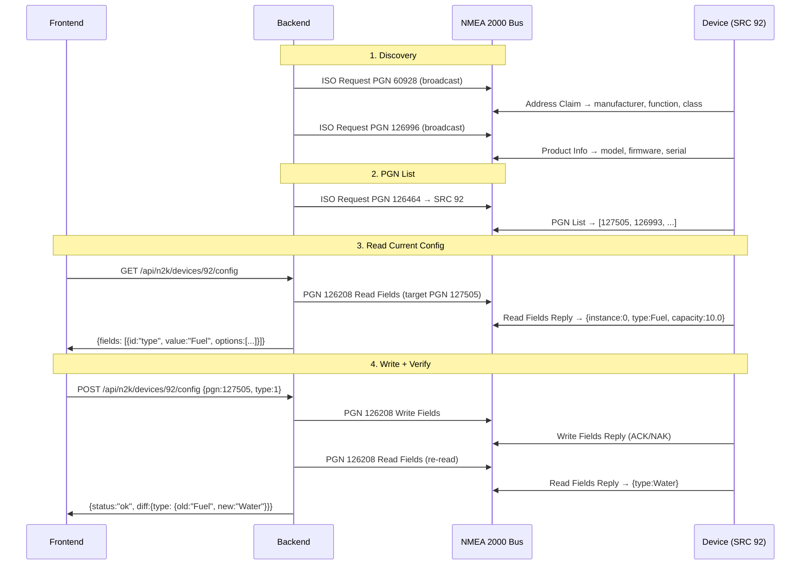

# NMEA 2000 Dynamic Network Manager

## Цель
Превратить текущий hardcoded N2K Config (только Fluid Level, только для датчиков) в полноценный динамический Network Manager:
- Находит **все устройства** (шлюзы, датчики, GPS, ...)
- Читает **реальные настраиваемые свойства** каждого устройства
- Динамически строит **UI из метаданных полей** (LOOKUP → select, NUMBER → input)
- Записывает изменения → **верифицирует** (read-back diff) → показывает результат
- Получает **live-обновления** от всех устройств на шине

## Что есть сейчас (и что неправильно)

| Компонент | Текущее состояние | Проблема |
|---|---|---|
| [n2k_config.js](file:///Users/denn/Develop/3dprint/ha/nmea2000/static/js/n2k_config.js) | Hardcoded `N2K_PGNS: {127505: {fields: [instance, fluid_type, capacity]}}` | Не из шины, одинаковый для всех устройств |
| [n2k_command_builder.py](file:///Users/denn/Develop/3dprint/ha/nmea2000/n2k_command_builder.py) | Ручная сборка байт для PGN 126208 только для PGN 127505 | Hardcoded field indices, scaling. Библиотека умеет encode |
| [routes/n2k.py](file:///Users/denn/Develop/3dprint/ha/nmea2000/routes/n2k.py) | `POST /n2k/command` с hardcoded `instance`, `fluid_type`, `capacity` | Не universal |
| Network tab | Кнопка Configure для всех устройств | Шлюзу не нужна настройка Fluid Level |

## Протокол NMEA 2000 — что мы используем

## Что даёт библиотека nmea2000

Из исследования — библиотека знает:
- **543 PGN** с decode + encode
- **212 lookup enums** (TANK_TYPE, MANUFACTURER_CODE, и т.д.)
- **FieldTypes**: NUMBER, LOOKUP, STRING, BINARY, TIME, PGN, ...
- **NMEA2000Field**: `id`, `name`, `type`, `value`, `raw_value`, `unit_of_measurement`
- **PGN 126208** — encode/decode для Read/Write/Command/Acknowledge

> [!IMPORTANT]
> Lookup ключ (напр. `"TANK_TYPE"`) зашит в сгенерированном decode коде для каждого PGN.
> Прямой метод `field.get_lookup_options()` — **нет**. Но мы можем извлечь lookup key из decode source или использовать `master_dict` по имени поля.

---

## Proposed Changes

### Phase 1: Backend — Dynamic Device Properties

#### [MODIFY] [ydnu02.py](file:///Users/denn/Develop/3dprint/ha/nmea2000/ydnu02.py)
Добавить методы:
- `get_pgn_field_metadata(pgn: int) → List[FieldMeta]` — по PGN возвращает список полей с типами, enum-опциями, единицами измерения. Декодирует dummy frame для PGN и извлекает field metadata из `NMEA2000Field` + lookup из `master_dict`.
- `build_read_fields_request(target_src, target_pgn) → str` — формирует PGN 126208 Read Fields Request в CAN_FRAME_ASCII_RAW
- `build_write_fields_request(target_src, target_pgn, fields) → str` — формирует PGN 126208 Write Fields в CAN_FRAME_ASCII_RAW
- `parse_read_fields_reply(msg) → Dict` — парсит Read Fields Reply в словарь {field_id: value}

---

#### [MODIFY] [device_manager.py](file:///Users/denn/Develop/3dprint/ha/nmea2000/device_manager.py)
- Добавить хранение `discovered_devices: Dict[int, DeviceInfo]` с полями:
  - `address_claim` (IsoName данные)
  - `product_info` (модель, firmware, serial)
  - `pgn_list` (список PGN от PGN 126464)
  - `last_seen` timestamp
- В `_update_sensor_state()` — обновлять `discovered_devices` из PGN 60928, 126996, 126464
- Добавить `read_device_config(src, pgn) → Dict` — отправляет Read Fields, ждёт Reply
- Добавить `write_device_config(src, pgn, fields) → Dict` — Write + Read-back + diff

---

#### [NEW] routes/n2k_config.py
Новые endpoints:
- `GET /api/n2k/devices` — все обнаруженные устройства с метаданными
- `GET /api/n2k/devices/{src}/pgns` — PGN list для конкретного устройства
- `GET /api/n2k/devices/{src}/config/{pgn}` — текущие значения полей (Read Fields)
- `POST /api/n2k/devices/{src}/config/{pgn}` — записать новые значения (Write + Verify)
- `GET /api/n2k/pgn/{pgn}/metadata` — метаданные полей PGN (типы, enum опции, units)

---

#### [DELETE] [n2k_command_builder.py](file:///Users/denn/Develop/3dprint/ha/nmea2000/n2k_command_builder.py)
Заменяется на библиотечный encoder. Вся логика переезжает в `ydnu02.py`.

---

### Phase 2: Frontend — Dynamic Config UI

#### [MODIFY] [n2k_config.js](file:///Users/denn/Develop/3dprint/ha/nmea2000/static/js/n2k_config.js)
Полная переработка:
- Убрать hardcoded `N2K_PGNS` registry
- `openN2KConfigModal(src)`:
  1. `GET /api/n2k/devices/{src}/pgns` → получить PGN list
  2. Для каждого настраиваемого PGN → `GET /api/n2k/devices/{src}/config/{pgn}` → текущие значения
  3. `GET /api/n2k/pgn/{pgn}/metadata` → типы полей, enum-опции
  4. Динамически строить форму:
     - `LOOKUP` → `<select>` с опциями из enum
     - `NUMBER` → `<input type="number">` с unit label
     - `STRING` → `<input type="text">`
     - `RESERVED`/`SPARE` → скрыть
  5. При сохранении: `POST /api/n2k/devices/{src}/config/{pgn}` → diff + result

#### [MODIFY] [network.js](file:///Users/denn/Develop/3dprint/ha/nmea2000/static/js/network.js)
- Кнопка "Configure" → вызывает `openN2KConfigModal(src)` без hardcoded PGN
- Badge и иконка — из `function_name` (уже сделано)
- Добавить badge "configurable" если устройство имеет настраиваемые PGN

---

### Phase 3: Live Data

#### [MODIFY] [device_manager.py](file:///Users/denn/Develop/3dprint/ha/nmea2000/device_manager.py)
- В `_bus_worker()` — для всех PGN (не только 127505) обновлять `discovered_devices[src].last_data[pgn]`
- WebSocket `/ws/monitor` — broadcast decoded data для всех PGN

---

## Open Questions

> [!IMPORTANT]
> **Lookup enum resolution:** Библиотека хранит lookup ключ (например `"TANK_TYPE"`) в сгенерированном decode-коде каждого PGN, но не экспортирует его как атрибут поля. Два варианта:
> 1. Парсить `inspect.getsource(decode_pgn_XXXXX)` для извлечения `master_dict['KEY_NAME']` — хрупко
> 2. Декодировать dummy frame → для LOOKUP полей перебирать `master_dict` значения проверяя совпадение → более надёжно
> 3. Hardcode маппинг field_id → master_dict key для известных PGN (TANK_TYPE, MANUFACTURER_CODE, ...) — прагматично
>
> Рекомендую вариант 3 как основу + вариант 2 как fallback.

> [!IMPORTANT]
> **PGN 126464 поддержка:** Не все устройства отвечают на ISO Request для PGN 126464. Gobius C может не поддерживать. В этом случае используем fallback — показываем PGN которые устройство реально публиковало на шине (видели в `_bus_worker()`).

## Verification Plan

### Automated Tests
- Unit test: `get_pgn_field_metadata(127505)` возвращает 4 поля с правильными типами
- Unit test: `build_read_fields_request()` генерирует валидный CAN frame
- Integration test на gateway.local: Read Fields → Gobius → проверить ответ

### Manual Verification
- Scan на gateway.local → проверить что YDNU-02 показывается как Gateway без Configure
- Configure Gobius → проверить что динамическая форма показывает правильные поля
- Write → Read-back → проверить diff
