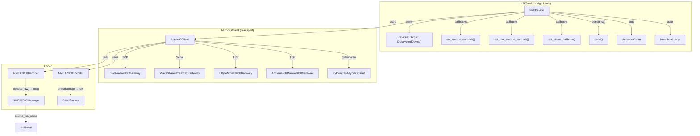

# Анализ библиотеки nmea2000 — Device Management & Network Discovery

## Архитектура



---

## N2KDevice — Устройство на шине

### Конструктор
```python
N2KDevice(
    client: AsyncIOClient,
    preferred_address=100,      # Адрес на шине
    unique_number=None,         # 21-bit уникальный ID (persistent)
    manufacturer_code=999,      # Код производителя
    device_function=130,        # PC Gateway
    device_class=25,            # Inter/Intra Network Device
    heartbeat_interval=60,      # Heartbeat каждые 60 сек
    persistence_path=None,      # ~/.nmea2000/{key}.json
    transmit_pgns=[],           # PGNs которые устройство публикует
    ...
)
```

### Factory Methods
| Метод | Transport | Формат | Подходит для YDNU-02? |
|---|---|---|---|
| `for_text_gateway(host, port, format)` | TCP | Любой TEXT_FORMAT | ❌ TCP only |
| `for_n2k_ascii(host, port)` | TCP | N2K_ASCII_RAW | ❌ TCP only |
| `for_waveshare(port)` | Serial USB | WAVESHARE binary | ❌ Другой формат |
| `for_python_can(interface, channel)` | python-can | Native CAN | ❌ Нет USB serial |
| `for_ebyte(host, port)` | TCP | EByte binary | ❌ |
| `for_actisense(host, port)` | TCP | BST/BDTP | ❌ |

> **⚠️ Нет готового factory для YDNU-02 serial!**
> YDNU-02 использует serial порт (`/dev/ttyACM0`) с форматом `CAN_FRAME_ASCII_RAW`.
> `TextNmea2000Gateway` поддерживает этот формат, но работает через TCP.
> Решение: нужен Serial-адаптер (subclass `AsyncIOClient`) или ser2net proxy.

### Жизненный цикл
```python
device = N2KDevice(client)
await device.start()              # → connect → Address Claim sequence
await device.wait_ready()         # Блокирует до успешного claim

# Автоматически при подключении:
# 1. Отправляет ISO Request для PGN 60928 (Address Claim) на SRC=254
# 2. Ждёт address_claim_startup_delay (250ms default)
# 3. Отправляет свой Address Claim
# 4. Ждёт address_claim_detection_time (250ms default)
# 5. Если конфликт — увеличивает адрес и повторяет
# 6. Отправляет Product Information (PGN 126996)
# 7. Запускает Heartbeat Loop (PGN 126993)

await device.send(msg)            # Отправить NMEA2000Message
await device.close()              # Остановить всё
```

### Auto-Discovery: `seed_network_map`
При подключении клиент автоматически:
```
connect() → _seed_network_map():
  wait 2s
  → ISO Request PGN 60928 (Address Claim)   ← все устройства отвечают
  wait 2s
  → ISO Request PGN 126996 (Product Info)    ← модель, firmware, serial
  wait 2s
  → ISO Request PGN 126998 (Config Info)     ← installation description
```

Ответы обрабатываются в `_handle_management_message()`:
- PGN 60928 → `device.devices[src].address_claim = message`
- PGN 126996 → `device.devices[src].product_information = message`
- PGN 126998 → `device.devices[src].configuration_information = message`

Также каждое сообщение обновляет `device.devices[src].last_seen`.

---

## DiscoveredDevice — Обнаруженное устройство
```python
@dataclass
class DiscoveredDevice:
    source: int                                          # SRC адрес
    last_seen: datetime | None                           # Когда последний раз видели
    address_claim: NMEA2000Message | None                # PGN 60928
    product_information: NMEA2000Message | None          # PGN 126996
    configuration_information: NMEA2000Message | None    # PGN 126998
```

Из `address_claim` можно извлечь `IsoName`:
```python
iso = IsoName(dev.address_claim)
iso.manufacturer_code  # "Yacht Devices"
iso.device_function    # "PC Gateway"
iso.device_class       # "Internetwork device"
iso.unique_number      # 402047
iso.device_instance    # int
iso.industry_group     # "Marine Industry"
```

Из `product_information`:
```python
msg = dev.product_information
msg.get_field_by_id("modelId").value        # "YDNU-02"
msg.get_field_by_id("softwareVersionCode").value  # "1.75"
msg.get_field_by_id("modelSerialCode").value      # "00402047"
```

---

## Encoder — Конструирование сообщений

### ISO Request (PGN 59904) — работает ✅
```python
msg = NMEA2000Message(
    PGN=59904, id="isoRequest",
    source=16, destination=255, priority=6,
    fields=[NMEA2000Field("pgn", value=60928, raw_value=60928)]
)
enc = NMEA2000Encoder(output_format=N2KFormat.CAN_FRAME_ASCII_RAW)
print(enc.encode(msg))  # "18EAFF10 00 EE 00"
```

### PGN 126208 (Group Function Command) — encode функции есть ✅
Библиотека имеет **encode** для всех вариантов PGN 126208:
- `encode_pgn_126208_nmeaCommandGroupFunction` — отправка команд конфигурации
- `encode_pgn_126208_nmeaWriteFieldsGroupFunction` — запись полей
- `encode_pgn_126208_nmeaReadFieldsGroupFunction` — чтение полей
- `encode_pgn_126208_nmeaRequestGroupFunction` — запрос
- `encode_pgn_126208_nmeaAcknowledgeGroupFunction` — подтверждение

### Поддерживаемые PGN для encode
```
543 encode_pgn_* функций в pgns.py
```

### Формат для YDNU-02
`CAN_FRAME_ASCII_RAW` → `"18EAFF10 00 EE 00"` (hex CAN ID + hex payload)

---

## Что библиотека делает за нас (и что нет)

### ✅ Делает
| Функция | Как |
|---|---|
| **Полный decode любого PGN** | `NMEA2000Decoder.decode(raw_line)` → `NMEA2000Message` |
| **291 производителей** | `master_dict["MANUFACTURER_CODE"]` |
| **2D device function lookup** | `IndirectLookupEncodeMaps["DEVICE_FUNCTION"]` |
| **IsoName parsing** | `IsoName(msg)` → manufacturer, function, class |
| **Multi-frame reassembly** | Автоматически (Fast Packet) |
| **Encode сообщений** | `NMEA2000Encoder.encode(msg, format)` |
| **Auto-discovery** | `seed_network_map` → ISO Request → DiscoveredDevice |
| **Address Claim** | Автоматический с conflict resolution |
| **Heartbeat** | Автоматический PGN 126993 |
| **ISO Request handler** | Отвечает на запросы Address Claim, Product Info |
| **Persistence** | `~/.nmea2000/{key}.json` — адрес + unique number |

### ❌ НЕ делает (нужно нам)
| Функция | Почему |
|---|---|
| **Serial port для YDNU-02** | Нет factory для serial + CAN_FRAME_ASCII_RAW формат |
| **YDNU-02 AT-команды** | Переключение режимов (RAW/NORMAL), silent mode — проприетарные |
| **Конфигурация через BLE** | Gobius BLE polling — вне scope библиотеки |
| **Sensor registry** | Привязка N2K instance к tank name — наша бизнес-логика |

---

## Стратегия интеграции для YDNU-02

### Вариант A: Serial AsyncIOClient (рекомендуемый)
Создать `SerialTextNmea2000Gateway(AsyncIOClient)` — наследник для serial + CAN_FRAME_ASCII_RAW:

```python
class SerialTextNmea2000Gateway(AsyncIOClient):
    """Serial client for YDNU-02 using CAN_FRAME_ASCII_RAW format."""
    
    async def _connect_impl(self):
        self.reader, self.writer = await serial_asyncio.open_serial_connection(
            url="/dev/ttyACM0", baudrate=115200)
    
    async def _receive_impl(self):
        data = await self.reader.readline()
        line = data.decode("utf-8", errors="ignore").strip()
        message = self.decoder.decode(line)
        if message:
            await self.queue.put(message)
    
    def _encode_impl(self, msg):
        return self.encoder.encode(msg, N2KFormat.CAN_FRAME_ASCII_RAW)
```

Затем `N2KDevice(SerialTextNmea2000Gateway(...))` — полный auto-discovery + send.

### Вариант B: ser2net proxy
Запустить `ser2net` для проброса `/dev/ttyACM0` → TCP:4001, и использовать `N2KDevice.for_text_gateway("localhost", 4001, N2KFormat.CAN_FRAME_ASCII_RAW)`.
