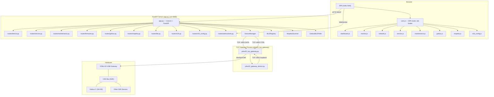
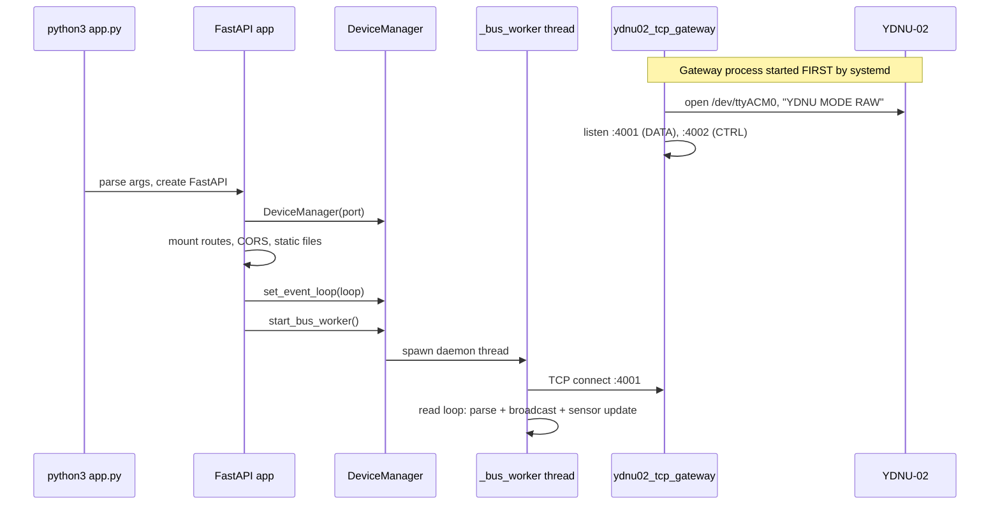

# 🏗️ Architecture & Refactoring Specification

## Part 1: System Model — Browser → Hardware

### End-to-End Architecture



---

### Startup Sequence



---

### Data Flow 1: Reading N2K Bus (live monitoring)

```
YDNU-02 (/dev/ttyACM0)
    │
    ▼  serial readline
ydnu02_tcp_gateway.py (serial_reader thread)
    │
    ▼  _broadcast(line) to all TCP clients
TCP :4001 ─────────────────────────────────────────┐
    │                                               │
    ▼                                               ▼
DeviceManager._bus_worker()              ydnu02_gateway_device (SA=200)
    │                                        (heartbeat, CPU temp)
    ├─► N2KPGNDecoder.parse_raw_line()
    ├─► _update_sensor_state()  ──► GET /api/sensors ──► Browser dashboard
    ├─► _record_error_event()   ──► GET /api/errors  ──► Browser error log
    └─► _broadcast_frame()      ──► asyncio.Queue ──► /ws/monitor ──► Browser monitor tab
```

### Data Flow 2: Service Operations (config/reset/firmware)

```
Browser POST /api/service/cmd
    │
    ▼
routes/service.py ──► DeviceManager._service_operation(func)
    │
    ├─► 1. _pause_event.set()          (suspend _bus_worker reading)
    ├─► 2. ProxyControlClient.enter_service()
    │       └─► TCP :4002 → "SERVICE_START\n" → gateway → DTR toggle → YDNU-02 service mode
    ├─► 3. YDNU02Controller._passthrough = ctrl_client
    │       └─► func(ctrl)  (e.g. HELP, PRINT FILTER, SET key value)
    ├─► 4. ProxyControlClient.exit_service()
    │       └─► TCP :4002 → "SERVICE_END\n" → gateway → "MODE RAW" → YDNU-02 resumes
    └─► 5. _pause_event.clear()        (resume _bus_worker reading)
```

### Data Flow 3: Bus Scan (device discovery)

```
Browser opens /ws/scan
    │
    ▼
DeviceManager.scan_bus(websocket)
    │
    ├─► Opens independent asyncio TCP to :4001
    ├─► Sends ISO Requests: PGN 59904 → global (0xFF)
    │     18EAFFFE 00 EE 00  (request ISO Address Claim)
    │     18EAFFFE 14 F0 01  (request Product Information)
    ├─► Reads responses for `duration` seconds
    │     N2KPGNDecoder.parse_raw_line() + parse_device_info()
    │     Fast-packet reassembly via local NMEA2000Decoder
    └─► Streams results as JSON to WebSocket → Browser network tab
```

---

### REST API Map

| Method | Endpoint | Route File | DeviceManager Method |
|--------|----------|-----------|---------------------|
| GET | `/api/state` | device.py | `get_state()` |
| GET | `/api/info` | device.py | `get_info()` |
| POST | `/api/mode` | device.py | `set_mode(mode)` |
| POST | `/api/silent` | device.py | `set_silent(state)` |
| GET | `/api/sensors` | n2k.py | `get_sensors_state()` |
| GET | `/api/errors` | n2k.py | `get_error_log()` |
| DELETE | `/api/errors` | n2k.py | `clear_error_log()` |
| POST | `/api/service/enter` | service.py | `enter_service()` |
| POST | `/api/service/exit` | service.py | `exit_service()` |
| POST | `/api/service/cmd` | service.py | `send_service_cmd(cmd)` |
| GET | `/api/n2k/filters` | n2k_config.py | `get_filters()` |
| GET | `/api/n2k/settings` | n2k_config.py | `get_settings()` |
| POST | `/api/maintenance/reset-settings` | maintenance.py | `reset_settings()` |
| POST | `/api/maintenance/reset-filters` | maintenance.py | `reset_filters()` |
| POST | `/api/maintenance/backup` | maintenance.py | `create_backup()` |
| POST | `/api/firmware/flash` | firmware.py | `flash_firmware(path)` |
| GET | `/api/firmware/check-latest` | firmware.py | `check_latest_firmware()` |
| WS | `/ws/monitor` | websockets.py | `monitor_raw(ws)` |
| WS | `/ws/scan` | websockets.py | `scan_bus(ws)` |

---

### Frontend SPA Structure

```
static/
├── index.html                  # Shell: nav, tab container, toast area
├── css/style.css               # Dark theme, components, animations
├── js/
│   ├── core.js                 # SPA router, tab loader, toast, WS manager
│   ├── dashboard.js            # Live gauge/sensor cards
│   ├── monitor.js              # Raw CAN frame stream + error modal
│   ├── network.js              # Bus device scanner + PGN decoder
│   ├── service.js              # Interactive YDNU-02 terminal
│   ├── maintenance.js          # Reset, backup actions
│   ├── gobius.js               # Gobius C tank sensor config
│   ├── mopeka.js               # Mopeka BLE sensor management
│   └── n2k_config.js           # PGN filter editor, settings
└── tabs/
    ├── dashboard.html           # Partial for dashboard tab
    ├── monitor.html             # Partial for CAN monitor tab
    ├── network.html             # Partial for network scan tab
    ├── service.html             # Partial for service terminal
    ├── maintenance.html         # Partial for maintenance tab
    ├── gobius.html              # Partial for Gobius config
    ├── mopeka.html              # Partial for Mopeka sensors
    └── modal_ble_scan.html      # Modal overlay for BLE scan
```

---

## Part 2: Refactored Module Specifications

### 2.1 DeviceManager → `device_manager/` package

#### Module: `device_manager/__init__.py`
```python
"""Re-export DeviceManager facade for backward-compatible imports."""
from .manager import DeviceManager
```

---

#### Module: `device_manager/manager.py` — Facade (~200 lines)

```python
"""DeviceManager — Facade over specialized sub-managers.

Central entry point for all YDNU-02 operations. Owns shared state
(locks, events, TCP connections) and delegates to sub-managers.
Routes continue using `get_device_mgr().method()` — no API change.
"""

class DeviceManager:
    """Facade: creates sub-managers, owns shared state, delegates all calls."""

    def __init__(self, port: str | None = None, debug: bool = False):
        """Initialize shared state and all sub-managers.
        
        Creates:
          - _tcp: TCPProxyConnection (DATA :4001)
          - _pause_event: threading.Event (bus worker suspension)
          - _sensors_lock: threading.Lock (sensor state access)
          - _service_lock: threading.Lock (service operation serialization)
          - Sub-managers: bus_worker, sensors, errors, operations, service, firmware, ws_hub
        """

    # ── Lifecycle delegation ──
    def start_bus_worker(self) -> None:
        """Delegate to BusWorker.start()."""
    
    def stop_bus_worker(self) -> None:
        """Delegate to BusWorker.stop()."""
    
    def set_event_loop(self, loop: asyncio.AbstractEventLoop) -> None:
        """Store asyncio loop ref for thread-safe WS queue pushing."""

    # ── Sensor state delegation ──
    def get_sensors_state(self) -> dict[str, Any]:
        """Delegate to SensorRegistry.get_state()."""

    # ── Error log delegation ──
    def get_error_log(self, limit: int = 100, src: int | None = None) -> dict:
        """Delegate to ErrorLogger.get_log()."""
    
    def clear_error_log(self) -> dict:
        """Delegate to ErrorLogger.clear()."""

    # ── Service operations delegation ──
    def get_info(self, force: bool = False) -> dict:
        """Delegate to ServiceManager.get_info()."""
    
    def get_filters(self) -> dict:
        """Delegate to ServiceManager.get_filters()."""
    
    def get_settings(self) -> dict[str, str]:
        """Delegate to ServiceManager.get_settings()."""
    
    def get_diag(self, scope: str) -> dict[str, str]:
        """Delegate to ServiceManager.get_diag()."""
    
    def send_service_cmd(self, cmd: str) -> dict[str, str]:
        """Delegate to ServiceManager.send_cmd()."""
    
    def create_backup(self, force: bool = False) -> dict[str, str]:
        """Delegate to ServiceManager.create_backup()."""
    
    def reset_settings(self) -> dict[str, str]:
        """Delegate to ServiceManager.reset_settings()."""
    
    def reset_filters(self) -> dict[str, str]:
        """Delegate to ServiceManager.reset_filters()."""
    
    def reset_mcu(self) -> dict[str, str]:
        """Delegate to ServiceManager.reset_mcu()."""
    
    def reset_hardware(self) -> dict[str, str]:
        """Delegate to ServiceManager.reset_hardware()."""
    
    def set_mode(self, mode: str) -> dict[str, str]:
        """Delegate to ServiceManager.set_mode()."""
    
    def set_silent(self, state: str) -> dict[str, str]:
        """Delegate to ServiceManager.set_silent()."""
    
    def enter_service(self) -> dict[str, str]:
        """Delegate to ServiceManager.enter_service()."""
    
    def exit_service(self, target_mode: str = "AUTO") -> dict[str, str]:
        """Delegate to ServiceManager.exit_service()."""

    # ── State delegation ──
    def get_port(self) -> str:
        """Return connection string (host:port or serial port path)."""
    
    def get_state(self) -> str:
        """Return current state: IDLE / LISTENING / SERVICE / NO_DEVICE."""
    
    def send_raw_command(self, cmd_str: str) -> None:
        """Send raw NMEA command via DATA port."""

    # ── Firmware delegation ──
    def flash_firmware(self, bin_path: str) -> dict[str, str]:
        """Delegate to FirmwareManager.flash()."""
    
    @staticmethod
    def check_latest_firmware() -> dict[str, Any]:
        """Delegate to FirmwareManager.check_latest()."""

    # ── WebSocket delegation ──
    async def monitor_raw(self, websocket, duration: float = 300.0) -> None:
        """Delegate to WSStreamHub.monitor_raw()."""
    
    async def scan_bus(self, websocket, duration: float = 10.0) -> None:
        """Delegate to WSStreamHub.scan_bus()."""
```

---

#### Module: `device_manager/tcp_connection.py` — TCP Clients (~250 lines)

```python
"""TCP client wrappers for proxy DATA (:4001) and CTRL (:4002) ports.

These are thin socket wrappers. TCPProxyConnection handles the broadcast
stream (multi-client). ProxyControlClient handles exclusive serial passthrough.
"""

class TCPProxyConnection:
    """Raw TCP client for the DATA port (:4001) broadcast stream.
    
    Used by BusWorker to receive live N2K frames.
    Thread-safe: one instance per bus_worker thread.
    """

    def __init__(self, host: str, port: int): ...
    def connect(self) -> None:
        """Open TCP connection. Raises ConnectionRefusedError on failure."""
    def readline(self) -> str:
        """Read one \\n-terminated NMEA line. Blocks until data available."""
    def write(self, data: bytes) -> None:
        """Send raw bytes to proxy DATA port (e.g. ISO Request)."""
    def close(self) -> None:
        """Close connection. Safe to call multiple times."""
    def is_connected(self) -> bool:
        """True if socket is open (no half-open detection)."""


class ProxyControlClient:
    """TCP client for the CTRL port (:4002) exclusive serial passthrough.
    
    Only ONE control session at a time. Used by ServiceManager and
    FirmwareManager for service terminal and firmware flash operations.
    """

    def __init__(self, host: str, port: int): ...
    def _connect(self) -> None:
        """Open TCP to CTRL port."""
    def _recv_line(self, timeout: float = 3.0) -> str:
        """Read one \\n-terminated line with timeout."""
    def _send_cmd(self, cmd: str) -> str:
        """Send command, return response line."""
    def enter_service(self) -> None:
        """Send SERVICE_START, wait for READY."""
    def exit_service(self) -> None:
        """Send SERVICE_END, wait for OK, close."""
    def enter_firmware(self) -> None:
        """Send FIRMWARE_START, wait for READY."""
    def exit_firmware(self) -> None:
        """Send FIRMWARE_END, close."""
    def passthrough_write(self, data: bytes) -> None:
        """Write raw bytes to serial via proxy passthrough."""
    def passthrough_readline(self, timeout: float = 3.0) -> str:
        """Read one line from serial via passthrough."""
    def passthrough_read_for(self, duration: float) -> str:
        """Read all response lines for duration seconds."""
    def _close(self) -> None:
        """Close connection. Safe to call multiple times."""
```

---

#### Module: `device_manager/bus_worker.py` — TCP Read Loop (~200 lines)

```python
"""Background thread that reads N2K frames from proxy DATA port.

Owns the TCPProxyConnection lifecycle. Feeds parsed frames to
SensorRegistry, ErrorLogger, and WSStreamHub via callbacks.
"""

class BusWorker:
    """Daemon thread: connect to :4001, read NMEA lines, dispatch to consumers.
    
    Threading: runs as a daemon thread. Suspends via _pause_event during
    service mode. Auto-reconnects on TCP disconnect (5s backoff).
    
    Consumers (injected via __init__):
      - on_frame(parsed)  → SensorRegistry._update + ErrorLogger._record
      - on_ws_frame(parsed) → WSStreamHub._broadcast_frame
    """

    def __init__(self, tcp: TCPProxyConnection, pause_event: threading.Event,
                 on_frame: Callable, on_ws_frame: Callable): ...
    def start(self) -> None:
        """Spawn daemon thread running _run()."""
    def stop(self) -> None:
        """Signal thread to exit and join."""
    def _run(self) -> None:
        """Main loop: connect → read → parse → dispatch. Reconnect on error."""
```

---

#### Module: `device_manager/sensor_registry.py` — Sensor State (~120 lines)

```python
"""Tracks N2K device state from live bus traffic.

Maintains per-SA device info (ISO Claims, Product Info) and
per-instance sensor readings (fluid levels, temperatures).
"""

class SensorRegistry:
    """Thread-safe sensor state from decoded N2K PGNs.
    
    PGN dispatch:
      60928  → ISO Address Claim → device identity cache
      126996 → Product Information → device model/version
      127505 → Fluid Level → GobiusCSensor update
      130312 → Temperature → temperature reading cache
    """

    def __init__(self, sensors_lock: threading.Lock): ...
    def update(self, parsed: dict[str, Any]) -> None:
        """Process a decoded NMEA frame and update sensor/device state."""
    def get_state(self) -> dict[str, Any]:
        """Thread-safe snapshot of all known sensors."""
    def get_bus_devices(self) -> dict[int, dict]:
        """Return cached bus device info keyed by Source Address."""
```

---

#### Module: `device_manager/error_logger.py` — Error Ring Buffer (~60 lines)

```python
"""In-memory ring buffer for CAN error events.

Stores last N error frames detected in live traffic (e.g. PGN 126993
Heartbeat with State:Error). Exposed via REST API /api/errors.
"""

class ErrorLogger:
    """Thread-safe CAN error event logger with ring buffer storage.
    
    Ring buffer size: 500 events (configurable).
    Each event: {timestamp, src, pgn, pgn_name, decoded, raw_line}.
    """

    def __init__(self, max_size: int = 500): ...
    def record(self, parsed: dict[str, Any]) -> None:
        """Record error if decoded frame contains error indicators."""
    def get_log(self, limit: int = 100, src: int | None = None) -> dict:
        """Return recent errors (most recent first), optionally filtered by SA."""
    def clear(self) -> dict:
        """Clear all recorded errors. Returns {status, cleared}."""
```

---

#### Module: `device_manager/operation_runner.py` — Operation Patterns (~150 lines)

```python
"""Three operation patterns for YDNU-02 interactions.

All patterns handle bus worker pause/resume and proxy passthrough setup.
ServiceManager and FirmwareManager use these patterns.
"""

class OperationRunner:
    """Executes YDNU-02 operations with proper bus worker lifecycle.
    
    Three patterns (least → most complex):
      1. locked_operation    — OS shell command (no service terminal)
      2. service_operation   — full service terminal session
      3. raw_locked_operation — raw passthrough (firmware flash)
    
    All patterns:
      - Acquire _service_lock (serialize operations)
      - Pause _bus_worker via _pause_event
      - Open ProxyControlClient for serial access
      - Execute user function
      - Resume _bus_worker on exit (even on exception)
    """

    def __init__(self, pause_event: threading.Event,
                 service_lock: threading.Lock,
                 get_ctrl: Callable, get_proxy_ctrl: Callable): ...
    
    def service_operation(self, func: Callable, exit_mode: str = "RAW") -> Any:
        """Full service mode: enter → func(ctrl) → exit to exit_mode."""
    
    def locked_operation(self, func: Callable) -> Any:
        """OS shell command: pause bus → func(ctrl) → resume bus."""
    
    def raw_locked_operation(self, func: Callable) -> Any:
        """Raw passthrough: pause bus → func manages its own exit."""
```

---

#### Module: `device_manager/service_manager.py` — Service Operations (~220 lines)

```python
"""YDNU-02 service terminal operations.

Wraps YDNU02Controller service commands with OperationRunner patterns.
"""

class ServiceManager:
    """High-level service terminal operations for REST API.
    
    Every method returns a JSON-serializable dict.
    All operations serialized by OperationRunner._service_lock.
    """

    def __init__(self, ops: OperationRunner, get_ctrl: Callable): ...
    
    # ── Read operations (enter service → read → exit) ──
    def get_info(self, force: bool = False) -> dict:
        """Read device info via HELP command. Cached unless force=True."""
    def get_filters(self) -> dict:
        """Read all 8 filter tables via PRINT commands."""
    def get_settings(self) -> dict[str, str]:
        """Read current settings via HELP SET."""
    def get_diag(self, scope: str) -> dict[str, str]:
        """Run DIAG command. scope: ALL/USB_RX/USB_TX/N2K_RX/N2K_TX."""
    def send_cmd(self, cmd: str) -> dict[str, str]:
        """Send arbitrary service terminal command."""

    # ── Write operations ──
    def create_backup(self, force: bool = False) -> dict[str, str]:
        """Create JSON backup of settings and filters."""
    def reset_settings(self) -> dict[str, str]:
        """Reset all settings to factory defaults."""
    def reset_filters(self) -> dict[str, str]:
        """Reset all PGN filter tables."""
    def reset_mcu(self) -> dict[str, str]:
        """Soft MCU reset (settings preserved)."""
    def reset_hardware(self) -> dict[str, str]:
        """Full hardware reset (factory firmware)."""

    # ── Mode operations (OS shell, no service terminal) ──
    def set_mode(self, mode: str) -> dict[str, str]:
        """Switch mode: AUTO/RAW/N2K/0183."""
    def set_silent(self, state: str) -> dict[str, str]:
        """Enable/disable silent mode."""
    
    # ── Interactive service session ──
    def enter_service(self) -> dict[str, str]:
        """Enter interactive service mode (UI terminal tab)."""
    def exit_service(self, target_mode: str = "AUTO") -> dict[str, str]:
        """Exit interactive service mode."""

    # ── Private ──
    def _find_existing_backup(self, fw_version: str) -> str | None:
        """Check if a backup for this firmware version already exists."""
```

---

#### Module: `device_manager/firmware_manager.py` — Firmware OTA (~90 lines)

```python
"""Firmware update operations for YDNU-02."""

class FirmwareManager:
    """OTA firmware flash and version tracking.
    
    Flash uses FIRMWARE_START passthrough (not service terminal).
    Version check scrapes yachtd.com/downloads/ for latest release.
    """

    def __init__(self, ops: OperationRunner, get_ctrl: Callable): ...
    
    def flash(self, bin_path: str) -> dict[str, str]:
        """Flash firmware via proxy passthrough.
        Sequence: FIRMWARE_START → chunked write → FIRMWARE_END."""
    
    @staticmethod
    def check_latest() -> dict[str, Any]:
        """Scrape yachtd.com for latest YDNU-02 firmware version."""
    
    @property
    def flash_progress(self) -> dict:
        """Current flash progress: {percent, status, error}."""
```

---

#### Module: `device_manager/ws_stream_hub.py` — WebSocket Streaming (~220 lines)

```python
"""WebSocket streaming for live CAN bus monitoring and device scanning."""

class WSStreamHub:
    """Manages WebSocket frame broadcasting and bus scanning.
    
    Monitor: asyncio.Queue per subscriber, filled by BusWorker callbacks.
    Scan: independent TCP connection, ISO Requests, parsed responses.
    """

    def __init__(self, event_loop_ref, proxy_host: str, proxy_port: int): ...
    
    def broadcast_frame(self, parsed: dict[str, Any]) -> None:
        """Push parsed frame to all active monitor queues (thread-safe)."""
    
    async def monitor_raw(self, websocket, duration: float = 300.0) -> None:
        """Stream live N2K frames to WebSocket for duration seconds."""
    
    @staticmethod
    def _build_device_msg(dev: dict) -> dict:
        """Build clean device summary for scan_bus response."""
    
    async def scan_bus(self, websocket, duration: float = 10.0) -> None:
        """Scan N2K bus: ISO Requests → stream discovered devices."""
```

---

### 2.2 ydnu02_tcp_gateway → Modular Gateway

#### Module: `ydnu02_tcp_gateway/frame_utils.py` (~100 lines)

```python
"""CAN frame parsing and formatting utilities for YDNU-02 RAW mode."""

_NMEA_LINE_RE: re.Pattern     # RX format: "HH:MM:SS.mmm R CANID b0 b1...\n"
_TX_LINE_RE: re.Pattern        # TX format: "CANID b0 b1...\r\n"

def fmt_frame(can_id_hex: str, data: bytes) -> bytes:
    """Format raw CAN data as YDNU-02 ASCII RX-format line."""

def get_pgn_sa(can_id: bytes | str) -> tuple[int, int]:
    """Decode (PGN, SourceAddress) from 8-char hex CAN ID."""
```

---

#### Module: `ydnu02_tcp_gateway/device_cache.py` (~200 lines)

```python
"""Per-SA device frame cache with fast-packet reassembly."""

class DeviceFrameCache:
    """Caches ISO Address Claims (60928) and Product Info (126996) per SA.
    
    On new TCP client connect, replays cached frames so Home Assistant
    immediately discovers all known devices without waiting for next broadcast.
    """

    def __init__(self): ...
    def update(self, line: bytes) -> None:
        """Update cache from a broadcast line (PGN 60928 or 126996)."""
    def replay(self, conn: socket.socket) -> None:
        """Send all cached frames to a newly connected client."""
    def _reassemble_fast_packet(self, sa: int, line: bytes) -> None:
        """Buffer PGN 126996 multi-frame fast-packet until complete."""
```

---

#### Module: `ydnu02_tcp_gateway/data_hub.py` (~200 lines)

```python
"""DATA port :4001 — bidirectional N2K bus hub."""

class DataHub:
    """Manages DATA client connections and frame broadcasting.
    
    Bidirectional hub:
      Serial → broadcast to all TCP clients
      TCP client → broadcast to all OTHER clients
    """

    def __init__(self, gateway: 'Gateway'): ...
    def broadcast(self, line: bytes, exclude: socket.socket | None = None) -> None:
        """Send line to all clients, update device cache."""
    def handle_client(self, conn: socket.socket, addr: tuple) -> None:
        """Handle DATA client lifecycle: register → replay → hub loop."""
    def send_iso_request(self) -> None:
        """Send ISO Requests (PGN 59904) to serial + broadcast to TCP clients."""
```

---

#### Module: `ydnu02_tcp_gateway/ctrl_handler.py` (~300 lines)

```python
"""CTRL port :4002 — exclusive serial passthrough for service/firmware mode."""

class CtrlHandler:
    """Manages exclusive CTRL client sessions.
    
    Protocol: SERVICE_START/FIRMWARE_START → READY → commands → END → OK
    Only ONE session at a time. Auto-cleanup on disconnect.
    """

    def __init__(self, gateway: 'Gateway'): ...
    def handle_client(self, conn: socket.socket, addr: tuple) -> None:
        """Handle CTRL client: state machine for service/firmware mode."""
    def _enter_service_mode(self) -> None:
        """DTR toggle → YDNU-02 enters service terminal mode."""
    def _exit_service_mode(self) -> None:
        """Send MODE RAW → return YDNU-02 to normal operation."""
    def _ctrl_send(self, conn: socket.socket, msg: str) -> None:
        """Send response line to CTRL client."""
```

---

#### Module: `ydnu02_tcp_gateway/serial_reader.py` (~200 lines)

```python
"""Serial reader — owns /dev/ttyACM0 exclusively."""

class SerialReader:
    """Daemon thread: open serial, init YDNU-02, read lines, broadcast.
    
    Init: MODE RAW → cache init frames → ISO Requests.
    Loop: readline → filter → broadcast to DataHub.
    Service mode: yield to CtrlHandler, adopt new serial on resume.
    Error recovery: auto-reconnect after 5s on SerialException.
    """

    def __init__(self, gateway: 'Gateway'): ...
    def run(self) -> None:
        """Main serial read loop (runs in daemon thread)."""
```

---

#### Module: `ydnu02_tcp_gateway/gateway.py` (~250 lines)

```python
"""Gateway class — replaces module-level globals."""

class Gateway:
    """Central gateway state. Replaces module globals for testability.
    
    Owns: serial_instance, clients set, locks, service_mode event.
    Creates: DeviceFrameCache, DataHub, CtrlHandler, SerialReader.
    """

    def __init__(self, serial_port: str, baud: int,
                 data_port: int, ctrl_port: int): ...
    def main(self) -> None:
        """Entry point: start serial reader, start accept loops."""
```

---

### 2.3 ydnu02 → `ydnu02/` package

#### Module: `ydnu02/__init__.py`
```python
"""Re-export for backward-compatible imports."""
from .pgn_decoder import N2KPGNDecoder
from .controller import YDNU02Controller
```

---

#### Module: `ydnu02/pgn_decoder.py` (~220 lines)

```python
"""Static N2K PGN decoder for CAN frames."""

class N2KPGNDecoder:
    """Stateless PGN decoder. All methods are @classmethod or @staticmethod."""

    @staticmethod
    def parse_can_id(can_id_hex: str) -> dict[str, int]:
        """Parse 29-bit CAN ID → {pgn, src, dst, priority}."""
    @staticmethod
    def pgn_name(pgn: int) -> str:
        """PGN number → human-readable name."""
    @classmethod
    def decode_pgn(cls, pgn: int, src: int, data: bytes) -> str:
        """Decode PGN payload → human-readable string."""
    @classmethod
    def parse_device_info(cls, parsed: dict) -> dict:
        """Extract structured device info from PGN 60928/126996."""
    @classmethod
    def parse_raw_line(cls, line: str) -> dict | None:
        """Parse single YDNU-02 RAW CAN line → structured dict."""
    @classmethod
    def feed_to_lib(cls, parsed: dict) -> Any:
        """Feed frame to nmea2000 library for fast-packet reassembly."""
    @classmethod
    def _decode_via_lib(cls, parsed: dict) -> Any:
        """Decode via nmea2000 library."""
    @staticmethod
    def _class_name(dev_class: int) -> str:
        """Device class code → name lookup."""
```

---

#### Module: `ydnu02/controller.py` (~575 lines)

```python
"""YDNU-02 serial port controller — service terminal + OS shell + firmware."""

class YDNU02Controller:
    """Controls YDNU-02 via direct serial or TCP proxy passthrough.
    
    Two command levels:
      Level 1 (OS Shell): echo > /dev/ttyACM0
      Level 2 (Service Terminal): interactive session via DTR toggle
    """

    def __init__(self, port: str | None, debug: bool): ...

    # ── Port management ──
    @staticmethod
    def _find_port() -> str: ...
    def _log(self, direction: str, data) -> None: ...

    # ── OS Shell (Level 1) ──
    def _send_shell_command(self, cmd: str) -> None: ...
    def set_mode(self, mode: str) -> None: ...
    def set_silent(self, on: bool) -> None: ...
    def start_diag_record(self) -> None: ...

    # ── Terminal session (Level 2) ──
    def _open_terminal(self) -> bool: ...
    def _close_terminal(self) -> None: ...
    def _write(self, data: bytes) -> None: ...
    def _read_response(self, duration: float) -> str: ...
    def _send_terminal_command(self, cmd: str, wait: float) -> str: ...

    # ── Service mode lifecycle ──
    def enter_service_mode(self) -> str: ...
    def exit_service_mode(self, target_mode: str) -> str: ...

    # ── Service menu commands ──
    def service_help(self, cmd: str | None) -> str: ...
    def service_diag(self, scope: str) -> str: ...
    def service_reset_settings(self) -> str: ...
    def service_reset_filters(self) -> str: ...
    def service_reset_mcu(self) -> str: ...
    def service_reset_hardware(self) -> str: ...
    def service_print_filter(self, name: str | None) -> str: ...
    def service_set(self, key: str | None, val: str | None) -> str: ...

    # ── Backup/restore ──
    def _parse_welcome_screen(self, text: str) -> dict: ...
    def service_backup(self, backup_dir: str | None) -> str: ...

    # ── Interactive REPL ──
    def service_interactive(self) -> None: ...

    # ── Firmware flash ──
    def update_firmware(self, bin_path: str, skip_backup: bool, progress_cb) -> None: ...

    # ── CLI monitoring ──
    def monitor_raw(self, duration: float, log_file: str | None) -> list[dict]: ...
    def monitor_0183(self, duration: float, log_file: str | None) -> None: ...
    def scan_bus(self, duration: float) -> list[dict]: ...
```

---

#### Module: `ydnu02/cli.py` (~200 lines)

```python
"""CLI entry point for ydnu02.py standalone usage."""

def build_parser() -> argparse.ArgumentParser:
    """Construct argparse parser with all subcommands:
    info, service, interactive, monitor, monitor-0183,
    scan, mode, silent, diag, backup, firmware, reset-settings,
    reset-filters, reset-mcu, reset-hardware.
    """

def main() -> None:
    """Parse args and dispatch to YDNU02Controller methods."""
```

---

## Part 3: Method Migration Map

### DeviceManager: 56 methods → 8 modules

| Current Method | Target Module | Target Class |
|---------------|--------------|-------------|
| `TCPProxyConnection.__init__` | tcp_connection.py | TCPProxyConnection |
| `TCPProxyConnection.connect` | tcp_connection.py | TCPProxyConnection |
| `TCPProxyConnection.readline` | tcp_connection.py | TCPProxyConnection |
| `TCPProxyConnection.write` | tcp_connection.py | TCPProxyConnection |
| `TCPProxyConnection.close` | tcp_connection.py | TCPProxyConnection |
| `TCPProxyConnection.is_connected` | tcp_connection.py | TCPProxyConnection |
| `ProxyControlClient.__init__` | tcp_connection.py | ProxyControlClient |
| `ProxyControlClient._connect` | tcp_connection.py | ProxyControlClient |
| `ProxyControlClient._recv_line` | tcp_connection.py | ProxyControlClient |
| `ProxyControlClient._send_cmd` | tcp_connection.py | ProxyControlClient |
| `ProxyControlClient.enter_service` | tcp_connection.py | ProxyControlClient |
| `ProxyControlClient.exit_service` | tcp_connection.py | ProxyControlClient |
| `ProxyControlClient.enter_firmware` | tcp_connection.py | ProxyControlClient |
| `ProxyControlClient.exit_firmware` | tcp_connection.py | ProxyControlClient |
| `ProxyControlClient.passthrough_write` | tcp_connection.py | ProxyControlClient |
| `ProxyControlClient.passthrough_readline` | tcp_connection.py | ProxyControlClient |
| `ProxyControlClient.passthrough_read_for` | tcp_connection.py | ProxyControlClient |
| `ProxyControlClient._close` | tcp_connection.py | ProxyControlClient |
| `DeviceManager.__init__` | manager.py | DeviceManager (facade) |
| `DeviceManager._get_ctrl` | manager.py | DeviceManager |
| `DeviceManager.get_port` | manager.py | DeviceManager |
| `DeviceManager.start_bus_worker` | manager.py → bus_worker.py | BusWorker.start |
| `DeviceManager.stop_bus_worker` | manager.py → bus_worker.py | BusWorker.stop |
| `DeviceManager._bus_worker` | bus_worker.py | BusWorker._run |
| `DeviceManager.set_event_loop` | manager.py | DeviceManager |
| `DeviceManager._broadcast_frame` | ws_stream_hub.py | WSStreamHub.broadcast_frame |
| `DeviceManager._update_sensor_state` | sensor_registry.py | SensorRegistry.update |
| `DeviceManager._record_error_event` | error_logger.py | ErrorLogger.record |
| `DeviceManager.get_error_log` | manager.py → error_logger.py | ErrorLogger.get_log |
| `DeviceManager.clear_error_log` | manager.py → error_logger.py | ErrorLogger.clear |
| `DeviceManager.send_raw_command` | manager.py | DeviceManager |
| `DeviceManager.get_sensors_state` | manager.py → sensor_registry.py | SensorRegistry.get_state |
| `DeviceManager._service_operation` | operation_runner.py | OperationRunner.service_operation |
| `DeviceManager._locked_operation` | operation_runner.py | OperationRunner.locked_operation |
| `DeviceManager._raw_locked_operation` | operation_runner.py | OperationRunner.raw_locked_operation |
| `DeviceManager.get_info` | manager.py → service_manager.py | ServiceManager.get_info |
| `DeviceManager.get_filters` | manager.py → service_manager.py | ServiceManager.get_filters |
| `DeviceManager.get_settings` | manager.py → service_manager.py | ServiceManager.get_settings |
| `DeviceManager.get_diag` | manager.py → service_manager.py | ServiceManager.get_diag |
| `DeviceManager.send_service_cmd` | manager.py → service_manager.py | ServiceManager.send_cmd |
| `DeviceManager._find_existing_backup` | service_manager.py | ServiceManager._find_existing_backup |
| `DeviceManager.create_backup` | manager.py → service_manager.py | ServiceManager.create_backup |
| `DeviceManager.reset_settings` | manager.py → service_manager.py | ServiceManager.reset_settings |
| `DeviceManager.reset_filters` | manager.py → service_manager.py | ServiceManager.reset_filters |
| `DeviceManager.reset_mcu` | manager.py → service_manager.py | ServiceManager.reset_mcu |
| `DeviceManager.reset_hardware` | manager.py → service_manager.py | ServiceManager.reset_hardware |
| `DeviceManager.set_mode` | manager.py → service_manager.py | ServiceManager.set_mode |
| `DeviceManager.set_silent` | manager.py → service_manager.py | ServiceManager.set_silent |
| `DeviceManager.enter_service` | manager.py → service_manager.py | ServiceManager.enter_service |
| `DeviceManager.exit_service` | manager.py → service_manager.py | ServiceManager.exit_service |
| `DeviceManager.get_state` | manager.py | DeviceManager |
| `DeviceManager.flash_firmware` | manager.py → firmware_manager.py | FirmwareManager.flash |
| `DeviceManager.check_latest_firmware` | manager.py → firmware_manager.py | FirmwareManager.check_latest |
| `DeviceManager.monitor_raw` | manager.py → ws_stream_hub.py | WSStreamHub.monitor_raw |
| `DeviceManager._build_device_msg` | ws_stream_hub.py | WSStreamHub._build_device_msg |
| `DeviceManager.scan_bus` | manager.py → ws_stream_hub.py | WSStreamHub.scan_bus |

### Shared State Ownership

```mermaid
graph TD
    DM["DeviceManager (facade)"]
    
    DM -->|"owns"| TCP["_tcp: TCPProxyConnection"]
    DM -->|"owns"| PE["_pause_event: threading.Event"]
    DM -->|"owns"| SL["_sensors_lock: threading.Lock"]
    DM -->|"owns"| SVL["_service_lock: threading.Lock"]
    DM -->|"owns"| LOOP["_event_loop: asyncio.AbstractEventLoop"]
    
    TCP -->|"injected to"| BW["BusWorker"]
    PE -->|"injected to"| BW
    PE -->|"injected to"| OPS["OperationRunner"]
    SVL -->|"injected to"| OPS
    SL -->|"injected to"| SR["SensorRegistry"]
    LOOP -->|"injected to"| WSH["WSStreamHub"]
    OPS -->|"injected to"| SM["ServiceManager"]
    OPS -->|"injected to"| FM["FirmwareManager"]

    style DM fill:#2d5a27
    style TCP fill:#5a4327
    style PE fill:#5a4327
    style SL fill:#5a4327
    style SVL fill:#5a4327
    style LOOP fill:#5a4327
```


