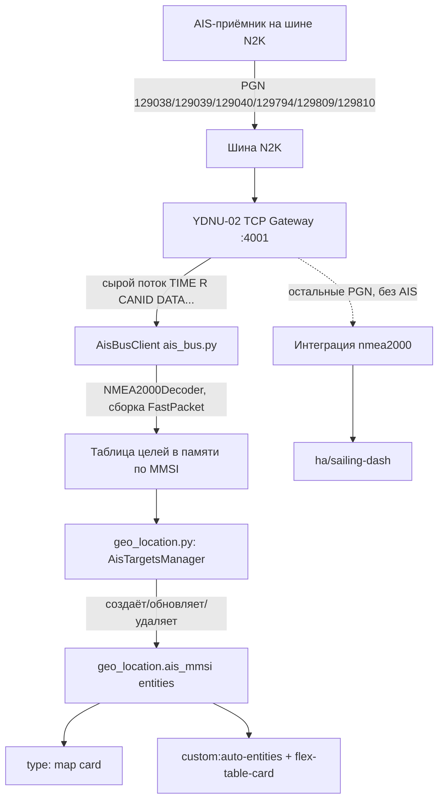

# Архитектура подсистемы AIS

## Обзор

Подсистема AIS (`ha/ais/`) отображает на карте Home Assistant собственную лодку и все цели AIS (другие суда), которые видит подключённый к шине NMEA 2000 AIS-приёмник (Alltek AIS, source address 31).

Ключевое архитектурное решение: **AIS декодируется НЕ через интеграцию `nmea2000`**, а напрямую кастомным компонентом `ais_targets`, который читает сырой TCP-поток шлюза YDNU-02.

## Поток данных



## Почему не через интеграцию `nmea2000`

Изначальный вариант дизайна предполагал чтение AIS-данных из сущностей, уже создаваемых интеграцией `nmea2000` (по аналогии с остальными PGN проекта). Это решение было отклонено, так как:

1. **Замусоривание реестра.** Цели AIS — транзитные объекты: суда появляются и исчезают из зоны видимости приёмника постоянно (особенно в оживлённых бухтах). Если `nmea2000` создаёт устройство и набор `sensor.*` на каждый MMSI, `core.device_registry` и `core.entity_registry` растут бесконтрольно.
2. **Нагрузка на recorder/БД.** История временных сенсоров проходящих судов не имеет практической ценности, но занимает место в базе данных Home Assistant.
3. **Архитектурное несоответствие.** Проходящие суда — это динамические объекты без постоянного адреса на шине (в отличие от датчиков лодки), поэтому им не место в статической конфигурации устройств.

Решение: `ais_targets` подключается к TCP-порту шлюза **напрямую**, минуя `nmea2000`, и декодирует AIS **только в оперативной памяти**. В HA регистрируются исключительно временные сущности `geo_location.ais_<mmsi>`, которые не создают записей в `core.device_registry`/`core.entity_registry` (у `GeolocationEvent` из `ais_targets` намеренно нет `unique_id`).

Для всех **остальных** PGN (навигация, баки, двигатель и т.д.) интеграция `nmea2000` продолжает работать как раньше — исключение сделано только для AIS PGN, которые явно выведены из `pgn_include` и помечены флагом `exclude_AIS = True` (см. `deployment_and_ops.md`).

## Компонент `AisBusClient` (`ais_bus.py`)

### Формат кадра

Шлюз YDNU-02 транслирует сырые CAN-кадры в текстовом виде, идентичном формату, который разбирает `ydnu02/pgn_decoder.py`:

```
HH:MM:SS.mmm R <CANID_HEX> <DATA_BYTE_HEX>...
```

### Логика работы

1. **Подключение по TCP** к `gw_host:gw_port` (настраивается через Config Flow, по умолчанию `127.0.0.1:4001`).
2. **Дешёвый предварительный фильтр**: из CAN ID разбираются `pgn` и `source`; кадры, чей PGN не входит в список декодируемых AIS PGN, отбрасываются немедленно — это не позволяет нагрузке шины сказываться на CPU HA, даже при высокой загруженности сети.
3. **Сборка FastPacket**: только кадры интересующих PGN передаются в `nmea2000.NMEA2000Decoder` — единственный (stateful) экземпляр на клиента, повторно используемый между вызовами, что необходимо для правильной пересборки многофреймовых (FastPacket) сообщений.
4. **Разбор в таблицу по MMSI**: декодированное сообщение группируется по значению поля `userId` (MMSI); для позиционных PGN (129038/129039/129040) обновляются координаты/скорость/курс, для статических PGN (129794/129809/129810 и частично 129040) — статические поля судна.

### Автоматическое переподключение

Клиент реализует экспоненциальный бэкофф при разрыве соединения:
- Начальная задержка: 2 секунды (`_RECONNECT_MIN`).
- Максимальная задержка: 30 секунд (`_RECONNECT_MAX`).
- При каждой неудачной попытке задержка удваивается вплоть до максимума.
- При успешном подключении задержка сбрасывается на минимум.

Ошибки подключения не приводят к падению интеграции — они логируются (`_LOGGER.warning`) и клиент продолжает попытки переподключения в фоне.

## Управление памятью и таймаутами (`geo_location.py`)

`AisTargetsManager` периодически (по умолчанию каждые 5 секунд, `update_interval`) считывает снимок (`snapshot()`) таблицы целей из `AisBusClient` и:

1. Создаёт сущность `geo_location.ais_<mmsi>` для каждой новой цели, у которой уже есть координаты (`has_position`).
2. Обновляет существующие сущности новыми данными без создания новых объектов (`update_from_reading`).
3. **Отбрасывает устаревшие цели**: если `last_seen` цели старше, чем `stale_timeout` (по умолчанию 10 минут) назад — сущность удаляется из HA (`async_remove(force_remove=True)`) и из таблицы клиента (`client.drop(mmsi)`), освобождая память.

Такое поведение полностью соответствует принятому в HA core паттерну для `geo_location`-платформ, обслуживающих динамические/временные источники данных (аналогично `adsb`/`opensky`).

## Собственное судно (own ship)

Собственный AIS-передатчик лодки также транслирует сообщения о своей позиции на шину (как обычная AIS-цель). Вместо использования отдельного `device_tracker.nevera` (GPS), собственное судно опционально идентифицируется по полю `own_mmsi` в конфигурации интеграции — см. `integration_spec.md`.

## Связанные документы

- [`pgn_specifications.md`](./pgn_specifications.md) — детальная спецификация PGN и конвертация полей.
- [`integration_spec.md`](./integration_spec.md) — устройство компонента `ais_targets`.
- [`dashboard_spec.md`](./dashboard_spec.md) — карта и таблица целей.
- [`deployment_and_ops.md`](./deployment_and_ops.md) — деплой, провижининг, диагностика.
