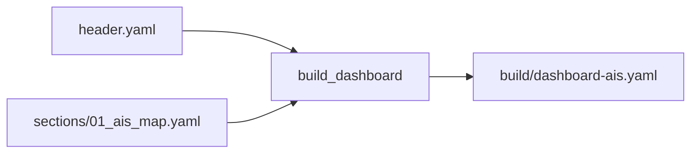
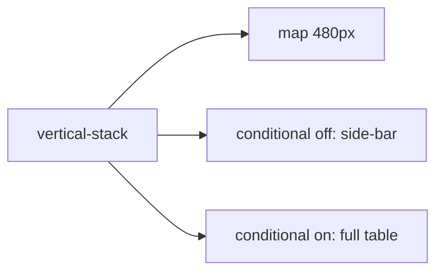

# Спецификация дашборда и интерфейса AIS

## Обзор

Дашборд AIS — отдельный Lovelace-вид Home Assistant (`lovelace.dashboard_ais`), состоящий из карты со всеми целями AIS и своим судном, а также полной кликабельной таблицы деталей по каждой цели. Дашборд собирается статически из YAML-исходников пайплайном `helpers/build.py` и деплоится идемпотентно скриптом `deploy.sh`.

## Структура исходников

```
ha/ais/src/yaml/dashboard/
├── header.yaml                       — заголовок вида (title, icon, max_columns)
└── sections/
    └── 01_ais_map.yaml               — карта + таблица целей (единственная секция)
```

## Пайплайн сборки (`helpers/build.py`)



### Единственный источник правды — YAML-шаблоны

`src/yaml/dashboard/header.yaml` и `src/yaml/dashboard/sections/*.yaml` — **единственный источник правды** для структуры и стилей: раскладка, геометрия оверлея, набор колонок таблицы, все стили `card_mod`/`css`.

`helpers/build.py` делает ровно две вещи:

1. подставляет явные плейсхолдеры `${AIS_*}`, объявленные самими шаблонами, значениями из `config.yaml` (дефолты — в `config.yaml.template`); неизвестный плейсхолдер — ошибка сборки, а не тихое игнорирование;
2. склеивает `header.yaml` + `sections/*.yaml` (в алфавитном порядке) в `views[0].cards` и пишет `build/dashboard-ais.yaml` (одноразовый артефакт, руками не правится).

Скрипт **не имеет права** ничего генерировать, дописывать или «нормализовать» внутри карточек. Ранняя версия генерировала целые `card_mod`-блоки и колонки таблицы из `config.yaml` и молча затирала содержимое шаблонов: любая ручная правка в `src/yaml/**` исчезала при следующем деплое (симптом — «отредактировал локально, задеплоил, а на stage старая карточка»). Возвращать эту логику нельзя.

### Опции `config.yaml` и их плейсхолдеры

| Ключ | Плейсхолдер | Назначение |
|---|---|---|
| `map.default_zoom` | `${AIS_MAP_ZOOM}` | начальный зум карты |
| `map.height` | `${AIS_MAP_HEIGHT}` | высота карты (CSS-длина, по умолчанию `calc(100vh - 104px)`) |
| `table.default_sort` | `${AIS_SORT_BY}` | сортировка таблицы по умолчанию (напр. `state+`) |
| `table.visible_rows` × `row_height_px` | `${AIS_ROWS_SCROLL_PX}` | сколько строк видно в полной таблице до скролла |
| `table.collapsed_visible_rows` × `row_height_px` | `${AIS_ROWS_SCROLL_COMPACT_PX}` | то же для компактного сайдбара |

### Важное архитектурное ограничение

`own_mmsi` **намеренно не читается** в `build.py` — единственный источник правды для этого значения — конфигурация интеграции `ais_targets` (Config Flow), а не build-time YAML. Это устраняет риск рассинхронизации между временем сборки дашборда и временем выполнения интеграции (см. `integration_spec.md`).

## Конфигурация вида (`header.yaml`)

```yaml
views:
  - type: panel
    title: AIS
    icon: mdi:radar
    cards:
```

`type: panel` — единственный тип вида Lovelace, который рендерит контент по-настоящему от края до края (без центрированной колонки с max-width, как в `sections`/`masonry`). Вид показывает ровно **одну** карточку верхнего уровня, поэтому карта и таблица завёрнуты в единый `vertical-stack`. Высота карты фиксируется через `card_mod`, чтобы «во всю ширину» не означало «во весь экран по высоте».

## Раскладка: карта + таблица-оверлей



- В нормальном потоке лежит **только карта** (высота ограничена вьюпортом, полная ширина контента).
- Список целей рендерится **оверлеем** поверх правой части карты: каждая карточка оверлея позиционируется своим собственным `card_mod` (`:host { position: absolute; top/right; z-index }`), заданным прямо в шаблоне.
- Два взаимоисключающих `conditional`-карточки по состоянию `input_boolean.ais_table_expanded`:
  - **`off` (по умолчанию)** — компактный сайдбар (ширина из `table.collapsed_width`): `Vessel`, `Dist (km)` и `SOG (kn)`.
  - **`on`** — полная таблица со всеми колонками, ширина из `table.width`.

### Габариты оверлея: не шире и не выше окна

Ширина обоих оверлеев задаётся **точно так же, как высота карты** — произвольной CSS-длиной в `config.yaml`:

| Опция | Плейсхолдер | По умолчанию |
| :--- | :--- | :--- |
| `table.width` | `${AIS_TABLE_WIDTH}` | `calc(50vw - 48px)` |
| `table.collapsed_width` | `${AIS_TABLE_COLLAPSED_WIDTH}` | `300px` |
| `table.vessel_column_width` | `${AIS_VESSEL_COL_WIDTH}` | `220px` |

По высоте оверлеи по-прежнему растягиваются **сторонами** (`top: 84px; bottom: 12px`), а не явным `height`, и прижаты к правому краю (`right: 12px`); дополнительный `max-width: calc(100vw - 48px)` гарантирует, что любая заданная ширина не выйдет за 12px-отступы окна.

Контейнер (`custom:mod-card` с `margin: 12px`) сам уже отступает от краёв окна, поэтому оверлей физически не может стать шире или выше окна и всегда сохраняет отступы. Явные `width: calc(100vw - 96px)` / `height: calc(100vh - 96px)` из прежней версии этого не гарантировали: они считались от вьюпорта, а не от контейнера, и при смещении `top: 84px` таблица выходила за нижнюю границу.

### Автоматический горизонтальный скролл

- На внутреннем `ha-card` оверлея задано `max-height: 100%; overflow: auto` — это и даёт скролл по обеим осям.
- В `css` полной таблицы добавлено `"table+": " min-width: ${AIS_TABLE_MIN_WIDTH}px;"` (по умолчанию 1100, опция `table.min_width_px`). Без `min-width` таблица с `width: 100%` просто сжималась, а из-за `white-space: nowrap` содержимое ячеек обрезалось; теперь при нехватке ширины включается горизонтальный скролл.
- Вертикальный скролл тела таблицы дополнительно ограничен вьюпортом: `max-height: min(${AIS_ROWS_SCROLL_PX}px, calc(100vh - 260px))`.
- Переключатель разворачивания — карточка `entities` с самим `input_boolean.ais_table_expanded` в шапке оверлея (присутствует в обоих состояниях). Хелпер создаётся идемпотентно скриптом `helpers/provision_helpers.py` в `.storage/input_boolean` при `deploy.sh --install`.
- **Важно про имя хелпера:** Home Assistant формирует `entity_id` из *отображаемого имени*, а не из `id`, поэтому имя обязано быть `AIS table expanded` → `input_boolean.ais_table_expanded`. Ранняя версия использовала имя `AIS Targets`, из-за чего создавался `input_boolean.ais_targets`, оба `conditional` никогда не срабатывали и **оверлей был полностью невидим**. Переименование само по себе не лечит уже зарегистрированный хелпер (его `entity_id` закреплён в `core.entity_registry`), поэтому `provision_helpers.py --entity-registry` удаляет неверную запись, и HA пересоздаёт её корректно при старте.
- Свёрнутое состояние проверяется через `state_not: "on"` (а не `state: "off"`), чтобы сайдбар отображался и в момент, когда хелпер ещё недоступен.
- **Отступы и высота.** Внешний `card_mod` добавляет `margin: 12px` (у `panel`-вида нет собственных отступов, без этого карта прилипала к краям окна), а высота карты ограничивается вьюпортом (`calc(100vh - 104px)`) — фиксированная высота делала страницу выше окна и включала вертикальный скролл браузера. Все эти значения заданы в шаблоне `01_ais_map.yaml`.

## Карточка карты (`type: map`)

```yaml
- type: map
  entities:
    - entity: device_tracker.nevera
  geo_location_sources:
    - ais_targets
  default_zoom: 12
  card_mod:
    style: |
      :host { display: block; height: calc(100vh - 104px); }
      ha-card { height: 100%; }
      #root { padding-bottom: 0 !important; height: 100% !important; }
      ha-map { height: 100% !important; }
```

- **`entities: [device_tracker.nevera]`** — GPS-трекер собственной лодки (fallback, работает одновременно с AIS-целью собственного судна).
- **`geo_location_sources: ['ais_targets']`** — все AIS-цели, включая собственное судно (единый `source`, см. `integration_spec.md`).
- **`card_mod.style`** — фиксирует высоту карточки и внутреннего DOM-элемента `ha-map` (значение задано в шаблоне).

## Таблица целей (`custom:flex-table-card`)

### Почему именно так

| Подход | Проблема |
|---|---|
| Нативная markdown-таблица (Jinja) | DOMPurify/marked.js фильтрует инлайн-`onclick`, клик по строке не работал; отсутствие trim-модификаторов в Jinja ломало GFM-таблицу. |
| Нативная карточка `entities` | Только один state + одна вторичная строка на сущность — не хватает колонок. |
| `custom:auto-entities` + `custom:flex-table-card` | `auto-entities` при **каждом** изменении набора целей заново вызывал `setConfig()` внутренней карточки, из-за чего пересоздавалась таблица и **сбрасывалась сортировка**, выбранная пользователем кликом по заголовку. |
| `custom:flex-table-card` напрямую (текущее решение) | Карточка сама умеет `entities: include: geo_location.ais_*` (wildcard-регексп внутри `_getEntities()`), поэтому `setConfig()` вызывается один раз, а сортировка живёт в экземпляре и **сохраняется**. |

### Конфигурация

```yaml
- type: custom:flex-table-card
  entities:
    include: geo_location.ais_*
  strict: true
  clickable: true
  sort_by: state+
  columns: [... см. ниже ...]
```

- **`entities.include`** — маска по `entity_id`: новые/исчезающие цели подхватываются автоматически.
- **`strict: true`** — скрывает строки с пустой ячейкой, то есть «призраков» — восстановленные (`restored`/`unavailable`) записи реестра без атрибутов, оставшиеся от прежних версий интеграции.
- **`clickable: true`** — клик по строке открывает нативный more-info выбранной цели с мини-картой (центрирование на судне).
- **`sort_by: ${AIS_SORT_BY}`** — сортировка по умолчанию из `config.yaml` (штатно `state+` — по расстоянию, state сущности = дистанция в км); клик по заголовку меняет сортировку и она сохраняется до перезагрузки страницы.
- **Скролл вместо обрезания.** Видно `table.visible_rows` строк, остальные доступны прокруткой: `css.tbody` делает тело таблицы собственным скролл-контейнером (`display: block; max-height; overflow-y: auto`), а `thead, tbody tr { display: table; table-layout: fixed }` сохраняет выравнивание колонок. Штатный `max_rows` карточки **не используется** — он обрезает лишние цели, а не скроллит их.
- **Однострочные ячейки.** `css` дописывает (суффикс `+` — режим append к дефолтному стилю карточки) `white-space: nowrap` для `tr td`/`th`, чтобы длинные имена судов не переносились на вторую строку.
- **Своя лодка** — обычная строка таблицы с тем же `geo_location.ais_<mmsi>`; отличается только иконкой ⛵ в начале имени (без подписи «Own Boat»), которую ставит интеграция при совпадении MMSI с `own_mmsi`.

### Колонки таблицы (заданы в шаблоне)

Список колонок целиком лежит в `sections/01_ais_map.yaml` — добавление/удаление/переупорядочивание колонок делается там. `data` — **плоский** ключ (не путь `attributes.x`): карточка резолвит `name`/`state`/... специальным образом, затем как член сущности, затем как `entity.attributes[key]`.

| Колонка | `data` |
|---|---|
| Vessel | `name` |
| Dist (km) | `state` |
| SOG (kn) | `sog` — сразу после расстояния (скорость цели читается вместе с дистанцией) |
| MMSI | `mmsi` |
| Callsign | `callsign` |
| Type | `ship_type` |
| Length (m) | `length` |
| Beam (m) | `beam` |
| Destination | `destination` |
| COG (°) | `cog` |
| Heading (°) | `heading` |
| Nav Status | `nav_status` |
| Updated | `last_seen` — **локальное** время `HH:MM:SS` (машиночитаемый UTC ISO остаётся в `last_seen_iso`) |

## Зависимости Lovelace-карточек

| Карточка | Репозиторий | Способ получения |
|---|---|---|
| `custom:flex-table-card` | `custom-cards/flex-table-card` | `github_raw`, версия зафиксирована в `ha/sailing-dash/deps.yaml` |
| `custom:auto-entities` | `thomasloven/lovelace-auto-entities` | `github_raw`; дашбордом больше не используется, но ресурс остаётся зарегистрированным |
| `card-mod` | — | нужен для оверлея и фиксированной высоты карты; уже присутствует на инстансе из `sailing-dash` |

Зависимости пинятся по версии/тегу в `ha/sailing-dash/deps.yaml` (ресурсы Lovelace общие для инстанса HA), а `ha/ais/deploy.sh` сам скачивает и регистрирует их (`deploy_card_deps()`).

## Связанные документы

- [`architecture.md`](./architecture.md) — общая архитектура и обоснование дизайна.
- [`integration_spec.md`](./integration_spec.md) — источник атрибутов, отображаемых в таблице.
- [`deployment_and_ops.md`](./deployment_and_ops.md) — деплой карточек и дашборда.

### Почему оверлей обёрнут в `custom:mod-card`

**card-mod не умеет стилизовать stack-карточки.** В `card-mod.js` нет ни одного упоминания `hui-*-stack-card` — библиотека хукается только на `ha-card`, `hui-card`, `hui-entities-card`, `hui-conditional-row`, `hui-picture-elements-card`, `hui-section`, `hui-view` и т.п. Поэтому `card_mod`, повешенный напрямую на внешний `vertical-stack`, **молча игнорировался**: не появлялись ни внешние отступы (`margin: 12px`), ни позиционирование оверлея (`#root > *:nth-child(2)`) — таблица просто оставалась в обычном потоке под картой.

Актуальная схема:

- Внешний контейнер — `custom:mod-card` (карточка идёт в составе `card-mod.js`): она рендерит собственный настоящий `<ha-card>` вокруг любой вложенной карточки, поэтому `card_mod` к ней применяется гарантированно. На нём заданы `position: relative` (offset-родитель оверлея) и `margin: 12px` (внешние отступы).
- Внутри — обычный `vertical-stack` без какого-либо `card_mod`.
- Карта остаётся в нормальном потоке и задаёт высоту контейнера (`calc(100vh - 104px)`).
- Тумблер и обе таблицы позиционируются `position: absolute` **своим собственным** `card_mod` — это реальные `ha-card`, к которым card-mod применяется штатно. Никакой зависимости от порядка детей (`nth-child`) внутри shadow root стека больше нет, поэтому раскладка не «съезжает» при перерисовке набора целей.
- Вся геометрия задана инлайн в шаблоне `01_ais_map.yaml`.

### Почему оверлеи позиционируются через `:host`, а не через `ha-card`

card-mod внедряет свой `<style>` **в shadow root самой карточки**, поэтому селектор `ha-card` стилизует только внутреннюю обёртку, а сам элемент карточки (`hui-tile-card`, `flex-table-card`) и его контейнер `hui-card` остаются в потоке flex-колонки `vertical-stack` (по исходникам HA: `:host { display:flex; flex-direction:column; height:100% }`, `#root { flex:1 }`). Последствия ровно те, что наблюдались:

- обёртки продолжали резервировать высоту под таблицей → страница становилась выше окна и включался вертикальный скролл браузера;
- карточка переключателя растягивалась колонкой на всю доступную высоту.

Правильный способ — `:host { position: absolute; ... }`: из потока выносится **вся** карточка, обёртка `hui-card` схлопывается в ноль, а внутреннему `ha-card` остаётся только роль скролл-контейнера (`max-height: 100%; overflow: auto`).

Дополнительно:
- переключатель — карточка `tile` (компактная строка с нативным тумблером) вместо громоздкой `entities`;
- высота карты — `calc(100vh - 104px)`: 56px верхней панели + строка табов + оба отступа по 12px, с небольшим запасом (пары лишних пикселей достаточно, чтобы скролл вернулся);
- на контейнере `custom:mod-card` добавлен `overflow: hidden`, чтобы оверлей не мог вылезти за пределы карточки.

### Чому карта була гігантською і сторінка скролилась

`hui-map-card._computePadding()` (джерело HA frontend) виставляє **інлайновий** `#root { padding-bottom: 100% }`, якщо карточка не є прямим дитям panel/grid-розкладки. Наша карта живе всередині `vertical-stack`, тож `layout` не дорівнює `panel` — карта робила себе **квадратною по своїй ширині**: на edge-to-edge панелі це ≈ ширина вікна по висоті, звідси вертикальний скрол браузера. Додатково попередній `card_mod` націлювався на `#map`, якого не існує (елемент називається `ha-map`), тому нічого не застосовувалось.

Робочий стиль карти:
```
:host { display: block; height: calc(100vh - 104px); }
ha-card { height: 100%; }
#root { padding-bottom: 0 !important; height: 100% !important; }
ha-map { height: 100% !important; }
```

### Подпись маркера на карте

По умолчанию `ha-map` подписывает маркер `geo_location` **инициалами** имени (первые буквы слов, максимум 3 символа) — то есть ни имени, ни данных о судне на карте фактически не видно. Читаемую подпись даёт только режим `label_mode: attribute`, поэтому источник карты задан объектом:

```yaml
geo_location_sources:
  - source: ais_targets
    label_mode: attribute
    attribute: map_label
```

Атрибут `map_label` формирует интеграция (`AisTarget._map_label()`) в виде `имя · SOG kn · длина m`. Недоступные поля просто опускаются (на карте не должно быть прочерков), ширина/beam в подпись намеренно не входит — по требованию только длина.

### Ширина колонки с именем судна

Таблица использует `table-layout: fixed` (это необходимо, чтобы колонки шапки и тела оставались выровненными, пока тело скроллится). Побочный эффект: ширина делится **равномерно** между колонками, поэтому длинные имена судов обрезались.

Колонке имени задана собственная ширина через `thead th:first-child, tbody td:first-child` — значение берётся из `table.vessel_column_width` (плейсхолдер `${AIS_VESSEL_COL_WIDTH}`, по умолчанию `220px`). Указывается и `width`, и `min-width`: при фиксированной раскладке один `min-width` игнорируется.

### Расстояние до цели: отсчёт от нашей лодки

`AisTarget._distance_km()` считает расстояние от **живой позиции нашей лодки**, а не от домашних координат Home Assistant (на движущейся лодке это бессмысленная точка отсчёта — именно поэтому колонка `Dist (km)` показывала непонятные значения).

Приоритет источника точки отсчёта (`AisTargetsManager.own_position()`):
1. **Собственный GNSS-фикс прямо с шины** — PGN 129029 (GNSS Position Data), при его отсутствии PGN 129025 (Position Rapid Update). Это точные координаты приёмников с антеннами под открытым небом, декодируются тем же `AisBusClient` (поле `own_position`).
2. AIS-цель с MMSI из `own_mmsi` — фолбэк (собственное AIS-сообщение).
3. Иначе расстояние **не показывается вообще**.

`device_tracker.nevera` в качестве источника **не используется**: это HA-шаблон, который получает тот же самый фикс через интеграцию `nmea2000` плюс удержание последней позиции, и на prod он публиковал частичный фикс (`longitude 0.0`), из-за чего все цели оказывались в ~1500 км. Домашние координаты Home Assistant тоже не используются — на движущейся лодке это бессмысленная точка отсчёта.
