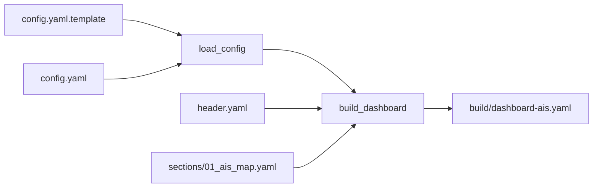

# Спецификация дашборда и интерфейса AIS

## Обзор

Дашборд AIS — отдельный Lovelace-вид Home Assistant (`lovelace.dashboard_ais`), состоящий из карты со всеми целями AIS и своим судном, а также полной кликабельной таблицы деталей по каждой цели. Дашборд собирается статически из YAML-исходников пайплайном `helpers/build.py` и деплоится идемпотентно скриптом `deploy.sh`.

## Структура исходников

```
ha/ais/src/yaml/dashboard/
├── header.yaml                       — заголовок вида (title, icon, max_columns)
└── sections/
    └── 01_ais_map.yaml               — карта + таблица целей (единственная секция)
```

## Пайплайн сборки (`helpers/build.py`)



1. **`load_config()`** читает `config.yaml.template` (значения по умолчанию), затем переопределяет их значениями из `config.yaml`, если он существует (аналогично конвенции `ha/sailing-dash`).
2. **`build_dashboard()`**:
   - Загружает `header.yaml` (заголовок вида).
   - Проходит по всем файлам `sections/*.yaml` в алфавитном порядке.
   - Для карточки с `id: map` (тип `type: map`) подставляет `default_zoom` и стиль `card_mod` с фиксированной высотой (`height_px`, по умолчанию 480px) из `config.yaml`.
   - Для карточки с `id: detail_list` (тип `type: custom:auto-entities`) подставляет во вложенную карточку `flex-table-card` список колонок, сгенерированный из `detail_fields` конфигурации (`build_columns()`).
   - Поле `id` удаляется из итогового YAML (`card.pop("id", None)`) — это чисто служебная метка для build-скрипта, HA её не использует.
   - Результат записывается в `build/dashboard-ais.yaml`.

### Важное архитектурное ограничение

`own_mmsi` **намеренно не читается** в `build.py` — единственный источник правды для этого значения — конфигурация интеграции `ais_targets` (Config Flow), а не build-time YAML. Это устраняет риск рассинхронизации между временем сборки дашборда и временем выполнения интеграции (см. `integration_spec.md`).

## Конфигурация сетки (`header.yaml`)

```yaml
views:
  - type: sections
    title: AIS
    icon: mdi:radar
    max_columns: 1
    sections:
```

`max_columns: 1` в сочетании с `grid_options: columns: full` на обеих карточках заставляет карту и таблицу занимать **всю ширину контента** дашборда (не «панельный» полноэкранный режим `type: panel`, а полноширинная секция), но при этом карта имеет фиксированную, а не бесконечную высоту — это решает проблему прежней версии, где карта растягивалась на весь экран.

## Карточка карты (`type: map`)

```yaml
- id: map
  type: map
  entities:
    - entity: device_tracker.nevera
  geo_location_sources:
    - ais_targets
  default_zoom: 12
  grid_options:
    columns: full
  card_mod:
    style: |
      ha-card { height: 480px; }
      #map { height: 480px !important; }
```

- **`entities: [device_tracker.nevera]`** — GPS-трекер собственной лодки (fallback-механизм; сохраняется одновременно с AIS-целью для собственного судна).
- **`geo_location_sources: ['ais_targets']`** — отображает **все** AIS-цели (кроме собственного судна, помеченного отдельным `source`, см. `integration_spec.md`), динамически появляющиеся/исчезающие как сущности `geo_location.ais_<mmsi>`.
- **`grid_options.columns: full`** — карточка растягивается на всю ширину секции (полную ширину контента дашборда).
- **`card_mod.style`** — фиксирует высоту карточки и внутреннего DOM-элемента карты (`#map`) в пикселях (`height_px` из `config.yaml`, по умолчанию 480px), чтобы карта не разрасталась на весь экран.

## Таблица целей (`custom:auto-entities` + `custom:flex-table-card`)

### Почему две вложенные карточки, а не одна

Ни одна из зависимостей не была выбрана произвольно — это результат нескольких итераций:

| Подход | Проблема |
|---|---|
| Нативная markdown-таблица (Jinja) | DOMPurify/marked.js в HA фильтрует инлайн-`onclick`, поэтому клик по строке не работал; кроме того, отсутствие `-` (trim) в Jinja-тегах ломало непрерывность GFM-таблицы. |
| Нативная карточка `entities` | Может показать только один state + одну вторичную строку на сущность — недостаточно колонок для полного набора AIS-полей. |
| `custom:auto-entities` + `custom:flex-table-card` (текущее решение) | `auto-entities` обнаруживает изменяющийся список `geo_location.ais_*` в рантайме (список судов заранее не известен), `flex-table-card` рендерит многоколоночную таблицу с нативной кликабельностью строк (открывает more-info с мини-картой судна). |

### Конфигурация

```yaml
- id: detail_list
  type: custom:auto-entities
  grid_options:
    columns: full
  card:
    type: custom:flex-table-card
    title: AIS Targets
    clickable: true
    sort_by: name+
    columns: [... см. ниже ...]
  filter:
    include:
      - entity_id: "geo_location.ais_*"
    exclude: []
```

- **`filter.include`** — маска по `entity_id` (`geo_location.ais_*`), а не жёстко заданный список: новые/исчезающие цели подхватываются автоматически без пересборки/передеплоя.
- **`clickable: true`** — клик по строке таблицы открывает нативный диалог more-info выбранной сущности `geo_location.ais_<mmsi>`, который включает мини-карту с позицией именно этого судна («центрирование на цели»).
- **`sort_by: name+`** — сортировка по алфавиту (по имени/friendly_name).

### Колонки таблицы (генерируются `build_columns()`)

Итоговый набор колонок = `friendly_name` + сконфигурированные `detail_fields` + всегда присутствующие навигационные колонки (`ALWAYS_TRAILING_FIELDS`), без дублей:

| Колонка | Источник | Атрибут |
|---|---|---|
| Vessel | всегда | `friendly_name` |
| MMSI | `detail_fields` (по умолчанию) | `mmsi` |
| Name | `detail_fields` (по умолчанию) | `vessel_name` |
| Callsign | `detail_fields` (по умолчанию) | `callsign` |
| Type | `detail_fields` (по умолчанию) | `ship_type` |
| Length (m) | `detail_fields` (по умолчанию) | `length` |
| Beam (m) | `detail_fields` (по умолчанию) | `beam` |
| Destination | `detail_fields` (по умолчанию) | `destination` |
| SOG (kn) | всегда (`ALWAYS_TRAILING_FIELDS`) | `sog` |
| COG (°) | всегда | `cog` |
| Heading (°) | всегда | `heading` |
| Nav Status | всегда | `nav_status` |
| Last Seen | всегда | `last_seen` |

Список `detail_fields` настраивается в `config.yaml` (по умолчанию — `DEFAULT_DETAIL_FIELDS` в `build.py`), последние 5 навигационных колонок присутствуют **всегда**, независимо от конфигурации, чтобы таблица никогда не «теряла» ключевые данные о движении цели.

## Зависимости Lovelace-карточек

| Карточка | Репозиторий | Способ получения |
|---|---|---|
| `custom:auto-entities` | `thomasloven/lovelace-auto-entities` | `github_raw` (у репозитория нет release-ассетов) |
| `custom:flex-table-card` | (аналогично) | `github_raw`, версия зафиксирована в `ha/sailing-dash/deps.yaml` |

Обе зависимости пинятся по конкретной версии/тегу в `ha/sailing-dash/deps.yaml` (общие ресурсы Lovelace для инстанса HA), а `ha/ais/deploy.sh` самостоятельно скачивает и регистрирует их (`deploy_card_deps()`) — пакет `ha/ais` не требует отдельного деплоя `ha/sailing-dash` для их появления (см. `deployment_and_ops.md`).

## Связанные документы

- [`architecture.md`](./architecture.md) — общая архитектура и обоснование дизайна.
- [`integration_spec.md`](./integration_spec.md) — источник атрибутов, отображаемых в таблице.
- [`deployment_and_ops.md`](./deployment_and_ops.md) — деплой карточек и дашборда.
