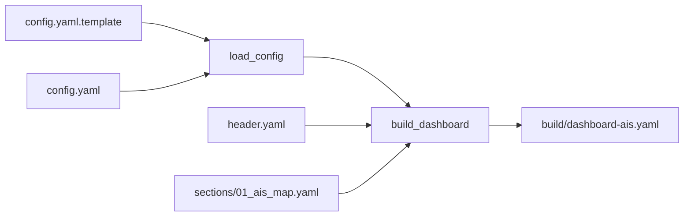
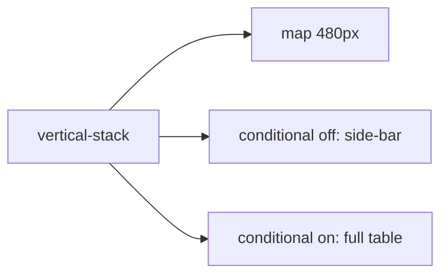

# Спецификация дашборда и интерфейса AIS

## Обзор

Дашборд AIS — отдельный Lovelace-вид Home Assistant (`lovelace.dashboard_ais`), состоящий из карты со всеми целями AIS и своим судном, а также полной кликабельной таблицы деталей по каждой цели. Дашборд собирается статически из YAML-исходников пайплайном `helpers/build.py` и деплоится идемпотентно скриптом `deploy.sh`.

## Структура исходников

```
ha/ais/src/yaml/dashboard/
├── header.yaml                       — заголовок вида (title, icon, max_columns)
└── sections/
    └── 01_ais_map.yaml               — карта + таблица целей (единственная секция)
```

## Пайплайн сборки (`helpers/build.py`)



1. **`load_config()`** читает `config.yaml.template` (значения по умолчанию), затем переопределяет их значениями из `config.yaml`, если он существует (аналогично конвенции `ha/sailing-dash`).
2. **`build_dashboard()`**:
   - Загружает `header.yaml` (заголовок вида).
   - Проходит по всем файлам `sections/*.yaml` в алфавитном порядке.
   - Для карточки с `id: map` (тип `type: map`) подставляет `default_zoom` и стиль `card_mod` с фиксированной высотой (`height_px`, по умолчанию 480px) из `config.yaml`.
   - Для карточки с `id: detail_list` (тип `type: custom:auto-entities`) подставляет во вложенную карточку `flex-table-card` список колонок, сгенерированный из `detail_fields` конфигурации (`build_columns()`).
   - Поле `id` удаляется из итогового YAML (`card.pop("id", None)`) — это чисто служебная метка для build-скрипта, HA её не использует.
   - Результат записывается в `build/dashboard-ais.yaml`.

### Важное архитектурное ограничение

`own_mmsi` **намеренно не читается** в `build.py` — единственный источник правды для этого значения — конфигурация интеграции `ais_targets` (Config Flow), а не build-time YAML. Это устраняет риск рассинхронизации между временем сборки дашборда и временем выполнения интеграции (см. `integration_spec.md`).

## Конфигурация вида (`header.yaml`)

```yaml
views:
  - type: panel
    title: AIS
    icon: mdi:radar
    cards:
```

`type: panel` — единственный тип вида Lovelace, который рендерит контент по-настоящему от края до края (без центрированной колонки с max-width, как в `sections`/`masonry`). Вид показывает ровно **одну** карточку верхнего уровня, поэтому карта и таблица завёрнуты в единый `vertical-stack`. Высота карты фиксируется через `card_mod`, чтобы «во всю ширину» не означало «во весь экран по высоте».

## Раскладка: карта + таблица-оверлей



- В нормальном потоке лежит **только карта** (фиксированная высота `height_px`, по умолчанию 480px, полная ширина контента).
- Список целей рендерится **оверлеем** поверх правой части карты. `card_mod` на внешнем `vertical-stack` делает контейнер `position: relative`, а 2-й и 3-й дочерние элементы — `position: absolute; top: 12px; right: 12px; z-index: 1` с `max-height: height_px - 24` и `overflow: auto` (стиль генерируется `overlay_style()` в `build.py`).
- Два взаимоисключающих `conditional`-карточки по состоянию `input_boolean.ais_table_expanded`:
  - **`off` (по умолчанию)** — компактный сайдбар шириной 300px: только `Vessel` и `Dist (km)`.
  - **`on`** — полная таблица шириной `min(1100px, calc(100vw - 48px))` со всеми колонками.
- Переключатель разворачивания — карточка `entities` с самим `input_boolean.ais_table_expanded` в шапке оверлея (присутствует в обоих состояниях). Хелпер создаётся идемпотентно скриптом `helpers/provision_helpers.py` в `.storage/input_boolean` при `deploy.sh --install`.
- **Важно про имя хелпера:** Home Assistant формирует `entity_id` из *отображаемого имени*, а не из `id`, поэтому имя обязано быть `AIS table expanded` → `input_boolean.ais_table_expanded`. Ранняя версия использовала имя `AIS Targets`, из-за чего создавался `input_boolean.ais_targets`, оба `conditional` никогда не срабатывали и **оверлей был полностью невидим**. Переименование само по себе не лечит уже зарегистрированный хелпер (его `entity_id` закреплён в `core.entity_registry`), поэтому `provision_helpers.py --entity-registry` удаляет неверную запись, и HA пересоздаёт её корректно при старте.
- Свёрнутое состояние проверяется через `state_not: "on"` (а не `state: "off"`), чтобы сайдбар отображался и в момент, когда хелпер ещё недоступен.
- **Отступы и высота.** Внешний `card_mod` добавляет `margin: 12px` (у `panel`-вида нет собственных отступов, без этого карта прилипала к краям окна), а высота карты ограничивается вьюпортом: `min(height_px, calc(100vh - 80px))` — фиксированная высота делала страницу выше окна и включала вертикальный скролл браузера. Стиль генерируется `map_height_css()`/`overlay_style()` в `build.py`.

## Карточка карты (`type: map`)

```yaml
- id: map
  type: map
  entities:
    - entity: device_tracker.nevera
  geo_location_sources:
    - ais_targets
  default_zoom: 12
  card_mod:
    style: |
      ha-card { height: 480px; }
      #map { height: 480px !important; }
```

- **`entities: [device_tracker.nevera]`** — GPS-трекер собственной лодки (fallback, работает одновременно с AIS-целью собственного судна).
- **`geo_location_sources: ['ais_targets']`** — все AIS-цели, включая собственное судно (единый `source`, см. `integration_spec.md`).
- **`card_mod.style`** — фиксирует высоту карточки и внутреннего DOM-элемента `#map` (`height_px` из `config.yaml`).

## Таблица целей (`custom:flex-table-card`)

### Почему именно так

| Подход | Проблема |
|---|---|
| Нативная markdown-таблица (Jinja) | DOMPurify/marked.js фильтрует инлайн-`onclick`, клик по строке не работал; отсутствие trim-модификаторов в Jinja ломало GFM-таблицу. |
| Нативная карточка `entities` | Только один state + одна вторичная строка на сущность — не хватает колонок. |
| `custom:auto-entities` + `custom:flex-table-card` | `auto-entities` при **каждом** изменении набора целей заново вызывал `setConfig()` внутренней карточки, из-за чего пересоздавалась таблица и **сбрасывалась сортировка**, выбранная пользователем кликом по заголовку. |
| `custom:flex-table-card` напрямую (текущее решение) | Карточка сама умеет `entities: include: geo_location.ais_*` (wildcard-регексп внутри `_getEntities()`), поэтому `setConfig()` вызывается один раз, а сортировка живёт в экземпляре и **сохраняется**. |

### Конфигурация

```yaml
- id: detail_list
  type: custom:flex-table-card
  entities:
    include: geo_location.ais_*
  strict: true
  clickable: true
  sort_by: state+
  columns: [... см. ниже ...]
```

- **`entities.include`** — маска по `entity_id`: новые/исчезающие цели подхватываются автоматически.
- **`strict: true`** — скрывает строки с пустой ячейкой, то есть «призраков» — восстановленные (`restored`/`unavailable`) записи реестра без атрибутов, оставшиеся от прежних версий интеграции.
- **`clickable: true`** — клик по строке открывает нативный more-info выбранной цели с мини-картой (центрирование на судне).
- **`sort_by: state+`** — начальная сортировка по расстоянию (state сущности = дистанция в км); клик по любому заголовку меняет сортировку и она сохраняется до перезагрузки страницы.

### Колонки таблицы (генерируются `build_columns()`)

Итоговый набор = `name` + `state` + сконфигурированные `detail_fields` + всегда присутствующие навигационные колонки (`ALWAYS_TRAILING_FIELDS`), без дублей. `data` — **плоский** ключ (не путь `attributes.x`): карточка резолвит `name`/`state`/... специальным образом, затем как член сущности, затем как `entity.attributes[key]`.

| Колонка | Источник | `data` |
|---|---|---|
| Vessel | всегда | `name` |
| Dist (km) | всегда | `state` |
| MMSI | `detail_fields` | `mmsi` |
| Name | `detail_fields` | `vessel_name` |
| Callsign | `detail_fields` | `callsign` |
| Type | `detail_fields` | `ship_type` |
| Length (m) | `detail_fields` | `length` |
| Beam (m) | `detail_fields` | `beam` |
| Destination | `detail_fields` | `destination` |
| SOG (kn) | всегда | `sog` |
| COG (°) | всегда | `cog` |
| Heading (°) | всегда | `heading` |
| Nav Status | всегда | `nav_status` |
| Updated | всегда | `last_seen` — **локальное** время `HH:MM:SS` (машиночитаемый UTC ISO остаётся в `last_seen_iso`) |

## Зависимости Lovelace-карточек

| Карточка | Репозиторий | Способ получения |
|---|---|---|
| `custom:flex-table-card` | `custom-cards/flex-table-card` | `github_raw`, версия зафиксирована в `ha/sailing-dash/deps.yaml` |
| `custom:auto-entities` | `thomasloven/lovelace-auto-entities` | `github_raw`; дашбордом больше не используется, но ресурс остаётся зарегистрированным |
| `card-mod` | — | нужен для оверлея и фиксированной высоты карты; уже присутствует на инстансе из `sailing-dash` |

Зависимости пинятся по версии/тегу в `ha/sailing-dash/deps.yaml` (ресурсы Lovelace общие для инстанса HA), а `ha/ais/deploy.sh` сам скачивает и регистрирует их (`deploy_card_deps()`).

## Связанные документы

- [`architecture.md`](./architecture.md) — общая архитектура и обоснование дизайна.
- [`integration_spec.md`](./integration_spec.md) — источник атрибутов, отображаемых в таблице.
- [`deployment_and_ops.md`](./deployment_and_ops.md) — деплой карточек и дашборда.

### Почему оверлей обёрнут в `custom:mod-card`

**card-mod не умеет стилизовать stack-карточки.** В `card-mod.js` нет ни одного упоминания `hui-*-stack-card` — библиотека хукается только на `ha-card`, `hui-card`, `hui-entities-card`, `hui-conditional-row`, `hui-picture-elements-card`, `hui-section`, `hui-view` и т.п. Поэтому `card_mod`, повешенный напрямую на внешний `vertical-stack`, **молча игнорировался**: не появлялись ни внешние отступы (`margin: 12px`), ни позиционирование оверлея (`#root > *:nth-child(2)`) — таблица просто оставалась в обычном потоке под картой.

Актуальная схема:

- Внешний контейнер — `custom:mod-card` (карточка идёт в составе `card-mod.js`): она рендерит собственный настоящий `<ha-card>` вокруг любой вложенной карточки, поэтому `card_mod` к ней применяется гарантированно. На нём заданы `position: relative` (offset-родитель оверлея) и `margin: 12px` (внешние отступы).
- Внутри — обычный `vertical-stack` без какого-либо `card_mod`.
- Карта остаётся в нормальном потоке и задаёт высоту контейнера (`min(height_px, calc(100vh - 80px))`).
- Тумблер (`overlay_toggle`) и обе таблицы (`detail_list_compact`, `detail_list`) позиционируются `position: absolute` **своим собственным** `card_mod` — это реальные `ha-card`, к которым card-mod применяется штатно. Никакой зависимости от порядка детей (`nth-child`) внутри shadow root стека больше нет, поэтому раскладка не «съезжает» при перерисовке набора целей.
- Геометрия генерируется функциями `overlay_container_style()`, `overlay_toggle_style()`, `overlay_table_style()` в `helpers/build.py`.

### Почему оверлеи позиционируются через `:host`, а не через `ha-card`

card-mod внедряет свой `<style>` **в shadow root самой карточки**, поэтому селектор `ha-card` стилизует только внутреннюю обёртку, а сам элемент карточки (`hui-tile-card`, `flex-table-card`) и его контейнер `hui-card` остаются в потоке flex-колонки `vertical-stack` (по исходникам HA: `:host { display:flex; flex-direction:column; height:100% }`, `#root { flex:1 }`). Последствия ровно те, что наблюдались:

- обёртки продолжали резервировать высоту под таблицей → страница становилась выше окна и включался вертикальный скролл браузера;
- карточка переключателя растягивалась колонкой на всю доступную высоту.

Правильный способ — `:host { position: absolute; ... }`: из потока выносится **вся** карточка, обёртка `hui-card` схлопывается в ноль, а внутреннему `ha-card` остаётся только роль скролл-контейнера (`max-height: 100%; overflow: auto`).

Дополнительно:
- переключатель — карточка `tile` (компактная строка с нативным тумблером) вместо громоздкой `entities`;
- высота карты — `min(height_px, calc(100vh - 104px))`: 56px верхней панели + строка табов + оба отступа по 12px, с небольшим запасом (пары лишних пикселей достаточно, чтобы скролл вернулся);
- на контейнере `custom:mod-card` добавлен `overflow: hidden`, чтобы оверлей не мог вылезти за пределы карточки.

### Чому карта була гігантською і сторінка скролилась

`hui-map-card._computePadding()` (джерело HA frontend) виставляє **інлайновий** `#root { padding-bottom: 100% }`, якщо карточка не є прямим дитям panel/grid-розкладки. Наша карта живе всередині `vertical-stack`, тож `layout` не дорівнює `panel` — карта робила себе **квадратною по своїй ширині**: на edge-to-edge панелі це ≈ ширина вікна по висоті, звідси вертикальний скрол браузера. Додатково попередній `card_mod` націлювався на `#map`, якого не існує (елемент називається `ha-map`), тому нічого не застосовувалось.

Робочий стиль карти:
```
:host { display: block; height: min(480px, calc(100vh - 104px)); }
ha-card { height: 100%; }
#root { padding-bottom: 0 !important; height: 100% !important; }
ha-map { height: 100% !important; }
```
