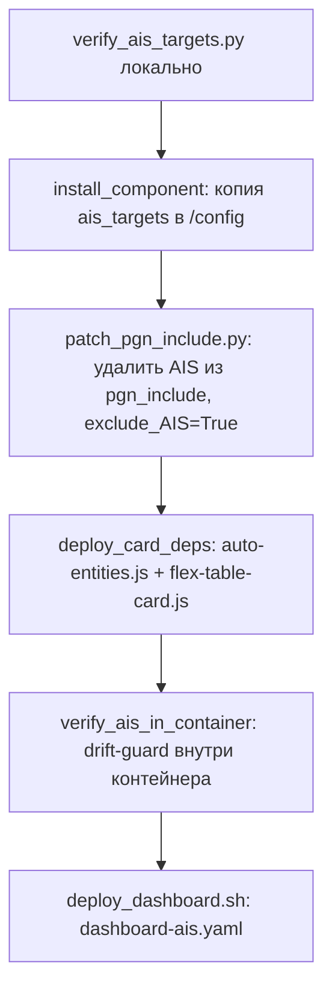

# Деплой, провижининг и эксплуатация подсистемы AIS

## Обзор

Деплой пакета `ha/ais` выполняется единой точкой входа `ha/ais/deploy.sh`, идемпотентно (загружает только изменившиеся файлы, перезапускает HA только при реальных изменениях) и с учётом профиля инстанса (`stage`/`prod`).

## Точка входа `deploy.sh`

### Профили инстансов

```
./deploy.sh --stage                 # деплой в профиль "stage"
./deploy.sh --prod  [user@host]     # деплой в профиль "prod"
./deploy.sh --target <profile>      # любой профиль из .env (например stage-pi5)
```

Профили описаны в `ha/ais/.env` (шаблон — `.env.template`): транспорт (`local-docker`/`ssh-docker`), SSH-хост, имя контейнера, путь к конфигу HA. **Пакет не использует `ha/sailing-dash/.env`** — значения (если инстанс тот же самый) переносятся вручную.

### Режимы (sub-modes)

| Флаг | Назначение |
|---|---|
| `--install` | Полная установка: компонент + правка `nmea2000` + карточки + drift-guard + дашборд |
| `--update` / `--dashboard-only` | Только обновление дашборда (режим по умолчанию) |
| `--clean-ha` / `--clean-sensors` | Очистка мусорных устройств/сущностей `nmea2000` |
| `--clean-ais` | Очистка старых `sensor.ais_*` (наследие прежней AIS-через-nmea2000 схемы) |
| `--clean-all` | Полная очистка всех устройств `nmea2000` |
| `--dry-run` / `--dry-sensors` | Сухой прогон очистки (без реальных изменений) |
| `--force` / `--force-delivery` | Принудительная перезаливка всех файлов независимо от диффа |

### Шаги режима `--install`



1. **Локальный drift-guard** (`verify_ais_targets.py`, best effort, не блокирует деплой).
2. **`install_component()`** — идемпотентное копирование `custom_components/ais_targets` в `/config/custom_components/ais_targets` контейнера (sha256-диф каталога, аналогично `ha_cp_dir_to_container_if_changed()` из `ha/sailing-dash`).
3. **`patch_pgn_include()`** — приводит live-конфигурацию интеграции `nmea2000` в `.storage/core.config_entries` к состоянию «AIS исключён» (см. ниже).
4. **`deploy_card_deps()`** — скачивает и регистрирует Lovelace-ресурсы `auto-entities.js`/`flex-table-card.js`.
5. **`verify_ais_in_container()`** — best-effort drift-guard внутри контейнера: проверяет, что `nmea2000`, установленный в контейнере, декодирует нужный набор AIS PGN.
6. **`deploy_dashboard.sh`** — финальный шаг: заливает `dashboard-ais.yaml` в `.storage/lovelace.dashboard_ais` и перезапускает HA, если что-то реально изменилось.

Режим `--update` выполняет только последний шаг (только дашборд, без переустановки компонента/патча).

## Автопровижининг: исключение AIS из `nmea2000` (`patch_pgn_include.py`)

**Важно**: несмотря на название файла (историческое), в текущей архитектуре скрипт **удаляет** AIS PGN из `pgn_include` интеграции `nmea2000`, а не добавляет их. Причина: AIS декодируется напрямую компонентом `ais_targets` (см. `architecture.md`), и интеграция `nmea2000` не должна параллельно декодировать те же PGN — иначе она создаёт по устройству/набору сенсоров на каждый проходящий MMSI и засоряет `core.device_registry`/`core.entity_registry`.

### Логика патча

Для каждой найденной записи домена `nmea2000` в `.storage/core.config_entries`:
1. Принудительно устанавливает `exclude_AIS = True` (в `data` и/или `options`, где бы ключ ни находился; если ключ отсутствует вовсе — добавляется в `data`).
2. Удаляет из `pgn_include` (поддерживаются оба формата: строка `"129038,129039,..."` и список) все PGN из набора `AIS_PGNS = [129038, 129039, 129040, 129041, 129793, 129794, 129809, 129810]`.

### Протокол идемпотентности

```
python3 patch_pgn_include.py <path>            # report-only: exit 0 = уже чисто, exit 2 = нужен патч
python3 patch_pgn_include.py <path> --write     # реально пишет файл (только если нужно)
```

`deploy.sh` сначала вызывает скрипт без `--write` и анализирует код возврата: `0` — «уже AIS-free», ничего не делает; `2` — реально патчит и заливает файл обратно в контейнер (что фиксируется в общем маркере изменений `AIS_CHANGE_FLAG`, определяющем необходимость перезапуска HA); любой другой код — предупреждение, `pgn_include` не трогается.

## Регистрация фронтенд-ресурсов (`deploy_card_deps`)

Пакет `ha/ais` **самодостаточен** для своих Lovelace-зависимостей: `deploy_card_deps()` внутри `deploy.sh --install`:
1. Использует хелперы из `ha/sailing-dash/helpers/` (`fetch_deps.py`, `merge_lovelace_resources.py`) — переиспользуются напрямую, отдельный деплой `ha/sailing-dash` для этого **не требуется**.
2. Скачивает `auto-entities.js` и `flex-table-card.js` (версии зафиксированы в `ha/sailing-dash/deps.yaml`, источник — `github_raw`, так как у обоих репозиториев нет release-ассетов).
3. Копирует файлы в `/config/www/` контейнера (идемпотентно, sha256-диф).
4. Мёржит записи о ресурсах в `.storage/lovelace_resources` (без затирания ресурсов других пакетов), используя тот же `merge_lovelace_resources.py`, что и `ha/sailing-dash`.

Без этого шага таблица целей отображает ошибку `Custom element doesn't exist: auto-entities`/`flex-table-card`.

## Взаимодействие со скриптом очистки `homeassistant/cleanup_nmea_devices.py`

Скрипт очистки — общий инструмент для всех пакетов деплоя (`deploy.sh`, `ha/sailing-dash/deploy.sh`, `ha/ais/deploy.sh`), совместим по флагам и учитывает целевой профиль инстанса (`stage`/`prod`/`--target`).

### Флаги (общие для всех deploy.sh проекта)

| Флаг деплоя | Что делает | Соответствующий флаг скрипта |
|---|---|---|
| `--clean-ha` / `--clean-sensors` | Базовая очистка мусорных устройств/сущностей `nmea2000` | (без доп. флагов) |
| `--clean-ais` | Очистка legacy `sensor.ais_*` (наследие прежней схемы AIS-через-nmea2000) | `--clean-ais` |
| `--clean-all` | Полная очистка всех устройств `nmea2000` | `--all` / `--clean-all` |
| `--dry-run` / `--dry-sensors` | Сухой прогон без записи изменений | `--dry-run` |

### Определение конфигурации HA (`resolve_config_dir`)

Скрипт определяет каталог конфигурации HA в следующем порядке приоритета: CLI-аргумент `--config-dir` → переменная окружения `HA_CONFIG_DIR` → путь по умолчанию `/config` (актуален только внутри Docker-контейнера HA). Запуск скрипта напрямую с хост-машины (вне контейнера) без одного из этих указателей завершается понятной ошибкой с инструкцией, как запустить его правильно (`docker exec`, `deploy.sh --clean-ha` или `--config-dir`).

### Механика вызова из `ha/ais/deploy.sh` (`clean_ha_target`)

1. Проверяет, что целевой контейнер HA запущен.
2. Копирует `homeassistant/cleanup_nmea_devices.py` в `/tmp/` контейнера.
3. Собирает флаги (`--all`, `--clean-ais`, `--dry-run`) из аргументов деплоя.
4. Выполняет скрипт внутри контейнера (`ha_exec python3 /tmp/cleanup_nmea_devices.py ...`).
5. Если это не сухой прогон — перезапускает HA.

## Диагностика и регламент проверки

### Контрольный список после деплоя

1. **Settings → Devices & Services** — интеграция "AIS Targets" должна быть настроена (Config Flow **не запускается автоматически** после копирования файлов кастомной интеграции — её нужно один раз добавить вручную через UI).
2. **Developer Tools → States** — проверить наличие `geo_location.ais_*` сущностей и их атрибутов (`latitude`/`longitude` не пустые).
3. **`.storage/core.config_entries`** — убедиться, что запись `nmea2000` содержит `exclude_AIS: true` и в `pgn_include` отсутствуют AIS PGN.
4. **Логи HA** (Settings → System → Logs, поиск по `ais_targets`) — предупреждения о переподключении к шлюзу (`ais_bus.py`), ошибки декодера.
5. Если целей на карте нет, но AIS-приёмник явно работает (виден на других MFD/плоттерах на той же шине) — проверить физическую топологию шины N2K: возможно, шлюз YDNU-02 и AIS-приёмник сидят на разных, электрически изолированных сегментах backbone (см. историю диагностики в `ha/ais/ais_pgn_discovery.md`).

### Типичные проблемы

| Симптом | Наиболее вероятная причина |
|---|---|
| Нет ни одной `geo_location.ais_*` сущности | Интеграция "AIS Targets" не добавлена через UI после копирования файлов |
| Карта пуста, но AIS-приёмник работает | Нет AIS-целей поблизости, либо шлюз физически не видит PGN 129038/129039 (другой сегмент шины) |
| Своё судно не видно на карте | `own_mmsi` не настроен, либо `device_tracker.nevera` не имеет валидных координат |
| Таблица показывает ошибку "Custom element doesn't exist" | Ресурсы `auto-entities.js`/`flex-table-card.js` не задеплоены — повторно запустить `deploy.sh --install` (не `--update`) |
| Устаревшие `sensor.ais_*` из старой схемы | Использовать `deploy.sh --clean-ais` для их удаления |

## Связанные документы

- [`architecture.md`](./architecture.md) — обоснование прямого чтения шлюза и исключения AIS из `nmea2000`.
- [`integration_spec.md`](./integration_spec.md) — параметры Config Flow, требующие настройки после `--install`.
- [`dashboard_spec.md`](./dashboard_spec.md) — зависимости карточек, деплоящиеся этим пайплайном.
