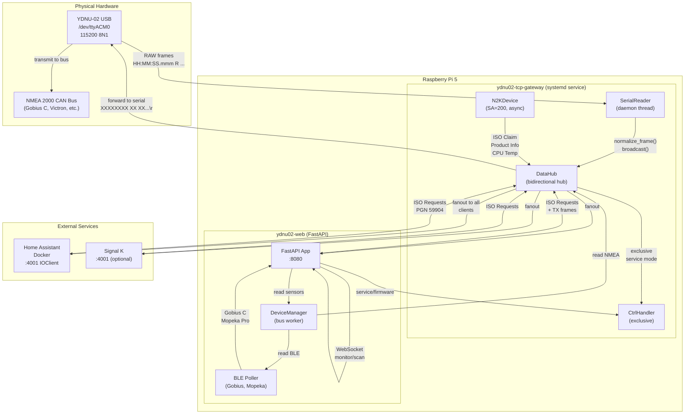

# yacht-n2k-console — Обзор проекта (as-is)

## Metadata

- id: 000
- type: feature
- status: as-is
- owner: yacht-n2k-console
- date: 2026-08-02

## Context

### Назначение проекта

**yacht-n2k-console** — самостоятельно развёртываемое веб-приложение для управления морской электроникой через шину NMEA 2000. Работает на Raspberry Pi 5 и предоставляет:

- **Обнаружение устройств** — автоматическое сканирование всех NMEA 2000 устройств на шине через ISO Address Claim (PGN 60928) и Product Information (PGN 126996)
- **Динамическая конфигурация** — чтение и запись параметров устройств через PGN 126208 Group Functions с метаданными, извлекаемыми динамически из библиотеки `nmea2000`
- **Мониторинг уровня жидкости** — поддержка датчиков Gobius C (NMEA 2000 + BLE конфигурация) и Mopeka Pro 200 (BLE)
- **Управление BLE** — централизованные диалоги подтверждения, защита от случайных изменений, предупреждения об опасных операциях
- **Монитор шины** — просмотр CAN-фреймов в реальном времени через WebSocket
- **Управление YDNU-02** — контроль serial-протокола, service-режим, обновление прошивки

### Целевая платформа

- **Хост:** Raspberry Pi 5 (ARMv8, 8 GB RAM)
- **ОС:** Raspberry Pi OS (Debian-based)
- **Python:** 3.13
- **Сетевые сервисы:** Home Assistant (Docker), Signal K (опционально)

### Состав репозитория

```
yacht-n2k-console/
├── ydnu02_tcp_gateway/          # TCP Gateway (exclusive /dev/ttyACM0 owner)
│   ├── data_hub.py              # Bidirectional TCP hub, broadcast, ISO Requests
│   ├── serial_reader.py         # Serial port reader, frame normalization
│   ├── device_contract.py       # N2K device registry (SA=64, SA=200)
│   ├── frame_utils.py           # Frame format parsing, CAN ID extraction
│   ├── gateway_settings.py      # Runtime-configurable settings
│   ├── ctrl_handler.py          # Exclusive control port (4002)
│   ├── ydnu02_tcp_gateway.py    # Main entry point
│   ├── ydnu02_gateway_device.py # Virtual N2K device (SA=200)
│   └── ydnu02-tcp-gateway.service
│
├── app.py                       # FastAPI application entry point
├── device_manager.py            # CAN bus worker, device discovery, sensor state
├── ydnu02.py                    # YDNU-02 serial protocol, N2KPGNDecoder
├── n2k_meta.py                  # Dynamic PGN metadata extraction
├── n2k_command_builder.py       # Legacy command builder (deprecated)
├── models.py                    # Pydantic request/response models
│
├── routes/                      # FastAPI route handlers
│   ├── device.py                # GET /api/info, /api/sensors
│   ├── n2k_config.py            # Dynamic device config API
│   ├── gobius.py                # Gobius C BLE management
│   ├── mopeka.py                # Mopeka Pro BLE management
│   ├── service.py               # YDNU-02 service mode
│   ├── maintenance.py           # Backup, reset, firmware
│   └── websockets.py            # /ws/monitor, /ws/scan
│
├── sensors/                     # Sensor implementations
│   ├── base_sensor.py           # BaseSensor ABC
│   ├── gobius_sensor.py         # Gobius C (NMEA + BLE)
│   └── mopeka_sensor.py         # Mopeka Pro (BLE)
│
├── static/                      # Web UI (HTML, CSS, JS)
├── tests/                       # Unit and integration tests
├── scripts/                     # Utility scripts
│   ├── spec.py                  # Spec validation CLI
│   └── patch_ha_nmea2000_message.py  # HA patch script
│
├── patches/                     # Runtime patches for third-party libs
│   └── nmea2000_ioclient.py     # EOF fix for HA nmea2000
│
├── specs/                       # Spec-driven development
│   ├── active/                  # Active specs (000-007)
│   ├── completed/               # Archived specs
│   └── templates/               # Spec templates
│
├── deploy.sh                    # Deployment script (Pi + HA patches)
├── deploy.conf.template         # Deployment config template
├── setup_gateway.sh             # Initial Pi setup
├── requirements.txt             # Python dependencies
├── pyproject.toml               # Project metadata
└── README.md, TECHNICAL.md      # Documentation
```

### Внешнее окружение

| Компонент | Интерфейс | Назначение |
|-----------|-----------|-----------|
| **YDNU-02** | USB Serial `/dev/ttyACM0` (115200 8N1) | USB-CAN адаптер, читает/пишет NMEA 2000 фреймы в RAW-режиме |
| **NMEA 2000 CAN Bus** | Физическая шина (120 Ω, 2 провода) | Сеть морской электроники (Gobius C, Victron, и т.д.) |
| **Home Assistant** | Docker контейнер, TCP :4001 | Интеграция `ha-nmea2000`, декодирует фреймы в сенсоры |
| **Signal K** | TCP :4001 (опционально) | Стандартный формат морских данных |
| **BLE датчики** | Bluetooth LE (2.4 GHz) | Gobius C (конфигурация), Mopeka Pro 200 (уровень жидкости) |

### Глоссарий

| Термин | Определение |
|--------|-----------|
| **PGN** | Parameter Group Number — идентификатор типа сообщения NMEA 2000 (например, 60928 = ISO Address Claim) |
| **SA** | Source Address — 8-бит адрес устройства на шине (0–255), назначается динамически при инициализации |
| **ISO Address Claim** | PGN 60928 — сообщение, в котором устройство объявляет свой SA и ISO NAME (уникальный идентификатор) |
| **ISO NAME** | 64-бит идентификатор устройства (NMEA 2000 §3.1.1), содержит `unique_number` (21-бит, прошит производителем) и другие поля |
| **unique_number** | 21-бит поле в ISO NAME, назначается производителем, **никогда не меняется** (в отличие от `device_instance`) |
| **RAW mode** | Текстовый режим YDNU-02 (Appendix E мануала), фреймы в формате `HH:MM:SS.mmm R/T XXXXXXXX XX XX...` |
| **Service mode** | Специальный режим YDNU-02 для диагностики и обновления прошивки, вход через DTR toggle |
| **FastPacket** | Механизм NMEA 2000 для передачи сообщений >8 байт через несколько CAN-фреймов (PGN 126996 Product Info использует FastPacket) |

## Requirements

### Функциональные требования

1. **Exclusive Serial Port Ownership** — только один процесс (ydnu02-tcp-gateway) открывает `/dev/ttyACM0` в RAW-режиме.
2. **Bidirectional TCP Hub (порт 4001)** — broadcast NMEA 2000 фреймов всем подключённым TCP-клиентам; forward фреймов от клиентов к другим клиентам и на физическую шину (ISO Requests только).
3. **Two-Phase Device Announcement** — при подключении нового TCP-клиента: Phase 1 (немедленно) — PGN 60928 (ISO Address Claim), Phase 2 (через 0.6s) — PGN 126996 (Product Information).
4. **Virtual N2K Device (SA=200)** — TCP Gateway регистрируется как первоклассное NMEA 2000 устройство с собственной идентичностью (model, firmware, CPU temperature).
5. **Exclusive Control Port (порт 4002)** — single-client passthrough для service-режима и firmware-flash.
6. **Device Discovery** — автоматическое сканирование устройств на шине через ISO Address Claim и Product Information.
7. **Dynamic Configuration API** — чтение и запись параметров устройств через PGN 126208 Group Functions с метаданными из `nmea2000` library.
8. **BLE Sensor Support** — поддержка Gobius C (NMEA 2000 + BLE конфигурация) и Mopeka Pro 200 (BLE advertisement).
9. **Web UI** — FastAPI + WebSocket приложение на `:8080` для управления и мониторинга.
10. **Home Assistant Integration** — идемпотентный деплой с патчами для исправления критических багов в `nmea2000` library.

### Нефункциональные требования

- **Производительность:** Broadcast должен завершиться за <100ms для 3+ клиентов на Pi 5.
- **Надёжность:** Разрыв соединения с одним клиентом не должен влиять на других; автоматический retry при ошибках serial-порта.
- **Thread Safety:** Все мутабельные структуры защищены locks.
- **Ограничения Pi 5:** Максимум ~10 одновременных TCP-клиентов.
- **Работа 24/7:** Сервис должен работать без перезагрузки в течение недель.
- **Совместимость:** Python 3.13, Home Assistant 2024.x+.

### Глобальные правила проекта (из `.agents/AGENTS.md`)

1. **NMEA 2000 — основной источник данных.** BLE используется только для конфигурации датчиков.
2. **Без hardcoded PGN-реестров.** Все метаданные PGN извлекаются динамически из библиотеки `nmea2000` через `n2k_meta.py`.
3. **`unique_number` вместо `iso_name.name`.** Идентификаторы устройств в HA строятся на основе `unique_number` (21-бит, прошит производителем), а не `iso_name.name` (меняется при переинициализации шины).
4. **Никаких реальных hostname/IP.** Все чувствительные параметры в `deploy.conf` (gitignored), только плейсхолдеры в коде и документации.
5. **Код и комментарии на английском.** Документация на русском, но весь исходный код, комментарии, docstrings — только на английском.
6. **Идемпотентный деплой.** Повторный запуск `deploy.sh` безопасен — не перезапускает сервисы без необходимости.
7. **Двухфазный анонс обязателен.** PGN 60928 (ISO Claim) ДОЛЖЕН отправляться ДО PGN 126996 (Product Info) с задержкой 0.6s.
8. **Версионированные патчи HA.** Патчи помечены маркерами (v1, v2) для идемпотентности и автоматического апгрейда.

### Out of Scope

- Реализация полного NMEA 2000 стека (используется `nmea2000` library).
- Обработка PGN, отличных от основных (делегируется потребителям).
- Хранение истории фреймов (no caching).
- Аутентификация TCP-клиентов.
- Деплой самого Home Assistant (предполагается, что контейнер уже запущен).

## Architecture & Technical Design

### Диаграмма верхнего уровня



### Реестр спек и статусы

| ID | Название | Статус | Каталог | Описание |
|----|----------|--------|---------|----------|
| **000** | **Project Overview** | **as-is** | — | Сквозная спека проекта (этот документ) |
| 001 | TCP Gateway для YDNU-02 | as-is | `ydnu02_tcp_gateway/` | Exclusive serial owner, bidirectional hub, device registry |
| 002 | Device Manager | as-is | `device_manager/` | Bus worker, device discovery, sensor state |
| 003 | Web API & UI | as-is | `app.py`, `routes/`, `static/` | FastAPI endpoints, WebSocket, web console |
| 004 | BLE Sensors | as-is | `sensors/`, `gobius_*`, `mopeka_*` | Gobius C + Mopeka Pro support |
| 005 | Deploy & HA Integration | as-is | `deploy.sh`, `scripts/`, `patches/` | Idempotent deployment, HA patches |
| 006 | Integrations | as-is | `ydnu02_tcp_gateway/`, `patches/`, `homeassistant/`, `routes/` | Технический дизайн внешних интеграций: YDNU-02/NMEA 2000, Home Assistant, Signal K, BLE, REST/WebSocket |
| 007 | Testing Strategy | as-is | `tests/` | Уровни тестирования, карта `tests/` → подсистемы, моки железа, Definition of Done |

### Таблица подсистем

| Подсистема | Каталог | Спека | Ответственность |
|-----------|---------|-------|-----------------|
| TCP Gateway | `ydnu02_tcp_gateway/` | 001 | Exclusive `/dev/ttyACM0` owner, bidirectional TCP hub (ports 4001/4002), device registry, ISO Requests |
| Device Manager | `device_manager/` | 002 | CAN bus worker thread, device discovery, sensor state aggregation |
| Web API & UI | `app.py`, `routes/`, `static/` | 003 | FastAPI endpoints, WebSocket streams, dynamic PGN metadata, web console |
| BLE Sensors | `sensors/`, `gobius_*`, `mopeka_*` | 004 | Gobius C (NMEA + BLE config), Mopeka Pro (BLE advertisement) |
| Deploy & HA | `deploy.sh`, `scripts/`, `patches/` | 005 | Idempotent deployment, HA Docker patches (ioclient EOF fix, message.py hash collision fix) |

### Потоки данных

```
NMEA 2000 Bus
    ↓
YDNU-02 /dev/ttyACM0 (RAW mode)
    ↓
SerialReader (serial_reader.py)
    ├─ readline() → parse NMEA ASCII frames
    ├─ filter: _NMEA_LINE_RE validation
    ↓
DataHub (data_hub.py)
    ├─ broadcast(line) → all TCP clients (set[socket])
    ├─ _track_physical_device(line) → N2KDeviceRegistry (PGN 60928 + 126996)
    ├─ :4001 DATA port — NMEA broadcast (read-only for clients)
    │   ├─ HA ha-nmea2000 integration (auto-connect)
    │   └─ ydnu02-web (TCPProxyConnection)
    └─ :4002 CTRL port — service/firmware passthrough (exclusive)
        └─ ProxyControlClient (service mode, firmware flash)

N2KDeviceRegistry:
    DEFAULT_PHYSICAL_DEVICE  SA=64 (0x40)  unique_number=402047  ISO NAME=YDNU-02
    DEFAULT_VIRTUAL_DEVICE   SA=200 (0xC8) unique_number=902047  ISO NAME=TCP-GW

На connect нового клиента: handle_client() → send_iso_request()
    Phase 1: broadcast ISO Claim (PGN 60928) для обоих устройств  [немедленно]
    Phase 2: broadcast Product Info (PGN 126996) после задержки    [+0.6s Timer]
```

## Interfaces / Contracts

### TCP Gateway (ydnu02_tcp_gateway)

| Порт | Режим | Описание | Клиенты |
|------|-------|---------|---------|
| **4001** | **DATA** | Broadcast NMEA 2000 ASCII фреймов (`\n`-terminated) всем подключённым TCP-клиентам. Поддерживает двунаправленную запись для N2K команд (ISO Requests, PGN 126208). | HA IOClient, Signal K, ydnu02-web |
| **4002** | **CTRL** | Exclusive control channel для YDNU-02 service mode, serial passthrough, firmware upload. Single-client only. | ydnu02-web (ProxyControlClient) |

**Формат фреймов:**
- RX (из YDNU-02): `HH:MM:SS.mmm R XXXXXXXX XX XX...\n`
- TX (в YDNU-02): `XXXXXXXX XX XX...\r\n`
- Hub broadcast: `HH:MM:SS.mmm R XXXXXXXX XX XX...\n`

**Ключевые PGN:**
- **60928** — ISO Address Claim (device registration)
- **126996** — Product Information (FastPacket, device metadata)
- **130312** — CPU Temperature (virtual device telemetry)
- **59904** — ISO Request (device discovery)
- **126208** — Group Function (read/write device config)

Подробнее: **Спека 001 — TCP Gateway**.

### Web API (app.py, routes/)

| Метод | Endpoint | Описание |
|-------|----------|---------|
| `GET` | `/api/n2k/devices` | List all discovered N2K devices |
| `GET` | `/api/n2k/devices/{src}/config/{pgn}` | Read current field values from device |
| `POST` | `/api/n2k/devices/{src}/config/{pgn}` | Write fields, verify with read-back diff |
| `GET` | `/api/n2k/pgn/{pgn}/metadata` | Get field metadata (types, enums, units) |
| `GET` | `/api/sensors` | All sensor readings (NMEA + BLE) |
| `GET` | `/api/dashboard/sensors` | Unified sensor cards |
| `GET` | `/api/info` | Gateway status and bus health |
| `POST` | `/api/mode/{mode}` | Set YDNU-02 operating mode |
| `WS` | `/ws/monitor` | Live CAN frame stream |
| `WS` | `/ws/scan` | Device discovery scan |

**Gobius C BLE:**
- `GET /api/gobius/status` — Full BLE sensor read
- `POST /api/gobius/n2k` — Write N2K Config GATT `0xFFF2`
- `POST /api/gobius/command` — Send command GATT `0xFFE7`

**Mopeka Pro:**
- `GET /api/mopeka/status` — BLE advertisement scan
- `POST /api/mopeka/bind` — Bind sensor to tank

Подробнее: **Спека 003 — Web API & UI**.

### BLE Interfaces

| Устройство | Интерфейс | Назначение |
|-----------|-----------|-----------|
| **Gobius C** | NMEA 2000 (PGN 127505) + BLE GATT | Fluid level (NMEA) + configuration (BLE) |
| **Mopeka Pro 200** | BLE Advertisement | Passive fluid level reading |

**Gobius C GATT Characteristics:**
- `0xFFE6` — User Config (R/W)
- `0xFFE7` — Command (W)
- `0xFFE8` — Status (R)
- `0xFFE9` — Measurement (R+Notify)
- `0xFFF2` — N2K Config (R/W)

Подробнее: **Спека 004 — BLE Sensors**.

## Implementation Plan

### Уже реализовано

#### Фаза 1: TCP Gateway (Спека 001)
- ✅ `ydnu02_tcp_gateway/` — полная реализация
- ✅ Exclusive serial port ownership (`/dev/ttyACM0`)
- ✅ Bidirectional TCP hub (ports 4001/4002)
- ✅ Two-phase device announcement (PGN 60928 + 126996)
- ✅ Virtual N2K device (SA=200, CPU temperature)
- ✅ Frame format normalization (RAW ↔ TX)
- ✅ Device registry with `unique_number` stability
- ✅ Unit tests (221+ тестов в `tests/`)
- ✅ systemd service (`ydnu02-tcp-gateway.service`)

#### Фаза 2: Device Manager (Спека 002)
- ✅ `device_manager.py` — CAN bus worker thread
- ✅ Device discovery (ISO Address Claim + Product Info)
- ✅ Sensor state aggregation (NMEA + BLE)
- ✅ SensorRegistry (persistent state)
- ✅ Unit tests

#### Фаза 3: Web API & UI (Спека 003)
- ✅ `app.py` — FastAPI application
- ✅ Dynamic PGN metadata extraction (`n2k_meta.py`)
- ✅ Device configuration API (PGN 126208 Group Functions)
- ✅ WebSocket streams (`/ws/monitor`, `/ws/scan`)
- ✅ Web UI (HTML/CSS/JS, 6 tabs: Dashboard, Network, Monitor, Gobius, Mopeka, Service, Maintenance)
- ✅ Unit tests

#### Фаза 4: BLE Sensors (Спека 004)
- ✅ `sensors/` — Gobius C + Mopeka Pro support
- ✅ Gobius C NMEA 2000 (PGN 127505) + BLE GATT configuration
- ✅ Mopeka Pro BLE advertisement parsing
- ✅ BLE device registry (`ble_registry.py`)
- ✅ Unit tests

#### Фаза 5: Deploy & HA Integration (Спека 005)
- ✅ `deploy.sh` — idempotent deployment script
- ✅ Patch 1: `nmea2000_ioclient.py` (EOF fix)
- ✅ Patch 2: `patch_ha_nmea2000_message.py` (hash collision fix, v1→v2 upgrade)
- ✅ `deploy.conf.template` (gitignored config)
- ✅ Post-deploy tests (`test_live_ha_integration.py`)
- ✅ systemd service (`ydnu02-web.service`)

### Фактическое состояние

**Статус:** Проект полностью реализован и развёрнут на целевом хосте (Raspberry Pi 5).

- **TCP Gateway:** Работает как systemd-сервис `ydnu02-tcp-gateway`, слушает порты 4001/4002.
- **Web Console:** Доступна на `:8080`, подключена к gateway через TCP.
- **Home Assistant:** Интегрирована через `ha-nmea2000`, получает данные с `:4001`.
- **BLE Sensors:** Gobius C и Mopeka Pro активно опрашиваются и отображаются в UI.
- **Тесты:** 221+ unit-тестов, 7 live-тестов против реального HA.
- **Деплой:** Идемпотентный, поддерживает 6+ режимов, автоматически применяет HA-патчи.

## Verification

### Как проверяется проект целиком

#### 1. Unit-тесты (локально)

```bash
# Все unit-тесты (без live HA и service_mode)
.venv/bin/python -m pytest tests/ \
  --ignore=tests/test_live_ha_integration.py \
  --ignore=tests/test_service_mode.py -q
# Ожидаемый результат: 221 passed, 10 skipped
```

#### 2. Live-тесты (требуют Pi + HA + running gateway)

```bash
# Live тесты против реального HA
.venv/bin/python -m pytest tests/test_live_ha_integration.py -v
# Ожидаемый результат: 7 passed
```

#### 3. Валидация спек

```bash
# Валидировать все спеки в active/ и completed/
python scripts/spec.py validate
# Ожидаемый результат: exit code 0, все спеки имеют обязательные секции
```

#### 4. Деплой и post-deploy тесты

```bash
# Полный деплой на Pi с автоматическими тестами
./deploy.sh
# Ожидаемый результат: exit code 0, сервисы запущены, тесты зелёные
```

#### 5. Диагностика на целевом хосте

```bash
# Статус сервисов
ssh user@<gateway-host> 'systemctl is-active ydnu02-tcp-gateway ydnu02-web'

# Соединения на :4001
ssh user@<gateway-host> 'ss -tnp | grep 4001'

# Живые NMEA фреймы
ssh user@<gateway-host> 'timeout 5 bash -c "nc localhost 4001" | head -10'

# Лог gateway
ssh user@<gateway-host> 'sudo journalctl -u ydnu02-tcp-gateway -n 30 --no-pager'

# Проверка HA патчей
ssh user@<gateway-host> "sudo docker exec homeassistant grep 'yacht-n2k-console-patch' \
  /usr/local/lib/python3.14/site-packages/nmea2000/message.py"
# Ожидаем: yacht-n2k-console-patch-v2
```

### Критерии приёмки

1. ✅ **TCP Gateway работает** — systemd-сервис `ydnu02-tcp-gateway` активен, слушает `:4001` и `:4002`.
2. ✅ **Web Console доступна** — FastAPI приложение на `:8080` отвечает на запросы.
3. ✅ **Устройства обнаружены** — минимум 2 устройства (YDNU-02 SA=64, TCP-GW SA=200) видны в Network tab.
4. ✅ **HA интегрирована** — оба устройства в HA registry имеют >0 entities, нет дублей.
5. ✅ **BLE датчики работают** — Gobius C и Mopeka Pro отображают данные в UI.
6. ✅ **Тесты зелёные** — 221+ unit-тестов, 7 live-тестов.
7. ✅ **Деплой идемпотентен** — повторный запуск `deploy.sh` безопасен.

## Known Issues

### Bug 1 — HA decoder silent drop (NMEA ioclient EOF spin-loop)

**Файл:** `nmea2000/ioclient.py` в HA Docker контейнере

**Симптом:** После рестарта gateway — HA крутится на 100% CPU, не переподключается.

**Причина:** EOF в serial → `b""` → exception → return без sleep → 100% CPU spin-loop.

**Фикс:** `patches/nmea2000_ioclient.py` — при `b""` поднимает `ConnectionError` вместо `return`.

**Статус:** Merged в upstream PR #61. Применяется через `deploy.sh --patch-ha`.

**Ссылка:** Спека 005 (Deploy & HA Integration), раздел "Bug 1".

### Bug 2 — PGN 126996 hash collision (все устройства → один device в HA)

**Файл:** `nmea2000/message.py` в HA Docker контейнере

**Симптом:** Второе NMEA 2000 устройство в HA показывает «0 entities».

**Причина:** `primary_key = f"{self.id}"` (одинаков для всех устройств) → коллизия MD5.

**Фикс:** Использовать `source_iso_name.unique_number` вместо `iso_name.name` для стабильного `primary_key`.

**Статус:** Pending PR в `dnevera/nmea2000`. Применяется через `deploy.sh --patch-ha` (v2 маркер).

**Ссылка:** Спека 005 (Deploy & HA Integration), раздел "Bug 2".

### Bug 3 — HA registry накапливает мусор (старые device записи)

**Симптом:** Несколько «Product Information (Yacht Devices - PC Gateway - ...)» в HA.

**Причина:** До patch-v2 `device_instance` в `iso_name.name` менялся → другой MD5 → новая запись.

**Фикс:** `./deploy.sh --clean-ha` → удалить все старые nmea2000 devices → HA пересоздаёт с нуля.

**Статус:** Одноразовая очистка решает проблему навсегда (patch-v2 предотвращает новые дубли).

**Ссылка:** Спека 005 (Deploy & HA Integration), раздел "Bug 3".

### Ограничение: test_service_mode.py падает в sandbox

**Симптом:** `PermissionError: [Errno 13] Permission denied` при `socket.bind()` на `:4002`.

**Причина:** Sandbox-окружение не позволяет открывать привилегированные порты.

**Статус:** Не баг кода, ожидаемое поведение. Тест пропускается в CI.

**Ссылка:** `.agents/AGENTS.md`, раздел "Правила".

### Ограничение: Gobius C firmware баг (fluid_type всегда 0x00)

**Симптом:** PGN 127505 от Gobius C всегда содержит `fluid_type = 0x00` (Fuel), даже если настроено другое.

**Причина:** Баг прошивки Gobius C.

**Workaround:** Использовать BLE GATT `0xFFF2` (N2K Config) для явной установки типа жидкости.

**Ссылка:** Спека 004 (BLE Sensors), раздел "Gobius C NMEA 2000".

### Ограничение: Gobius C не поддерживает N2K write (PGN 126208)

**Симптом:** Попытка изменить конфигурацию Gobius C через PGN 126208 Group Function игнорируется.

**Причина:** Gobius C не реализует PGN 126208 write handler.

**Workaround:** Использовать BLE GATT для конфигурации (характеристики `0xFFE6`, `0xFFF2`).

**Ссылка:** Спека 004 (BLE Sensors), раздел "Gobius C GATT".

### Ограничение: Mopeka Pro 200 max tank volume 255L

**Симптом:** Характеристика GATT `0xFFF2` (N2K Config) кодирует объём в 1 байт (0–255L).

**Причина:** Ограничение BLE GATT payload.

**Workaround:** Для больших танков использовать NMEA 2000 PGN 127505 напрямую (без BLE конфигурации).

**Ссылка:** Спека 004 (BLE Sensors), раздел "Mopeka Pro 200".

### Ограничение: FastPacket assembly не thread-safe

**Симптом:** Двойной вызов `_n2k_decoder.decode()` на один фрейм отравляет sequence counter.

**Причина:** `_n2k_decoder` — stateful singleton, accumulates sub-frames.

**Правило:** НИКОГДА не кормить один и тот же CAN frame в `_n2k_decoder.decode()` дважды.

**Ссылка:** `.agents/skills/nmea2000-setup/SKILL.md`, раздел "⚡ FastPacket Assembly".
