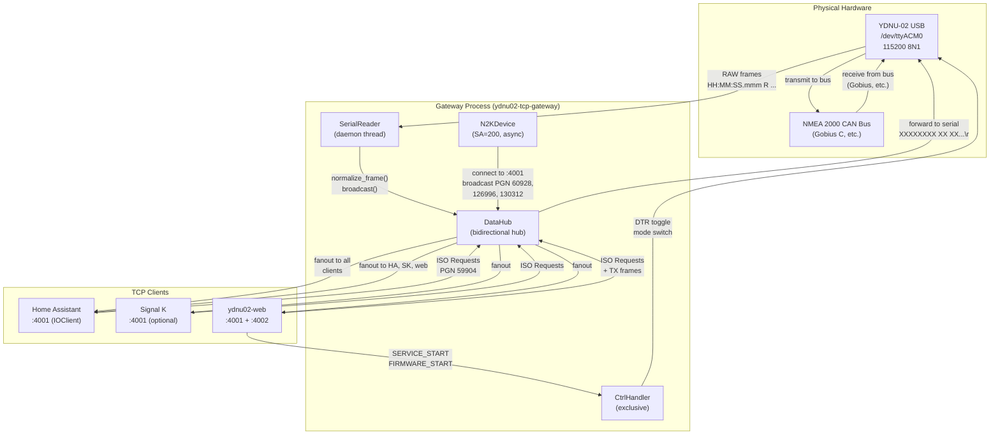

# TCP Gateway для YDNU-02 (Ретро-спецификация)

## Metadata

- id: 001
- type: feature
- status: as-is
- owner: yacht-n2k-console
- date: 2026-08-02

## Context

TCP Gateway — центральный мультиплексер между USB-адаптером YDNU-02 (`/dev/ttyACM0`) и всеми потребителями на Raspberry Pi 5. Это единственный процесс, который открывает физический serial-порт. Все остальные сервисы (Home Assistant, Signal K, ydnu02-web) взаимодействуют через TCP.

**Проблема, которую решает:**
- Исключительный доступ к serial-порту (избегаем race conditions и конфликтов)
- Двунаправленный broadcast NMEA 2000 фреймов всем TCP-клиентам
- Активная регистрация устройств на шине (ISO Requests) при подключении новых клиентов
- Гарантия уникальности устройств в Home Assistant (через стабильные хэши на основе `unique_number`)
- Эксклюзивный канал управления для service-режима и прошивки (порт 4002)

**Существующая реализация:**
- Модуль `ydnu02_tcp_gateway/` содержит полную реализацию
- Развёрнут как systemd-сервис `ydnu02-tcp-gateway.service` на Pi
- Запускается ДО `ydnu02-web.service` (зависимость)
- Покрыт unit-тестами (221+ тестов в `tests/`)

## Requirements

### Функциональные требования

1. **Exclusive Serial Port Ownership** — только один процесс открывает `/dev/ttyACM0` в RAW-режиме (CAN_FRAME_ASCII).
2. **Bidirectional TCP Hub (порт 4001)** — broadcast NMEA 2000 фреймов всем подключённым TCP-клиентам; forward фреймов от клиентов к другим клиентам и на физическую шину (ISO Requests только).
3. **Two-Phase Device Announcement** — при подключении нового TCP-клиента:
   - Phase 1 (немедленно): broadcast PGN 60928 (ISO Address Claim) для обоих устройств (SA=64, SA=200)
   - Phase 2 (через 0.6s): broadcast PGN 126996 (Product Information) для обоих устройств
4. **Virtual N2K Device (SA=200)** — TCP Gateway регистрируется как первоклассное NMEA 2000 устройство с собственной идентичностью (model, firmware, CPU temperature).
5. **Exclusive Control Port (порт 4002)** — single-client passthrough для service-режима и firmware-flash; DTR toggle для переключения YDNU-02 между RAW и SERVICE режимами.
6. **Frame Format Normalization** — преобразование между форматами:
   - RX (из YDNU-02): `HH:MM:SS.mmm R XXXXXXXX XX XX...\n`
   - TX (в YDNU-02): `XXXXXXXX XX XX...\r\n`
   - Hub (виртуальные устройства): `XXXXXXXX XX XX...\r\n`
7. **Device Registry Stability** — использование `unique_number` (21-бит, прошит производителем) вместо `iso_name.name` для стабильных хэшей в HA registry.
8. **Serial Initialization** — RAW-режим инициализируется командой `YDNU MODE RAW\r\n` с ожиданием 2.0s.
9. **Service Mode Entry** — DTR toggle (close → stty echo → open) для переключения в SERVICE режим.
10. **Rate Limiting** — ISO Requests отправляются не чаще чем раз в 5.0s; CPU-temp (PGN 130312) троттлится независимо для TCP и serial.

### Нефункциональные требования

- **Производительность:** Broadcast должен завершиться за <100ms для 3+ клиентов (на Pi 5).
- **Надёжность:** Разрыв соединения с одним клиентом не должен влиять на других.
- **Thread Safety:** Все мутабельные структуры защищены locks (serial_lock, clients_lock, iso_request_lock и т.д.).
- **Graceful Degradation:** Ошибки serial-порта не должны крашить процесс; автоматический retry через 5s.
- **Ограничения Pi 5:** Максимум ~10 одновременных TCP-клиентов (HA + Signal K + ydnu02-web + N2KDevice).

### Out of Scope

- Реализация полного NMEA 2000 стека (используется `nmea2000` library)
- Обработка PGN, отличных от 60928, 126996, 130312, 59904 (делегируется потребителям)
- Хранение истории фреймов (no caching)
- Аутентификация TCP-клиентов

## Architecture & Technical Design

### Модули и их ответственность

| Модуль | Ответственность | Тесты |
|--------|-----------------|-------|
| `data_hub.py` | Bidirectional TCP hub (port 4001), broadcast, ISO Requests, device registry, frame tracking | `test_data_hub.py`, `test_bidirectional_hub.py`, `test_data_hub_serial_forward.py` |
| `serial_reader.py` | Owns `/dev/ttyACM0`, RAW-mode init, frame normalization, broadcast to hub | `test_data_hub.py` (integration) |
| `device_contract.py` | N2K device registration (SA=64, SA=200), ISO NAME encoding, FastPacket assembly | `test_device_contract.py` |
| `frame_utils.py` | Frame format parsing (NMEA_LINE_RE, TX_LINE_RE), CAN ID extraction, PGN/SA decoding | `test_frame_utils.py` |
| `gateway_settings.py` | Runtime-configurable settings (JSON persistence), thread-safe singleton | `test_gateway_settings.py` |
| `ctrl_handler.py` | Exclusive control port (4002), DTR toggle, service/firmware mode | `test_service_mode.py` (sandbox-only) |
| `ydnu02_tcp_gateway.py` | Main entry point, thread orchestration, TCP accept loops | `test_integration.py` |
| `ydnu02_gateway_device.py` | Virtual N2K device (SA=200), CPU temp broadcasts, asyncio loop | `test_gateway_device.py` |

### Потоки данных (Mermaid диаграмма)



### Двухфазный `announce_all_devices()` (КРИТИЧЕСКИЙ)

**Сигнатура:**
```python
def announce_all_devices(self, product_info_delay: float = 0.0) -> None:
    """
    product_info_delay=0.0   → синхронный broadcast (unit tests)
    product_info_delay=0.6   → Timer (production, send_iso_request вызывает)
    """
```

**Phase 1 — Немедленно (PGN 60928):**
```
DataHub.announce_all_devices(product_info_delay=0.6)
  ├─ broadcast(DEFAULT_PHYSICAL_DEVICE.encode_iso_claim())  # SA=64, unique_id=402047
  └─ broadcast(DEFAULT_VIRTUAL_DEVICE.encode_iso_claim())   # SA=200, unique_id=902047
```

**Phase 2 — Через 0.6s (PGN 126996):**
```
Timer(0.6s) fires:
  ├─ broadcast(DEFAULT_PHYSICAL_DEVICE.encode_product_info())  # SA=64
  └─ broadcast(DEFAULT_VIRTUAL_DEVICE.encode_product_info())   # SA=200
```

**ПОЧЕМУ задержка 0.6s обязательна:**

HA nmea2000 decoder (в контейнере Home Assistant) содержит stateful map `source_to_iso_name`:
```python
# nmea2000/decoder.py, строки 338-346
source_iso_name = self.source_to_iso_name.get(source_id, None)
if source_iso_name is None and self.build_network_map:
    return None  # ← SILENT DROP!
```

Если PGN 126996 (Product Info) приходит ДО PGN 60928 (ISO Claim) или в одном TCP buffer flush:
- `source_to_iso_name[SA]` ещё не заполнен
- Decoder делает **silent drop** PGN 126996
- `message.source_iso_name = None`
- `message.hash = MD5("productInformation")` = `818d9516db08fd90ffd1967e3c403bed` (одинаков для обоих SA!)
- Оба устройства получают одинаковый хэш → коллизия в HA registry → второе устройство имеет 0 entities

**Решение:** 0.6s задержка гарантирует, что decoder обработает PGN 60928 и заполнит `source_to_iso_name` ДО прихода PGN 126996.

### Ключевые константы

```python
# data_hub.py
ANNOUNCE_PRODUCT_INFO_DELAY = 0.6  # seconds, Phase 1 → Phase 2
_ISO_REQUEST_MIN_INTERVAL = 5.0    # rate limit ISO Requests
_TX_ECHO_WINDOW_S = 3.0            # diagnostic echo-logging window

# gateway_settings.py (defaults)
ha_iso_replay_enabled = True
ha_iso_replay_interval_s = 60.0
n2k_serial_tx_enabled = True
n2k_serial_temp_interval_s = 5.0   # PGN 130312 throttle for serial
n2k_tcp_temp_interval_s = 3.0      # PGN 130312 interval for TCP

# device_contract.py
DEFAULT_PHYSICAL_DEVICE:
  sa=64, unique_id=402047, mfg_code=717 (Yacht Devices)
  model_id="YDNU-02", model_serial="00402047"

DEFAULT_VIRTUAL_DEVICE:
  sa=200, unique_id=902047, mfg_code=2047 (Custom)
  model_id="YDNU-02 TCP-GW", model_serial="902047"
```

### Service Mode (CTRL порт 4002)

**Exclusive Mutex:** только один CTRL-клиент одновременно.

**DTR Toggle Sequence (enter_service_mode_on_device):**
```
1. serial.close()                                    # DTR → low
2. stty -F /dev/ttyACM0 115200 raw -echo hupcl
3. echo 'YDNU MODE SERVICE' > /dev/ttyACM0          # при DTR=low
4. time.sleep(0.15)
5. serial.open(dsrdtr=True, dtr=True)               # DTR → high → YDNU-02 переключается
6. ← YDNU-02 выводит service prompt
```

**Возврат в RAW:**
```
serial.write(b"MODE RAW\r\n")
time.sleep(0.5)
← SerialReader продолжает читать NMEA_LINE_RE фреймы
```

## Interfaces / Contracts

### TCP Порты

| Порт | Назначение | Клиенты | Формат | Мультиплекс |
|------|-----------|---------|--------|------------|
| 4001 | DATA | HA, Signal K, ydnu02-web, N2KDevice | NMEA ASCII | Broadcast (все клиенты) |
| 4002 | CTRL | ydnu02-web (admin) | UTF-8 lines | Exclusive (1 клиент) |

### Форматы CAN-фреймов

#### Формат A — NMEA_LINE_RE (YDNU-02 → Host, RX)
```
HH:MM:SS.mmm R XXXXXXXX XX XX ... XX\n
│            │ │        └── DATA bytes (hex uppercase, space-separated)
│            │ └── CAN ID (8 hex chars, no 0x prefix)
│            └── Direction: R=Receive / T=Transmit (echo)
└── Timestamp (YDNU-02 clock)

Regex: rb"^\d{2}:\d{2}:\d{2}\.\d{3} [RT] [0-9A-Fa-f]{8}( [0-9A-Fa-f]{2})+\n$"

Примеры:
  18:48:47.064 R 09FD025C 00 67 00 00 00 FF 00 00\n  ← Gobius C, SA=92
  18:48:47.064 T 19F01440 C0 86 15 05 00 EE 00\n     ← YDNU-02 echo, SA=64
```

#### Формат B — TX_LINE_RE (Host → YDNU-02, TX)
```
XXXXXXXX XX XX ... XX\r\n
│        └── DATA bytes (hex uppercase, space-separated)
└── CAN ID (8 hex chars, no 0x prefix)

Regex: rb"^[0-9A-Fa-f]{8}( [0-9A-Fa-f]{2})+\r?\n$"

Примеры:
  18EAFFFE 00 EE 00\r\n            ← ISO Request PGN 59904 (PGN 60928)
  18EAFFFE 14 F0 01\r\n            ← ISO Request PGN 59904 (PGN 126996)
  18EAFFC8 00 00 00 00 00 E8 FF 00\r\n  ← ISO Address Claim, SA=200
  09FF04C8 05 00 02 91 7E FF FF 00\r\n  ← CPU Temp PGN 130312, SA=200
```

#### Ошибочные форматы (молча игнорируются YDNU-02)
```
18:48:47.064 R 18EAFFC8 00\n    ← таймштамп/флаг запрещены в TX
18EAFFC8 00 EE 00\n             ← только \n без \r — не работает
18EAFFC8 00 EE 00               ← нет терминатора
```

### CTRL Протокол (порт 4002)

**Line-oriented UTF-8, CRLF-terminated:**

```
CLIENT → SERVER:
  SERVICE_START\n     → Инициирует DTR toggle, переводит YDNU-02 в service mode
  FIRMWARE_START\n    → Raw passthrough (без mode switch)
  <cmd>\r\n           → Forwarded verbatim to serial
  SERVICE_END\n       → Sends "MODE RAW\r\n" to device, exits service mode

SERVER → CLIENT:
  READY\r\n           ← Service mode ready (после DTR toggle)
  <response>\r\n      ← Echoed from serial (polled every 100ms)
  OK\r\n              ← Confirmation (SERVICE_END)
  ERROR: ...\r\n      ← Error message (e.g., another session active)
```

### Device Registry Contracts

**ISO NAME (64-bit, PGN 60928):**
```
Bits 63-43: unique_number (21 bits)  ← STABLE, manufacturer-assigned
Bits 42-32: manufacturer_code (11 bits)
Bits 31-28: device_instance_upper (4 bits)  ← CHANGES on bus reinit!
Bits 27-21: device_instance_lower (7 bits)  ← CHANGES on bus reinit!
Bits 20-16: device_function (5 bits)
...
```

**HA Device Hash (patch-v2, stable):**
```python
primary_key = f"{pgn_id}_{source_iso_name.unique_number}"
hash = MD5(primary_key)

Примеры (стабильны навсегда):
  SA=64  (YDNU-02):  MD5("productInformation_402047") = ef195c7c99c762fdfda4e198aae87930
  SA=200 (TCP-GW):   MD5("productInformation_902047") = c11f5c824c71fe7e186cba56bf0f8672
```

### PGN Contracts

| PGN | Имя | Направление | Интервал | Ответственность |
|-----|-----|-------------|----------|-----------------|
| 59904 | ISO Request | Host → Bus | on-demand | DataHub (ISO Requests) |
| 60928 | ISO Address Claim | Device → Bus | on-start + Phase 1 | N2KDevice + DataHub |
| 126996 | Product Information | Device → Bus | on-start + Phase 2 (0.6s) | N2KDevice + DataHub |
| 130312 | CPU Temperature | N2KDevice → Bus | 3.0s (TCP) / 5.0s (serial) | ydnu02_gateway_device.py |

## Implementation Plan

Это ретро-спецификация (as-is). Ниже перечислены фактические этапы реализации и текущее состояние:

1. **Phase 1 (2025-Q3)** — Базовая архитектура
   - ✅ Реализована `DataHub` (bidirectional hub, broadcast)
   - ✅ Реализована `SerialReader` (RAW-mode init, frame normalization)
   - ✅ Реализована `device_contract.py` (N2K device registry)
   - ✅ Реализована `frame_utils.py` (frame parsing, CAN ID extraction)
   - Файлы: `data_hub.py`, `serial_reader.py`, `device_contract.py`, `frame_utils.py`

2. **Phase 2 (2025-Q3)** — Control Port & Service Mode
   - ✅ Реализована `CtrlHandler` (exclusive control, DTR toggle)
   - ✅ Реализована `ydnu02_tcp_gateway.py` (main entry point, thread orchestration)
   - Файлы: `ctrl_handler.py`, `ydnu02_tcp_gateway.py`

3. **Phase 3 (2025-Q4)** — Virtual N2K Device & Settings
   - ✅ Реализована `ydnu02_gateway_device.py` (SA=200, CPU temp broadcasts)
   - ✅ Реализована `gateway_settings.py` (runtime-configurable, JSON persistence)
   - Файлы: `ydnu02_gateway_device.py`, `gateway_settings.py`

4. **Phase 4 (2026-Q1)** — HA Integration & Bug Fixes
   - ✅ Двухфазный `announce_all_devices()` (PGN 60928 → 126996, 0.6s delay)
   - ✅ Patch-v2 для HA (unique_number-based hashing, stable device registry)
   - ✅ Patch для ioclient EOF spin-loop (PR #61 merged upstream)
   - Файлы: `scripts/patch_ha_nmea2000_message.py`, `patches/nmea2000_ioclient.py`

5. **Phase 5 (2026-Q2)** — Testing & Diagnostics
   - ✅ Unit-тесты (221+ тестов, test_data_hub.py, test_device_contract.py и т.д.)
   - ✅ Live integration tests (test_live_ha_integration.py, 7 тестов)
   - ✅ Diagnostic echo-logging (experimental, TX frame pseudo-ACK)
   - Файлы: `tests/test_*.py`

6. **Current State (2026-08-02)**
   - ✅ Полная реализация завершена
   - ✅ Все модули интегрированы и протестированы
   - ✅ Развёрнут на Pi 5 как systemd-сервис
   - ✅ Работает в production (HA + Signal K + ydnu02-web)

## Verification

### Существующие тесты

| Тест | Файл | Что проверяет |
|------|------|---------------|
| `test_broadcast_to_all_clients` | `test_data_hub.py` | Broadcast fanout ко всем клиентам |
| `test_broadcast_excludes_sender` | `test_data_hub.py` | Исключение отправителя из broadcast |
| `test_dead_client_removed` | `test_data_hub.py` | Удаление разорванных соединений |
| `test_sends_to_serial` | `test_data_hub.py` | ISO Requests пишутся в serial |
| `test_broadcasts_to_tcp_clients` | `test_data_hub.py` | ISO Requests broadcast к TCP-клиентам |
| `test_announce_all_devices_emits_both_sa64_and_sa200_frames` | `test_ha_gateway.py` | Оба устройства в анонсе |
| `test_pk_hash_uniqueness_per_device_source` | `test_ha_integration_full.py` | SA=64 и SA=200 дают разные MD5 |
| `test_ha_live_registry_strict_device_and_entities_check` | `test_live_ha_integration.py` | Оба device в HA имеют >0 entities |
| `test_virtual_gateway_device_info_complete` | `test_gateway_device.py` | Virtual gateway device правильно зарегистрирован |
| `test_frame_normalization_t_to_r` | `test_frame_utils.py` | T-флаг преобразуется в R |
| `test_device_registry_update_from_frame` | `test_device_contract.py` | Device registry обновляется из фреймов |
| `test_gateway_settings_persistence` | `test_gateway_settings.py` | Settings сохраняются в JSON |
| `test_bidirectional_hub_fanout` | `test_bidirectional_hub.py` | Двунаправленный fanout работает |
| `test_serial_forward_rate_limiting` | `test_data_hub_serial_forward.py` | Rate limiting для serial TX |

### Запуск тестов

```bash
# Unit-тесты (без live HA и service_mode)
.venv/bin/python -m pytest tests/ \
  --ignore=tests/test_live_ha_integration.py \
  --ignore=tests/test_service_mode.py -q
# → 221 passed, 10 skipped

# Live-тесты (требуют Pi + HA + running gateway)
.venv/bin/python -m pytest tests/test_live_ha_integration.py -v
# → 7 passed
```

### Ручные проверки

**Skill — verify dual device announcements in live stream:**
```bash
ssh user@<gateway-host> 'nc localhost 4001 | grep -E "19F01440|19F014C8"'
# Ожидаем: обе SA (64 и 200) в потоке
```

**Skill — trigger manual ISO Request:**
```bash
python3 -c "
import socket
s = socket.create_connection(('localhost', 4001))
s.sendall(b'18EAFFFE 00 EE 00\r\n')
print('ISO Request sent')
s.close()
"
```

**Skill — watch client onboarding logs:**
```bash
ssh user@<gateway-host> 'journalctl -u ydnu02-tcp-gateway -n 30 | grep -E "Phase|client|ISO"'
```

**Skill — verify HA device registry (patch-v2):**
```bash
ssh user@<gateway-host> "sudo docker exec homeassistant grep 'yacht-n2k-console-patch' \
  /usr/local/lib/python3.14/site-packages/nmea2000/message.py"
# Ожидаем: yacht-n2k-console-patch-v2
```

### Критерии приёмки

- ✅ Оба устройства (SA=64, SA=200) видны в HA device registry
- ✅ Каждое устройство имеет >0 entities (не 0 entities)
- ✅ Хэши стабильны между рестартами (patch-v2, unique_number-based)
- ✅ Нет дублей в HA registry после рестарта gateway
- ✅ TCP-клиенты получают фреймы в течение <100ms после broadcast
- ✅ Разрыв соединения одного клиента не влияет на других
- ✅ Service mode доступен только одному клиенту одновременно
- ✅ CPU temperature (PGN 130312) транслируется каждые 3.0s (TCP) / 5.0s (serial)

## Known Issues

### Issue 1 — HA IOClient EOF Spin-Loop (NMEA ioclient)

**Файл:** `nmea2000/ioclient.py` в HA Docker контейнере

**Симптом:** После рестарта gateway HA крутится на 100% CPU, не переподключается.

**Причина:**
```python
# _receive_impl() (строка ~535):
data = await self.reader.readline()  # EOF → b""
line = data.decode().strip()         # ""
message = self.decoder.decode(line)  # EXCEPTION
# except: return  ← немедленный return, цикл крутится без sleep → 100% CPU
```

**Фикс:** `patches/nmea2000_ioclient.py` — при `b""` поднимает `ConnectionError` вместо `return`.

**Статус:** PR #61 merged в upstream `tomer-w/nmea2000`.

**Деплой:** `deploy.sh --patch-ha` применяет патч идемпотентно (MD5-сравнение).

**Ссылка:** `.agents/skills/nmea2000-setup/SKILL.md` → "Bug 1 — HA decoder silent drop (NMEA ioclient EOF spin-loop)"

---

### Issue 2 — PGN 126996 Hash Collision (NMEA message.py)

**Файл:** `nmea2000/message.py` в HA Docker контейнере

**Симптом:** Второй NMEA 2000 девайс в HA показывает «0 entities» (коллизия хэшей).

**Причина (оригинальный upstream код):**
```python
primary_key = f"{self.id}"    # для PGN 126996: self.id = "productInformation"
# Нет полей с part_of_primary_key=True → primary_key одинаков для ВСЕХ устройств
# MD5("productInformation") = "818d9516db08fd90ffd1967e3c403bed"  ← коллизия
```

**Фикс (наш форк + patch-v2):**
```python
source_id = (
    self.source_iso_name.unique_number   # ← 21-бит, manufacturer-assigned, STABLE
    if self.source_iso_name is not None
    else self.source                      # ← fallback: SA byte
)
primary_key = f"{self.id}_{source_id}"
```

**ПОЧЕМУ `unique_number`, а НЕ `iso_name.name`:**
- `unique_number` = 21-бит, прошит производителем (NMEA 2000 §3.1.1), **никогда не меняется**
- `iso_name.name` = 64-бит integer, включает `device_instance` (меняется при переинициализации шины!)
- Использование `iso_name.name` → разный MD5 при каждом рестарте YDNU-02 → новый device в HA registry

**Стабильные хэши (patch-v2):**
- SA=64 (YDNU-02, unique_number=402047): `ef195c7c99c762fdfda4e198aae87930`
- SA=200 (TCP-GW, unique_number=902047): `c11f5c824c71fe7e186cba56bf0f8672`

**Маркер идемпотентности:**
- `"yacht-n2k-console-patch-v1"` — использовал `.name` (нестабильный, создавал дубли)
- `"yacht-n2k-console-patch-v2"` — использует `.unique_number` (стабильный, текущий)

**Upgrade v1→v2:** автоматически через `patch_ha_nmea2000_message.py` при следующем `--patch-ha`.

**Статус:** PR pending в `dnevera/nmea2000` → `tomer-w/nmea2000`.

**Деплой:** `deploy.sh --patch-ha` применяет patch-v2 идемпотентно (маркер-проверка).

**Ссылка:** `.agents/skills/nmea2000-setup/SKILL.md` → "Bug 2 — PGN 126996 hash collision (все устройства → один device в HA)"

---

### Issue 3 — HA Registry Accumulates Stale Entries

**Симптом:** Несколько «Product Information (Yacht Devices - PC Gateway - ...)» в HA.

**Причина:** До patch-v2 `device_instance` в `iso_name.name` менялся → другой MD5 → новая запись.

**Фикс:** `./deploy.sh --clean-ha` → удаляет все nmea2000 devices → HA пересоздаёт с нуля.

**После patch-v2:** дубли больше не создаются. Одноразовая очистка решает проблему навсегда.

**Диагностика:**
```bash
ssh user@<gateway-host> "sudo docker exec homeassistant python3 -c \"
import json
dr = json.load(open('/config/.storage/core.device_registry'))
er = json.load(open('/config/.storage/core.entity_registry'))
nmea = [d for d in dr['data']['devices'] if '402047' in str(d) or '902047' in str(d)]
print('NMEA devices:', len(nmea))
for d in nmea:
    ent = [e for e in er['data']['entities'] if e.get('device_id')==d['id']]
    print('  %s → %d entities' % (d.get('name','?')[:70], len(ent)))
\""
```

---

### Issue 4 — Diagnostic Echo-Logging (Experimental)

**Статус:** Экспериментальная фича, не влияет на функциональность.

**Описание:** `DataHub.record_tx_echo_candidate()` и `SerialReader.check_tx_echo()` пытаются логировать pseudo-ACK для TX-фреймов, которые отражаются обратно с физической шины.

**Эмпирическая находка (реальное железо, Pi5 @ `<gateway-host>.local`, 2026-08-01):**
- Проверено 20+ минут работы сервиса (десятки TX-записей)
- **Ни разу не было залогировано ни одной строки `[data] echo: ...`**
- Вывод: физическое устройство YDNU-02 в RAW-режиме **не отражает** собственные TX-фреймы обратно хосту по USB
- Фича оставлена в коде только как диагностический задел на случай другой прошивки/железа в будущем

**Ссылка:** `data_hub.py` (строки 111-138), `serial_reader.py` (строки 65-77)

---

### Issue 5 — Serial Port Race Condition on Service Mode Exit

**Статус:** Редкая, наблюдалась один раз на реальном железе.

**Описание:** Сразу после выхода из CTRL/service-режима в RAW-режим:
```
[serial] unexpected error: argument must be an int, or have a fileno() method. — retrying in 5s
```

**Причина:** Вероятно гонка между `ctrl_handler` подменой `ser`-хендла и `SerialReader.run()`.

**Статус:** Порт переоткрылся штатно через 5s, без дальнейших проблем. Не расследовано глубже.

**Ссылка:** `serial_reader.py` (строки 144-155)

---

### Issue 6 — Service Mode Tests Fail in Sandbox

**Статус:** Ожидаемо, не баг кода.

**Описание:** `test_service_mode.py` падает с `PermissionError: socket.bind()` в sandbox-окружении (не может открыть порт 4002).

**Решение:** Тесты пропускаются в CI/CD (sandbox-only ограничение).

**Ссылка:** `.agents/skills/nmea2000-setup/SKILL.md` → "Запуск (локально)"
