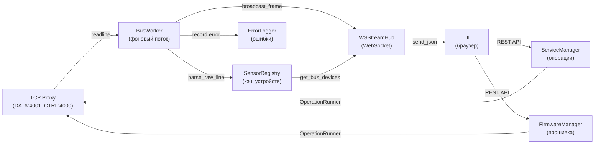

# Device Manager — NMEA 2000 Bus Facade

## Metadata

- id: 002
- type: feature
- status: as-is
- owner: yacht-n2k-console
- date: 2026-08-02

## Context

Device Manager — центральный фасад для управления NMEA 2000 шиной и операциями YDNU-02. Система отвечает за:

1. **Непрерывное чтение N2K трафика** — BusWorker подключается к TCP прокси (порт 4001) и парсит NMEA фреймы в фоновом потоке.
2. **Отслеживание состояния устройств** — SensorRegistry кэширует информацию об устройствах (ISO Address Claim, Product Info) и сенсорах (уровни жидкостей).
3. **Трансляция в WebSocket** — WSStreamHub транслирует сырые фреймы и результаты сканирования шины в подключённые WS клиенты.
4. **Управление сервисными операциями** — ServiceManager, OperationRunner и FirmwareManager обеспечивают интерактивные операции (backup, reset, firmware flash) с правильной синхронизацией потоков.
5. **Логирование ошибок** — ErrorLogger собирает CAN ошибки (PGN 126993 Heartbeat с State:Error) в кольцевой буфер.

Система работает в режиме TCP прокси (YDNU-02 как шлюз) и поддерживает как автоматический мониторинг, так и интерактивные операции на устройстве.

## Requirements

### Функциональные требования

1. **Непрерывное чтение шины** — BusWorker должен подключаться к TCP DATA порту (4001), читать NMEA строки и парсить их через N2KPGNDecoder.
2. **Отслеживание устройств** — SensorRegistry должна кэшировать информацию об устройствах по Source Address (SA), включая ISO Address Claim (PGN 60928) и Product Info (PGN 126996).
3. **Отслеживание сенсоров** — SensorRegistry должна парсить PGN 127505 (Fluid Level) и обновлять состояние GobiusCSensor.
4. **Трансляция в WebSocket** — WSStreamHub должна поддерживать два режима: `monitor_raw` (сырые фреймы) и `scan_bus` (сканирование с ISO Requests).
5. **Сервисные операции** — ServiceManager должна поддерживать: get_info, get_filters, get_settings, create_backup, reset_mcu, reset_hardware, enter_service, exit_service.
6. **Обновление прошивки** — FirmwareManager должна поддерживать flash_firmware (через passthrough) и check_latest_firmware (скрейпинг yachtd.com).
7. **Логирование ошибок** — ErrorLogger должна собирать CAN ошибки в кольцевой буфер (max 500 событий) и предоставлять фильтрацию по SA.
8. **Синхронизация потоков** — все операции должны использовать service_lock (сериализация), pause_event (остановка BusWorker), controller_lock (синхронизация с on_frame callback).

### Нефункциональные требования

- **Производительность** — BusWorker должен обрабатывать ≥100 фреймов/сек без потерь.
- **Надёжность** — TCP переподключение с экспоненциальной задержкой (макс 30 сек).
- **Потокобезопасность** — все общие структуры данные защищены threading.Lock.
- **Совместимость** — Python 3.13, asyncio, FastAPI WebSocket.

### Out of scope

- Прямое управление серийным портом (только через TCP прокси).
- Парсинг всех PGN (только 60928, 126996, 127505, 126993).
- Хранение истории (только текущее состояние + кольцевой буфер ошибок).

## Architecture & Technical Design

### Компоненты и ответственность

| Модуль | Ответственность | Тесты |
|--------|-----------------|-------|
| `device_manager/manager.py` | Центральный фасад, инициализация компонентов, делегирование | `tests/test_bus_scanner.py`, `tests/test_integration.py` |
| `device_manager/bus_worker.py` | Фоновый поток чтения TCP, переподключение, парсинг NMEA | `tests/test_integration.py` (serial_to_tcp_delivery) |
| `device_manager/tcp_connection.py` | TCP соединение (DATA + CTRL порты), passthrough для сервисных операций | `tests/test_integration.py` (client_frame_forwarded) |
| `device_manager/sensor_registry.py` | Кэш устройств (SA → device info), парсинг PGN 60928/126996/127505, fast-packet reassembly | `tests/test_sensors_service.py` (nmea_pgn_parsing) |
| `device_manager/ws_stream_hub.py` | WebSocket endpoints (monitor_raw, scan_bus), трансляция фреймов | `tests/test_bus_scanner.py` (decoder_fast_packet_and_claim) |
| `device_manager/service_manager.py` | Сервисные операции (info, filters, backup, reset), кэширование с TTL | `tests/test_device_contract.py` |
| `device_manager/firmware_manager.py` | OTA flash (passthrough), скрейпинг yachtd.com для версий | (нет прямых тестов) |
| `device_manager/operation_runner.py` | Три паттерна операций (service, locked, raw), синхронизация потоков | (используется в service_manager) |
| `device_manager/error_logger.py` | Кольцевой буфер CAN ошибок (max 500), фильтрация по SA | (используется в manager) |

### Жизненный цикл Discovery устройств

```
1. BusWorker подключается к TCP DATA порту (4001)
   ↓
2. WSStreamHub.scan_bus() отправляет ISO Requests (PGN 60928, 126996)
   ↓
3. BusWorker читает ответы, парсит через N2KPGNDecoder
   ↓
4. SensorRegistry.update() обновляет discovered_bus_devices[SA]:
   - PGN 60928 → ISO Address Claim (manufacturer, unique_id, device_class)
   - PGN 126996 → Product Info (model, serial, firmware) — fast-packet reassembly
   ↓
5. WSStreamHub.scan_bus() транслирует device messages в WebSocket
   ↓
6. UI отображает таблицу устройств
```

### Модель состояния сенсоров

```
GobiusCSensor (instance, name):
  ├─ nmea_raw (from PGN 127505):
  │  ├─ level_pct (0–100%)
  │  ├─ capacity_l (литры)
  │  ├─ type_code (0=Fuel, 1=Fresh Water, ...)
  │  └─ src (Source Address)
  ├─ ble_raw (from BLE GATT FFF2):
  │  ├─ fill_pct
  │  ├─ volume_l
  │  └─ distance_mm
  └─ display (merged):
     ├─ fill_level_pct (from NMEA или BLE)
     ├─ calculated_l (fill_pct × capacity_l)
     └─ fluid_type_name
```

### Обработка ошибок и длительных операций

```
ErrorLogger:
  - Слушает все фреймы через _update_sensor_state()
  - Ловит PGN 126993 (Heartbeat) с State:Error
  - Парсит error_fields (regex: "Error.*?:.*?(?=\s+\w+:|$)")
  - Кольцевой буфер: 500 событий, FIFO
  - API: GET /api/errors?limit=100&src=92

OperationRunner (три паттерна):
  1. service_operation() — полная интерактивная сессия (MODE RAW, SILENT)
  2. locked_operation() — OS shell команда (echo в закрытый порт)
  3. raw_locked_operation() — raw passthrough (reboot, firmware flash)
  
  Все паттерны:
    - Захватывают service_lock (сериализация)
    - Устанавливают pause_event (BusWorker останавливается)
    - Открывают ProxyControlClient на CTRL порту (4000)
    - Выполняют func(ctrl) с ctrl._passthrough = PCC
    - Снимают pause_event (BusWorker возобновляется)
```

### Сервисный режим и обновление прошивки

```
ServiceManager.enter_service():
  1. OperationRunner.service_operation()
  2. ProxyControlClient.enter_service() → "SERVICE_START\r\n"
  3. YDNU02Controller.enter_service_mode() → читает welcome text
  4. Пользователь может отправлять команды (MODE, SILENT, etc.)
  5. exit_service() → "SERVICE_END\r\n" + "MODE RAW\r\n"

FirmwareManager.flash_firmware(bin_path):
  1. OperationRunner.raw_locked_operation()
  2. ProxyControlClient.enter_service()
  3. YDNU02Controller.update_firmware(bin_path, progress_cb)
  4. Чанковая запись бинарных данных через passthrough
  5. Устройство перезагружается (ctrl._close_terminal() перед reboot)
  6. Кэш info инвалидируется
```

### Диаграмма потоков данных



## Interfaces / Contracts

### REST API (DeviceManager endpoints)

```
GET /api/sensors
  → {"status": "ok", "fluid_levels": [...], "count": N}

GET /api/bus/devices
  → {SA: {"src": SA, "claimed": bool, "manufacturer": str, "model": str, ...}, ...}

GET /api/errors?limit=100&src=92
  → {"count": N, "errors": [{"id": int, "timestamp": float, "src": int, "pgn": int, ...}]}

POST /api/service/info?force=true
  → {"status": "ok", "device": {...}, "cached": bool}

POST /api/service/backup?force=true
  → {"status": "ok", "path": str, "size": int}

POST /api/service/reset-mcu
  → {"status": "ok", "message": str}

POST /api/service/reset-hardware
  → {"status": "ok", "message": str}

POST /api/service/enter
  → {"status": "ok", "welcome": str}

POST /api/service/exit?target_mode=AUTO
  → {"status": "ok"}

POST /api/firmware/flash
  Body: {"bin_path": str}
  → {"status": "ok", "message": str}

GET /api/firmware/latest
  → {"status": "ok", "latest_version": str, "release_date": str, "download_url": str}

GET /api/state
  → {"state": "IDLE" | "LISTENING" | "NO_DEVICE", "port": str}
```

### WebSocket endpoints

```
WS /ws/monitor?duration=300
  → {"type": "frame", "time": str, "pgn": int, "src": int, "decoded": str, "raw": str}

WS /ws/scan?duration=10
  → {"type": "device", "src": int, "claimed": bool, "manufacturer": str, ...}
  → {"type": "scan_complete", "count": int}
```

### N2K PGN обработка

```
PGN 60928 (ISO Address Claim):
  - Парсится через N2KPGNDecoder.parse_device_info()
  - Заполняет: manufacturer, unique_id, device_class, function_name
  - Очищает stale entries (same unique_id или transient src=0)

PGN 126996 (Product Information):
  - Fast-packet reassembly через N2KPGNDecoder.feed_to_lib()
  - Заполняет: model, serial, firmware, model_version
  - Парсится только через library decoder (не в parse_raw_line)

PGN 127505 (Fluid Level):
  - Парсится напрямую из raw bytes
  - Формат: [instance|type_code] [level_lo] [level_hi] [cap_0] [cap_1] [cap_2] [cap_3]
  - level_pct = (level_raw × 0.004) если level_raw ≤ 25000
  - capacity_l = (cap_raw × 0.1) если cap_raw ≠ 0xFFFFFFFF

PGN 126993 (Heartbeat):
  - Ловится ErrorLogger если decoded содержит "error|fault|fail|bus off"
  - Исключение: "error active" — нормальное состояние CAN контроллера
```

## Implementation Plan

### Уже реализовано

1. **BusWorker** (`device_manager/bus_worker.py`):
   - ✅ Фоновый поток с переподключением (exponential backoff до 30 сек)
   - ✅ Чтение TCP DATA порта (4001) с readline()
   - ✅ Парсинг через N2KPGNDecoder.parse_raw_line()
   - ✅ Callback on_frame для каждого фрейма
   - ✅ Pause/resume через pause_event

2. **SensorRegistry** (`device_manager/sensor_registry.py`):
   - ✅ Кэш discovered_bus_devices[SA] с полной информацией
   - ✅ Парсинг PGN 60928 (ISO Address Claim) с очисткой stale entries
   - ✅ Fast-packet reassembly для PGN 126996 (Product Info) через library decoder
   - ✅ Парсинг PGN 127505 (Fluid Level) с расчётом level_pct и capacity_l
   - ✅ Thread-safe доступ через external lock

3. **WSStreamHub** (`device_manager/ws_stream_hub.py`):
   - ✅ monitor_raw() — трансляция сырых фреймов в WebSocket
   - ✅ scan_bus() — отправка ISO Requests, сбор device messages
   - ✅ broadcast_frame() — push в asyncio queues (thread-safe)
   - ✅ _build_device_msg() — форматирование device summary

4. **ServiceManager** (`device_manager/service_manager.py`):
   - ✅ get_info() с кэшированием (TTL 60 сек)
   - ✅ get_filters(), get_settings(), get_diag()
   - ✅ create_backup() с поиском существующих бэкапов
   - ✅ reset_mcu(), reset_hardware()
   - ✅ enter_service(), exit_service()
   - ✅ send_service_cmd() для произвольных команд

5. **FirmwareManager** (`device_manager/firmware_manager.py`):
   - ✅ flash_firmware() с progress callback
   - ✅ check_latest_firmware() — скрейпинг yachtd.com/downloads/
   - ✅ Парсинг HTML для версии, даты, changelog

6. **OperationRunner** (`device_manager/operation_runner.py`):
   - ✅ service_operation() — полная интерактивная сессия
   - ✅ locked_operation() — OS shell команда
   - ✅ raw_locked_operation() — raw passthrough
   - ✅ Синхронизация: service_lock, pause_event, controller_lock
   - ✅ 200 мс guard перед захватом CTRL порта

7. **ErrorLogger** (`device_manager/error_logger.py`):
   - ✅ Кольцевой буфер (max 500 событий)
   - ✅ Парсинг error_fields из decoded строки
   - ✅ Фильтрация по SA
   - ✅ Thread-safe доступ

8. **DeviceManager** (`device_manager/manager.py`):
   - ✅ Центральный фасад, инициализация всех компонентов
   - ✅ Делегирование методов (get_sensors_state, get_bus_devices, etc.)
   - ✅ Управление event loop для asyncio
   - ✅ Синхронизация потоков через shared locks

## Verification

### Существующие тесты

- **`tests/test_bus_scanner.py`**:
  - `test_decoder_fast_packet_and_claim()` — парсинг PGN 60928 Address Claim
  - `scan_live_bus()` — live probe режим для сканирования реальной шины

- **`tests/test_integration.py`**:
  - `test_serial_to_tcp_delivery()` — доставка фреймов от serial к TCP клиентам
  - `test_two_clients_both_receive()` — fanout к двум клиентам
  - `test_client_disconnect_does_not_crash()` — graceful disconnect
  - `test_client_frame_forwarded_to_peer()` — bidirectional hub (A → B)
  - `test_client_frame_not_echoed_back()` — no echo back to sender

- **`tests/test_sensors_service.py`**:
  - `test_nmea_standalone()` — парсинг PGN 127505 без BLE
  - `test_nmea_pgn_parsing()` — парсинг реальной CAN линии
  - `test_base_sensor_3_layer_non_interference()` — 3-layer data model (NMEA, BLE, display)

- **`tests/test_n2k_commands.py`**:
  - `test_build_iso_request_frame()` — генерация ISO Request payload
  - `test_build_pgn_126208_command()` — генерация PGN 126208 Group Function
  - `test_base_sensor_3_layer_non_interference()` — NMEA не перезаписывает BLE

- **`tests/test_device_contract.py`**:
  - Контрактные тесты для DeviceManager API

### Критерии приёмки

1. ✅ BusWorker успешно подключается к TCP DATA порту и читает фреймы
2. ✅ SensorRegistry корректно парсит PGN 60928, 126996, 127505
3. ✅ WSStreamHub транслирует фреймы в WebSocket без потерь
4. ✅ ServiceManager выполняет операции с правильной синхронизацией потоков
5. ✅ FirmwareManager скрейпит yachtd.com и обновляет прошивку
6. ✅ ErrorLogger собирает CAN ошибки в кольцевой буфер
7. ✅ Все REST API endpoints возвращают корректные JSON ответы
8. ✅ Все WebSocket endpoints работают без разрывов соединения

## Known Issues

### Ограничения и ловушки

1. **Fast-packet reassembly** — PGN 126996 (Product Info) требует stateful reassembly через library decoder. `parse_raw_line()` намеренно пропускает fast-packet PGNs, чтобы избежать double-feeding singleton `_n2k_decoder` (см. commit 1de3074). Это может привести к потере данных если не использовать `feed_to_lib()`.

2. **Stale device entries** — SensorRegistry очищает старые записи для same unique_id или transient src=0 ghosts. Это может скрыть переходные состояния если unique_id не уникален.

3. **Кэширование info** — ServiceManager кэширует результаты get_info() на 60 сек. Если устройство обновило firmware, кэш может быть устаревшим. Используйте `force=true` для инвалидации.

4. **Timeout в scan_bus()** — WSStreamHub.scan_bus() имеет жёсткий timeout 5 сек на подключение к TCP. На медленных сетях может не подключиться.

5. **Потеря фреймов в monitor_raw()** — asyncio.Queue имеет maxsize=500. Если UI не читает достаточно быстро, фреймы будут потеряны (QueueFull исключение игнорируется).

6. **Passthrough и reboot** — raw_locked_operation() требует, чтобы func() вызвал ctrl._close_terminal() перед reboot. Если этого не сделать, serial port может остаться открытым.

7. **Уникальность unique_id** — NMEA 2000 spec требует unique_id > 0 для валидного Address Claim. Если устройство отправляет unique_id=0, оно считается transient и может быть очищено.

8. **Скрейпинг yachtd.com** — FirmwareManager.check_latest_firmware() зависит от HTML структуры yachtd.com. Если сайт изменится, regex может не работать.

### Ссылки на патчи и документацию

- **nmea2000 lib fork** — `requirements.txt` использует форк с unique_number fix (см. `nmea2000-setup` skill)
- **HA patches** — `patches/` содержит патчи для Home Assistant decoder (PGN 126996 hash collision)
- **TCP Gateway архитектура** — см. `TECHNICAL.md` и `nmea2000-setup` skill для деталей data_hub и serial_reader
