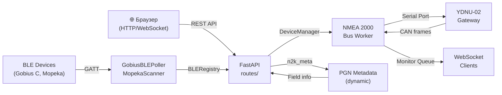

# Веб-слой YDNU-02 Web Console (as-is)

## Metadata

- id: 003
- type: feature
- status: as-is
- owner: yacht-n2k-console
- date: 2026-08-02

## Context

YDNU-02 Web Console — это FastAPI-приложение, предоставляющее REST API и WebSocket-каналы для управления NMEA 2000 USB Gateway. Веб-слой интегрирует:

- **Управление устройством**: информация о шлюзе, режимы работы (AUTO, RAW, N2K, 0183), состояние датчиков
- **Конфигурация N2K**: динамическое чтение/запись параметров устройств на шине (PGN 126208 Group Function)
- **BLE-датчики**: Gobius C (двухканальный BLE+N2K) и Mopeka Pro 200 (BLE-только)
- **Сервисные операции**: резервные копии, диагностика, сброс, обновление прошивки
- **Мониторинг**: WebSocket-трансляция сырых CAN-кадров и результатов сканирования шины
- **Статический контент**: HTML-интерфейс с табами (Dashboard, Gobius, Mopeka, Monitor, Service, Maintenance, Network)

Веб-слой использует `DeviceManager` (управление NMEA 2000 шиной), `BLERegistry` (реестр BLE-датчиков), `MopekaScanner` (фоновое сканирование Mopeka), `GobiusBLEPoller` (GATT-опрос Gobius C).

## Requirements

### Функциональные требования

1. **REST API для управления устройством**: GET `/api/info`, `/api/version`, `/api/sensors`, `/api/dashboard/sensors`; POST `/api/mode/{mode}`, `/api/silent/{state}`
2. **REST API для конфигурации N2K**: GET `/api/n2k/devices`, `/api/n2k/devices/{src}/config/{pgn}`; POST `/api/n2k/devices/{src}/config/{pgn}`, `/api/n2k/command`
3. **REST API для BLE-датчиков**: GET/POST/DELETE `/api/ble/sensors`, GET `/api/ble/scan`; GET/POST/DELETE `/api/mopeka/sensor/{mac}`
4. **REST API для Gobius C**: GET `/api/gobius/status`, `/api/gobius/live`; POST `/api/gobius/n2k`, `/api/gobius/user_config`, `/api/gobius/info`, `/api/gobius/command`, `/api/gobius/n2k_command`
5. **REST API для сервиса**: POST `/api/io/pause`, `/api/io/resume`; GET `/api/io/state`, `/api/filters`, `/api/settings`, `/api/diag/{scope}`; POST `/api/service/cmd`, `/api/service/enter`, `/api/service/exit`; GET `/api/service/state`
6. **REST API для резервных копий и сброса**: POST `/api/backup`, `/api/reset/settings`, `/api/reset/filters`, `/api/reset/mcu`, `/api/reset/hardware`; GET `/api/backups`, `/api/backup/download/{filename}`; DELETE `/api/errors`
7. **REST API для прошивки**: GET `/api/firmware/latest`, `/api/firmware/progress`, `/api/firmware/files`; POST `/api/firmware/download`, `/api/firmware/upload`, `/api/firmware/flash/{filename}`
8. **WebSocket-каналы**: `/ws/monitor` (сырые CAN-кадры), `/ws/scan` (результаты сканирования шины)
9. **Статический контент**: GET `/` (index.html), `/static/css/style.css`, `/static/js/*.js`, `/static/tabs/*.html`
10. **Динамическая метаинформация PGN**: модуль `n2k_meta.py` предоставляет метаданные полей PGN без hardcoded реестров

### Нефункциональные требования

- Асинхронная обработка (asyncio, FastAPI)
- CORS включен для всех источников
- Поддержка Raspberry Pi 5 (Python 3.13)
- Graceful shutdown: остановка BLE-сканеров и bus worker при завершении
- Состояние I/O (pause/resume) сохраняется на диск (`io_state.json`)

### Out of scope

- Аутентификация и авторизация
- HTTPS/TLS (используется HTTP)
- Кэширование на уровне HTTP (кроме встроенного кэша info)

## Architecture & Technical Design

### Компоненты

```
┌─────────────────────────────────────────────────────────────┐
│                    FastAPI Application                      │
│  (app.py: lifespan, CORS, static files, route registration) │
└─────────────────────────────────────────────────────────────┘
                              │
        ┌─────────────────────┼─────────────────────┐
        │                     │                     │
        ▼                     ▼                     ▼
   ┌─────────────┐    ┌──────────────┐    ┌──────────────┐
   │ DeviceManager│    │ BLERegistry  │    │MopekaScanner │
   │ (NMEA 2000) │    │ (JSON config)│    │ (BLE scan)   │
   └─────────────┘    └──────────────┘    └──────────────┘
        │                     │                     │
        ▼                     ▼                     ▼
   ┌─────────────┐    ┌──────────────┐    ┌──────────────┐
   │ Routes:     │    │ Routes:      │    │ Routes:      │
   │ device.py   │    │ ble.py       │    │ mopeka.py    │
   │ service.py  │    │ gobius.py    │    │              │
   │ n2k.py      │    │              │    │              │
   │ n2k_config  │    │              │    │              │
   │ firmware.py │    │              │    │              │
   │ maintenance │    │              │    │              │
   │ websockets  │    │              │    │              │
   └─────────────┘    └──────────────┘    └──────────────┘
        │
        ▼
   ┌─────────────────────────────────────┐
   │ n2k_meta.py (PGN metadata)          │
   │ n2k_command_builder.py (frame gen)  │
   └─────────────────────────────────────┘
```

### Потоки данных

1. **Браузер → FastAPI routes → DeviceManager → NMEA 2000 шина**
   - Пользователь отправляет HTTP-запрос (GET/POST)
   - Route получает параметры, вызывает метод DeviceManager
   - DeviceManager отправляет команду на шину (serial port)
   - Ответ возвращается в JSON

2. **NMEA 2000 шина → DeviceManager → WebSocket → Браузер**
   - Bus worker читает сырые CAN-кадры из serial port
   - Кадры помещаются в очередь мониторинга
   - WebSocket-клиент получает кадры в реальном времени

3. **BLE-датчик → GobiusBLEPoller/MopekaScanner → Registry → REST API → Браузер**
   - Фоновый поллер читает GATT-характеристики
   - Данные сохраняются в памяти и реестре
   - REST API возвращает текущее состояние

### Ключевые решения

- **Ленивая инициализация DeviceManager**: создается до импорта routes, чтобы избежать циклических импортов
- **Глобальное состояние I/O**: сохраняется на диск для восстановления после перезагрузки
- **Асинхронные операции**: длительные операции (backup, firmware) выполняются в thread pool
- **Динамическая метаинформация PGN**: `n2k_meta.py` парсит метаданные из nmea2000 lib, не использует hardcoded реестры
- **Unified BLE registry**: единый реестр для Gobius и Mopeka, синхронизация с MopekaScanner



## Interfaces / Contracts

### HTTP-эндпоинты

#### Device Management (`routes/device.py`)

| Метод | Путь | Назначение | Параметры | Ответ |
|-------|------|-----------|-----------|--------|
| GET | `/api/info` | Информация о шлюзе (cached) | `force=bool` | `{firmware_version, serial_number, state, port, app_version}` |
| GET | `/api/version` | Версия приложения | — | `{version}` |
| GET | `/api/sensors` | Текущее состояние датчиков (live) | — | `{status, fluid_levels: [{src, instance, type, level_pct, capacity_l}], count}` |
| GET | `/api/dashboard/sensors` | Объединенный список датчиков (registry + live) | — | `{sensors: [{mac, type, name, channels: [{name, age_sec, live, fields}]}]}` |
| GET | `/api/errors` | История ошибок CAN-шины | `limit=int, src=int` | `{errors: [{timestamp, src, pgn, error_code}]}` |
| DELETE | `/api/errors` | Очистить историю ошибок | — | `{status}` |
| POST | `/api/mode/{mode}` | Установить режим (auto, 0183, raw, n2k) | `mode` | `{status, message}` |
| POST | `/api/silent/{state}` | Включить/отключить silent mode | `state: on\|off` | `{status, message}` |

#### Service Operations (`routes/service.py`)

| Метод | Путь | Назначение | Параметры | Ответ |
|-------|------|-----------|-----------|--------|
| POST | `/api/io/pause` | Остановить I/O (serial + BLE) | — | `{paused: true, serial: stopped, gobius: stopped, mopeka: stopped}` |
| POST | `/api/io/resume` | Возобновить I/O | — | `{paused: false, serial: running, gobius: running, mopeka: running}` |
| GET | `/api/io/state` | Текущее состояние I/O | — | `{paused, serial, gobius, mopeka}` |
| GET | `/api/filters` | Список фильтров CAN-шины | — | `{filters: [{pgn, enabled}]}` |
| GET | `/api/settings` | Параметры шлюза (raw) | — | `{settings_raw}` |
| GET | `/api/diag/{scope}` | Диагностика (ALL, SERIAL, BUS, BLE) | `scope` | `{data}` |
| POST | `/api/service/cmd` | Отправить команду в service mode | `{cmd: str}` | `{response}` |
| POST | `/api/service/enter` | Войти в service mode | — | `{status, state}` |
| POST | `/api/service/exit` | Выйти из service mode | — | `{status, state}` |
| GET | `/api/service/state` | Состояние service mode | — | `{state}` |
| GET | `/api/gw/settings` | Параметры Gateway Settings | — | `{settings: {key: value}}` |
| POST | `/api/gw/settings` | Обновить Gateway Settings | `{key: value}` | `{status, settings}` |

#### NMEA 2000 Configuration (`routes/n2k.py`, `routes/n2k_config.py`)

| Метод | Путь | Назначение | Параметры | Ответ |
|-------|------|-----------|-----------|--------|
| GET | `/api/n2k/devices` | Список устройств на шине | — | `{devices: [{src, product_code, device_instance, pgn_list}]}` |
| GET | `/api/n2k/devices/{src}/config/{pgn}` | Прочитать конфиг устройства (PGN 126208) | `src, pgn` | `{status, pgn, src, fields: {field_name: value}}` |
| POST | `/api/n2k/devices/{src}/config/{pgn}` | Записать конфиг устройства | `src, pgn, {fields: {field_name: value}}` | `{status, fields}` |
| GET | `/api/n2k/metadata/{pgn}` | Метаданные полей PGN | `pgn` | `{pgn, name, fields: [{name, type, unit, min, max}]}` |
| POST | `/api/n2k/command` | Отправить PGN 126208 команду | `{target_address, target_pgn, fields}` | `{status, message, command, hex}` |

#### BLE Sensors (`routes/ble.py`)

| Метод | Путь | Назначение | Параметры | Ответ |
|-------|------|-----------|-----------|--------|
| GET | `/api/ble/sensors` | Список зарегистрированных BLE-датчиков | `type=str` | `{sensors: [{mac, type, name, ...config}]}` |
| POST | `/api/ble/sensors` | Добавить BLE-датчик в реестр | `{mac, type, name, ...extra}` | `{status, sensor}` |
| PUT | `/api/ble/sensors/{mac}` | Обновить конфиг датчика | `mac, {name, tank_depth_mm, capacity_l, ...}` | `{status, sensor}` |
| DELETE | `/api/ble/sensors/{mac}` | Удалить датчик из реестра | `mac` | `{status}` |
| GET | `/api/ble/scan` | Сканировать BLE-устройства | `duration=float` | `{devices: [{mac, name, type, rssi, registered}], duration}` |

#### Gobius C (`routes/gobius.py`)

| Метод | Путь | Назначение | Параметры | Ответ |
|-------|------|-----------|-----------|--------|
| GET | `/api/gobius/status` | Статус Gobius C (GATT read) | — | `{connected, address, device, status, user_config, n2k_config}` |
| GET | `/api/gobius/live` | Live данные Gobius (без GATT) | — | `{connected, address, device, status}` |
| POST | `/api/gobius/refresh` | Обновить статус (force GATT read) | — | `{status, config}` |
| POST | `/api/gobius/n2k` | Записать N2K конфиг (GATT write) | `{enabled, fluid_instance, fluid_type, capacity}` | `{status, config}` |
| POST | `/api/gobius/user_config` | Записать user config (GATT write) | `{fluid_type, capacity, depth}` | `{status, config}` |
| POST | `/api/gobius/info` | Записать info strings (GATT write) | `{info1, info2}` | `{status}` |
| POST | `/api/gobius/command` | Отправить raw GATT command | `{cmd_hex}` | `{status, response}` |
| POST | `/api/gobius/n2k_command` | Отправить N2K команду через Gobius | `{target_pgn, fields}` | `{status, message}` |

#### Mopeka (`routes/mopeka.py`)

| Метод | Путь | Назначение | Параметры | Ответ |
|-------|------|-----------|-----------|--------|
| GET | `/api/mopeka/sensors` | Список Mopeka датчиков | — | `{sensors: [{mac_address, name, level_pct, temperature, source}]}` |
| GET | `/api/mopeka/sensor/{mac}` | Данные конкретного Mopeka датчика | `mac` | `{mac_address, name, level_pct, temperature, source}` |
| POST | `/api/mopeka/config/{mac}` | Обновить конфиг Mopeka датчика | `mac, {name, tank_depth_mm, capacity_l, fluid_type}` | `{status, sensor}` |
| DELETE | `/api/mopeka/sensor/{mac}` | Удалить Mopeka датчик | `mac` | `{status}` |

#### Firmware (`routes/firmware.py`)

| Метод | Путь | Назначение | Параметры | Ответ |
|-------|------|-----------|-----------|--------|
| GET | `/api/firmware/latest` | Проверить последнюю версию (yachtd.com) | — | `{status, latest_version, download_url}` |
| GET | `/api/firmware/progress` | Прогресс обновления | — | `{progress_pct, status}` |
| GET | `/api/firmware/files` | Список загруженных .BIN файлов | — | `{files: [filename]}` |
| POST | `/api/firmware/download` | Скачать и распаковать ZIP | — | `{status, version, files: [{filename, size}]}` |
| POST | `/api/firmware/upload` | Загрузить .BIN файл | `file: UploadFile` | `{status, filename, path, size}` |
| POST | `/api/firmware/flash/{filename}` | Прошить устройство | `filename` | `{status, message}` |

#### Maintenance (`routes/maintenance.py`)

| Метод | Путь | Назначение | Параметры | Ответ |
|-------|------|-----------|-----------|--------|
| POST | `/api/backup` | Создать резервную копию | `force=bool` | `{status, filepath, timestamp}` |
| GET | `/api/backups` | Список резервных копий | — | `{backups: [{filename, size, timestamp}]}` |
| GET | `/api/backup/download/{filename}` | Скачать резервную копию | `filename` | `FileResponse (JSON)` |
| POST | `/api/reset/settings` | Сбросить параметры | — | `{status, message}` |
| POST | `/api/reset/filters` | Сбросить фильтры | — | `{status, message}` |
| POST | `/api/reset/mcu` | Перезагрузить MCU | — | `{status, message}` |
| POST | `/api/reset/hardware` | Полный сброс (требует подтверждение) | `{confirm: "RESET"}` | `{status, message}` |

#### Static Files

| Метод | Путь | Назначение |
|-------|------|-----------|
| GET | `/` | index.html (главная страница) |
| GET | `/static/css/style.css` | Стили |
| GET | `/static/js/core.js` | Основной JS (инициализация, API клиент) |
| GET | `/static/js/dashboard.js` | Dashboard таб |
| GET | `/static/js/gobius.js` | Gobius C таб |
| GET | `/static/js/mopeka.js` | Mopeka таб |
| GET | `/static/js/monitor.js` | Monitor таб (WebSocket) |
| GET | `/static/js/service.js` | Service таб |
| GET | `/static/js/maintenance.js` | Maintenance таб |
| GET | `/static/js/network.js` | Network таб |
| GET | `/static/js/n2k_config.js` | N2K Config таб |
| GET | `/static/tabs/*.html` | HTML-фрагменты табов |

### WebSocket-каналы

#### `/ws/monitor`

**Назначение**: Трансляция сырых CAN-кадров в реальном времени.

**Инициализация клиента**:
```json
{
  "duration": 300
}
```

**Формат сообщения**:
```json
{
  "timestamp": "2026-08-02T10:33:00.123456",
  "raw": "09F80340 00 01 02 03 04 05 06 07",
  "pgn": 61952,
  "src": 3,
  "dst": 255,
  "priority": 6,
  "parsed": {
    "field1": "value1",
    "field2": "value2"
  }
}
```

#### `/ws/scan`

**Назначение**: Результаты сканирования NMEA 2000 шины (ISO Request → Address Claim).

**Инициализация клиента**:
```json
{
  "duration": 10
}
```

**Формат сообщения**:
```json
{
  "timestamp": "2026-08-02T10:33:00.123456",
  "src": 42,
  "device": {
    "product_code": 12345,
    "device_instance": 0,
    "pgn_list": [127505, 127506, 127507]
  }
}
```

### Роль `n2k_meta.py`

Модуль `n2k_meta.py` предоставляет **динамическую метаинформацию PGN** без hardcoded реестров:

- **`get_pgn_field_metadata(pgn: int)`**: Возвращает список полей PGN с типами, единицами, диапазонами
- **`get_pgn_name(pgn: int)`**: Возвращает человеческое имя PGN
- **`build_iso_request_frame(requested_pgn: int)`**: Строит ISO Request (PGN 59904) для сканирования
- **`build_read_fields_frame(target_src, target_pgn)`**: Строит PGN 126208 Read Fields
- **`build_write_fields_frame(target_src, target_pgn, field_pairs)`**: Строит PGN 126208 Write Fields
- **`build_command_frame(target_src, target_pgn, field_pairs)`**: Строит PGN 126208 Command
- **`parse_device_info(raw_line)`**: Парсит Address Claim (PGN 60928)
- **`parse_pgn_list(raw_line)`**: Парсит Product Information (PGN 126996)
- **`decode_raw_line(raw_line)`**: Декодирует сырой CAN-кадр в поля

**Ключевое правило**: Метаданные извлекаются из nmea2000 lib, не используются hardcoded реестры. Это позволяет поддерживать новые PGN без изменения кода.

### Модель данных

#### Sensor (BLE Registry)
```json
{
  "mac": "2C:A7:74:21:56:D8",
  "type": "gobius",
  "name": "Fresh Water Tank",
  "tank_depth_mm": 500,
  "capacity_l": 150,
  "fluid_type": 1
}
```

#### Device (NMEA 2000 Bus)
```json
{
  "src": 42,
  "product_code": 12345,
  "device_instance": 0,
  "pgn_list": [127505, 127506, 127507],
  "last_seen": "2026-08-02T10:33:00"
}
```

#### Fluid Level (PGN 127505)
```json
{
  "src": 42,
  "instance": 0,
  "type": 1,
  "level_pct": 75.5,
  "capacity_l": 150,
  "age_sec": 2
}
```

## Implementation Plan

Уже реализовано (as-is):

1. **FastAPI приложение** (`app.py`):
   - Инициализация с lifespan (graceful shutdown)
   - CORS middleware для всех источников
   - Регистрация 10 роутеров
   - Монтирование статических файлов

2. **Device Management** (`routes/device.py`):
   - GET `/api/info` (cached + force)
   - GET `/api/version`
   - GET `/api/sensors` (live)
   - GET `/api/dashboard/sensors` (unified)
   - GET/DELETE `/api/errors`
   - POST `/api/mode/{mode}`
   - POST `/api/silent/{state}`

3. **Service Operations** (`routes/service.py`):
   - POST `/api/io/pause`, `/api/io/resume`
   - GET `/api/io/state`
   - GET `/api/filters`, `/api/settings`, `/api/diag/{scope}`
   - POST `/api/service/cmd`, `/api/service/enter`, `/api/service/exit`
   - GET `/api/service/state`
   - GET/POST `/api/gw/settings`

4. **NMEA 2000 Configuration** (`routes/n2k.py`, `routes/n2k_config.py`):
   - GET `/api/n2k/devices`
   - GET/POST `/api/n2k/devices/{src}/config/{pgn}`
   - GET `/api/n2k/metadata/{pgn}`
   - POST `/api/n2k/command` (PGN 126208)

5. **BLE Sensors** (`routes/ble.py`):
   - GET/POST/DELETE `/api/ble/sensors`
   - PUT `/api/ble/sensors/{mac}`
   - GET `/api/ble/scan`

6. **Gobius C** (`routes/gobius.py`):
   - GET `/api/gobius/status`, `/api/gobius/live`
   - POST `/api/gobius/refresh`, `/api/gobius/n2k`, `/api/gobius/user_config`, `/api/gobius/info`
   - POST `/api/gobius/command`, `/api/gobius/n2k_command`

7. **Mopeka** (`routes/mopeka.py`):
   - GET `/api/mopeka/sensors`, `/api/mopeka/sensor/{mac}`
   - POST `/api/mopeka/config/{mac}`
   - DELETE `/api/mopeka/sensor/{mac}`

8. **Firmware** (`routes/firmware.py`):
   - GET `/api/firmware/latest`, `/api/firmware/progress`, `/api/firmware/files`
   - POST `/api/firmware/download`, `/api/firmware/upload`, `/api/firmware/flash/{filename}`

9. **Maintenance** (`routes/maintenance.py`):
   - POST `/api/backup`, `/api/reset/settings`, `/api/reset/filters`, `/api/reset/mcu`, `/api/reset/hardware`
   - GET `/api/backups`, `/api/backup/download/{filename}`

10. **WebSocket** (`routes/websockets.py`):
    - `/ws/monitor` (CAN frames)
    - `/ws/scan` (bus discovery)

11. **Dynamic PGN Metadata** (`n2k_meta.py`):
    - Парсинг метаданных из nmea2000 lib
    - Построение ISO Request, Read/Write Fields, Command frames
    - Декодирование сырых кадров

12. **Static Content**:
    - index.html (главная страница)
    - CSS (style.css)
    - JS модули (core.js, dashboard.js, gobius.js, mopeka.js, monitor.js, service.js, maintenance.js, network.js, n2k_config.js)
    - HTML табы (dashboard.html, gobius.html, mopeka.html, monitor.html, service.html, maintenance.html, network.html, modal_ble_scan.html)

## Verification

### Существующие тесты

- **`tests/test_api.py`**: Интеграционные тесты REST API (43 теста)
  - Device info, version, sensors, dashboard
  - Mode, silent, errors
  - Backups, service ops, firmware, reset
  - Gobius C (status, n2k write, user config, info)
  - BLE scan, static files

- **`tests/test_ble_api.py`**: Тесты BLE Registry и MopekaScanner (8 тестов)
  - Registry → Gobius routes (MAC lookup)
  - Registry → Mopeka scanner (sensor sync)
  - Add/remove/update lifecycle

- **`tests/specs/device.py`**: Spec-тесты Device API
- **`tests/specs/service.py`**: Spec-тесты Service API
- **`tests/specs/firmware.py`**: Spec-тесты Firmware API
- **`tests/specs/maintenance.py`**: Spec-тесты Maintenance API
- **`tests/specs/static.py`**: Spec-тесты Static Files

### Критерии приёмки

- Все HTTP-эндпоинты возвращают JSON с ожидаемыми ключами
- WebSocket-каналы передают сообщения в реальном времени
- BLE Registry синхронизирует данные с MopekaScanner
- Gobius C GATT-операции работают без ошибок
- Динамическая метаинформация PGN загружается из nmea2000 lib
- Static files доступны по правильным путям
- I/O pause/resume корректно останавливает/возобновляет serial + BLE

## Known Issues

### Ограничения

1. **Отсутствие аутентификации**: API доступен всем без проверки прав
2. **HTTP только**: Нет HTTPS/TLS, небезопасно для публичных сетей
3. **Кэширование info**: Может быть устаревшим, требует `force=true` для обновления
4. **Timeout WebSocket**: Если клиент не отправит конфиг в течение 2 сек, используется default duration
5. **Gobius C dual-channel**: Если N2K broadcasting отключен на датчике, PGN 126208 команды не будут приняты (safety guard в `/api/n2k/command`)
6. **Mopeka BLE adapter**: Сканирование Mopeka может конфликтовать с другими BLE операциями (pause/resume требуется)

### Ловушки

- **Circular imports**: DeviceManager создается в app.py до импорта routes, чтобы избежать циклических зависимостей
- **Global I/O state**: Состояние pause/resume сохраняется на диск, но может быть несинхронизировано при краше
- **PGN 126996 hash collision**: Известный баг nmea2000 lib (см. `.agents/skills/nmea2000-setup/SKILL.md`)
- **HA registry accumulation**: При деплое на Home Assistant может накапливаться мусор (см. patches/)

### Ссылки

- `.agents/skills/nmea2000-setup/SKILL.md`: Полная база знаний по N2K, TCP Gateway, HA patches
- `patches/`: Патчи для nmea2000 lib и Home Assistant
- `TECHNICAL.md`: Техническая документация проекта
