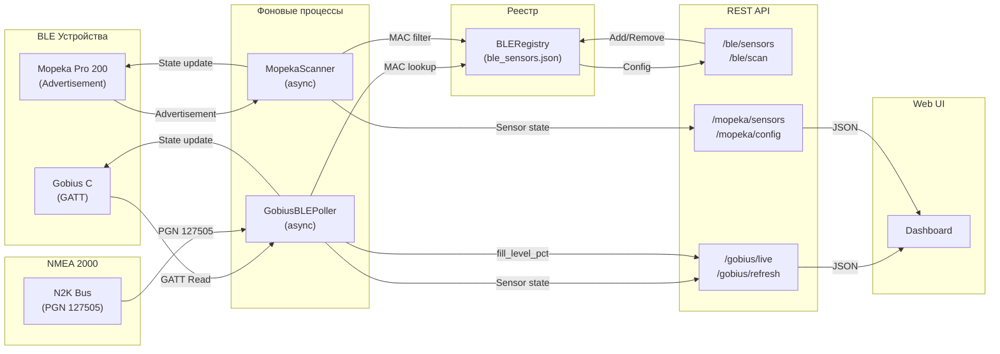

# BLE-сенсоры (Gobius C + Mopeka Pro 200)

## Metadata

- id: 004
- type: n2k-device
- status: as-is
- owner: yacht-n2k-console
- date: 2026-08-02

## Context

Подсистема BLE-сенсоров интегрирует два типа устройств:

1. **Gobius C** — радарный датчик уровня жидкости с BLE + NMEA 2000 интерфейсом. Производитель: Gobius Sensor Technology AB. Подключается к шине N2K и одновременно транслирует конфигурацию и телеметрию по BLE (GATT).

2. **Mopeka Pro 200** — пассивный BLE датчик уровня топлива/воды. Производитель: Mopeka. Транслирует только BLE-реклам (advertisement), без NMEA 2000.

**Правило проекта**: N2K — основной источник данных (fill_level_pct, capacity_l для Gobius). BLE — только конфигурация (geometry, fluid_type) и дополнительная телеметрия (temperature, voltage, distance).

## Requirements

### Функциональные требования

1. **Gobius C — источник данных уровня — NMEA 2000.** `fill_level_pct`, `capacity_l`, `fluid_type` берутся из PGN 127505; BLE используется только как источник конфигурации и дополнительной телеметрии.
2. **Gobius C — телеметрия из BLE.** Через GATT читаются `temperature`, `voltage`, `distance_mm`, `inclination`, `uptime`, MAC, `state`, geometry (`distance_empty_mm`, `distance_full_mm`).
3. **Gobius C — конфигурация из BLE.** Через GATT записываются tank geometry (`distance_empty`/`distance_full`), N2K volume, `fluid_type`, device info (serial, firmware, name, comment).
4. **Gobius C — команды устройства.** Поддерживаются `initialize`, `calibrate`, `start`, `stop`, `adv_normal`, `adv_off`.
5. **Опасные команды требуют явного подтверждения.** `adv_off` (отключение BLE-рекламы — устройство перестаёт быть видимым) и `initialize` (сброс к заводским настройкам с потерей калибровки) выполняются только после подтверждения в UI.
6. **Период опроса Gobius C — 30 секунд.** `FFE8` (Status) и `FFF3` (N2K Status) опрашиваются каждые 30 с; `FFE9` (Measurement) приходит по GATT-уведомлениям.
7. **Mopeka Pro 200 — пассивный сбор данных.** Из BLE advertisement извлекаются `distance_mm` (air gap), `temperature`, `voltage`, `battery_pct`, `quality_stars`, `hardware_id`, `sync_pressed`; GATT-подключение не используется.
8. **Mopeka Pro 200 — локальная конфигурация.** `tank_depth_mm`, `capacity_l`, `fluid_type` хранятся в реестре проекта (`ble_registry.py`), а не на устройстве.
9. **Mopeka Pro 200 — расчёт уровня.** `fill_level_pct = (tank_depth_mm - distance_mm) / tank_depth_mm * 100`.
10. **Единый реестр BLE-датчиков.** Все датчики (MAC, тип, конфигурация) хранятся в `ble_sensors.json` через `ble_registry.py`; сканер и поллер работают только по MAC из реестра.

### Нефункциональные требования

- Частота обновления Mopeka — по каждой рекламе, обычно 1–2 Гц; потеря отдельных пакетов не считается отказом.
- Фоновые процессы (`gobius_ble_poller.py`, `mopeka_scanner.py`) асинхронные и не блокируют HTTP/WebSocket-обработку.
- Недоступность BLE-устройства не должна ронять приложение: состояние помечается устаревшим, N2K-данные продолжают отдаваться.
- В спеке и коде — только плейсхолдеры вместо реальных MAC-адресов и hostname/IP.

### Out of scope

- Запись уровня жидкости в Gobius C по NMEA 2000 (устройство не поддерживает N2K write).
- Управление Mopeka Pro 200 по BLE (устройство пассивное, только advertisement).
- Хранение истории показаний датчиков и построение графиков.

## Architecture & Technical Design

### Модули и ответственность

| Модуль | Ответственность | Тесты |
|--------|-----------------|-------|
| `sensors/base_sensor.py` | Базовый класс для всех датчиков, структуры NMEAData и BLEData | — |
| `sensors/gobius_sensor.py` | Состояние Gobius C (NMEA + BLE каналы независимы) | `test_gobius_parsers.py` |
| `sensors/mopeka_sensor.py` | Состояние Mopeka (реклама + локальная конфигурация) | `test_mopeka_parsers.py` |
| `gobius_parsers.py` | Парсеры 20-байтных GATT характеристик (FFE8, FFE9, FFF2, FFF3, FFE6) | `test_gobius_parsers.py`, `test_gobius_ble_writes.py` |
| `mopeka_parsers.py` | Парсер 10-байтной реклам (hardware_id, voltage, temp, ToF, quality) | `test_mopeka_parsers.py` |
| `gobius_ble_poller.py` | Фоновый GATT-клиент, управление подключением, опрос FFE8/FFE9/FFF3 | `test_gobius_ble_nmea.py`, `test_gobius_n2k_protocol.py` |
| `mopeka_scanner.py` | Фоновый BLE-сканер, фильтр по MAC из registry, обновление состояния | `test_ble_api.py` |
| `ble_registry.py` | Единый реестр всех BLE-датчиков (JSON: ble_sensors.json), CRUD + миграция | `test_ble_registry.py` |
| `routes/ble.py` | REST API: /ble/sensors, /ble/scan, add/remove/update | `test_ble_api.py` |
| `routes/gobius.py` | REST API: /gobius/live, /gobius/refresh, write N2K config, commands | `test_gobius_ble_writes.py` |
| `routes/mopeka.py` | REST API: /mopeka/sensors, /mopeka/config | `test_ble_api.py` |

### Диаграмма потоков данных



### Жизненный цикл подключения Gobius

1. **Инициализация**: `GobiusBLEPoller.__init__()` → читает MAC из registry.
2. **Подключение**: `_connect()` → BleakScanner.find_device_by_address() → BleakClient.
3. **Первичное чтение**: `_read_full_unlocked()` → читает все характеристики (FFE8, FFE9, FFF2, FFF3, FFE6, device info).
4. **Подписка на уведомления**: `_subscribe_notifications()` → FFE9 (Measurement) по notify.
5. **Опрос**: `_poll_loop()` → каждые 30 сек читает FFE8 + FFF3, обновляет состояние.
6. **Отключение**: `_disconnect()` → закрывает BleakClient, перезапускает Mopeka scanner.

## Interfaces / Contracts

### GATT-контракты Gobius C

Все характеристики в сервисе `0000180A` (Device Information) и пользовательском сервисе.

| UUID | Имя | Размер | Доступ | Назначение |
|------|-----|--------|--------|-----------|
| `0000ffe8-0000-1000-8000-00805f9b34fb` | Status | 20 байт | R | Состояние, температура, напряжение, MAC, uptime, range |
| `0000ffe9-0000-1000-8000-00805f9b34fb` | Measurement | 20 байт | R/Notify | Уровень (‰), расстояние (мм), наклон (°), envelope sizes |
| `0000fff3-0000-1000-8000-00805f9b34fb` | N2K Status | 20 байт | R | N2K state, source address |
| `0000ffe6-0000-1000-8000-00805f9b34fb` | User Config | 20 байт | R/W | Geometry: distance_empty_mm, distance_full_mm, LP filters |
| `0000fff2-0000-1000-8000-00805f9b34fb` | N2K Config | 20 байт | R/W | N2K enabled, fluid_instance, fluid_type, volume_l |
| `0000ffe7-0000-1000-8000-00805f9b34fb` | Command | 3 байта | W | Команды: initialize, calibrate, start, stop, adv_off |
| `0000ffeb-0000-1000-8000-00805f9b34fb` | Info 1 | 20 байт | R/W | ASCII label (tank name) |
| `0000ffec-0000-1000-8000-00805f9b34fb` | Info 2 | 20 байт | R/W | ASCII label (tank comment) |
| `00002a28-0000-1000-8000-00805f9b34fb` | Firmware Revision | — | R | Firmware version string |
| `00002a25-0000-1000-8000-00805f9b34fb` | Serial Number | — | R | Serial number string |

### Формат FFE8 (Status) — 20 байт, Big-Endian

```
Byte  Поле              Тип      Значение
────────────────────────────────────────────
[0]   ST_ST (State)     uint8    0=Start-Up, 1=Self-Test, 2=Uninit, 3=Uncalibrated,
                                 4=Calibration, 5=Active, 6=Error, 7=Prod-Test, 8=HW-Test
[1]   ST_SB (Status)    uint8    Bits: measuring, calibrating, etc.
[2:6] ST_T (Uptime)     uint32   Seconds since power-on
[6]   ST_ER1 (Error)    uint8    General error code
[7]   ST_ER2 (HW Err)   uint8    Hardware error code
[8]   ST_T (Temp)       int8     Temperature °C (signed)
[9:11] ST_V (Voltage)   uint16   Supply voltage [mV]
[11:17] ST_ID (MAC)     6 bytes  BLE MAC address
[17]  ST_ER3 (Ext HW)   uint8    Extended HW error
[18]  ST_ERR (Radar)    uint8    Radar comm error counter
[19]  ST_RNG (Range)    uint8    0=Zero, 1=Near, 2=Mid, 3=Far
```

**Пример**: `05 08 00 00 74 9a 00 00 1c 2e c0 2c a7 74 21 56 d8 00 00 01`
- State=5 (Active), Uptime=29850s, Temp=28°C, Voltage=11968mV=11.968V, MAC=2C:A7:74:21:56:D8, Range=Near

### Формат FFE9 (Measurement) — 20 байт, Big-Endian

```
Byte  Поле              Тип      Значение
────────────────────────────────────────────
[0]   M_ST (State)      uint8    Copy from Status
[1]   M_SB (Status)     uint8    Status bits
[2]   M_VD (Valid)      uint8    0=invalid, 1=valid
[3:5] M_FL (Fill)       uint16   Fill level [‰] 0-1000 → convert to % ÷10
[5]   M_INC (Incl)      uint8    Inclination [0-90°]
[6:8] M_DIST (Dist)     uint16   Distance from sensor [mm]
[8:10] M_SZR (Env0)     uint16   Envelope size Zero Range
[10:12] M_SNR (Env1)    uint16   Envelope size Near Range
[12:14] M_SMR (Env2)    uint16   Envelope size Mid Range
[14:16] M_SFR (Env3)    uint16   Envelope size Far Range
[16:20] Reserved        4 bytes  —
```

**Пример**: `05 08 01 03 18 05 00 66 00 5e 00 87 01 79 02 d3 00 00 00 00`
- Valid=1, Fill=792‰=79.2%, Incl=5°, Distance=102mm

### Формат FFF2 (N2K Config) — 20 байт, Big-Endian

```
Byte  Поле              Тип      Значение
────────────────────────────────────────────
[0]   Enabled           uint8    0=OFF, 1=ON (N2K transmission)
[1]   Fluid Instance    uint8    0-15 (NMEA 2000 instance)
[2]   Fluid Type        uint8    0=Fuel, 1=Fresh Water, 2=Gray Water, 3=Live Well,
                                 4=Oil, 5=Black Water, 6=Gasoline
[3:9] Reserved          6 bytes  —
[9]   Volume            uint8    Tank volume [L] (1-255)
[10:20] Reserved        10 bytes —
```

**Пример**: `01 00 01 00 00 00 00 00 96 00 00 00 00 00 00 00 00 00 00 00`
- Enabled=1, Instance=0, FluidType=1 (Fresh Water), Volume=150L

### Формат FFE6 (User Config) — 20 байт, Big-Endian

```
Byte  Поле              Тип      Значение
────────────────────────────────────────────
[0:2] UC_DE (Empty)     uint16   Distance when empty [mm]
[2:4] UC_DF (Full)      uint16   Distance when full [mm]
[4]   LP_N (Filter N)   uint8    Low-pass filter N (0-100)
[5]   LP_K (Filter K)   uint8    Low-pass filter K (1-100)
[6]   Config Bits       uint8    Configuration flags
[7]   Out1 Threshold    uint8    Output 1 threshold [%]
[8]   Out1 Hysteresis   uint8    Output 1 hysteresis [%]
[9]   Out2 Threshold    uint8    Output 2 threshold [%]
[10]  Out2 Hysteresis   uint8    Output 2 hysteresis [%]
[11:18] Reserved        7 bytes  —
[18]  Adv Off Time      uint8    Advertising off time [s] (10-255)
[19]  Reserved          1 byte   —
```

**Пример**: `01 2c 00 32 03 15 10 32 05 32 05 00 00 00 00 00 00 00 0a 00`
- Distance_empty=300mm, Distance_full=50mm, LP_N=3, LP_K=21, Adv_off=10s

### Формат FFF3 (N2K Status) — 20 байт

```
Byte  Поле              Тип      Значение
────────────────────────────────────────────
[0]   N2K State         uint8    0=Offline, 1=Claiming, 2=Active, 3=Error
[1]   N2K Source        uint8    Source address on N2K bus (0-253)
[2:20] Reserved         18 bytes —
```

**Пример**: `02 5c 00 00 00 00 00 00 00 00 00 00 00 00 00 00 00 00 00 00`
- N2K_state=2 (Active), N2K_src=92 (0x5C)

### BLE Advertisement Mopeka Pro 200 — 10 байт, Little-Endian (частично)

Manufacturer Data (0x0059 = Nordic):

```
Byte  Поле              Тип      Значение
────────────────────────────────────────────
[0]   HW Byte           uint8    [7]=extended_range, [6:0]=hardware_id
                                 0x03=Pro Check, 0x04=Pro 200, 0x05=Pro Check Univ,
                                 0x08=Water, 0x0A=Pro 200 Water, 0x0C=Pro+ Water
[1]   Battery           uint8    [7]=reserved, [6:0]=voltage_raw (÷32 → V)
[2]   Temp              uint8    [7]=sync_pressed, [6:0]=temp_raw-40 (°C)
[3:5] Level Word        uint16   LE: [15:14]=quality_stars, [13:0]=tof_us
                                 Distance = tof_us * (0.575 - 0.0017*temp_c) [mm]
                                 (для Pro 200 top-down: v_air = 331.3 + 0.606*temp_c)
[5:7] Accel             2 bytes  Accelerometer X, Y
[7:10] MAC Suffix       3 bytes  Last 3 bytes of BLE MAC
```

**Пример**: `04 60 3c e8 83 00 00 aa bb cc`
- HW=Pro 200, Voltage=3.0V, Temp=20°C, ToF=1000µs, Quality=2, MAC_suffix=AABBCC

### Команды (FFE7) — 3 байта

```
Byte  Назначение
──────────────────────────────────────────
[0]   Command code: 'i'=initialize, 'c'=calibrate, 'a'=stop, 'b'=start,
                    'n'=adv_normal, 'o'=adv_off, 'w'=write_info, 's'=secure, 'u'=unsecure
[1:3] Parameter    Big-Endian uint16 (обычно 0)
```

### REST API

#### GET /ble/sensors?type=gobius|mopeka
Список всех BLE-датчиков или отфильтрованный по типу.

#### POST /ble/sensors
Добавить датчик: `{mac, type, name, tank_depth_mm?, capacity_l?, fluid_type?}`

#### PUT /ble/sensors/{mac}
Обновить конфигурацию датчика.

#### DELETE /ble/sensors/{mac}
Удалить датчик из реестра.

#### GET /ble/scan?duration=10
Сканировать BLE устройства (10-30 сек), вернуть список с type identification.

#### GET /gobius/live
Текущее состояние Gobius (NMEA + BLE данные).

#### POST /gobius/refresh
Принудительно прочитать все характеристики Gobius.

#### POST /gobius/write-n2k-config
Записать N2K конфигурацию: `{enabled, fluid_instance, fluid_type, volume_l}`

#### POST /gobius/write-user-config
Записать geometry: `{distance_empty_mm, distance_full_mm, lp_filter_n, lp_filter_k, ...}`

#### POST /gobius/send-command
Отправить команду: `{command: "initialize"|"calibrate"|"start"|"stop"|"adv_off"|...}`

#### GET /mopeka/sensors
Список всех Mopeka датчиков с текущей телеметрией.

#### GET /mopeka/sensor/{mac}
Состояние конкретного Mopeka датчика.

#### POST /mopeka/config/{mac}
Обновить конфигурацию: `{name, tank_depth_mm, capacity_l, fluid_type}`

## Implementation Plan

### Уже реализовано

#### 1. Базовые структуры данных
- ✅ `BaseSensor` — базовый класс с NMEAData и BLEData.
- ✅ `GobiusCSensor` — состояние Gobius (NMEA + BLE каналы).
- ✅ `MopekaSensor` + `MopekaAdvData` — состояние Mopeka.

#### 2. Парсеры
- ✅ `gobius_parsers.py` — парсеры FFE8, FFE9, FFF2, FFF3, FFE6 с полной валидацией.
- ✅ `mopeka_parsers.py` — парсер 10-байтной реклам, расчет distance по ToF.
- ✅ Все парсеры возвращают dict с ошибками или распарсенными данными.

#### 3. Фоновые процессы
- ✅ `GobiusBLEPoller` — async GATT-клиент, управление подключением, опрос FFE8/FFE9/FFF3.
- ✅ `MopekaScanner` — async BLE-сканер, фильтр по MAC из registry.
- ✅ Оба процесса работают независимо, могут паузироваться/возобновляться.

#### 4. Реестр
- ✅ `BLERegistry` — thread-safe JSON-реестр (ble_sensors.json).
- ✅ CRUD операции: add, get, update, remove, get_by_type.
- ✅ Миграция из старого mopeka_config.json.

#### 5. REST API
- ✅ `/ble/sensors` — список, фильтр по типу.
- ✅ `/ble/sensors` POST — добавить датчик.
- ✅ `/ble/sensors/{mac}` PUT/DELETE — обновить/удалить.
- ✅ `/ble/scan` — сканирование с type identification.
- ✅ `/gobius/live` — текущее состояние.
- ✅ `/gobius/refresh` — принудительное чтение.
- ✅ `/gobius/write-n2k-config` — запись FFF2.
- ✅ `/gobius/write-user-config` — запись FFE6.
- ✅ `/gobius/send-command` — отправка команд (FFE7).
- ✅ `/mopeka/sensors` — список Mopeka.
- ✅ `/mopeka/sensor/{mac}` — состояние одного.
- ✅ `/mopeka/config/{mac}` — обновить конфигурацию.

#### 6. Интеграция с N2K
- ✅ `GobiusCSensor.update_from_nmea127505()` — обновление fill_level_pct, capacity_l из PGN 127505.
- ✅ Независимые каналы: NMEA не зависит от BLE, BLE не зависит от NMEA.

#### 7. Тесты
- ✅ `test_gobius_parsers.py` — парсеры FFE8, FFE9, FFF2, FFF3, FFE6 на реальных дампах.
- ✅ `test_mopeka_parsers.py` — парсер реклам, расчет fill_level.
- ✅ `test_ble_registry.py` — CRUD, миграция, persistence.
- ✅ `test_ble_api.py` — интеграция registry → routes → scanner.
- ✅ `test_gobius_ble_writes.py` — byte-level encoding для FFE6, FFF2, FFE7.
- ✅ `test_gobius_ble_nmea.py` — live BLE ↔ NMEA интеграция (требует hardware).
- ✅ `test_gobius_n2k_protocol.py` — live N2K команды (требует hardware).
- ✅ `test_gobius_profile.py` — live профиль Gobius (требует hardware).

## Verification

### Модульные тесты (без hardware)

```bash
python3 -m pytest tests/test_gobius_parsers.py -v
python3 -m pytest tests/test_mopeka_parsers.py -v
python3 -m pytest tests/test_ble_registry.py -v
python3 -m pytest tests/test_ble_api.py -v
python3 -m pytest tests/test_gobius_ble_writes.py -v
```

### Интеграционные тесты (требуют hardware: Gobius C + /dev/ttyACM0)

```bash
python3 -m pytest tests/test_gobius_ble_nmea.py -v
python3 -m pytest tests/test_gobius_n2k_protocol.py -v
python3 -m pytest tests/test_gobius_profile.py -v
```

### Живая проверка

1. **Gobius подключение**:
   - Убедиться, что Gobius C включен и находится в пределах BLE-диапазона.
   - Проверить `/ble/scan` — должен найти Gobius (manufacturer ID 0x0F53).
   - Добавить в registry: `POST /ble/sensors {mac, type: "gobius", name: "Fresh Water"}`.
   - Проверить `/gobius/live` — должны быть NMEA и BLE данные.

2. **Mopeka подключение**:
   - Убедиться, что Mopeka Pro 200 включена и находится в пределах BLE-диапазона.
   - Проверить `/ble/scan` — должна найти Mopeka (manufacturer ID 0x0059).
   - Добавить в registry: `POST /ble/sensors {mac, type: "mopeka", name: "Fuel Tank", tank_depth_mm: 300, capacity_l: 50}`.
   - Проверить `/mopeka/sensors` — должна быть телеметрия (distance_mm, temp, voltage, battery_pct).

3. **Gobius N2K конфигурация**:
   - Прочитать текущую: `GET /gobius/live` → `ble.n2k_state`, `ble.n2k_src`.
   - Изменить fluid_type: `POST /gobius/write-n2k-config {fluid_type: 1}`.
   - Проверить PGN 127505 на шине — должен измениться fluid_type.

4. **Gobius geometry**:
   - Прочитать текущую: `GET /gobius/live` → `ble.distance_empty_mm`, `ble.distance_full_mm`.
   - Изменить: `POST /gobius/write-user-config {distance_empty_mm: 300, distance_full_mm: 50}`.
   - Проверить `/gobius/live` → `ble.computed_fill_pct` должен пересчитаться.

5. **Опасные операции**:
   - `POST /gobius/send-command {command: "adv_off"}` — отключит BLE рекламу на 10 сек (опасно!).
   - `POST /gobius/send-command {command: "initialize"}` — перезагрузит датчик (опасно!).

## Known Issues

### Опасные операции

1. **`adv_off` (FFE7 = 'o')**
   - Отключает BLE рекламу на время, указанное в FFE6[18] (по умолчанию 10 сек).
   - **Риск**: Если отключить на долгое время, датчик станет недоступен по BLE.
   - **Рекомендация**: Использовать только для отладки, не в production.

2. **`initialize` (FFE7 = 'i')**
   - Перезагружает датчик, сбрасывает состояние.
   - **Риск**: Потеря текущих данных, временное отключение.
   - **Рекомендация**: Использовать только при необходимости переинициализации.

3. **`calibrate` (FFE7 = 'c')**
   - Запускает процедуру калибровки (может занять минуты).
   - **Риск**: Датчик недоступен во время калибровки.
   - **Рекомендация**: Выполнять только при необходимости, с предварительным уведомлением пользователя.

### Ловушки протокола

1. **BlueZ InProgress conflict**
   - На Linux, если одновременно запустить Gobius poller и Mopeka scanner, может быть конфликт "InProgress".
   - **Решение**: `GobiusBLEPoller._connect()` останавливает Mopeka scanner перед подключением, затем перезапускает.

2. **Stale BlueZ connection**
   - После краша приложения BlueZ может оставить "зависшее" подключение к Gobius.
   - **Решение**: `GobiusBLEPoller._connect()` вызывает `bluetoothctl disconnect {mac}` перед сканированием.

3. **FFE9 notifications vs polling**
   - FFE9 (Measurement) может быть как по notify, так и по read.
   - **Текущая реализация**: Подписываемся на notify, но также читаем по расписанию (30 сек).
   - **Риск**: Если notify не работает, данные обновляются только каждые 30 сек.

4. **N2K и BLE независимы**
   - Gobius может быть отключен по BLE, но продолжать транслировать PGN 127505 по N2K.
   - **Следствие**: fill_level_pct может быть актуален, но BLE-конфигурация недоступна.
   - **Рекомендация**: Всегда проверять оба канала.

5. **Mopeka — пассивный сканер**
   - Mopeka не имеет GATT-подключения, только слушает реклам.
   - **Следствие**: Нельзя писать конфигурацию на устройство, только локально в registry.
   - **Риск**: Если переподключить Mopeka, локальная конфигурация потеряется (нужно переинициализировать).

6. **Миграция mopeka_config.json**
   - При первом запуске `BLERegistry` автоматически мигрирует старый `mopeka_config.json` → `ble_sensors.json`.
   - **Следствие**: Старый файл переименовывается в `.migrated`, миграция не повторяется.
   - **Риск**: Если вручную удалить `.migrated`, миграция повторится и может перезаписать новые данные.

### Замечания по HA-интеграции

- Gobius транслирует PGN 127505 (Tank Fluid Level) на N2K шину.
- Home Assistant может получить эти данные через N2K gateway.
- BLE-конфигурация (geometry, fluid_type) не транслируется на N2K, только локально в registry.
- Mopeka не имеет N2K-интеграции, только BLE.
