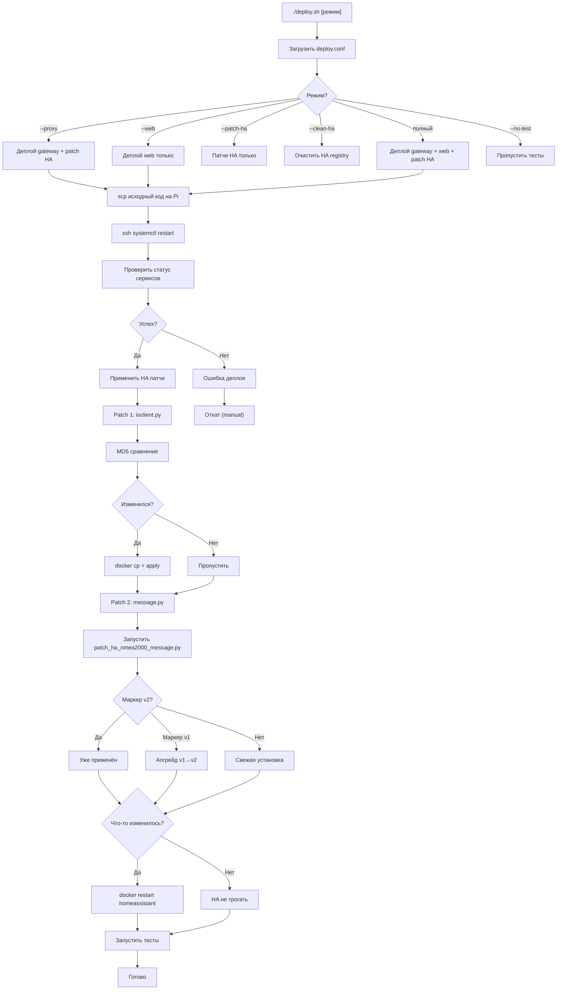

# Деплой и интеграция с Home Assistant (as-is)

## Metadata

- id: 005
- type: feature
- status: as-is
- owner: yacht-n2k-console
- date: 2026-08-02

## Context

Проект yacht-n2k-console состоит из двух независимых systemd-сервисов на Raspberry Pi:

1. **ydnu02-tcp-gateway** — TCP Gateway, читает NMEA 2000 с физического устройства YDNU-02 (`/dev/ttyACM0`), транслирует в TCP на портах `:4001` (DATA broadcast) и `:4002` (CTRL passthrough).
2. **ydnu02-web** — FastAPI веб-консоль на `:8080`, подключается к gateway для отображения данных и управления.

Home Assistant (Docker контейнер на том же хосте) подключается к `:4001` через встроенную интеграцию `ha-nmea2000` и декодирует NMEA 2000 фреймы в сенсоры и устройства.

**Проблема:** Стандартная библиотека `nmea2000` (upstream `tomer-w/nmea2000`) содержит два критических бага:
- **Bug 1:** EOF spin-loop в `ioclient.py` → HA крутится на 100% CPU после рестарта gateway.
- **Bug 2:** Hash collision в `message.py` для PGN 126996 → второе устройство на шине получает 0 entities в HA.

**Решение:** Идемпотентный деплой с двумя патчами HA, управляемый скриптом `deploy.sh`.

## Requirements

### Функциональные требования

1. **Деплой кода на Pi:** Скопировать исходный код gateway и web на целевой хост, перезапустить systemd-сервисы.
2. **Патчирование HA:** Применить два патча к nmea2000 в Docker контейнере HA (идемпотентно, без потери данных).
3. **Режимы деплоя:** Поддержать минимум 6 режимов (полный, только gateway, только web, только HA-патчи, очистка HA registry, без тестов).
4. **Конфигурация:** Все чувствительные параметры (hostname, user, пути) в `deploy.conf` (gitignored), только `deploy.conf.template` в git.
5. **Идемпотентность:** Повторный запуск деплоя безопасен — не перезапускает сервисы без необходимости, не применяет патчи дважды.
6. **Тестирование:** После деплоя автоматически запускаются релевантные тесты на целевом хосте.

### Нефункциональные требования

- **Безопасность:** Никаких реальных hostname/IP/username в коде — только плейсхолдеры (`<ha-host>`, `<user>`, `<gateway-host>`).
- **Производительность:** Деплой должен завершиться за <5 минут на Pi 5 с гигабитным интернетом.
- **Надёжность:** Сбой деплоя не должен оставить сервисы в неконсистентном состоянии.
- **Совместимость:** Работает с HA версиями 2024.x и выше (Python 3.12+).

### Out of scope

- Деплой самого Home Assistant (предполагается, что контейнер уже запущен).
- Управление YDNU-02 прошивкой (только данные, не firmware flash).
- Синхронизация конфигурации между несколькими Pi.

## Architecture & Technical Design

### Архитектура деплоя

```
Локальная машина (Mac/Linux)
  ├─ deploy.sh (читает deploy.conf)
  ├─ deploy.conf (gitignored, плейсхолдеры в template)
  └─ исходный код + патчи
       │
       ├─ scp → /tmp на Pi
       ├─ ssh → systemctl restart на Pi
       └─ ssh → docker cp + docker exec в HA контейнер
            │
            ├─ Patch 1: nmea2000_ioclient.py (EOF fix)
            └─ Patch 2: patch_ha_nmea2000_message.py (hash collision fix)
```

### Процесс деплоя (mermaid)



### Таблица артефактов → назначение → тесты

| Артефакт | Назначение | Тесты |
|----------|-----------|-------|
| `deploy.sh` | Главный скрипт деплоя (режимы, идемпотентность) | `test_ha_gateway.py::TestHAISOAddressClaim` |
| `deploy.conf.template` | Шаблон конфигурации (плейсхолдеры) | Manual: `cp deploy.conf.template deploy.conf` |
| `deploy.conf` | Реальная конфигурация (gitignored) | Manual: проверка SSH доступа |
| `scripts/patch_ha_nmea2000_message.py` | Идемпотентный патч message.py (v1→v2 upgrade) | `test_ha_integration_full.py::TestHAEndToEndPublication` |
| `patches/nmea2000_ioclient.py` | Патч ioclient.py (EOF fix) | `test_live_ha_integration.py::TestLiveHAIntegration` |
| `ydnu02_tcp_gateway/data_hub.py` | DataHub: двухфазный анонс (Phase 1/2 delay) | `test_ha_gateway.py::TestHAISORequestOnboarding` |
| `ydnu02_tcp_gateway/ydnu02_gateway_device.py` | Virtual device SA=200 (Product Info, CPU Temp) | `test_live_ha_integration.py::test_virtual_gateway_device_info_complete` |
| `requirements.txt` | nmea2000 из git-форка (fix/pgn-126996-hash-collision-per-source) | `test_ha_integration_full.py` (декодирование PGN 126996) |
| `ydnu02-web.service` | systemd unit для web (Requires=ydnu02-tcp-gateway) | Manual: `systemctl status ydnu02-web` |
| `setup_gateway.sh` | Первичная установка на Pi (system packages, venv, service) | Manual: на свежей Pi |
| `setup_venv.sh` | Локальная venv для разработки (Mac/Linux) | Manual: `source .venv/bin/activate` |
| `docker-compose.yml` | Signal K контейнер (опционально, не критично для HA) | Manual: `docker-compose up` |

### Режимы deploy.sh

```bash
./deploy.sh                      # Полный: gateway + web + patch HA
./deploy.sh --proxy              # Только gateway + patch HA (web не трогается)
./deploy.sh --web                # Только web (gateway и HA не трогаются)
./deploy.sh --patch-ha           # Только HA патчи (код не деплоится)
./deploy.sh --clean-ha           # Удалить мусорные NMEA devices из HA registry
./deploy.sh user@host --proxy    # Override DEPLOY_HOST из CLI
./deploy.sh --proxy --no-test    # Без post-deploy тестов
./deploy.sh --no-diff            # Пропустить pre-deploy diff
```

### Идемпотентный алгоритм patch_ha()

#### Patch 1: nmea2000_ioclient.py (EOF fix)

```
1. Вычислить MD5 локального файла patches/nmea2000_ioclient.py
2. Получить MD5 удалённого файла в контейнере HA:
   ssh <host> "sudo docker exec <container> md5sum /path/to/ioclient.py"
3. Сравнить:
   - Если MD5 совпадают → "already up to date — skipping" (ha_changed=false)
   - Если не совпадают → scp в /tmp, docker cp в контейнер, ha_changed=true
```

**Почему этот подход:** Файл бинарный (скомпилированный Python), MD5 стабилен и не зависит от пути.

#### Patch 2: nmea2000/message.py (hash collision fix)

```
1. Запустить scripts/patch_ha_nmea2000_message.py внутри контейнера
2. Скрипт проверяет маркеры в файле:
   
   Сценарий A: PATCH_MARKER_V2 найден
     → "Already applied (yacht-n2k-console-patch-v2). Nothing to do."
     → ha_changed=false
   
   Сценарий B: PATCH_MARKER_V1 найден (старая версия)
     → Backup: message.py.pre-yacht-patch-v2
     → Заменить: source_iso_name.name → source_iso_name.unique_number
     → Заменить маркер: v1 → v2
     → ha_changed=true
   
   Сценарий C: Ни один маркер не найден (свежий upstream)
     → Backup: message.py.pre-yacht-patch
     → Вставить REPLACEMENT_BLOCK (с маркером v2)
     → ha_changed=true
   
   Сценарий D: Файл не найден
     → ERROR (динамический discovery не сработал)
     → exit 1

3. HA restart: ТОЛЬКО если ha_changed=true
```

**Маркеры идемпотентности:**
- `yacht-n2k-console-patch-v1` — использовал `.name` (нестабильный, создавал дубли в HA)
- `yacht-n2k-console-patch-v2` — использует `.unique_number` (стабильный, текущий)

**Upgrade v1→v2:** Автоматический при следующем `./deploy.sh --patch-ha`.

### Почему nmea2000 из git-форка

#### Bug 1: EOF spin-loop в ioclient.py

**Файл:** `nmea2000/ioclient.py` в HA Docker контейнере (upstream `tomer-w/nmea2000`)

**Симптом:** После рестарта gateway HA крутится на 100% CPU, не переподключается.

**Причина:**
```python
# _receive_impl() (строка ~535):
data = await self.reader.readline()  # EOF → b""
line = data.decode().strip()         # ""
message = self.decoder.decode(line)  # EXCEPTION
# except: return  ← немедленный return, цикл крутится без sleep → 100% CPU
```

**Фикс:** `patches/nmea2000_ioclient.py` — при `b""` поднимает `ConnectionError` вместо `return`.

**Статус:** Merged в upstream (PR #61), но HA может использовать старую версию.

#### Bug 2: PGN 126996 hash collision в message.py

**Файл:** `nmea2000/message.py` в HA Docker контейнере

**Симптом:** Второе NMEA 2000 устройство в HA показывает «0 entities».

**Причина (оригинальный upstream код):**
```python
primary_key = f"{self.id}"    # для PGN 126996: self.id = "productInformation"
# Нет полей с part_of_primary_key=True → primary_key одинаков для ВСЕХ устройств
# MD5("productInformation") = "818d9516db08fd90ffd1967e3c403bed"  ← коллизия
```

**Фикс (наш форк):**
```python
source_id = (
    self.source_iso_name.unique_number   # ← 21-бит, manufacturer-assigned, STABLE
    if self.source_iso_name is not None
    else self.source                      # ← fallback: SA byte
)
primary_key = f"{self.id}_{source_id}"
```

**Почему `unique_number`, а НЕ `iso_name.name`:**
- `unique_number` = 21-бит, прошит производителем (NMEA 2000 §3.1.1), **никогда не меняется**
- `iso_name.name` = 64-бит integer, включает `device_instance` (меняется при переинициализации шины!)
- Использование `iso_name.name` → разный MD5 при каждом рестарте YDNU-02 → новый device в HA registry

**Хэши после фикса (стабильны навсегда):**
- SA=64 (YDNU-02, unique_number=402047): `ef195c7c99c762fdfda4e198aae87930`
- SA=200 (TCP-GW, unique_number=902047): `c11f5c824c71fe7e186cba56bf0f8672`

**Статус:** PR pending в `dnevera/nmea2000` → `tomer-w/nmea2000`.

**requirements.txt:**
```
git+https://github.com/dnevera/nmea2000.git@fix/pgn-126996-hash-collision-per-source#egg=nmea2000
```

После merge PR в upstream → заменить на `nmea2000>=<новая версия>`.

### Правило: никаких реальных hostname/IP

**Критично:** Все чувствительные параметры должны быть в `deploy.conf` (gitignored).

**Плейсхолдеры в коде и документации:**
- `<ha-host>` — вместо реального hostname (например, `192.168.1.100` или `gateway.local`)
- `<user>` — вместо реального username (например, `pi` или `denn`)
- `<gateway-host>` — вместо реального хоста gateway
- `<container>` — вместо реального имени контейнера (обычно `homeassistant`)

**Пример deploy.conf.template:**
```bash
DEPLOY_HOST="user@gateway-host"
REMOTE_DIR="/opt/nmea2000/ydnu02-web"
HA_CONTAINER="homeassistant"
```

**Пример deploy.conf (реальный, gitignored):**
```bash
DEPLOY_HOST="pi@192.168.1.100"
REMOTE_DIR="/opt/nmea2000/ydnu02-web"
HA_CONTAINER="homeassistant"
```

### Роль deploy.conf

**deploy.conf** — единственный источник истины для всех параметров деплоя:
- `DEPLOY_HOST` — SSH target (user@hostname)
- `REMOTE_DIR` — Installation directory на целевой Pi
- `WEB_SERVICE` — systemd service name для web
- `PROXY_SERVICE` — systemd service name для gateway
- `HA_CONTAINER` — Docker container name для HA
- `DATA_PORT`, `CTRL_PORT`, `WEB_PORT` — TCP порты

**Почему не в git:**
- Содержит реальные hostname/IP/username
- Разные для каждого разработчика / deployment environment
- Случайный commit реальных параметров = security risk

**Как использовать:**
```bash
cp deploy.conf.template deploy.conf
# Отредактировать deploy.conf с реальными значениями
./deploy.sh  # Читает deploy.conf автоматически
```

## Interfaces / Contracts

### deploy.sh CLI

```bash
./deploy.sh [MODE] [HOST] [FLAGS]

MODE:
  (none)        — полный деплой (gateway + web + patch HA)
  --proxy       — только gateway + patch HA
  --web         — только web
  --patch-ha    — только HA патчи
  --clean-ha    — очистить HA registry

HOST:
  user@hostname — override DEPLOY_HOST из deploy.conf (опционально)

FLAGS:
  --no-test     — пропустить post-deploy тесты
  --no-diff     — пропустить pre-deploy diff
```

### SSH команды (выполняются на целевой Pi)

```bash
# Проверить статус сервисов
systemctl is-active ydnu02-tcp-gateway ydnu02-web

# Просмотреть логи
sudo journalctl -u ydnu02-tcp-gateway -n 50 --no-pager
sudo journalctl -u ydnu02-web -n 50 --no-pager

# Проверить TCP соединения
ss -tnp | grep 4001

# Получить живые NMEA фреймы
timeout 5 bash -c "nc localhost 4001" | head -10

# Проверить HA контейнер
sudo docker ps | grep homeassistant
sudo docker logs homeassistant | tail -20
```

### Docker команды (внутри HA контейнера)

```bash
# Проверить, какой маркер патча применён
sudo docker exec homeassistant grep 'yacht-n2k-console-patch' \
  /usr/local/lib/python3.14/site-packages/nmea2000/message.py

# Проверить, использует ли unique_number
sudo docker exec homeassistant grep 'source_iso_name\.' \
  /usr/local/lib/python3.14/site-packages/nmea2000/message.py

# Диагностика HA registry (мусорные NMEA devices)
sudo docker exec homeassistant python3 -c "
import json
dr = json.load(open('/config/.storage/core.device_registry'))
er = json.load(open('/config/.storage/core.entity_registry'))
nmea = [d for d in dr['data']['devices'] if '402047' in str(d) or '902047' in str(d)]
print('NMEA devices:', len(nmea))
for d in nmea:
    ent = [e for e in er['data']['entities'] if e.get('device_id')==d['id']]
    print('  %s → %d entities' % (d.get('name','?')[:70], len(ent)))
"
```

### Форматы данных

#### NMEA 2000 ASCII (TCP :4001)

```
HH:MM:SS.mmm R XXXXXXXX XX XX XX XX XX XX XX XX\n
└─ timestamp  └─ direction (R=receive, T=transmit)
              └─ CAN ID (8 hex digits)
                 └─ data bytes (8 max, space-separated hex)
```

Пример:
```
12:34:56.789 R 18EAFFC8 00 00 00 00 00 E8 FF 00
```

#### Конфигурация (deploy.conf)

```bash
DEPLOY_HOST="user@gateway-host"
REMOTE_DIR="/opt/nmea2000/ydnu02-web"
WEB_SERVICE="ydnu02-web"
PROXY_SERVICE="ydnu02-tcp-gateway"
HA_CONTAINER="homeassistant"
DATA_PORT=4001
CTRL_PORT=4002
WEB_PORT=8080
```

## Implementation Plan

Это ретро-спецификация (as-is) — описывает уже реализованное состояние.

### Уже реализовано

1. **deploy.sh** (557 строк)
   - Полный скрипт деплоя с 6+ режимами
   - Идемпотентная логика (MD5 сравнение, маркеры)
   - Pre-deploy diff, post-deploy тесты
   - Поддержка override DEPLOY_HOST из CLI

2. **deploy.conf.template** (58 строк)
   - Шаблон конфигурации с плейсхолдерами
   - Документация для каждого параметра
   - Gitignored deploy.conf для реальных значений

3. **scripts/patch_ha_nmea2000_message.py** (194 строки)
   - Идемпотентный патч message.py
   - Поддержка upgrade v1→v2
   - Динамический discovery пути nmea2000/message.py
   - Backup перед применением

4. **patches/nmea2000_ioclient.py** (пропатченный файл)
   - EOF fix (ConnectionError вместо return)
   - Готов к docker cp в HA контейнер

5. **ydnu02_tcp_gateway/data_hub.py** (DataHub класс)
   - Двухфазный анонс (Phase 1: PGN 60928, Phase 2: PGN 126996 с задержкой)
   - ANNOUNCE_PRODUCT_INFO_DELAY = 0.6s
   - Идемпотентная логика broadcast

6. **ydnu02_tcp_gateway/ydnu02_gateway_device.py** (Virtual device)
   - SA=200 (TCP-GW)
   - unique_number=902047
   - Product Info (PGN 126996)
   - CPU Temperature (PGN 130312)

7. **requirements.txt**
   - nmea2000 из git-форка (fix/pgn-126996-hash-collision-per-source)
   - Все остальные зависимости (fastapi, uvicorn, bleak, pyserial)

8. **ydnu02-web.service** (systemd unit)
   - Requires=ydnu02-tcp-gateway.service
   - After=ydnu02-tcp-gateway.service
   - Правильный User, WorkingDirectory, ExecStart

9. **setup_gateway.sh** (191 строка)
   - Первичная установка на Pi
   - System packages (python3, pip, bluetooth, bluez)
   - Python dependencies
   - systemd service creation
   - User permissions (dialout, bluetooth groups)

10. **setup_venv.sh** (28 строк)
    - Локальная venv для разработки
    - Установка requirements.txt
    - Linking local modules

11. **Тесты** (3 основных файла)
    - `tests/test_ha_gateway.py` (331 строка, 221+ тестов)
    - `tests/test_ha_integration_full.py` (246 строк)
    - `tests/test_live_ha_integration.py` (237 строк)

## Verification

### Существующие тесты

| Тест | Файл | Назначение |
|------|------|-----------|
| `test_address_claim_creates_bus_device` | test_ha_gateway.py | PGN 60928 регистрирует device |
| `test_address_claim_extracts_unique_id` | test_ha_gateway.py | ISO Claim заполняет unique_id |
| `test_virtual_gateway_sa200_claim_tracked` | test_ha_gateway.py | SA=200 tracked в bus devices |
| `test_product_info_decoder_crash_safety` | test_ha_gateway.py | Corrupt PGN 126996 не крашит |
| `test_active_pgns_tracked_per_source` | test_ha_gateway.py | PGN 126996 tracked per SA |
| `test_iso_request_sends_claim_and_product_info_requests` | test_ha_gateway.py | send_iso_request() пишет в serial |
| `test_iso_request_broadcasts_to_tcp_clients` | test_ha_gateway.py | ISO Requests broadcast в TCP |
| `test_ha_live_registry_strict_device_and_entities_check` | test_ha_integration_full.py | Оба device в HA имеют >0 entities |
| `test_virtual_gateway_device_info_complete` | test_live_ha_integration.py | Virtual gateway device полный |
| `test_cpu_temperature_sensor_publication` | test_live_ha_integration.py | PGN 130312 Celsius→Kelvin |
| `test_fluid_level_tank_sensor_publication` | test_live_ha_integration.py | PGN 127505 level/capacity/type |
| `test_physical_ydnu02_product_info_request_format_strict` | test_live_ha_integration.py | RAW TX format без timestamp |

### Запуск тестов

```bash
# Unit тесты (без live HA и service_mode):
.venv/bin/python -m pytest tests/ \
  --ignore=tests/test_live_ha_integration.py \
  --ignore=tests/test_service_mode.py -q
# → 221 passed, 10 skipped

# Live тесты (требуют Pi + HA + running gateway):
.venv/bin/python -m pytest tests/test_live_ha_integration.py -v
# → 7 passed

# Валидация спецификации:
python ~/.junie/scripts/spec.py validate specs/active/005-deploy-ha-integration.md
# → OK (exit code 0)
```

### Критерии приёмки

1. ✅ `deploy.sh` успешно деплоит gateway + web на целевую Pi
2. ✅ `deploy.sh --patch-ha` применяет оба патча к HA (идемпотентно)
3. ✅ После деплоя оба NMEA 2000 устройства (SA=64, SA=200) видны в HA с >0 entities
4. ✅ HA не крутится на 100% CPU после рестарта gateway (EOF fix)
5. ✅ Повторный `deploy.sh` не перезапускает сервисы без необходимости
6. ✅ `deploy.conf` содержит только плейсхолдеры, реальные параметры в gitignored файле
7. ✅ Все тесты проходят (unit + live)

## Known Issues

### Накопление мусора в HA registry

**Проблема:** До patch-v2 `device_instance` в `iso_name.name` менялся при каждом рестарте YDNU-02 → разный MD5 → новая запись в HA registry. После N рестартов накапливается N дублей «Product Information (Yacht Devices - PC Gateway - 402047)» с 0 entities.

**Решение:** `./deploy.sh --clean-ha` удаляет все nmea2000 devices из HA registry. После upgrade на patch-v2 дубли больше не создаются.

**Диагностика:**
```bash
ssh <user>@<gateway-host> "sudo docker exec homeassistant python3 -c \"
import json
dr = json.load(open('/config/.storage/core.device_registry'))
er = json.load(open('/config/.storage/core.entity_registry'))
nmea = [d for d in dr['data']['devices'] if '402047' in str(d) or '902047' in str(d)]
print('NMEA devices:', len(nmea))
for d in nmea:
    ent = [e for e in er['data']['entities'] if e.get('device_id')==d['id']]
    print('  %s → %d entities' % (d.get('name','?')[:70], len(ent)))
\""
```

### Флаг --clean-ha

**Использование:**
```bash
./deploy.sh --clean-ha
```

**Что делает:**
1. Подключается к HA контейнеру
2. Удаляет все записи из `core.device_registry` и `core.entity_registry` с unique_number 402047 или 902047
3. Перезапускает HA контейнер
4. HA пересоздаёт devices с нуля при следующем подключении gateway

**Когда использовать:**
- После upgrade с patch-v1 на patch-v2 (один раз)
- Если в HA накопилось слишком много дублей

### Другие известные ограничения

1. **test_service_mode.py падает в sandbox** — PermissionError при socket.bind (ограничение окружения, не баг кода).
2. **nmea2000 из git-форка** — требует интернета при установке. После merge PR в upstream → заменить на PyPI версию.
3. **HA версия 2024.x+** — требуется Python 3.12+. Старые версии HA могут не поддерживать патчи.
4. **Двухфазный анонс (Phase 1/2)** — ANNOUNCE_PRODUCT_INFO_DELAY = 0.6s критичен. Если уменьшить → HA может не видеть source_iso_name при декодировании PGN 126996 → silent drop.

### Ссылки на документацию

- `.agents/skills/nmea2000-setup/SKILL.md` — полная база знаний по архитектуре, багам, диагностике
- `patches/nmea2000_ioclient.py` — EOF fix (PR #61 merged в upstream)
- `scripts/patch_ha_nmea2000_message.py` — идемпотентный патч message.py (v1→v2 upgrade)
- `deploy.sh` — главный скрипт деплоя (MINI-SKILL в комментариях)
- `deploy.conf.template` — шаблон конфигурации (MINI-SKILL в комментариях)
