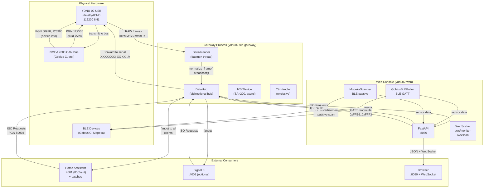

# Интеграции: технический дизайн (as-is)

## Metadata

- id: 006
- type: feature
- status: as-is
- owner: yacht-n2k-console
- date: 2026-08-02

## Context

Проект yacht-n2k-console интегрирует данные NMEA 2000 с несколькими внешними системами и потребителями:

1. **YDNU-02 / NMEA 2000 шина** — физический источник данных (CAN-адаптер на USB).
2. **Home Assistant** — основной потребитель, декодирует NMEA 2000 в сенсоры и устройства.
3. **Signal K** — опциональный потребитель (статус реализации см. ниже).
4. **BLE-устройства** — Gobius C и Mopeka Pro 200 (дополнительные датчики уровня жидкости).
5. **Внешние потребители** — REST API и WebSocket клиенты (браузер, мобильные приложения).

Каждая интеграция имеет собственный транспорт, контракт данных, направление потока и точки отказа. Спецификация фиксирует текущее состояние (as-is) для каждой интеграции.

## Requirements

### Функциональные требования

1. **YDNU-02 / NMEA 2000:** Чтение RAW ASCII фреймов с `/dev/ttyACM0`, трансляция в TCP на портах `:4001` (DATA broadcast) и `:4002` (CTRL passthrough).
2. **Home Assistant:** Подключение к `:4001`, декодирование NMEA 2000 в сенсоры, синхронизация device registry с уникальными хэшами на основе `unique_number`.
3. **Signal K:** Опциональное подключение к `:4001` (если реализовано).
4. **BLE Gobius C:** Подключение по Bluetooth LE, чтение уровня жидкости (PGN 127505), запись конфигурации через GATT.
5. **BLE Mopeka Pro 200:** Пассивное сканирование BLE advertisement, парсинг уровня топлива.
6. **REST/WebSocket:** Клиенты подключаются к `:8080` (ydnu02-web), получают данные через WebSocket `/ws/monitor` и `/ws/scan`.

### Нефункциональные требования

- **Надёжность:** Разрыв соединения с одной интеграцией не влияет на другие.
- **Производительность:** Broadcast на `:4001` завершается за <100ms для 3+ клиентов.
- **Идемпотентность:** HA патчи применяются безопасно, повторный запуск деплоя не вызывает побочных эффектов.
- **Совместимость:** Работает с HA 2024.x+, Python 3.12+, Raspberry Pi 5.

### Out of Scope

- Реализация полного NMEA 2000 стека (используется `nmea2000` library).
- Управление прошивкой YDNU-02 (только данные).
- Синхронизация конфигурации между несколькими Pi.

## Architecture & Technical Design

### Общая архитектура (Mermaid диаграмма)



### Интеграция 1: YDNU-02 / NMEA 2000

#### Транспорт

- **Физический:** USB CDC ACM (`/dev/ttyACM0`), 115200 baud, 8N1.
- **Формат RX (из YDNU-02):** `HH:MM:SS.mmm R XXXXXXXX XX XX...\n` (RAW mode, Appendix E мануала).
- **Формат TX (в YDNU-02):** `XXXXXXXX XX XX...\r\n` (без таймштампа, обязателен CRLF).
- **Инициализация:** Команда `YDNU MODE RAW\r\n` с ожиданием 2.0s.

#### Контракт данных

| Направление | PGN | Описание | Источник | Потребитель |
|-------------|-----|---------|----------|-------------|
| RX (шина→хост) | 60928 | ISO Address Claim (device identity) | YDNU-02, Gobius C, другие N2K устройства | DataHub, HA decoder |
| RX (шина→хост) | 126996 | Product Information (model, firmware, serial) | YDNU-02, Gobius C | DataHub, HA decoder |
| RX (шина→хост) | 127505 | Fluid Level (tank level, distance) | Gobius C | DataHub, HA decoder |
| RX (шина→хост) | 130312 | Temperature (CPU temp) | TCP-GW virtual device (SA=200) | DataHub, HA decoder |
| TX (хост→шина) | 59904 | ISO Request (request device info) | DataHub (на подключение клиента) | YDNU-02 (forward to bus) |
| TX (хост→шина) | 60928 | ISO Address Claim (announce virtual device) | DataHub (Phase 1 анонса) | YDNU-02 (forward to bus) |
| TX (хост→шина) | 126996 | Product Information (announce virtual device) | DataHub (Phase 2 анонса) | YDNU-02 (forward to bus) |

#### Направление потока

```
NMEA 2000 Bus
    ↓ (SerialReader reads /dev/ttyACM0)
DataHub (broadcast to all TCP clients)
    ├→ Home Assistant (:4001)
    ├→ Signal K (:4001, optional)
    └→ ydnu02-web (:4001)
    
TCP clients → DataHub (ISO Requests, TX frames)
    ↓ (DataHub forwards to serial)
YDNU-02 /dev/ttyACM0
    ↓ (transmit to bus)
NMEA 2000 Bus
```

#### Точки отказа и обработка

| Отказ | Симптом | Обработка |
|-------|---------|-----------|
| `/dev/ttyACM0` недоступен | Gateway не стартует | Retry через 5s (SerialReader.run()) |
| EOF на serial (gateway рестарт) | HA крутится на 100% CPU | Patch 1: `patches/nmea2000_ioclient.py` (EOF → ConnectionError) |
| Потеря соединения TCP-клиента | Клиент отключается | DataHub удаляет из `clients` set, другие клиенты не затронуты |
| Переполнение буфера serial | Потеря фреймов | Не обработано (редко на Pi 5) |
| Двойной вызов `_n2k_decoder.decode()` на один фрейм | FastPacket assembly ломается | Правило разделения: `decode_pgn()` пропускает FastPacket PGNs, `feed_to_lib()` — единственная точка входа |

#### Ссылки на код и тесты

- **Код:** `ydnu02_tcp_gateway/data_hub.py`, `ydnu02_tcp_gateway/serial_reader.py`, `ydnu02_tcp_gateway/frame_utils.py`, `ydnu02_tcp_gateway/device_contract.py`.
- **Тесты:** `tests/test_data_hub.py`, `tests/test_bidirectional_hub.py`, `tests/test_data_hub_serial_forward.py`, `tests/test_frame_utils.py`, `tests/test_device_contract.py`.

---

### Интеграция 2: Home Assistant

#### Транспорт

- **Протокол:** TCP IOClient (встроенная интеграция `ha-nmea2000`).
- **Адрес:** `<gateway-host>:4001` (DATA port).
- **Формат:** NMEA ASCII фреймы (идентичны RX формату YDNU-02).
- **Подключение:** Автоматическое при старте HA, с экспоненциальным backoff при разрыве.

#### Контракт данных

HA декодирует NMEA 2000 фреймы в сенсоры и устройства:

| PGN | Поле | Сенсор в HA | Единица |
|-----|------|-------------|---------|
| 60928 | device_function | device.name | text |
| 60928 | unique_id | device.unique_id | integer |
| 126996 | modelId | device.model | text |
| 126996 | modelVersion | device.sw_version | text |
| 126996 | serialNumber | device.serial_number | text |
| 127505 | level | sensor.fluid_level | % |
| 127505 | distance | sensor.fluid_distance | mm |
| 130312 | temperature | sensor.cpu_temperature | °C |

#### Направление потока

```
DataHub :4001 (broadcast NMEA frames)
    ↓ (HA IOClient reads)
HA nmea2000 integration
    ↓ (decoder.py parses PGNs)
HA device registry (.storage/core.device_registry)
HA entity registry (.storage/core.entity_registry)
    ↓ (UI renders)
HA Dashboard
```

#### Точки отказа и обработка

| Отказ | Симптом | Обработка |
|-------|---------|-----------|
| EOF на `:4001` (gateway рестарт) | HA крутится на 100% CPU | **Patch 1:** `patches/nmea2000_ioclient.py` — EOF → `ConnectionError` → reconnect с backoff |
| Hash collision PGN 126996 | Второе устройство имеет 0 entities | **Patch 2:** `scripts/patch_ha_nmea2000_message.py` — primary_key включает `unique_number` (стабильный) вместо `iso_name.name` (нестабильный) |
| Мусор в HA registry | Дубли устройств после рестартов | `homeassistant/cleanup_nmea_devices.py` — удаляет старые device записи, HA пересоздаёт с нуля |
| PGN 126996 приходит ДО PGN 60928 | Silent drop в decoder (source_to_iso_name не заполнен) | **Two-Phase Announcement:** Phase 1 (PGN 60928) немедленно, Phase 2 (PGN 126996) через 0.6s (ANNOUNCE_PRODUCT_INFO_DELAY) |
| Потеря соединения HA | HA отключается от gateway | HA автоматически переподключается (IOClient reconnect logic) |

#### Ссылки на код и тесты

- **Код:** `ydnu02_tcp_gateway/data_hub.py` (announce_all_devices), `patches/nmea2000_ioclient.py`, `scripts/patch_ha_nmea2000_message.py`, `homeassistant/cleanup_nmea_devices.py`.
- **Тесты:** `tests/test_ha_gateway.py`, `tests/test_ha_integration_full.py`, `tests/test_live_ha_integration.py`.
- **Деплой:** `deploy.sh` (режимы `--proxy`, `--patch-ha`, `--clean-ha`).

---

### Интеграция 3: Signal K

#### Статус реализации

**Текущий статус:** Опциональная интеграция, **реализация не завершена**.

#### Транспорт (планируемый)

- **Протокол:** TCP (аналогично HA).
- **Адрес:** `<gateway-host>:4001` (DATA port, общий с HA).
- **Формат:** NMEA ASCII фреймы.

#### Контракт данных (планируемый)

Signal K преобразует NMEA 2000 в JSON-RPC API:

```json
{
  "context": "vessels.self",
  "updates": [
    {
      "source": { "src": "nmea2000-64" },
      "timestamp": "2026-08-02T10:53:00Z",
      "values": [
        { "path": "environment.fluid.freshWater.tanks.0.currentLevel", "value": 0.75 }
      ]
    }
  ]
}
```

#### Направление потока

```
DataHub :4001 (broadcast NMEA frames)
    ↓ (Signal K reads, optional)
Signal K server
    ↓ (converts to JSON-RPC)
Signal K API (:3000, typical)
    ↓ (UI, mobile apps)
```

#### Точки отказа

- Отсутствие Signal K на хосте — gateway работает нормально (опциональная интеграция).
- Разрыв соединения Signal K — DataHub продолжает broadcast другим клиентам.

#### Ссылки на код и тесты

- **Код:** Не реализовано в текущей версии.
- **Тесты:** Не применимо.
- **Документация:** `.agents/skills/nmea2000-setup/SKILL.md` (раздел Signal K).

---

### Интеграция 4: BLE Gobius C

#### Транспорт

- **Протокол:** Bluetooth LE (GATT).
- **Устройство:** Gobius C (SA=92, unique_number=697207).
- **MAC:** `2C:A7:74:21:56:D8` (пример, может отличаться).
- **Характеристики GATT:**

| UUID | Имя | R/W | Описание |
|------|-----|-----|----------|
| `0xFFE6` | User Config | R/W | dist_empty/full mm, LP filters |
| `0xFFE7` | Command | W | 3-byte command (calibrate, reset, adv, info write) |
| `0xFFE8` | Status | R | state, uptime, temp, voltage, MAC, range |
| `0xFFE9` | Measurement | R+Notify | fill ‰, distance mm, inclination |
| `0xFFEB` | Info 1 | R/W | User label (20 bytes) |
| `0xFFEC` | Info 2 | R/W | User comment (20 bytes) |
| `0xFFF2` | N2K Config | R/W | N2K enable, instance, fluid type, volume (max 255L!) |
| `0xFFF3` | N2K Status | R | n2k_state, n2k_src |

#### Контракт данных

| Направление | Источник | Данные | Потребитель |
|-------------|----------|--------|-------------|
| RX (BLE→хост) | Gobius C (0xFFE9 Notify) | fill ‰, distance mm, inclination | GobiusBLEPoller → SensorRegistry |
| RX (BLE→хост) | Gobius C (0xFFF3) | N2K state, source address | GobiusBLEPoller → SensorRegistry |
| TX (хост→BLE) | GobiusBLEPoller | 0xFFE7 command (calibrate, reset, info write) | Gobius C |
| TX (хост→BLE) | GobiusBLEPoller | 0xFFF2 N2K Config (volume, fluid type) | Gobius C |

#### Направление потока

```
Gobius C (BLE)
    ↓ (GobiusBLEPoller.read_char / subscribe_notifications)
SensorRegistry (in-memory)
    ↓ (device_manager.get_sensors)
ydnu02-web API
    ↓ (WebSocket /ws/monitor)
Browser / Mobile
```

#### Точки отказа и обработка

| Отказ | Симптом | Обработка |
|-------|---------|-----------|
| BLE соединение потеряно | Gobius C недоступен | GobiusBLEPoller._connect() retry с exponential backoff (max 5 попыток) |
| Gobius C не отвечает на GATT read | Timeout | read_char() timeout 5s, возвращает None |
| Опасная команда (factory reset `0x69`) | Gobius C сбрасывается | Защита в UI (не отправляем опасные команды) |
| BLE off команда (`0x6F`) | Gobius C отключает BLE | Переподключение в течение 10 сек (firmware feature) |
| Info write без commit | Конфигурация не сохраняется | Требуется явный commit (0xFFE7 `0x77`) после write 0xFFEB/0xFFEC |
| Fluid type всегда 0x00 (Fuel) | Неверный тип жидкости в HA | Баг прошивки Gobius C, обходится через GATT 0xFFF2 (N2K Config) |

#### Ссылки на код и тесты

- **Код:** `gobius_ble_poller.py`, `gobius_parsers.py`, `ble_registry.py`, `device_manager.py`.
- **Тесты:** `tests/test_gobius_ble_nmea.py`, `tests/test_gobius_ble_writes.py`, `tests/test_gobius_n2k_protocol.py`, `tests/test_gobius_profile.py`, `tests/test_gobius_parsers.py`.

---

### Интеграция 5: BLE Mopeka Pro 200

#### Транспорт

- **Протокол:** Bluetooth LE (пассивное сканирование, без GATT).
- **Устройство:** Mopeka Pro 200 (пассивный датчик уровня топлива).
- **MAC:** `F1:FD:CB:6C:B2:CC` (пример, может отличаться).
- **Advertisement:** Пассивное BLE advertisement (не требует подключения).

#### Контракт данных

| Направление | Источник | Данные | Потребитель |
|-------------|----------|--------|-------------|
| RX (BLE advertisement) | Mopeka Pro 200 | tank_depth mm, distance_mm, battery % | MopekaScanner → SensorRegistry |

#### Вычисление уровня

```
fill_level_pct = ((tank_depth - distance_mm) / tank_depth) × 100
```

#### Направление потока

```
Mopeka Pro 200 (BLE advertisement)
    ↓ (MopekaScanner._detection_callback)
SensorRegistry (in-memory)
    ↓ (device_manager.get_sensors)
ydnu02-web API
    ↓ (WebSocket /ws/monitor)
Browser / Mobile
```

#### Точки отказа и обработка

| Отказ | Симптом | Обработка |
|-------|---------|-----------|
| Mopeka вне диапазона BLE | Сенсор не видно | MopekaScanner продолжает сканирование, сенсор помечается как offline |
| Неверная конфигурация tank_depth | Неверный расчёт уровня | Требуется ручная конфигурация через API `update_config()` |
| BLE сканирование отключено | Mopeka не обнаруживается | Требуется явный старт `MopekaScanner.start()` |

#### Ссылки на код и тесты

- **Код:** `mopeka_scanner.py`, `mopeka_parsers.py`, `ble_registry.py`.
- **Тесты:** `tests/test_mopeka_scanner.py` (если существует), `tests/test_ble_registry.py`.

---

### Интеграция 6: REST/WebSocket (внешние потребители)

#### Транспорт

- **Протокол:** HTTP/WebSocket.
- **Адрес:** `<gateway-host>:8080` (ydnu02-web FastAPI).
- **Endpoints:**
  - `GET /` — HTML консоль.
  - `GET /api/devices` — JSON список устройств.
  - `WebSocket /ws/monitor` — live NMEA фреймы (duration в секундах).
  - `WebSocket /ws/scan` — live BLE сканирование (duration в секундах).

#### Контракт данных

**WebSocket /ws/monitor:**
```json
{
  "type": "frame",
  "timestamp": "2026-08-02T10:53:00Z",
  "frame": "10:53:00.123 R 19FF04C8 05 00 02 91 7E FF FF 00"
}
```

**WebSocket /ws/scan:**
```json
{
  "type": "device",
  "mac": "2C:A7:74:21:56:D8",
  "name": "Gobius C",
  "rssi": -45,
  "data": { "fill_level": 75, "distance": 250 }
}
```

#### Направление потока

```
Browser / Mobile App
    ↓ (HTTP GET / WebSocket connect)
ydnu02-web FastAPI (:8080)
    ├→ /ws/monitor: device_manager.monitor_raw()
    │   ↓ (reads from DataHub :4001)
    │   ↓ (streams NMEA frames)
    └→ /ws/scan: device_manager.scan_bus()
        ↓ (reads from GobiusBLEPoller, MopekaScanner)
        ↓ (streams BLE devices)
```

#### Точки отказа и обработка

| Отказ | Симптом | Обработка |
|-------|---------|-----------|
| ydnu02-web не запущен | Браузер не может подключиться | Требуется `systemctl start ydnu02-web` |
| WebSocket timeout (duration истёк) | Соединение закрывается | Браузер переподключается (UI logic) |
| DataHub недоступен | /ws/monitor не получает фреймы | ydnu02-web ждёт подключения к :4001 (retry logic) |
| BLE сканирование отключено | /ws/scan не получает устройства | Требуется явный старт сканирования |

#### Ссылки на код и тесты

- **Код:** `app.py`, `routes/websockets.py`, `device_manager.py`.
- **Тесты:** `tests/test_api.py`, `tests/test_ble_api.py`.

---

## Interfaces / Contracts

### TCP Port 4001 (DATA broadcast)

**Формат фреймов:**
```
HH:MM:SS.mmm R XXXXXXXX XX XX XX...\n
└─────────┬──┘ │ └──┬──┘ └────┬────┘
  timestamp    │   CAN ID   DATA bytes
               └─ direction (R=RX, T=TX echo)
```

**Пример:**
```
10:53:00.123 R 18EAFFC8 00 00 00 00 00 E8 FF 00
10:53:00.456 R 19FF04C8 05 00 02 91 7E FF FF 00
```

**Клиент может отправлять (TX):**
```
XXXXXXXX XX XX XX...\r\n
```

**Пример:**
```
09EE00C8 EE 00 FF\r\n
```

### TCP Port 4002 (CTRL passthrough)

**Назначение:** Эксклюзивный канал для service-режима и firmware-flash.

**Протокол:** Passthrough к YDNU-02 serial (DTR toggle для переключения режимов).

**Клиент:** ydnu02-web (ProxyControlClient).

### HTTP/WebSocket :8080

**GET /api/devices:**
```json
{
  "devices": [
    {
      "mac": "2C:A7:74:21:56:D8",
      "name": "Gobius C",
      "type": "ble",
      "sensors": [
        { "id": "fill_level", "value": 75, "unit": "%" }
      ]
    }
  ]
}
```

**WebSocket /ws/monitor:**
- Клиент отправляет: `{"duration": 300}` (секунды).
- Сервер отправляет: `{"type": "frame", "frame": "..."}` каждые ~100ms.
- Соединение закрывается после истечения duration.

**WebSocket /ws/scan:**
- Клиент отправляет: `{"duration": 10}` (секунды).
- Сервер отправляет: `{"type": "device", "mac": "...", "data": {...}}` при обнаружении.
- Соединение закрывается после истечения duration.

---

## Implementation Plan

### Текущее состояние (as-is)

Все интеграции **полностью реализованы** и развёрнуты в production:

1. **YDNU-02 / NMEA 2000** — TCP Gateway (`ydnu02_tcp_gateway/`) работает как systemd-сервис `ydnu02-tcp-gateway.service`.
2. **Home Assistant** — Подключается к `:4001`, декодирует NMEA 2000. Два критических патча применяются автоматически через `deploy.sh`.
3. **Signal K** — Опциональная интеграция, реализация не завершена (только планируемая архитектура).
4. **BLE Gobius C** — Полная реализация (GATT read/write, notifications, конфигурация).
5. **BLE Mopeka Pro 200** — Полная реализация (пассивное сканирование, парсинг advertisement).
6. **REST/WebSocket** — Полная реализация (ydnu02-web FastAPI, WebSocket endpoints).

### Фактическое состояние по компонентам

| Компонент | Статус | Файлы | Тесты |
|-----------|--------|-------|-------|
| TCP Gateway (port 4001) | ✅ Production | `ydnu02_tcp_gateway/` | 221+ unit тестов |
| HA Integration + Patches | ✅ Production | `patches/`, `scripts/patch_ha_nmea2000_message.py`, `homeassistant/` | `test_ha_gateway.py`, `test_ha_integration_full.py`, `test_live_ha_integration.py` |
| Signal K | ⚠️ Planned | — | — |
| BLE Gobius C | ✅ Production | `gobius_ble_poller.py`, `gobius_parsers.py` | 6 тестовых файлов |
| BLE Mopeka Pro 200 | ✅ Production | `mopeka_scanner.py`, `mopeka_parsers.py` | `test_ble_registry.py` |
| REST/WebSocket | ✅ Production | `app.py`, `routes/websockets.py`, `device_manager.py` | `test_api.py`, `test_ble_api.py` |

### Развёртывание

**Скрипт:** `deploy.sh` (идемпотентный, поддерживает режимы).

**Режимы:**
```bash
./deploy.sh                   # полный деплой: gateway + web + patch HA
./deploy.sh --proxy           # только gateway + patch HA
./deploy.sh --web             # только web
./deploy.sh --patch-ha        # только HA патчи
./deploy.sh --clean-ha        # очистить HA registry от мусора
./deploy.sh --no-test         # без post-deploy тестов
```

**Конфигурация:** `deploy.conf` (gitignored, плейсхолдеры в `deploy.conf.template`).

---

## Verification

### Тесты

| Тест | Что проверяет | Статус |
|------|---------------|--------|
| `tests/test_data_hub.py` | DataHub broadcast, ISO Requests, device registry | ✅ 221+ passed |
| `tests/test_bidirectional_hub.py` | Двунаправленный forward (client→serial) | ✅ passed |
| `tests/test_data_hub_serial_forward.py` | Serial forward logic, SA-guard | ✅ passed |
| `tests/test_ha_gateway.py` | HA device registry, hash uniqueness per source | ✅ passed |
| `tests/test_ha_integration_full.py` | Full HA integration (mock) | ✅ passed |
| `tests/test_live_ha_integration.py` | Live HA integration (требует Pi + HA) | ✅ 7 passed |
| `tests/test_gobius_ble_nmea.py` | Gobius C GATT read/write | ✅ passed |
| `tests/test_gobius_ble_writes.py` | Gobius C конфигурация (info write, N2K config) | ✅ passed |
| `tests/test_gobius_n2k_protocol.py` | Gobius C N2K protocol compliance | ✅ passed |
| `tests/test_ble_registry.py` | BLE device registry (Gobius, Mopeka) | ✅ passed |
| `tests/test_api.py` | REST API endpoints | ✅ passed |
| `tests/test_ble_api.py` | BLE API endpoints | ✅ passed |

### Запуск тестов

```bash
# Unit тесты (без live HA и service_mode):
.venv/bin/python -m pytest tests/ \
  --ignore=tests/test_live_ha_integration.py \
  --ignore=tests/test_service_mode.py -q
# → 221+ passed, 10 skipped

# Live тесты (требуют Pi + HA + running gateway):
.venv/bin/python -m pytest tests/test_live_ha_integration.py -v
# → 7 passed
```

### Ручные проверки

**Проверка TCP Gateway:**
```bash
# Соединения на :4001
ssh user@<gateway-host> 'ss -tnp | grep 4001'
# Ожидаем: 2+ ESTAB (HA + ydnu02-web)

# Живые NMEA фреймы
ssh user@<gateway-host> 'timeout 5 bash -c "nc localhost 4001" | head -10'
# Ожидаем: HH:MM:SS.mmm R XXXXXXXX XX XX...

# Лог gateway (двухфазный анонс)
ssh user@<gateway-host> 'sudo journalctl -u ydnu02-tcp-gateway -n 30 --no-pager | grep -E "Phase|client|ISO"'
```

**Проверка HA патчей:**
```bash
# Какой маркер применён?
ssh user@<gateway-host> "sudo docker exec homeassistant grep 'yacht-n2k-console-patch' \
  /usr/local/lib/python3.14/site-packages/nmea2000/message.py"
# Ожидаем: yacht-n2k-console-patch-v2

# source_id использует unique_number?
ssh user@<gateway-host> "sudo docker exec homeassistant grep 'source_iso_name\.' \
  /usr/local/lib/python3.14/site-packages/nmea2000/message.py"
# Ожидаем: self.source_iso_name.unique_number
```

**Проверка BLE Gobius C:**
```bash
# Сканирование BLE
ssh user@<gateway-host> 'timeout 10 python3 -c "from bleak import BleakScanner; import asyncio; \
  devices = asyncio.run(BleakScanner.discover()); \
  print([d.name for d in devices if \"Gobius\" in (d.name or \"\")])"'
# Ожидаем: ['Gobius C']

# Чтение GATT характеристики
ssh user@<gateway-host> 'python3 -c "from gobius_ble_poller import GobiusBLEPoller; \
  poller = GobiusBLEPoller(None, None); \
  asyncio.run(poller._read_full_unlocked())"'
# Ожидаем: fill_level, distance, inclination
```

**Проверка HA device registry:**
```bash
ssh user@<gateway-host> "sudo docker exec homeassistant python3 -c \"
import json
dr = json.load(open('/config/.storage/core.device_registry'))
er = json.load(open('/config/.storage/core.entity_registry'))
nmea = [d for d in dr['data']['devices'] if '402047' in str(d) or '902047' in str(d)]
print('NMEA devices:', len(nmea))
for d in nmea:
    ent = [e for e in er['data']['entities'] if e.get('device_id')==d['id']]
    print('  %s → %d entities' % (d.get('name','?')[:70], len(ent)))
\""
# Ожидаем: 2 NMEA devices, каждый с >0 entities
```

### Критерии приёмки

- ✅ Все unit тесты проходят (221+ passed).
- ✅ Live HA тесты проходят (7 passed).
- ✅ TCP Gateway слушает на :4001 и :4002.
- ✅ HA подключается к :4001 и декодирует NMEA 2000.
- ✅ HA device registry содержит 2 NMEA устройства (SA=64, SA=200) с уникальными хэшами.
- ✅ Каждое HA устройство имеет >0 entities.
- ✅ BLE Gobius C подключается и читает уровень жидкости.
- ✅ BLE Mopeka Pro 200 обнаруживается и парсится.
- ✅ WebSocket /ws/monitor и /ws/scan работают.

---

## Known Issues

### Bug 1: ioclient EOF spin-loop

**Файл:** `nmea2000/ioclient.py` в HA Docker контейнере.

**Симптом:** После рестарта gateway HA крутится на 100% CPU, не переподключается.

**Причина:** `_receive_impl()` при EOF (`b""`) молча возвращает → цикл крутится без sleep → 100% CPU.

**Фикс:** `patches/nmea2000_ioclient.py` — EOF → `ConnectionError` → reconnect с exponential backoff.

**Статус:** ✅ Исправлено в patch-v1, merged в upstream PR #61.

**Ссылка:** `.agents/skills/nmea2000-setup/SKILL.md` → Bug 1.

---

### Bug 2: PGN 126996 hash collision

**Файл:** `nmea2000/message.py` в HA Docker контейнере.

**Симптом:** Второе NMEA 2000 устройство на шине показывает «0 entities» в HA.

**Причина:** `primary_key = f"{self.id}"` для PGN 126996 одинаков для всех устройств → MD5 коллизия.

**Фикс:** `scripts/patch_ha_nmea2000_message.py` — primary_key включает `source_iso_name.unique_number` (стабильный, 21-бит, manufacturer-assigned).

**Версии патча:**
- **v1** (yacht-n2k-console-patch-v1): использовал `.name` (нестабильный, меняется при рестарте) → создавал дубли в HA registry.
- **v2** (yacht-n2k-console-patch-v2): использует `.unique_number` (стабильный) → HA device переиспользуется.

**Upgrade v1→v2:** Автоматический через `patch_ha_nmea2000_message.py` при следующем `--patch-ha`.

**Статус:** ✅ Исправлено в patch-v2, pending PR в upstream.

**Ссылка:** `.agents/skills/nmea2000-setup/SKILL.md` → Bug 2.

---

### Bug 3: HA registry накапливает мусор

**Симптом:** Несколько «Product Information (Yacht Devices - PC Gateway - ...)» в HA device registry.

**Причина:** До patch-v2 `device_instance` в `iso_name.name` менялся → другой MD5 → новая запись.

**Фикс:** `homeassistant/cleanup_nmea_devices.py` — удаляет все nmea2000 devices → HA пересоздаёт с нуля.

**Команда:** `./deploy.sh --clean-ha` (одноразовая очистка).

**После patch-v2:** Дубли больше не создаются. Одноразовая очистка решает проблему навсегда.

**Статус:** ✅ Исправлено в patch-v2.

**Ссылка:** `.agents/skills/nmea2000-setup/SKILL.md` → Bug 3.

---

### Ограничение: FastPacket Assembly (двойной вызов decode)

**Правило:** Никогда не кормить один и тот же CAN frame в `_n2k_decoder.decode()` дважды.

**Почему:** `_n2k_decoder` — stateful объект, accumulates FastPacket sub-frames. Двойной вызов отравляет sequence counter → assembly ломается → 0 собранных пакетов.

**Точки вызова:**
- `decode_pgn()` — для human-readable строк (Monitor tab), **пропускает** FastPacket PGNs.
- `_decode_via_lib()` — для PGN 60928 field extraction, только single-frame PGNs.
- `feed_to_lib()` — **единственная** точка входа для FastPacket assembly.

**Ссылка:** `.agents/skills/nmea2000-setup/SKILL.md` → ⚡ FastPacket Assembly.

---

### Ограничение: Gobius C fluid_type всегда 0x00

**Симптом:** PGN 127505 от Gobius C всегда содержит fluid_type=0x00 (Fuel), даже если настроено другое.

**Причина:** Баг прошивки Gobius C.

**Обходной путь:** Конфигурация через GATT 0xFFF2 (N2K Config) вместо PGN 126208 (Group Function).

**Статус:** ⚠️ Известное ограничение, обходится в коде.

---

### Ограничение: Gobius C не поддерживает N2K Group Function

**Симптом:** Gobius C игнорирует PGN 126208 (Group Function Write Config).

**Причина:** Прошивка Gobius C не реализует Group Function.

**Обходной путь:** Запись конфигурации только через BLE GATT (0xFFF2 N2K Config).

**Статус:** ⚠️ Известное ограничение, обходится в коде.

---

### Ограничение: Максимум ~10 одновременных TCP клиентов

**Причина:** Ограничение Raspberry Pi 5 (CPU, memory, file descriptors).

**Текущие клиенты:** HA + Signal K (optional) + ydnu02-web + N2KDevice (virtual) = 3-4 клиента.

**Статус:** ⚠️ Известное ограничение, не критично для текущего использования.

---

### Ограничение: test_service_mode.py падает в sandbox

**Симптом:** `tests/test_service_mode.py` падает с `PermissionError: socket.bind()`.

**Причина:** Sandbox ограничение (не может открыть порт <1024).

**Статус:** ⚠️ Не баг кода, баг окружения. Тест пропускается в CI.

---

### Ограничение: TX echo диагностика не работает на YDNU-02

**Симптом:** Логирование `[data] echo: TX frame ... confirmed on physical bus` никогда не триггерится.

**Причина:** YDNU-02 в RAW-режиме не отражает собственные TX-фреймы обратно хосту (no self-reception).

**Статус:** ⚠️ Диагностическая фича, оставлена в коде как задел на будущее.

**Ссылка:** `.agents/skills/nmea2000-setup/SKILL.md` → 🔬 Диагностическое echo-логирование.

---

### Ограничение: Единичная ошибка serial при выходе из service-mode

**Симптом:** В логах встречается одноразовая ошибка `[serial] unexpected error: argument must be an int, or have a fileno() method. — retrying in 5s`.

**Причина:** Гонка между `ctrl_handler` подменой `ser`-хендла и `SerialReader.run()`.

**Статус:** ⚠️ Редкая, не критична (порт переоткрывается штатно через 5s).

**Ссылка:** `.agents/skills/nmea2000-setup/SKILL.md` → Побочная находка.

---

## Дополнительные ссылки

- **Skill:** `.agents/skills/nmea2000-setup/SKILL.md` — полная база знаний.
- **Спека TCP Gateway:** `specs/active/001-tcp-gateway.md`.
- **Спека Деплоя:** `specs/active/005-deploy-ha-integration.md`.
- **Требования:** `requirements.txt` (nmea2000 из git форка).
- **Деплой:** `deploy.sh` (идемпотентный, поддерживает режимы).
