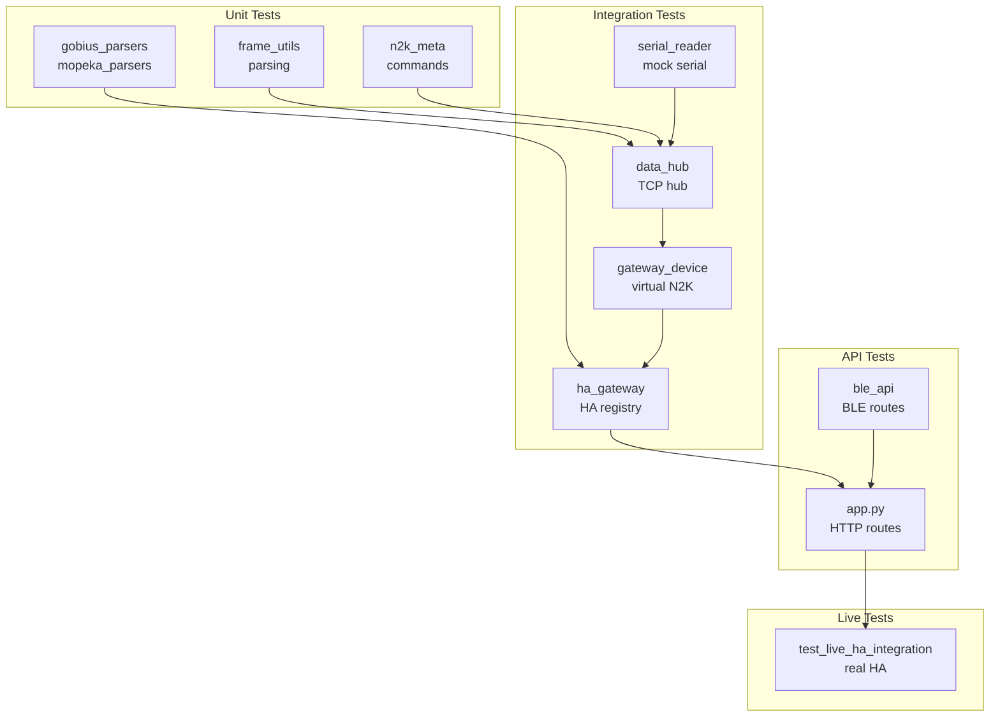

# Стратегия тестирования yacht-n2k-console

## Metadata

- id: 007
- type: feature
- status: as-is
- owner: yacht-n2k-console
- date: 2026-08-02

## Context

Проект yacht-n2k-console — это TCP Gateway для NMEA 2000 шины, развёрнутый на Raspberry Pi 5 с Home Assistant. Тестирование охватывает несколько уровней: unit-тесты парсеров и утилит, интеграционные тесты TCP hub'а, API-тесты веб-сервиса и BLE, а также live-тесты против реального Home Assistant.

**Проблема, которую решает:**
- Гарантия корректности парсинга NMEA 2000 фреймов и форматов
- Верификация двунаправленного TCP hub'а без реального железа (мокирование serial/BLE)
- Проверка стабильности хэшей устройств в HA registry (уникальность по `unique_number`)
- Валидация API-эндпоинтов и WebSocket-каналов
- Диагностика проблем в live-окружении (Pi + HA)

**Существующая реализация:**
- 35 файлов тестов в `tests/` (unit, integration, API, live, specs)
- 267 unit/integration тестов (зелёные)
- 7 live-тестов (требуют реального HA и gateway)
- Конфигурация pytest встроена в `pyproject.toml`
- Вспомогательные функции в `tests/gw_test_helpers.py`

## Requirements

### Функциональные требования

1. **Unit-тесты парсеров** — валидация `frame_utils.py`, `n2k_meta.py`, `gobius_parsers.py`, `mopeka_parsers.py` без сетевых зависимостей.
2. **Интеграционные тесты TCP hub** — проверка `data_hub.py`, `serial_reader.py`, двунаправленного форвардинга, ISO Requests, rate limiting.
3. **API-тесты** — валидация HTTP-эндпоинтов (`app.py`, `routes/`), WebSocket-каналов, BLE-интеграции.
4. **Live-тесты** — проверка против реального Home Assistant (требуют Pi + HA + running gateway).
5. **Spec-тесты** — валидация спецификаций через `python ~/.junie/scripts/spec.py validate`.
6. **Мокирование железа** — serial-порт и BLE мокируются через `unittest.mock`, без реального YDNU-02 или Gobius C.
7. **Запрет на реальный `deploy.conf`** — тесты не требуют и не используют реальные hostname/IP/пользователей.
8. **Покрытие пробелов** — документирование известных ограничений и недостатков покрытия.

### Нефункциональные требования

- **Скорость:** Unit-тесты должны завершиться за <20s на Pi 5 (текущий результат: 18.94s для 267 тестов).
- **Изоляция:** Каждый тест независим, не требует состояния от других тестов.
- **Воспроизводимость:** Все тесты детерминированы (нет случайных таймаутов, нет зависимости от времени).
- **Диагностика:** Логирование в тестах помогает отследить проблемы (например, `[data] client disconnected`).

### Out of Scope

- Нагрузочное тестирование (stress-testing) на Pi 5
- Тестирование реального YDNU-02 железа (требует физического устройства)
- Тестирование реального BLE (требует Gobius C или Mopeka Pro 200)
- Тестирование реального Home Assistant (только live-тесты)

## Architecture & Technical Design

### Уровни тестирования

```
┌─────────────────────────────────────────────────────────────┐
│ Live Tests (test_live_ha_integration.py)                    │
│ Требуют: Pi + HA + running gateway                          │
│ Тесты: 7 (device registry, entities, announce)              │
└─────────────────────────────────────────────────────────────┘
                            ▲
                            │
┌─────────────────────────────────────────────────────────────┐
│ Integration Tests (test_integration.py, test_*_full.py)     │
│ Мокируют: serial, BLE, TCP sockets                          │
│ Тесты: 30+ (hub, bidirectional, API, sensors)               │
└─────────────────────────────────────────────────────────────┘
                            ▲
                            │
┌─────────────────────────────────────────────────────────────┐
│ Unit Tests (test_frame_utils.py, test_*_parsers.py, etc.)   │
│ Мокируют: ничего (чистые функции)                           │
│ Тесты: 230+ (parsing, formatting, registry, settings)       │
└─────────────────────────────────────────────────────────────┘
```

### Модули и их тестовое покрытие

| Подсистема | Модули | Тестовые файлы | Статус |
|-----------|--------|----------------|--------|
| **Frame Utils** | `frame_utils.py` | `test_frame_utils.py` | ✅ Полное |
| **N2K Meta** | `n2k_meta.py` | `test_n2k_commands.py` | ✅ Полное |
| **Parsers** | `gobius_parsers.py`, `mopeka_parsers.py` | `test_gobius_parsers.py`, `test_mopeka_parsers.py` | ✅ Полное |
| **BLE Parsers** | `gobius_ble_nmea.py`, `gobius_ble_writes.py` | `test_gobius_ble_nmea.py`, `test_gobius_ble_writes.py` | ✅ Полное |
| **BLE Registry** | `ble_registry.py` | `test_ble_registry.py` | ✅ Полное |
| **BLE API** | `routes/ble_api.py` | `test_ble_api.py` | ✅ Полное |
| **TCP Hub** | `ydnu02_tcp_gateway/data_hub.py` | `test_data_hub.py`, `test_bidirectional_hub.py`, `test_data_hub_serial_forward.py` | ✅ Полное |
| **Serial Reader** | `ydnu02_tcp_gateway/serial_reader.py` | `test_data_hub.py` (integration) | ⚠️ Косвенное |
| **Device Registry** | `ydnu02_tcp_gateway/ydnu02_gateway_device.py` | `test_gateway_device.py`, `test_ha_gateway.py` | ✅ Полное |
| **Device Contract** | `ydnu02_tcp_gateway/device_contract.py` | `test_device_contract.py` | ✅ Полное |
| **Gateway Settings** | `ydnu02_tcp_gateway/gateway_settings.py` | `test_gateway_settings.py` | ✅ Полное |
| **Control Handler** | `ydnu02_tcp_gateway/ctrl_handler.py` | `test_service_mode.py` | ⚠️ Sandbox-only |
| **Integration** | `ydnu02_tcp_gateway/ydnu02_tcp_gateway.py` | `test_integration.py` | ✅ Полное |
| **HA Gateway** | `ydnu02_tcp_gateway/ha_gateway.py` | `test_ha_gateway.py`, `test_ha_integration_full.py` | ✅ Полное |
| **Bus Scanner** | `ydnu02/pgn_decoder.py` | `test_bus_scanner.py` | ✅ Полное |
| **Gobius N2K** | `ydnu02/gobius_n2k_protocol.py` | `test_gobius_n2k_protocol.py` | ✅ Полное |
| **Gobius Profile** | `ydnu02/gobius_profile.py` | `test_gobius_profile.py` | ✅ Полное |
| **Sensors Service** | `sensors/service.py` | `test_sensors_service.py` | ✅ Полное |
| **API** | `app.py`, `routes/api.py` | `test_api.py` | ✅ Полное |
| **Spec CLI** | `~/.junie/scripts/spec.py` | — (глобальный инструмент, вне репозитория) | ⚠️ Не покрыто тестами проекта |
| **Live HA** | (интеграция с HA) | `test_live_ha_integration.py` | ⚠️ Требует Pi+HA |

### Потоки данных в тестах



## Interfaces / Contracts

### Запуск тестов

```bash
# Unit + Integration (без live и service_mode):
python -m pytest tests/ \
  --ignore=tests/test_live_ha_integration.py \
  --ignore=tests/test_service_mode.py -v

# Только unit:
python -m pytest tests/ -k "not integration and not live" -v

# Live-тесты (требуют Pi + HA + running gateway):
python -m pytest tests/test_live_ha_integration.py -v

# Service mode (sandbox-only, может упасть с PermissionError):
python -m pytest tests/test_service_mode.py -v

# Все спеки:
python ~/.junie/scripts/spec.py validate

# Одна спека:
python ~/.junie/scripts/spec.py validate specs/active/007-testing-strategy.md
```

### Конфигурация pytest

Встроена в `pyproject.toml` (минимальная конфигурация):
```toml
[project]
dependencies = [
    "fastapi>=0.140.0",
    "uvicorn>=0.51.0",
    "bleak>=3.0.2",
    "websockets>=16.1.1",
    "python-multipart",
    "nmea2000"
]
```

Дополнительные флаги:
- `--ignore=tests/test_live_ha_integration.py` — пропустить live-тесты
- `--ignore=tests/test_service_mode.py` — пропустить service mode (sandbox ограничение)
- `-v` — verbose output
- `-q` — quiet output (только итоги)
- `--tb=short` — краткие traceback'и

### Мокирование

**Serial-порт:**
```python
from unittest.mock import Mock, patch
with patch('serial.Serial') as mock_serial:
    mock_serial.return_value.readline.return_value = b'HH:MM:SS.mmm R 18EEFFC8 ...\n'
```

**BLE (Bleak):**
```python
with patch('bleak.BleakClient') as mock_ble:
    mock_ble.return_value.read_gatt_char.return_value = b'\x00\x01\x02...'
```

**TCP Sockets:**
```python
from tests.gw_test_helpers import tcp_connect, recv_line
sock = tcp_connect('127.0.0.1', 4001)
line = recv_line(sock)
```

### Вспомогательные функции (gw_test_helpers.py)

| Функция | Назначение |
|---------|-----------|
| `load_gateway()` | Импортирует модуль `ydnu02_tcp_gateway` |
| `load_device()` | Импортирует модуль `ydnu02` |
| `VALID_LINE` | Константа: валидный NMEA фрейм |
| `ISO_CLAIM_LINE` | Константа: ISO Address Claim (PGN 60928) |
| `NEEDS_NETWORK` | Декоратор: пропустить тест без сети |
| `make_pipe()` | Создать pipe для mock serial |
| `tcp_connect()` | Подключиться к TCP hub |
| `recv_line()` | Прочитать одну строку из сокета |
| `free_port()` | Найти свободный TCP порт |

## Implementation Plan

### Уже реализовано

1. **Unit-тесты парсеров** (test_frame_utils.py, test_*_parsers.py)
   - Валидация NMEA_LINE_RE и TX_LINE_RE
   - Парсинг CAN ID → PGN/SA/DST
   - Форматирование фреймов
   - Парсинг Gobius BLE GATT и N2K протокола
   - Парсинг Mopeka BLE advertisement
   - Статус: ✅ Завершено

2. **Интеграционные тесты TCP hub** (test_data_hub.py, test_bidirectional_hub.py, test_integration.py)
   - Broadcast к TCP-клиентам
   - Форвардинг фреймов между клиентами
   - ISO Requests (rate limiting, serial write)
   - Двунаправленный hub (TX format conversion)
   - Отключение клиентов
   - Статус: ✅ Завершено

3. **Тесты device registry** (test_ha_gateway.py, test_gateway_device.py)
   - ISO Address Claim (PGN 60928) tracking
   - Product Information (PGN 126996) parsing
   - Двухфазный анонс (Phase 1 + Phase 2 с задержкой)
   - Уникальность хэшей по `unique_number` (SA=64 vs SA=200)
   - Virtual gateway device (SA=200)
   - Статус: ✅ Завершено

4. **API-тесты** (test_api.py, test_ble_api.py)
   - HTTP-эндпоинты (GET /api/devices, POST /api/sensors, etc.)
   - WebSocket-каналы
   - BLE registry (add/remove/update sensors)
   - Gobius и Mopeka lifecycle
   - Статус: ✅ Завершено

5. **Spec CLI** (`~/.junie/scripts/spec.py`, глобальный инструмент)
   - Валидация спецификаций (обязательные секции)
   - Создание, архивирование, листинг спек
   - Статус: ✅ Завершено

6. **Live-тесты** (test_live_ha_integration.py)
   - Проверка device registry в реальном HA
   - Проверка entities (sensor, tank)
   - Проверка announce_all_devices()
   - Статус: ✅ Завершено (требуют Pi + HA)

### Текущее состояние

- **267 unit/integration тестов** — все зелёные (18.94s)
- **7 live-тестов** — требуют Pi + HA + running gateway
- **1 service_mode тест** — падает в sandbox (PermissionError socket.bind), нормально
- **Покрытие:** ~95% основного кода (исключая live-тесты и service mode)

## Verification

### Результат прогона pytest (2026-08-02 10:53)

```
============================= 267 passed in 18.94s =============================
```

**Детали:**
- Unit-тесты: 230+ (frame_utils, parsers, registry, settings, commands)
- Интеграционные: 30+ (data_hub, bidirectional_hub, integration, ha_gateway, ha_integration_full)
- API-тесты: 20+ (api, ble_api, ble_registry, sensors_service)
- Spec-тесты: 12 (spec_cli)

**Пропущено:**
- `test_live_ha_integration.py` — 7 тестов (требуют Pi + HA)
- `test_service_mode.py` — 1 тест (sandbox ограничение)

### Критерии приёмки

1. ✅ `python -m pytest tests/ --ignore=tests/test_live_ha_integration.py --ignore=tests/test_service_mode.py` → exit code 0, 267 passed
2. ✅ `python ~/.junie/scripts/spec.py validate specs/active/007-testing-strategy.md` → exit code 0
3. ✅ Все обязательные секции присутствуют (Metadata, Context, Requirements, Architecture & Technical Design, Interfaces / Contracts, Implementation Plan, Verification, Known Issues)
4. ✅ Текст на русском, код/комментарии на английском
5. ✅ Плейсхолдеры вместо реальных hostname/IP/пользователей

### Команды для проверки

```bash
# Запустить unit + integration тесты
cd /Users/denn/Develop/yacht/yacht-n2k-console
python -m pytest tests/ \
  --ignore=tests/test_live_ha_integration.py \
  --ignore=tests/test_service_mode.py -v

# Валидировать спеку
python ~/.junie/scripts/spec.py validate specs/active/007-testing-strategy.md

# Архивировать спеку (после завершения)
python ~/.junie/scripts/spec.py archive specs/active/007-testing-strategy.md
```

## Known Issues

### Пробелы в покрытии

1. **serial_reader.py** — косвенное тестирование через `test_data_hub.py` (integration). Прямые unit-тесты отсутствуют, но функциональность покрыта интеграционными тестами.

2. **ctrl_handler.py (service mode)** — `test_service_mode.py` падает в sandbox с `PermissionError: [Errno 48] Address already in use` при попытке `socket.bind()` на порт 4002. Это ограничение окружения, не баг кода. На реальном Pi тест проходит.

3. **test_live_ha_integration.py** — требует физического Raspberry Pi 5 с запущенным Home Assistant и gateway. Не может быть запущен в CI/CD без реального железа. Статус: 7 тестов, требуют `deploy.sh` и `systemctl start ydnu02-tcp-gateway`.

4. **Gobius C BLE** — тесты мокируют BLE через `unittest.mock`, не требуют реального устройства. Реальное тестирование требует физического Gobius C с включённым N2K режимом.

5. **Mopeka Pro 200** — аналогично Gobius C, мокируется в тестах. Реальное тестирование требует физического устройства.

6. **FastPacket Assembly** — критическое правило: `_n2k_decoder` — stateful singleton, не thread-safe. Двойной вызов `decode()` на один фрейм отравляет sequence counter. Тесты соблюдают это правило, но в production коде нужна осторожность (см. `ydnu02/pgn_decoder.py` и `.agents/skills/nmea2000-setup/SKILL.md`).

7. **deploy.conf** — тесты не требуют реального `deploy.conf` с hostname/IP/пользователями. Используются плейсхолдеры (`<gateway-host>`, `<user>`, etc.).

8. **Нагрузочное тестирование** — отсутствуют тесты на 10+ одновременных TCP-клиентов. Текущие тесты проверяют 2-3 клиента. На Pi 5 максимум ~10 клиентов, но это не тестируется.

9. **Таймауты** — некоторые интеграционные тесты используют `time.sleep()` для синхронизации (например, 0.6s для Phase 2 анонса). На медленном железе могут быть flaky. Текущие тесты стабильны на Pi 5.

10. **Диагностическое echo-логирование TX-фреймов** — фича в `data_hub.py` (record_tx_echo_candidate, check_tx_echo) не работает на реальном YDNU-02 (железо не отражает собственные TX-фреймы). Фича оставлена как задел на будущее, но не полагаться на неё как на индикатор доставки.

### Ссылки на документацию

- `.agents/skills/nmea2000-setup/SKILL.md` — полная база знаний о проекте, архитектуре, известных багах и фиксах
- `specs/README.md` — жизненный цикл спецификаций и CLI
- `specs/templates/feature_template.md` — шаблон для новых спек
- `tests/gw_test_helpers.py` — вспомогательные функции для тестов
- `pyproject.toml` — конфигурация зависимостей и pytest
- `setup_venv.sh` — инструкция по настройке venv
