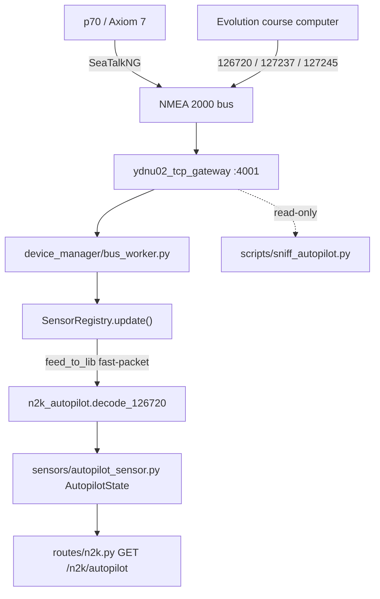

# Управление автопилотом Raymarine Evolution (исследование + read-only прототип)

## Metadata

- id: 008
- type: feature
- status: draft
- owner: yacht-n2k-console
- date: 2026-08-15

## Context

На борту стоит курсовой компьютер **Raymarine Evolution**, пост управления **p70** и MFD **Axiom 7**. Всё соединено по SeaTalkNG — это физически NMEA 2000 (те же CAN-кадры, другой разъём), поэтому шина, к которой уже подключён YDNU-02, и есть шина автопилота.

Проект `yacht-n2k-console` про автопилот сейчас **не знает ничего**: `grep -ri "autopilot|126720|65379|65360"` по коду не даёт ни одного попадания. При этом инфраструктура TX уже есть и используется для конфигурации датчиков: `DeviceManager.send_raw_command()` пишет ASCII-кадр в DATA-порт `:4001`, `n2k_command_builder.build_pgn_126208_command()` собирает 29-битный CAN ID и Group Function.

Задача решает два вопроса:

1. **Разобраться и зафиксировать**, какими вообще способами можно управлять Evolution с гейтвея, чего каждый способ стоит и чем рискует.
2. **Проверить теорию чтением**: гейтвей должен видеть и отдавать наружу текущий режим автопилота, заданный курс и угол руля. Отправка команд в шину в этой итерации **не делается** — это отдельная задача после верификации чтения на борту.

## Requirements

### Функциональные

1. Спека содержит письменный разбор трёх каналов управления (Axiom/LightHouse, стандартные PGN, проприетарный 126720) с выбором пути и обоснованием.
2. Декодер распознаёт кадр PGN 126720 как Raymarine-проприетарный по manufacturer code 1851 + industry group 4 в первых двух байтах (little-endian) и разбирает подтипы по proprietary ID.
3. Состояние автопилота включает поля: `mode` (`standby|auto|wind|track|unknown`), `locked_heading_deg`, `heading_reference` (`magnetic|true`), `wind_datum_deg`, `rudder_angle_deg`, `src`, `last_update`, `age_sec`.
4. Поля, для которых кадр не приходил или пришёл со значением «нет данных» (`0xFFFF`), остаются `None` — не подменяются нулями.
5. `GET /api/n2k/autopilot` возвращает снимок состояния; при отсутствии трафика — `mode: "unknown"` и `age_sec: null` с HTTP 200, а не 500.
6. Снифер `scripts/sniff_autopilot.py` подключается к DATA-порту `:4001` только на чтение, пишет сырые строки с интересующими PGN в файл и печатает разобранную интерпретацию рядом — чтобы сверять с показаниями p70.

### Нефункциональные

- **Безопасность прежде всего:** ни одна строка этого этапа не пишет в шину. `send_raw_command()` не вызывается, снифер открывает соединение read-only.
- Декодирование выполняется в горячем цикле `_bus_worker` (Raspberry Pi 5, Python 3.13) — только арифметика над байтами, никаких блокирующих операций и никакого логирования на кадр: трафик автопилота — несколько кадров в секунду.
- Раскладки байт помечены в коде как reverse-engineered (источник — canboat / SignalK), с явным указанием, что Raymarine их не документировала.

### Out of scope

- Любая отправка команд автопилоту (смена режима, правка курса) — отдельная задача.
- Интеграция в HA-дашборд `ha/sailing-dash/`.
- Управление через Axiom / LightHouse — фиксируется как тупик, кодом не трогается.

## Architecture & Technical Design

### Три канала управления

**1. Axiom 7 / LightHouse как «отдельный интерфейс» — тупик.** Axiom не курсовой компьютер, а такая же голова на шине, как p70. Наружу LightHouse отдаёт только RayNet-видео, точки/маршруты и мобильное приложение — **открытого API для команд автопилоту нет**. Всё, что Axiom делает с автопилотом, он делает теми же кадрами SeaTalkNG, что и p70. Вывод: Axiom интересен только как *источник* кадров для реверс-инжиниринга, а не как точка интеграции.

**2. Стандартные NMEA 2000 PGN — частично.** 127237 (Heading/Track Control) и 129284 (Navigation Data) Evolution принимает, но фактически лишь чтобы **вести по маршруту в режиме Track**; перевести автопилот из Standby в Auto ими нельзя. Полезны как *источник чтения*: 127237 отдаёт heading-to-steer и commanded rudder, 127245 — угол руля.

**3. Проприетарный PGN 126720 (SeaTalkNG) — единственный полноценный путь.** Выбран. Это fast-packet PDU1 (`0x1EF00`); первые два байта — manufacturer code 1851 (Raymarine) и industry group 4 (Marine), упакованные little-endian (`0x3B 0x9F`), дальше proprietary ID. Сообщество (canboat, SignalK `@signalk/raymarine-autopilot`) разобрало нужные подтипы:

| Подтип | Смысл | Направление |
|---|---|---|
| 65379 Seatalk Pilot Mode | режим: Standby / Auto / Wind / Track | чтение **и** запись |
| 65360 Seatalk Pilot Locked Heading | заданный курс | чтение |
| 65345 Seatalk Pilot Wind Datum | заданный угол к ветру | чтение |
| 126208 поверх 65360 | правка курса ±1 / ±10 | запись (будущий этап) |

В этой итерации используются **только строки «чтение»**.

### Существующая реализация, в которую встраиваемся

- Приём: `ydnu02_tcp_gateway` → DATA `:4001` → `device_manager/bus_worker.py` → `DeviceManager._update_sensor_state()` → `SensorRegistry.update(parsed)`.
- Диспетчер PGN живёт прямо в `SensorRegistry.update`. Fast-packet собирается через `N2KPGNDecoder.feed_to_lib(parsed)` — **единственная** точка сборки, дублировать её нельзя (комментарий в файле, commit `1de3074`).
- Модели датчиков: `sensors/base_sensor.py` — dataclass-каналы + `to_dict()`.

### Ключевые решения

1. **Декодер — отдельный модуль `n2k_autopilot.py` в корне**, рядом с `n2k_command_builder.py` / `n2k_meta.py`, а не рост `SensorRegistry.update`: проприетарный разбор — чистая функция `bytes -> dict`, тестируется в отрыве от шины.
2. **Fast-packet берём из существующего `feed_to_lib`.** Свой реассемблер отравил бы счётчик последовательности stateful-декодера и сломал сборку 126996.
3. **Один объект `AutopilotState` на весь автопилот**, не словарь по instance: автопилот на борту один, `src` хранится для наблюдаемости.
4. **Никакого TX.** Формат будущей команды только описан ниже.
5. **Раскладки байт — гипотеза до подтверждения на борту.** Отсюда снифер.



## Interfaces / Contracts

### `GET /api/n2k/autopilot`

```json
{
  "mode": "auto",
  "locked_heading_deg": 187.4,
  "heading_reference": "magnetic",
  "wind_datum_deg": null,
  "rudder_angle_deg": -2.1,
  "src": 204,
  "last_update": 1755200000.0,
  "age_sec": 0.4
}
```

Пустое состояние: `mode: "unknown"`, все значения `null`, `age_sec: null`, HTTP 200. Нет менеджера устройств — HTTP 503 (как в остальных эндпоинтах `routes/`).

### Декодер `n2k_autopilot.py`

```python
is_raymarine_proprietary(data: bytes) -> bool
decode_126720(data: bytes) -> Optional[dict]          # fast-packet carrier
decode_proprietary(pgn: int, data: bytes) -> Optional[dict]  # single-frame 65345/65360/65379
decode_127237(data: bytes) -> Optional[dict]          # heading/track control
decode_127245(data: bytes) -> Optional[dict]          # rudder angle
decode_frame(pgn: int, data: bytes) -> Optional[dict] # single dispatch entry point
```

Замечание по реализации: подтипы 65345/65360/65379 лежат в проприетарном
однокадровом диапазоне PGN и на практике приходят **и** как самостоятельные
кадры, **и** как payload внутри fast-packet 126720. Декодер поддерживает оба
входа одними и теми же разборщиками; 126720 обрабатывается исключительно
внутри существующего вызова `feed_to_lib`.

### Будущая команда (НЕ реализуется в этой итерации)

Смена режима — запись подтипа 65379 внутрь 126720:

```
data = 3B 9F <mode_lo> <mode_hi> <submode_lo> <submode_hi> ...
```

Правка курса — Group Function (126208) поверх 65360, отправка через уже существующие `n2k_command_builder` + `DeviceManager.send_raw_command()`. Формат фиксируется отдельной спекой после верификации чтения и обсуждения безопасности.

## Implementation Plan

1. `specs/active/008-autopilot-control.md` — эта спека, разбор каналов и выбор пути.
2. `n2k_autopilot.py` + `tests/test_autopilot_decoder.py` — декодер 126720/127237/127245, тесты на зафиксированных hex-кадрах.
3. `sensors/autopilot_sensor.py` + `sensors/__init__.py` — модель `AutopilotState`.
4. `device_manager/sensor_registry.py` + `device_manager/manager.py` — обработка 126720 внутри существующей ветки `lib_msg`, однокадровые 127237/127245, геттер `get_autopilot_state()`.
5. `routes/n2k.py` — `GET /n2k/autopilot`.
6. `scripts/sniff_autopilot.py` — read-only снифер для сверки с p70.

## Verification

- Тесты: `tests/test_autopilot_decoder.py` (кейс на каждый режим, locked heading, чужой производитель, обрезанный кадр, `0xFFFF`), `tests/test_autopilot_registry.py` (последовательность Standby → Auto → смена курса через `SensorRegistry.update()`, регрессия сборки 126996), эндпоинт (пустое и заполненное состояние).
- Ручная проверка на борту: `python scripts/sniff_autopilot.py --host <pi>`; перевести p70 в Auto, поправить курс на ±10 и сравнить вывод снифера с дисплеем.
- Критерии приёмки: полный `pytest tests/` зелёный; `GET /api/n2k/autopilot` на живом гейтвее отдаёт режим, совпадающий с p70; ни одного кадра, отправленного в шину со стороны этой фичи.
- Статус сверки на борту: **не выполнена** (нужен доступ к лодке). До неё раскладки байт считаются гипотезой.

## Known Issues

- **Раскладки байт не документированы Raymarine.** Взяты из canboat / SignalK, могут отличаться для конкретной прошивки EV. Митигация — снифер и сверка с p70 до фиксации констант.
- **Запись в шину, ведущую руль, опасна.** Ошибочный кадр может перевести автопилот в Auto или сменить курс на ходу. Поэтому TX вынесен в Out of scope; при его реализации нужны: подтверждение оператором, запрет смены режима при скорости выше порога и явный «watchdog» на потерю связи.
- **126720 — fast-packet.** Разбор в обход `feed_to_lib` даст мусор и сломает сборку 126996. См. комментарий в `device_manager/sensor_registry.py` и `.agents/skills/nmea2000-setup/SKILL.md`.
- Неизвестная пара (mode, submode) обязана давать `mode: "unknown"`, а не исключение: падение в `_bus_worker` останавливает приём всей шины.
