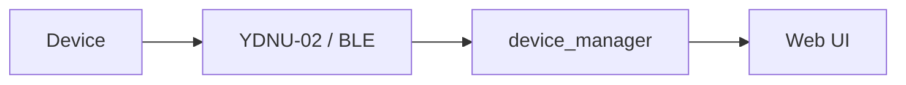

# <Устройство NMEA 2000 / BLE>

## Metadata

- id: NNN
- type: n2k-device
- status: draft
- owner: <owner>
- date: YYYY-MM-DD

## Context

Производитель, модель, роль на шине, физическое подключение (N2K backbone / BLE / serial).

## Requirements

- Какие данные устройство должно отдавать (PGN, единицы, частота).
- Какие настройки должны быть доступны из UI.
- Правило проекта: N2K — основной источник данных, BLE — только конфигурация.

## Architecture & Technical Design

Where the device fits: `device_manager/`, `sensors/`, `routes/`, `ydnu02_tcp_gateway/`.

## Interfaces / Contracts

- PGN (данные): ...
- PGN 126208 (конфигурация): поля, диапазоны.
- ISO NAME: manufacturer code, unique_number, device function/class.
- BLE GATT (если применимо): service/characteristic UUID, формат payload.
- REST/WS эндпоинты приложения.

## Implementation Plan

1. Парсер/декодер — файл.
2. Регистрация в реестре сенсоров.
3. UI и эндпоинты.

## Verification

- Тесты: `tests/...`
- Живая проверка на шине (какие команды, что ожидать).

## Known Issues

Опасные операции (например `adv_off`, `initialize`), ловушки протокола, замечания по HA-интеграции.
